## Question Set 1

**Context:**
You have an Azure subscription that contains a custom application named Application1. Application1 was developed by an external company named Fabrikam ,
Ltd. Developers at Fabrikam were assigned role-based access control (RBAC) permissions to the Application1 components. All users are licensed for the
Microsoft 365 E5 plan.
You need to recommend a solution to verify whether the Fabrikam developers still require permissions to Application1. The solution must meet the following requirements:
- To the manager of the developers, send a monthly email message that lists the access permissions to Application1.
- If the manager does not verify an access permission, automatically revoke that permission.
- Minimize development effort.

**Question:**
What should you recommend?
- A. In Azure Active Directory (Azure AD), create an access review of Application1.
- B. Create an Azure Automation runbook that runs the Get- AzRoleAssignment cmdlet.
- C. In Azure Active Directory (Azure AD) Privileged Identity Management, create a custom role assignment for the Application1 resources.
- D. Create an Azure Automation runbook that runs the Get- AzureADUserAppRoleAssignment cmdlet.

**Answer:**
Correct Answer: A

**Explication:**
N/A

## Question Set 2

**Context:**
You have an Azure subscription. The subscription has a blob container that contains multiple blobs.
Ten users in the finance department of your company plan to access the blobs during the month of April.
You need to recommend a solution to enable access to the blobs during the month of April only.

**Question:**
Which security solution should you include in the recommendation?
- A. shared access signatures (SAS)
- B. Conditional Access policies
- C. certificates
- D. access keys

**Answer:**
Correct Answer: A

**Explication:**
Shared Access Signatures (SAS) allows for limited-time fine grained access control to resources. So you can generate URL, specify duration (for month of April) and disseminate URL to 10 team members. On May 1, the SAS token is automatically invalidated, denying team members continued access.

## Question Set 3

**Context:**
You have an Azure Active Directory (Azure AD) tenant that syncs with an on-premises Active Directory domain.
You have an internal web app named WebApp1 that is hosted on-premises. WebApp1 uses Integrated Windows authentication.
Some users work remotely and do NOT have VPN access to the on-premises network.
You need to provide the remote users with single sign-on (SSO) access to WebApp1.

**Question:**
Which two features should you include in the solution? Each correct answer presents part of the solution.
NOTE: Each correct selection is worth one point.
- A. Azure AD Application Proxy
- B. Azure AD Privileged Identity Management (PIM)
- C. Conditional Access policies
- D. Azure Arc
- E. Azure AD enterprise applications
- F. Azure Application Gateway

**Answer:**
Correct Answer: AE

**Explication:**
A: Application Proxy is a feature of Azure AD that enables users to access on-premises web applications from a remote client. Application Proxy includes both the
Application Proxy service which runs in the cloud, and the Application Proxy connector which runs on an on-premises server.
You can configure single sign-on to an Application Proxy application.
E: Add an on-premises app to Azure AD
Now that you’ve prepared your environment and installed a connector, you’re ready to add on-premises applications to Azure AD.
1. Sign in as an administrator in the Azure portal.
2. In the left navigation panel, select Azure Active Directory.
3. Select Enterprise applications, and then select New application.
4. Select Add an on-premises application button which appears about halfway down the page in the On-premises applications section. Alternatively, you can select Create your own application at the top of the page and then select Configure Application Proxy for secure remote access to an on-premise application.
5. In the Add your own on-premises application section, provide the following information about your application.
6. Etc.
Incorrect:
Not C: Conditional Access policies are not required.

## Question Set 4

**Context:**
You have an Azure Active Directory (Azure AD) tenant named contoso.com that has a security group named Group1. Group1 is configured for assigned membership. Group1 has 50 members, including 20 guest users.
You need to recommend a solution for evaluating the membership of Group1. The solution must meet the following requirements:
- The evaluation must be repeated automatically every three months.
- Every member must be able to report whether they need to be in Group1.
- Users who report that they do not need to be in Group1 must be removed from Group1 automatically.
- Users who do not report whether they need to be in Group1 must be removed from Group1 automatically.

**Question:**
What should you include in the recommendation?
- A. Implement Azure AD Identity Protection.
- B. Change the Membership type of Group1 to Dynamic User.
- C. Create an access review.
- D. Implement Azure AD Privileged Identity Management (PIM).

**Answer:**
Correct Answer: C

**Explication:**
Azure Active Directory (Azure AD) access reviews enable organizations to efficiently manage group memberships, access to enterprise applications, and role assignments. User’s access can be reviewed on a regular basis to make sure only the right people have continued access.

## Question Set 5

**Context:**
HOTSPOT –
You plan to deploy Azure Databricks to support a machine learning application. Data engineers will mount an Azure Data Lake Storage account to the Databricks file system. Permissions to folders are granted directly to the data engineers.
You need to recommend a design for the planned Databrick deployment. The solution must meet the following requirements:
- Ensure that the data engineers can only access folders to which they have permissions.
- Minimize development effort.
- Minimize costs.

**Question:**
What should you include in the recommendation? To answer, select the appropriate options in the answer area.
NOTE: Each correct selection is worth one point.
Hot Area:
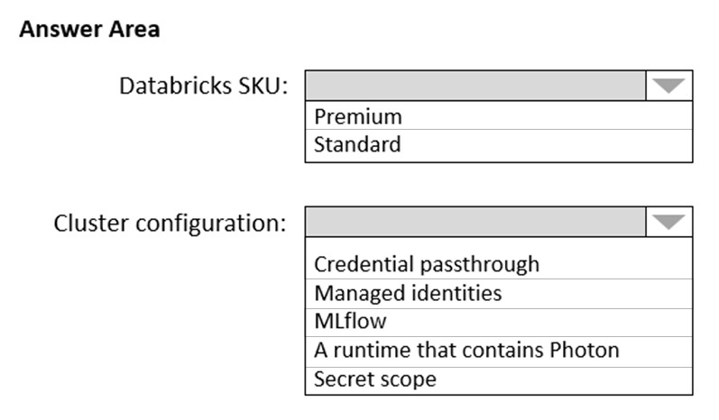

**Answer:**
Correct Answer:
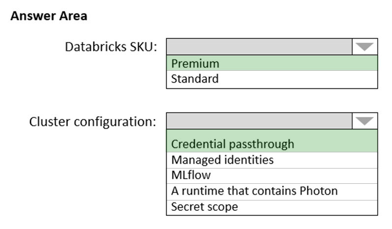

**Explication:**
- Box 1: Premium –
Premium Databricks SKU is required for credential passhtrough .
- Box 2: Credential passthrough –
Athenticate automatically to Azure Data Lake Storage Gen1 (ADLS Gen1) and Azure Data Lake Storage Gen2 (ADLS Gen2) from Azure Databricks clusters using the same Azure Active Directory (Azure AD) identity that you use to log into Azure Databricks. When you enable Azure Data Lake Storage credential passthrough for your cluster, commands that you run on that cluster can read and write data in Azure Data Lake Storage without requiring you to configure service principal credentials for access to storage.

## Question Set 6

**Context:**
HOTSPOT –
You plan to deploy an Azure web app named App1 that will use Azure Active Directory (Azure AD) authentication.
App1 will be accessed from the internet by the users at your company. All the users have computers that run Windows 10 and are joined to Azure AD.
You need to recommend a solution to ensure that the users can connect to App1 without being prompted for authentication and can access App1 only from company-owned computers.

**Question:**
What should you recommend for each requirement? To answer, select the appropriate options in the answer area.
NOTE: Each correct selection is worth one point.
Hot Area:
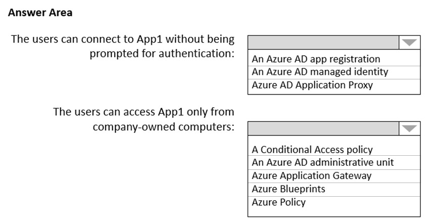

**Answer:**
Correct Answer:
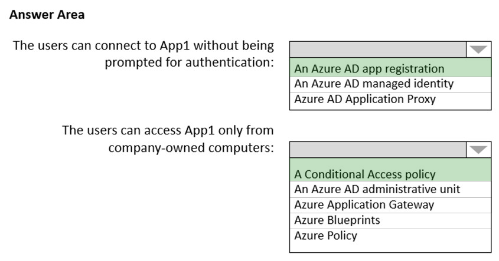

**Explication:**
- Box 1: An Azure AD app registration
Azure active directory (AD) provides cloud based directory and identity management services.You can use azure AD to manage users of your application and authenticate access to your applications using azure active directory.
You register your application with Azure active directory tenant.
- Box 2: A conditional access policy
Conditional Access policies at their simplest are if-then statements, if a user wants to access a resource, then they must complete an action.
By using Conditional Access policies, you can apply the right access controls when needed to keep your organization secure and stay out of your user’s way when not needed.

## Question Set 7

**Context:**
Note: This question is part of a series of questions that present the same scenario. Each question in the series contains a unique solution that might meet the stated goals. Some question sets might have more than one correct solution, while others might not have a correct solution.
After you answer a question in this section, you will NOT be able to return to it. As a result, these questions will not appear in the review screen.
Your company deploys several virtual machines on-premises and to Azure. ExpressRoute is deployed and configured for on-premises to Azure connectivity.
Several virtual machines exhibit network connectivity issues.
You need to analyze the network traffic to identify whether packets are being allowed or denied to the virtual machines.
Solution: Use Azure Traffic Analytics in Azure Network Watcher to analyze the network traffic.

**Question:**
Does this meet the goal?
- A. Yes
- B. No

**Answer:**
Correct Answer: B

**Explication:**
Instead use Azure Network Watcher IP Flow Verify, which allows you to detect traffic filtering issues at a VM level.
Note: IP flow verify checks if a packet is allowed or denied to or from a virtual machine. The information consists of direction, protocol, local IP, remote IP, local port, and remote port. If the packet is denied by a security group, the name of the rule that denied the packet is returned. While any source or destination IP can be chosen, IP flow verify helps administrators quickly diagnose connectivity issues from or to the internet and from or to the on-premises environment.

## Question Set 8

**Context:**
Note: This question is part of a series of questions that present the same scenario. Each question in the series contains a unique solution that might meet the stated goals. Some question sets might have more than one correct solution, while others might not have a correct solution.
After you answer a question in this section, you will NOT be able to return to it. As a result, these questions will not appear in the review screen.
Your company deploys several virtual machines on-premises and to Azure. ExpressRoute is deployed and configured for on-premises to Azure connectivity.
Several virtual machines exhibit network connectivity issues.
You need to analyze the network traffic to identify whether packets are being allowed or denied to the virtual machines.
Solution: Use Azure Advisor to analyze the network traffic.

**Question:**
Does this meet the goal?
- A. Yes
- B. No

**Answer:**
Correct Answer: B

**Explication:**
Instead use Azure Network Watcher IP Flow Verify, which allows you to detect traffic filtering issues at a VM level.
Note: IP flow verify checks if a packet is allowed or denied to or from a virtual machine. The information consists of direction, protocol, local IP, remote IP, local port, and remote port. If the packet is denied by a security group, the name of the rule that denied the packet is returned. While any source or destination IP can be chosen, IP flow verify helps administrators quickly diagnose connectivity issues from or to the internet and from or to the on-premises environment.

## Question Set 9

**Context:**
Note: This question is part of a series of questions that present the same scenario. Each question in the series contains a unique solution that might meet the stated goals. Some question sets might have more than one correct solution, while others might not have a correct solution.
After you answer a question in this section, you will NOT be able to return to it. As a result, these questions will not appear in the review screen.
Your company deploys several virtual machines on-premises and to Azure. ExpressRoute is deployed and configured for on-premises to Azure connectivity.
Several virtual machines exhibit network connectivity issues.
You need to analyze the network traffic to identify whether packets are being allowed or denied to the virtual machines.
Solution: Use Azure Network Watcher to run IP flow verify to analyze the network traffic.

**Question:**
Does this meet the goal?
- A. Yes
- B. No

**Answer:**
Correct Answer: A

**Explication:**
Azure Network Watcher IP Flow Verify allows you to detect traffic filtering issues at a VM level.
IP flow verify checks if a packet is allowed or denied to or from a virtual machine. The information consists of direction, protocol, local IP, remote IP, local port, and remote port. If the packet is denied by a security group, the name of the rule that denied the packet is returned. While any source or destination IP can be chosen,
IP flow verify helps administrators quickly diagnose connectivity issues from or to the internet and from or to the on-premises environment.

## Question Set 10

**Context:**
DRAG DROP –
You have an Azure subscription. The subscription contains Azure virtual machines that run Windows Server 2016 and Linux.
You need to use Azure Monitor to design an alerting strategy for security-related events.

**Question:**
Which Azure Monitor Logs tables should you query? To answer, drag the appropriate tables to the correct log types. Each table may be used once, more than once, or not at all. You may need to drag the split bar between panes or scroll to view content.
NOTE: Each correct selection is worth one point.
Select and Place:
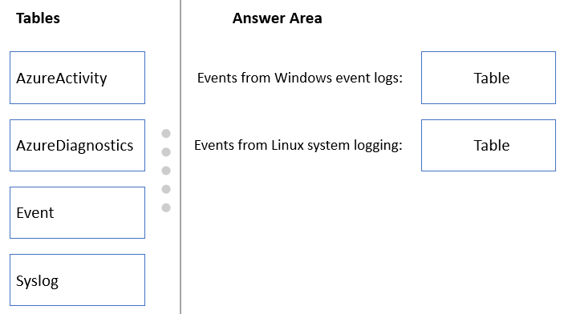

**Answer:**
Correct Answer:
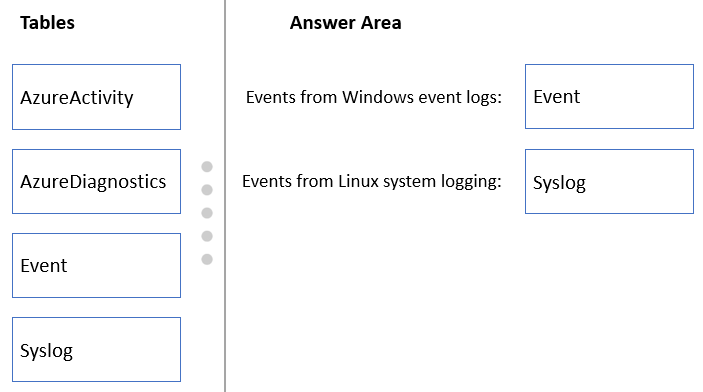

**Explication:**
N/A

## Question Set 11

**Context:**
You are designing a large Azure environment that will contain many subscriptions.
You plan to use Azure Policy as part of a governance solution.

**Question:**
To which three scopes can you assign Azure Policy definitions? Each correct answer presents a complete solution.
NOTE: Each correct selection is worth one point.
- A. Azure Active Directory (Azure AD) administrative units
- B. Azure Active Directory (Azure AD) tenants
- C. subscriptions
- D. compute resources
- E. resource groups
- F. management groups

**Answer:**
Correct Answer: CEF

**Explication:**
Azure Policy evaluates resources in Azure by comparing the properties of those resources to business rules. Once your business rules have been formed, the policy definition or initiative is assigned to any scope of resources that Azure supports, such as management groups, subscriptions, resource groups, or individual resources.
CEF (100%)

## Question Set 12

**Context:**
DRAG DROP –
Your on-premises network contains a server named Server1 that runs an ASP.NET application named App1.
You have a hybrid deployment of Azure Active Directory (Azure AD).
You need to recommend a solution to ensure that users sign in by using their Azure AD account and Azure Multi-Factor Authentication (MFA) when they connect to App1 from the internet.

**Question:**
Which three features should you recommend be deployed and configured in sequence? To answer, move the appropriate features from the list of features to the answer area and arrange them in the correct order.
Select and Place:
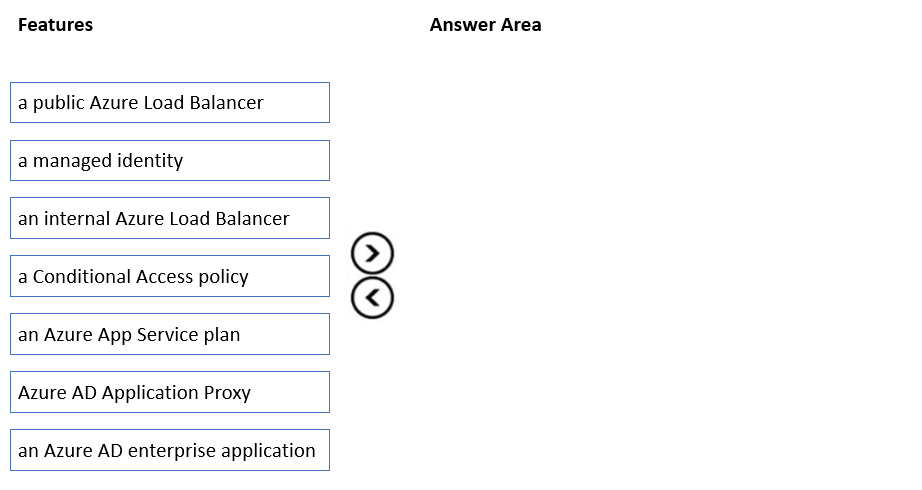

**Answer:**
Correct Answer:
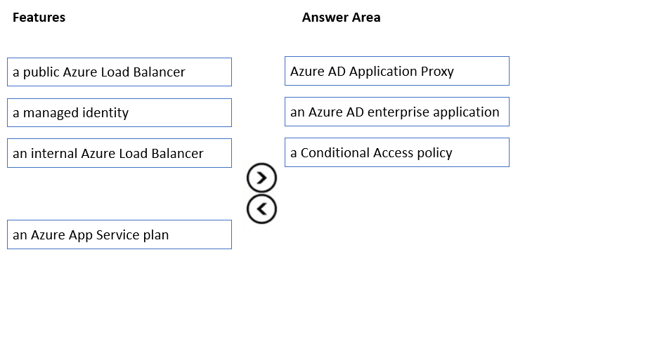

**Explication:**
Step 1: Azure AD Application Proxy
Start by enabling communication to Azure data centers to prepare your environment for Azure AD Application Proxy.
Step 2: an Azure AD enterprise application
Add an on-premises app to Azure AD.
Now that you’ve prepared your environment and installed a connector, you’re ready to add on-premises applications to Azure AD.
1. Sign in as an administrator in the Azure portal.
2. In the left navigation panel, select Azure Active Directory.
3. Select Enterprise applications, and then select New application.
4. Etc.

## Question Set 13

**Context:**
You need to recommend a solution to generate a monthly report of all the new Azure Resource Manager (ARM) resource deployments in your Azure subscription.

**Question:**
What should you include in the recommendation?
- A. Azure Activity Log
- B. Azure Advisor
- C. Azure Analysis Services
- D. Azure Monitor action groups

**Answer:**
Correct Answer: A

**Explication:**
Activity logs are kept for 90 days. You can query for any range of dates, as long as the starting date isn’t more than 90 days in the past.
Through activity logs, you can determine:
- what operations were taken on the resources in your subscription
- who started the operation
- when the operation occurred
- the status of the operation
- the values of other properties that might help you research the operation

## Question Set 14

**Context:**
Note: This question is part of a series of questions that present the same scenario. Each question in the series contains a unique solution that might meet the stated goals. Some question sets might have more than one correct solution, while others might not have a correct solution.
After you answer a question in this section, you will NOT be able to return to it. As a result, these questions will not appear in the review screen.

Your company deploys several virtual machines on-premises and to Azure. ExpressRoute is deployed and configured for on-premises to Azure connectivity.
Several virtual machines exhibit network connectivity issues.
You need to analyze the network traffic to identify whether packets are being allowed or denied to the virtual machines.
Solution: Install and configure the Azure Monitoring agent and the Dependency Agent on all the virtual machines. Use VM insights in Azure Monitor to analyze the network traffic.

**Question:**
Does this meet the goal?
- A. Yes
- B. No

**Answer:**
Correct Answer: B

**Explication:**
Use the Azure Monitor agent if you need to:
Collect guest logs and metrics from any machine in Azure, in other clouds, or on-premises.
Use the Dependency agent if you need to:
Use the Map feature VM insights or the Service Map solution.
Note: Instead use Azure Network Watcher IP Flow Verify allows you to detect traffic filtering issues at a VM level.
IP flow verify checks if a packet is allowed or denied to or from a virtual machine. The information consists of direction, protocol, local IP, remote IP, local port, and remote port. If the packet is denied by a security group, the name of the rule that denied the packet is returned. While any source or destination IP can be chosen,
IP flow verify helps administrators quickly diagnose connectivity issues from or to the internet and from or to the on-premises environment.

## Question Set 15

**Context:**
DRAG DROP –
You need to design an architecture to capture the creation of users and the assignment of roles. The captured data must be stored in Azure Cosmos DB.

**Question:**
Which services should you include in the design? To answer, drag the appropriate services to the correct targets. Each service may be used once, more than once, or not at all. You may need to drag the split bar between panes or scroll to view content.
NOTE: Each correct selection is worth one point.
Select and Place:
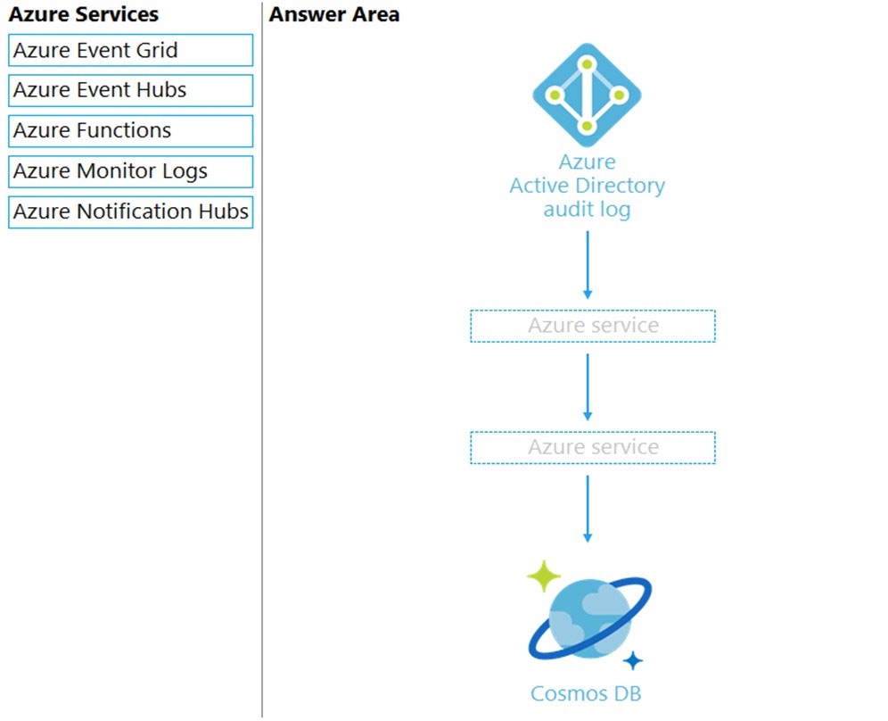

**Answer:**
Correct Answer:
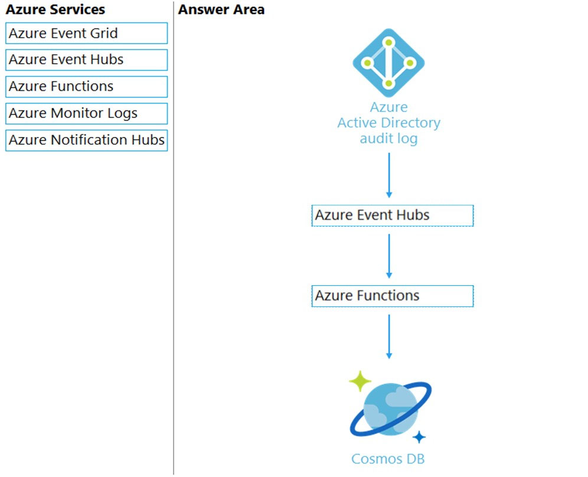

**Explication:**
- Box 1: Azure Event Hubs –
You can route Azure Active Directory (Azure AD) activity logs to several endpoints for long term retention and data insights.
The Event Hub is used for streaming.
- Box 2: Azure Function –
Use an Azure Function along with a cosmos DB change feed, and store the data in Cosmos DB.

## Question Set 16

**Context:**
Your company, named Contoso, Ltd., implements several Azure logic apps that have HTTP triggers. The logic apps provide access to an on-premises web service.
Contoso establishes a partnership with another company named Fabrikam , Inc.
Fabrikam does not have an existing Azure Active Directory (Azure AD) tenant and uses third-party OAuth 2.0 identity management to authenticate its users.
Developers at Fabrikam plan to use a subset of the logic apps to build applications that will integrate with the on-premises web service of Contoso.
You need to design a solution to provide the Fabrikam developers with access to the logic apps. The solution must meet the following requirements:
- Requests to the logic apps from the developers must be limited to lower rates than the requests from the users at Contoso.
- The developers must be able to rely on their existing OAuth 2.0 provider to gain access to the logic apps.
- The solution must NOT require changes to the logic apps.
- The solution must NOT use Azure AD guest accounts.

**Question:**
What should you include in the solution?
- A. Azure Front Door
- B. Azure AD Application Proxy
- C. Azure AD business-to-business (B2B)
- D. Azure API Management

**Answer:**
Correct Answer: D

**Explication:**
Many APIs support OAuth 2.0 to secure the API and ensure that only valid users have access, and they can only access resources to which they’re entitled. To use Azure API Management’s interactive developer console with such APIs, the service allows you to configure your service instance to work with your OAuth 2.0 enabled API.
Incorrect:
Azure AD business-to-business (B2B) uses guest accounts.
Azure AD Application Proxy is for on-premises scenarios.

## Question Set 17

**Context:**
HOTSPOT –
You have an Azure subscription that contains 300 virtual machines that run Windows Server 2019.
You need to centrally monitor all warning events in the System logs of the virtual machines.

**Question:**
What should you include in the solution? To answer, select the appropriate options in the answer area.
NOTE: Each correct selection is worth one point.
Hot Area:
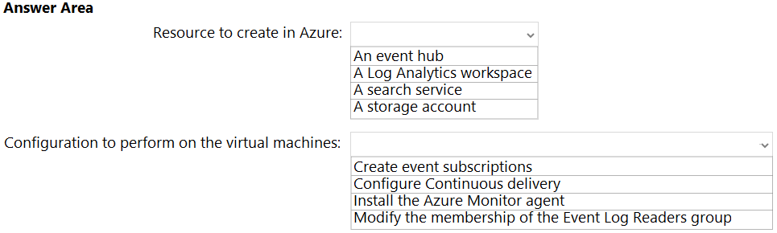

**Answer:**
Correct Answer:
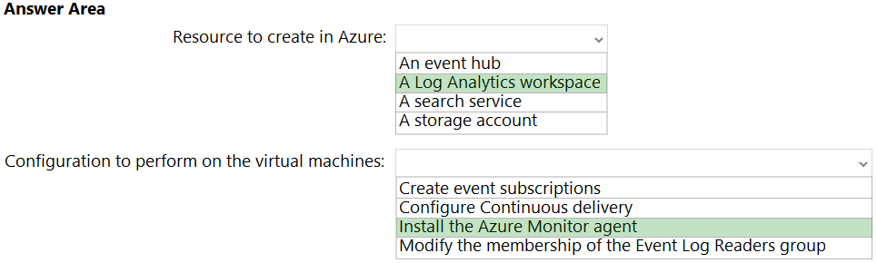

**Explication:**
- Box 1: A Log Analytics workspace
Send resource logs to a Log Analytics workspace to enable the features of Azure Monitor Logs.
You must create a diagnostic setting for each Azure resource to send its resource logs to a Log Analytics workspace to use with Azure Monitor Logs.
- Box 2: Install the Azure Monitor agent
Use the Azure Monitor agent if you need to:
Collect guest logs and metrics from any machine in Azure, in other clouds, or on-premises.
Manage data collection configuration centrally

## Question Set 18

**Context:**
HOTSPOT –
You have several Azure App Service web apps that use Azure Key Vault to store data encryption keys.
Several departments have the following requests to support the web app:
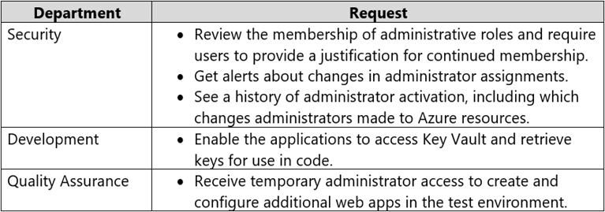

**Question:**
Which service should you recommend for each department’s request? To answer, configure the appropriate options in the answer area.
NOTE: Each correct selection is worth one point.
Hot Area:
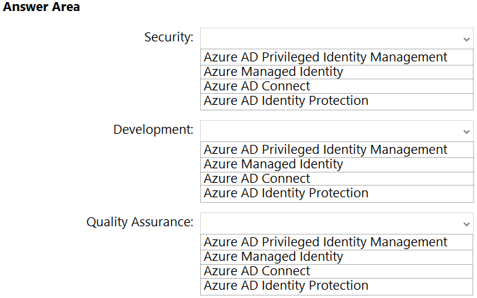

**Answer:**
Correct Answer:
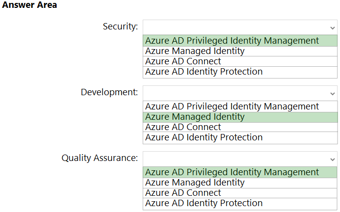

**Explication:**
- Box 1: Azure AD Privileged Identity Management
Privileged Identity Management provides time-based and approval-based role activation to mitigate the risks of excessive, unnecessary, or misused access permissions on resources that you care about. Here are some of the key features of Privileged Identity Management:
Provide just-in-time privileged access to Azure AD and Azure resources
Assign time-bound access to resources using start and end dates
Require approval to activate privileged roles
Enforce multi-factor authentication to activate any role
Use justification to understand why users activate
Get notifications when privileged roles are activated
Conduct access reviews to ensure users still need roles
Download audit history for internal or external audit
Prevents removal of the last active Global Administrator role assignment
- Box 2: Azure Managed Identity –
Managed identities provide an identity for applications to use when connecting to resources that support Azure Active Directory (Azure AD) authentication.
Applications may use the managed identity to obtain Azure AD tokens. With Azure Key Vault, developers can use managed identities to access resources. Key
Vault stores credentials in a secure manner and gives access to storage accounts.
- Box 3: Azure AD Privileged Identity Management
Privileged Identity Management provides time-based and approval-based role activation to mitigate the risks of excessive, unnecessary, or misused access permissions on resources that you care about. Here are some of the key features of Privileged Identity Management:
Provide just-in-time privileged access to Azure AD and Azure resources
Assign time-bound access to resources using start and end dates

## Question Set 19

**Context:**
HOTSPOT –
Your company has the divisions shown in the following table.
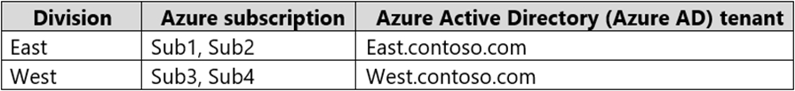
You plan to deploy a custom application to each subscription. The application will contain the following:
- A resource group
- An Azure web app
- Custom role assignments
- An Azure Cosmos DB account
You need to use Azure Blueprints to deploy the application to each subscription.

**Question:**
What is the minimum number of objects required to deploy the application? To answer, select the appropriate options in the answer area.
NOTE: Each correct selection is worth one point.
Hot Area:
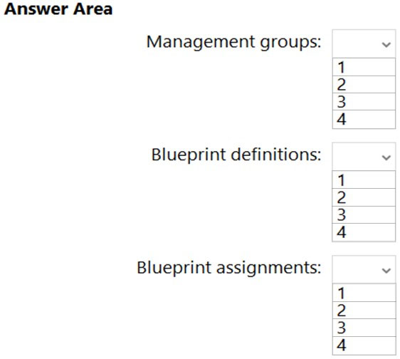

**Answer:**
Correct Answer:
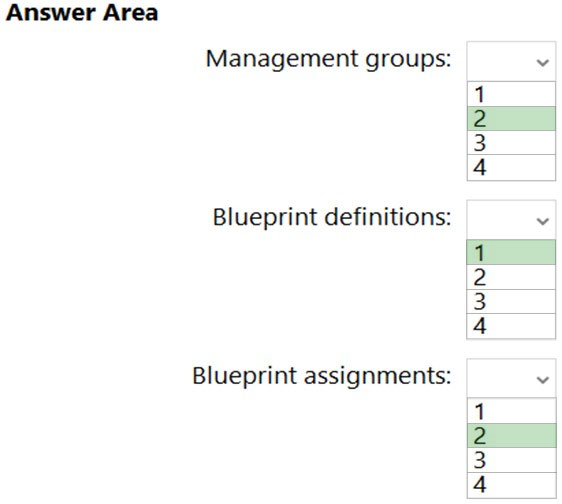

**Explication:**
- Box 1: 2 –
One management group for each Azure AD tenant
Azure management groups provide a level of scope above subscriptions.
All subscriptions within a management group automatically inherit the conditions applied to the management group.
All subscriptions within a single management group must trust the same Azure Active Directory tenant.
- Box 2: 1 –
One single blueprint definition can be assigned to different existing management groups or subscriptions.
When creating a blueprint definition, you’ll define where the blueprint is saved. Blueprints can be saved to a management group or subscription that you have
Contributor access to. If the location is a management group, the blueprint is available to assign to any child subscription of that management group.
- Box 3: 2 –
Blueprint assignment –
Each Published Version of a blueprint can be assigned (with a max name length of 90 characters) to an existing management group or subscription.
Assigning a blueprint definition to a management group means the assignment object exists at the management group. The deployment of artifacts still targets a subscription.

## Question Set 20

**Context:**
HOTSPOT –
You need to design an Azure policy that will implement the following functionality:
- For new resources, assign tags and values that match the tags and values of the resource group to which the resources are deployed.
- For existing resources, identify whether the tags and values match the tags and values of the resource group that contains the resources.
- For any non-compliant resources, trigger auto-generated remediation tasks to create missing tags and values.
The solution must use the principle of least privilege.

**Question:**
What should you include in the design? To answer, select the appropriate options in the answer area.
NOTE: Each correct selection is worth one point.
Hot Area:
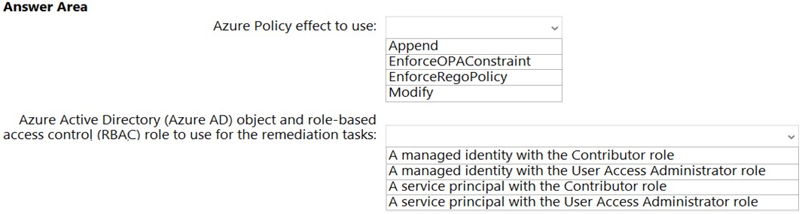

**Answer:**
Correct Answer:
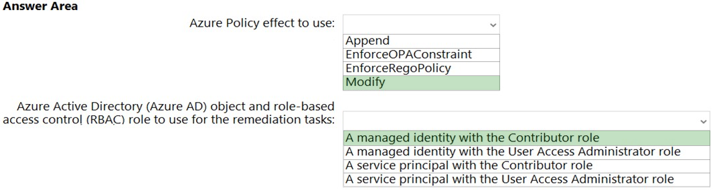

**Explication:**
- Box 1: Modify –
Modify is used to add, update, or remove properties or tags on a subscription or resource during creation or update. A common example is updating tags on resources such as costCenter . Existing non-compliant resources can be remediated with a remediation task. A single Modify rule can have any number of operations. Policy assignments with effect set as Modify require a managed identity to do remediation.
Incorrect:
* The following effects are deprecated: EnforceOPAConstraint EnforceRegoPolicy
* Append is used to add additional fields to the requested resource during creation or update. A common example is specifying allowed IPs for a storage resource.
Append is intended for use with non-tag properties. While Append can add tags to a resource during a create or update request, it’s recommended to use the
Modify effect for tags instead.
- Box 2: A managed identity with the Contributor role
The managed identity needs to be granted the appropriate roles required for remediating resources to grant the managed identity.
Contributor – Can create and manage all types of Azure resources but can’t grant access to others.
Incorrect:
User Access Administrator: lets you manage user access to Azure resources.

## Question Set 21

**Context:**
HOTSPOT –
You have an Azure subscription that contains the resources shown in the following table.
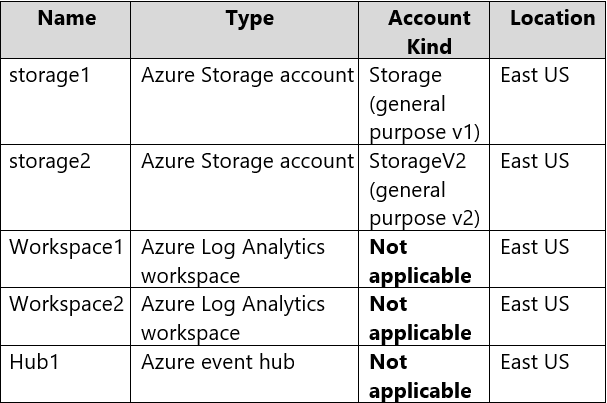
You create an Azure SQL database named DB1 that is hosted in the East US Azure region.
To DB1, you add a diagnostic setting named Settings1. Settings1 archive SQLInsights to storage1 and sends SQLInsights to Workspace1.
For each of the following statements, select Yes if the statement is true. Otherwise, select No.
Hot Area:
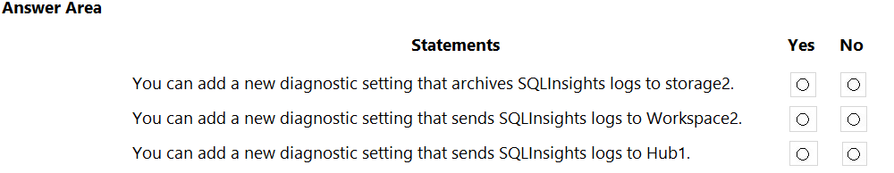
Correct Answer:
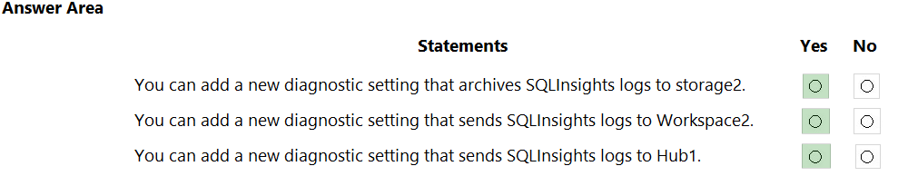
- Box 1: Yes –
A single diagnostic setting can define no more than one of each of the destinations. If you want to send data to more than one of a particular destination type (for example, two different Log Analytics workspaces), then create multiple settings.
Each resource can have up to 5 diagnostic settings.
Note: This diagnostic telemetry can be streamed to one of the following Azure resources for analysis.
* Log Analytics workspace
* Azure Event Hubs
* Azure Storage
- Box 2: Yes –
- Box 3: Yes –
Reference:

**Question:**
N/A

**Answer:**
Correct Answer:

**Explication:**
- Box 1: Yes –
A single diagnostic setting can define no more than one of each of the destinations. If you want to send data to more than one of a particular destination type (for example, two different Log Analytics workspaces), then create multiple settings.
Each resource can have up to 5 diagnostic settings.
Note: This diagnostic telemetry can be streamed to one of the following Azure resources for analysis.
* Log Analytics workspace
* Azure Event Hubs
* Azure Storage
- Box 2: Yes –
- Box 3: Yes –

## Question Set 22

**Context:**
You plan to deploy an Azure SQL database that will store Personally Identifiable Information (PII).
You need to ensure that only privileged users can view the PII.

**Question:**
What should you include in the solution?
- A. dynamic data masking
- B. role-based access control (RBAC)
- C. Data Discovery & Classification
- D. Transparent Data Encryption (TDE)

**Answer:**
Correct Answer: A

**Explication:**
Dynamic data masking limits sensitive data exposure by masking it to non-privileged users.
Dynamic data masking helps prevent unauthorized access to sensitive data by enabling customers to designate how much of the sensitive data to reveal with minimal impact on the application layer. It’s a policy-based security feature that hides the sensitive data in the result set of a query over designated database fields, while the data in the database is not changed.

## Question Set 23

**Context:**
You plan to deploy an app that will use an Azure Storage account.
You need to deploy the storage account. The storage account must meet the following requirements:
- Store the data for multiple users.
- Encrypt each user’s data by using a separate key.
- Encrypt all the data in the storage account by using customer-managed keys.

**Question:**
What should you deploy?
- A. files in a premium file share storage account
- B. blobs in a general purpose v2 storage account
- C. blobs in an Azure Data Lake Storage Gen2 account
- D. files in a general purpose v2 storage account

**Answer:**
Correct Answer: B

**Explication:**
You can specify a customer-provided key on Blob storage operations. A client making a read or write request against Blob storage can include an encryption key on the request for granular control over how blob data is encrypted and decrypted.

## Question Set 24

**Context:**
HOTSPOT –
You have an Azure App Service web app that uses a system-assigned managed identity.
You need to recommend a solution to store the settings of the web app as secrets in an Azure key vault. The solution must meet the following requirements:
- Minimize changes to the app code.
- Use the principle of least privilege.

**Question:**
What should you include in the recommendation? To answer, select the appropriate options in the answer area.
NOTE: Each correct selection is worth one point.
Hot Area:
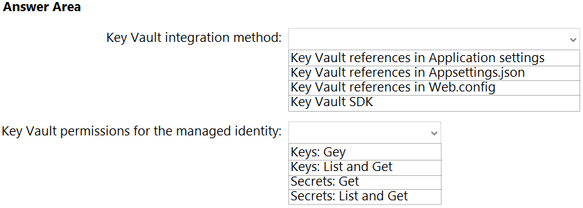

**Answer:**
Correct Answer:
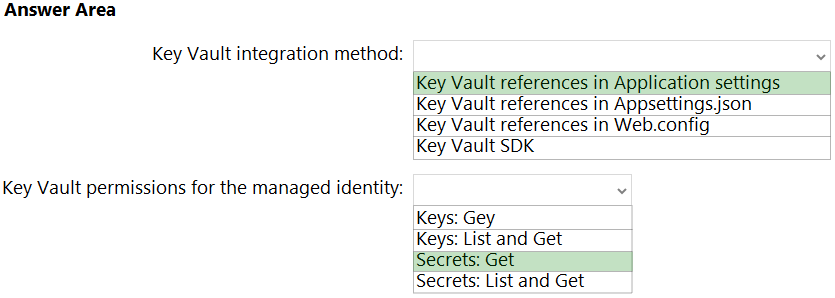

**Explication:**
- Box 1: Key Vault references in Application settings
Source Application Settings from Key Vault.
Key Vault references can be used as values for Application Settings, allowing you to keep secrets in Key Vault instead of the site config. Application Settings are securely encrypted at rest, but if you need secret management capabilities, they should go into Key Vault.
To use a Key Vault reference for an app setting, set the reference as the value of the setting. Your app can reference the secret through its key as normal. No code changes are required.
- Box 2: Secrets: Get –
In order to read secrets from Key Vault, you need to have a vault created and give your app permission to access it.
1. Create a key vault by following the Key Vault quickstart .
2. Create a managed identity for your application.
3. Key Vault references will use the app’s system assigned identity by default, but you can specify a user-assigned identity.
4. Create an access policy in Key Vault for the application identity you created earlier. Enable the “Get” secret permission on this policy.

## Question Set 25

**Context:**
You plan to deploy an application named App1 that will run on five Azure virtual machines. Additional virtual machines will be deployed later to run App1.
You need to recommend a solution to meet the following requirements for the virtual machines that will run App1:
- Ensure that the virtual machines can authenticate to Azure Active Directory (Azure AD) to gain access to an Azure key vault, Azure Logic Apps instances, and an Azure SQL database.
- Avoid assigning new roles and permissions for Azure services when you deploy additional virtual machines.
- Avoid storing secrets and certificates on the virtual machines.
- Minimize administrative effort for managing identities.

**Question:**
Which type of identity should you include in the recommendation?
- A. a system-assigned managed identity
- B. a service principal that is configured to use a certificate
- C. a service principal that is configured to use a client secret
- D. a user-assigned managed identity

**Answer:**
Correct Answer: D

**Explication:**
Managed identities provide an identity for applications to use when connecting to resources that support Azure Active Directory (Azure AD) authentication.
A user-assigned managed identity:
Can be shared.
The same user-assigned managed identity can be associated with more than one Azure resource.
Common usage:
Workloads that run on multiple resources and can share a single identity.
For example, a workload where multiple virtual machines need to access the same resource.
Incorrect:
Not A: A system-assigned managed identity can’t be shared. It can only be associated with a single Azure resource.
Typical usage:
Workloads that are contained within a single Azure resource.
Workloads for which you need independent identities.
For example, an application that runs on a single virtual machine.

## Question Set 26

**Context:**
You have the resources shown in the following table:
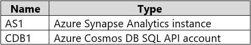
CDB1 hosts a container that stores continuously updated operational data.
You are designing a solution that will use AS1 to analyze the operational data daily.
You need to recommend a solution to analyze the data without affecting the performance of the operational data store.

**Question:**
What should you include in the recommendation?
- A. Azure Cosmos DB change feed
- B. Azure Data Factory with Azure Cosmos DB and Azure Synapse Analytics connectors
- C. Azure Synapse Link for Azure Cosmos DB
- D. Azure Synapse Analytics with PolyBase data loading

**Answer:**
Correct Answer: C

**Explication:**
Azure Synapse Link for Azure Cosmos DB creates a tight integration between Azure Cosmos DB and Azure Synapse Analytics. It enables customers to run near real-time analytics over their operational data with full performance isolation from their transactional workloads and without an ETL pipeline.

## Question Set 27

**Context:**
HOTSPOT –
You deploy several Azure SQL Database instances.
You plan to configure the Diagnostics settings on the databases as shown in the following exhibit.
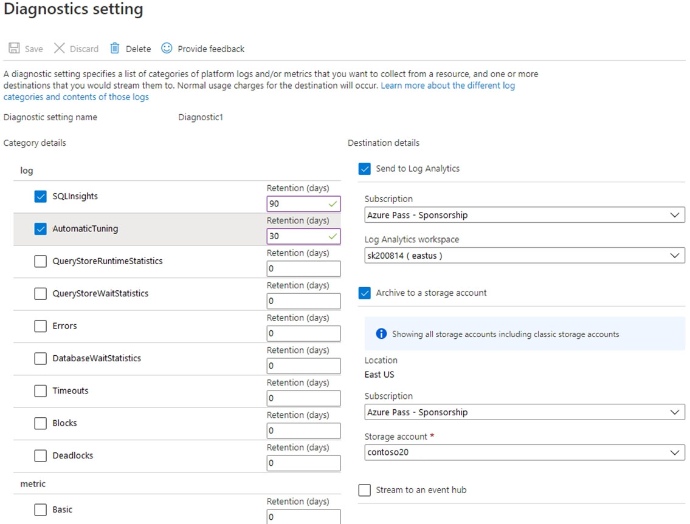
Use the drop-down menus to select the answer choice that completes each statement based on the information presented in the graphic.
NOTE: Each correct selection is worth one point.
Hot Area:
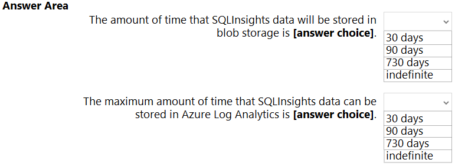
Correct Answer:
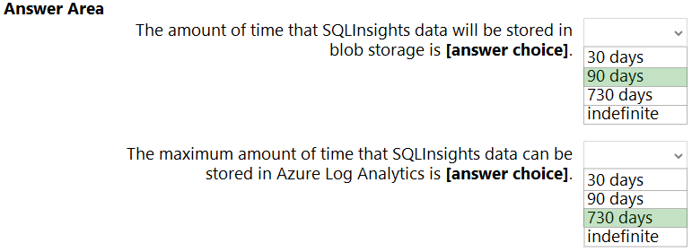
- Box 1: 90 days –
As per exhibit.
- Box 2: 730 days –

**Question:**
N/A

**Answer:**
Correct Answer:

**Explication:**
- Box 1: 90 days –
As per exhibit.
- Box 2: 730 days –
How long is the data kept?
Raw data points (that is, items that you can query in Analytics and inspect in Search) are kept for up to 730 days.

## Question Set 28

**Context:**
You have an application that is used by 6,000 users to validate their vacation requests. The application manages its own credential store.
Users must enter a username and password to access the application. The application does NOT support identity providers.
You plan to upgrade the application to use single sign-on (SSO) authentication by using an Azure Active Directory (Azure AD) application registration.

**Question:**
Which SSO method should you use?
- A. header-based
- B. SAML
- C. password-based
- D. OpenID Connect

**Answer:**
Correct Answer: C

**Explication:**
Password – On-premises applications can use a password-based method for SSO. This choice works when applications are configured for Application Proxy.
With password-based SSO, users sign in to the application with a username and password the first time they access it. After the first sign-on, Azure AD provides the username and password to the application. Password-based SSO enables secure application password storage and replay using a web browser extension or mobile app. This option uses the existing sign-in process provided by the application, enables an administrator to manage the passwords, and doesn’t require the user to know the password.
Incorrect:
Choosing an SSO method depends on how the application is configured for authentication. Cloud applications can use federation-based options, such as OpenID
Connect, OAuth, and SAML.
Federation – When you set up SSO to work between multiple identity providers, it’s called federation.

## Question Set 29

**Context:**
HOTSPOT –
You have an Azure subscription that contains a virtual network named VNET1 and 10 virtual machines. The virtual machines are connected to VNET1.
You need to design a solution to manage the virtual machines from the internet. The solution must meet the following requirements:
- Incoming connections to the virtual machines must be authenticated by using Azure Multi-Factor Authentication (MFA) before network connectivity is allowed.
- Incoming connections must use TLS and connect to TCP port 443.
- The solution must support RDP and SSH.

**Question:**
What should you include in the solution? To answer, select the appropriate options in the answer area.
NOTE: Each correct selection is worth one point.
Hot Area:
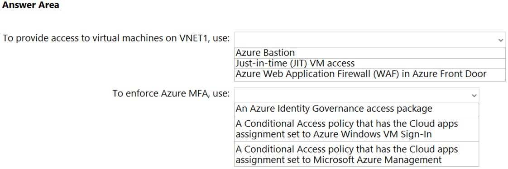

**Answer:**
Correct Answer:
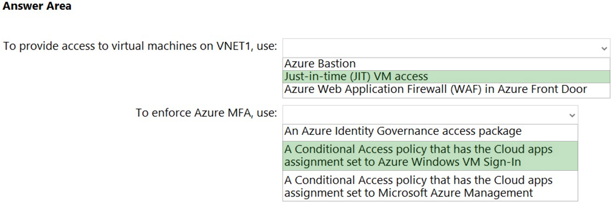

**Explication:**
- Box 1: Just-in-time (JIT) VN access
Lock down inbound traffic to your Azure Virtual Machines with Microsoft Defender for Cloud’s just-in-time (JIT) virtual machine (VM) access feature. This reduces exposure to attacks while providing easy access when you need to connect to a VM.
Note: Threat actors actively hunt accessible machines with open management ports, like RDP or SSH. Your legitimate users also use these ports, so it’s not practical to keep them closed.
When you enable just-in-time VM access, you can select the ports on the VM to which inbound traffic will be blocked.
To solve this dilemma, Microsoft Defender for Cloud offers JIT. With JIT, you can lock down the inbound traffic to your VMs, reducing exposure to attacks while providing easy access to connect to VMs when needed.
- Box 2: A conditional Access policy that has Cloud Apps assignment set to Azure Windows VM Sign-In
You can enforce Conditional Access policies such as multi-factor authentication or user sign-in risk check before authorizing access to Windows VMs in Azure that are enabled with Azure AD sign in. To apply Conditional Access policy, you must select the “Azure Windows VM Sign-In” app from the cloud apps or actions assignment option and then use Sign-in risk as a condition and/or require multi-factor authentication as a grant access control.

## Question Set 30

**Context:**
You are designing an Azure governance solution.
All Azure resources must be easily identifiable based on the following operational information: environment, owner, department and cost center.
You need to ensure that you can use the operational information when you generate reports for the Azure resources.

**Question:**
What should you include in the solution?
- A. an Azure data catalog that uses the Azure REST API as a data source
- B. an Azure management group that uses parent groups to create a hierarchy
- C. an Azure policy that enforces tagging rules
- D. Azure Active Directory (Azure AD) administrative units

**Answer:**
Correct Answer: C

**Explication:**
You apply tags to your Azure resources, resource groups, and subscriptions to logically organize them into a taxonomy. Each tag consists of a name and a value pair.
You use Azure Policy to enforce tagging rules and conventions. By creating a policy, you avoid the scenario of resources being deployed to your subscription that don’t have the expected tags for your organization. Instead of manually applying tags or searching for resources that aren’t compliant, you create a policy that automatically applies the needed tags during deployment.

## Question Set 31

**Context:**
A company named Contoso, Ltd. has an Azure Active Directory (Azure AD) tenant that is integrated with Microsoft 365 and an Azure subscription.
Contoso has an on-premises identity infrastructure. The infrastructure includes servers that run Active Directory Domain Services (AD DS) and Azure AD Connect.
Contoso has a partnership with a company named Fabrikam . Inc. Fabrikam has an Active Directory forest and a Microsoft 365 tenant. Fabrikam has the same on- premises identity infrastructure components as Contoso.
A team of 10 developers from Fabrikam will work on an Azure solution that will be hosted in the Azure subscription of Contoso. The developers must be added to the Contributor role for a resource group in the Contoso subscription.
You need to recommend a solution to ensure that Contoso can assign the role to the 10 Fabrikam developers. The solution must ensure that the Fabrikam developers use their existing credentials to access resources

**Question:**
What should you recommend?
- A. In the Azure AD tenant of Contoso. create cloud-only user accounts for the Fabrikam developers.
- B. Configure a forest trust between the on-premises Active Directory forests of Contoso and Fabrikam .
- C. Configure an organization relationship between the Microsoft 365 tenants of Fabrikam and Contoso.
- D. In the Azure AD tenant of Contoso, create guest accounts for the Fabnkam developers.

**Answer:**
Correct Answer: D

**Explication:**
You can use the capabilities in Azure Active Directory B2B to collaborate with external guest users and you can use Azure RBAC to grant just the permissions that guest users need in your environment.
Incorrect:
Not B: Forest trust is used for internal security, not external access.
4%

## Question Set 32

**Context:**
Your company has the divisions shown in the following table.
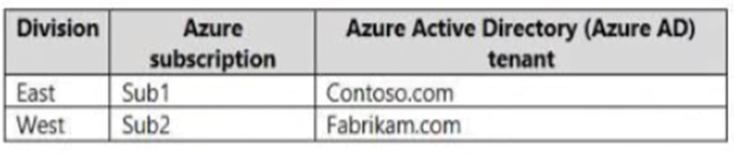
Sub1 contains an Azure App Service web app named App1. App1 uses Azure AD for single-tenant user authentication. Users from contoso.com can authenticate to App1.
You need to recommend a solution to enable users in the fabrikam.com tenant to authenticate to App1.

**Question:**
What should you recommend?
- A. Configure the Azure AD provisioning service.
- B. Enable Azure AD pass-through authentication and update the sign-in endpoint.
- C. Use Azure AD entitlement management to govern external users.
- D. Configure Azure AD join.

**Answer:**
Correct Answer: A

**Explication:**
You can enable automatic user provisioning for your multi-tenant application in Azure Active Directory.
Automatic user provisioning is the process of automating the creation, maintenance, and removal of user identities in target systems like your software-as-a- service applications.
Azure AD provides several integration paths to enable automatic user provisioning for your application.
* The Azure AD Provisioning Service manages the provisioning and deprovisioning of users from Azure AD to your application (outbound provisioning) and from your application to Azure AD (inbound provisioning). The service connects to the System for Cross-Domain Identity Management (SCIM) user management API endpoints provided by your application.
* Microsoft Graph
* The Security Assertion Markup Language Just in Time (SAML JIT) user provisioning.

## Question Set 33

**Context:**
HOTSPOT –
Your company has 20 web APIs that were developed in-house.
The company is developing 10 web apps that will use the web APIs. The web apps and the APIs are registered in the company s Azure Active Directory (Azure
AD) tenant. The web APIs are published by using Azure API Management.
You need to recommend a solution to block unauthorized requests originating from the web apps from reaching the web APIs. The solution must meet the following requirements:
- Use Azure AD-generated claims.
Minimize configuration and management effort.

**Question:**
What should you include in the recommendation? To answer, select the appropriate options in the answer area.
NOTE: Each correct selection is worth one point.
Hot Area:
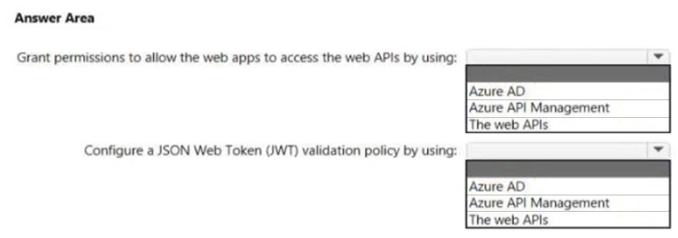

**Answer:**
Correct Answer:
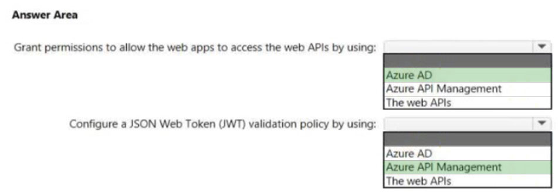

**Explication:**
- Box 1: Azure AD –
Grant permissions in Azure AD.
- Box 2: Azure API Management –
Configure a JWT validation policy to pre-authorize requests.
Pre-authorize requests in API Management with the Validate JWT policy, by validating the access tokens of each incoming request. If a request does not have a valid token, API Management blocks it.

## Question Set 34

**Context:**
You need to recommend a solution to generate a monthly report of all the new Azure Resource Manager (ARM) resource deployments in your Azure subscription.

**Question:**
What should you include in the recommendation?
- A. Azure Log Analytics
- B. Azure Arc
- C. Azure Analysis Services
- D. Application Insights

**Answer:**
Correct Answer: A

**Explication:**
The Activity log is a platform log in Azure that provides insight into subscription-level events. Activity log includes such information as when a resource is modified or when a virtual machine is started.
Activity log events are retained in Azure for 90 days and then deleted.
For more functionality, you should create a diagnostic setting to send the Activity log to one or more of these locations for the following reasons: to Azure Monitor Logs for more complex querying and alerting, and longer retention (up to two years) to Azure Event Hubs to forward outside of Azure to Azure Storage for cheaper, long-term archiving
Note: Azure Monitor builds on top of Log Analytics, the platform service that gathers log and metrics data from all your resources. The easiest way to think about it is that Azure Monitor is the marketing name, whereas Log Analytics is the technology that powers it.

## Question Set 35

**Context:**
Your company has the divisions shown in the following table.
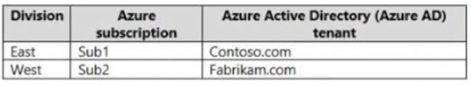
Sub1 contains an Azure App Service web app named App1. App1 uses Azure AD for single-tenant user authentication. Users from contoso.com can authenticate to App1.
You need to recommend a solution to enable users in the fabrikam.com tenant to authenticate to App1.

**Question:**
What should you recommend?
- A. Configure the Azure AD provisioning service.
- B. Configure assignments for the fabrikam.com users by using Azure AD Privileged Identity Management (PIM).
- C. Use Azure AD entitlement management to govern external users.
- D. Configure Azure AD Identity Protection.

**Answer:**
Correct Answer: C

**Explication:**
Entitlement management is an identity governance capability that enables organizations to manage identity and access lifecycle at scale by automating access request workflows, access assignments, reviews, and expiration. Entitlement management allows delegated non-admins to create access packages that external users from other organizations can request access to. One and multi-stage approval workflows can be configured to evaluate requests, and provision users for time-limited access with recurring reviews. Entitlement management enables policy-based provisioning and deprovisioning of external accounts.
Note: Access Packages –
An access package is the foundation of entitlement management. Access packages are groupings of policy-governed resources a user needs to collaborate on a project or do other tasks. For example, an access package might include: access to specific SharePoint sites. enterprise applications including your custom in-house and SaaS apps like Salesforce.
Microsoft Teams.
Microsoft 365 Groups.
Incorrect:
Not A: Automatic provisioning refers to creating user identities and roles in the cloud applications that users need access to. In addition to creating user identities, automatic provisioning includes the maintenance and removal of user identities as status or roles change.
Not B: Privileged Identity Management provides time-based and approval-based role activation to mitigate the risks of excessive, unnecessary, or misused access permissions on resources that you care about. Here are some of the key features of Privileged Identity Management:
Provide just-in-time privileged access to Azure AD and Azure resources
Assign time-bound access to resources using start and end dates
Etc.

## Question Set 36

**Context:**
You are developing an app that will read activity logs for an Azure subscription by using Azure Functions.
You need to recommend an authentication solution for Azure Functions. The solution must minimize administrative effort.

**Question:**
What should you include in the recommendation?
- A. an enterprise application in Azure AD
- B. system-assigned managed identities
- C. shared access signatures (SAS)
- D. application registration in Azure AD

**Answer:**
Correct Answer: B

**Explication:**
N/A

## Question Set 37

**Context:**
Your company has the divisions shown in the following table.
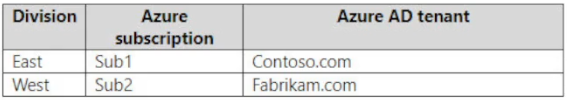
Sub1 contains an Azure App Service web app named App1. App1 uses Azure AD for single-tenant user authentication. Users from contoso.com can authenticate to App1.
You need to recommend a solution to enable users in the fabrikam.com tenant to authenticate to App1.

**Question:**
What should you recommend?
- A. Configure Azure AD join.
- B. Use Azure AD entitlement management to govern external users.
- C. Enable Azure AD pass-through authentication and update the sign-in endpoint.
- D. Configure assignments for the fabrikam.com users by using Azure AD Privileged Identity Management (PIM).

**Answer:**
Correct Answer: B

**Explication:**
N/A

## Question Set 38

**Context:**
Your company has the divisions shown in the following table.

Sub1 contains an Azure App Service web app named App1. App1 uses Azure AD for single-tenant user authentication. Users from contoso.com can authenticate to App1.
You need to recommend a solution to enable users in the fabrikam.com tenant to authenticate to App1.

**Question:**
What should you recommend?
- A. Configure Azure AD join.
- B. Configure Azure AD Identity Protection.
- C. Use Azure AD entitlement management to govern external users.
- D. Configure assignments for the fabrikam.com users by using Azure AD Privileged Identity Management (PIM).

**Answer:**
Correct Answer: C

**Explication:**
N/A

## Question Set 39

**Context:**
You need to recommend a solution to generate a monthly report of all the new Azure Resource Manager (ARM) resource deployments in your Azure subscription.

**Question:**
What should you include in the recommendation?
- A. Azure Activity Log
- B. Azure Arc
- C. Azure Analysis Services
- D. Azure Monitor metrics

**Answer:**
Correct Answer: A

**Explication:**
N/A

## Question Set 40

**Context:**
HOTSPOT
–
You have an Azure subscription that contains an Azure key vault named KV1 and a virtual machine named VM1. VM1 runs Windows Server 2022: Azure Edition.
You plan to deploy an ASP.Net Core-based application named App1 to VM1.
You need to configure App1 to use a system-assigned managed identity to retrieve secrets from KV1. The solution must minimize development effort.

**Question:**
What should you do? To answer, select the appropriate options in the answer area.
NOTE: Each correct selection is worth one point.
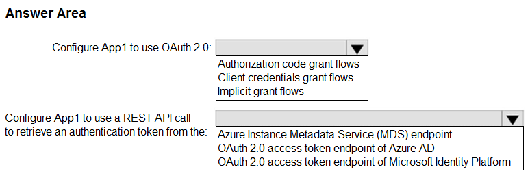

**Answer:**
Correct Answer:
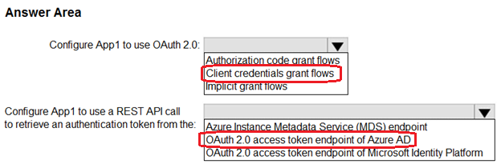

**Explication:**
N/A

## Question Set 41

**Context:**
Your company has the divisions shown in the following table.

Sub1 contains an Azure App Service web app named App1. App1 uses Azure AD for single-tenant user authentication. Users from contoso.com can authenticate to App1.
You need to recommend a solution to enable users in the fabrikam.com tenant to authenticate to App1.

**Question:**
What should you recommend?
- A. Configure Azure AD join.
- B. Configure Azure AD Identity Protection.
- C. Configure a Conditional Access policy.
- D. Configure Supported account types in the application registration and update the sign-in endpoint.

**Answer:**
Correct Answer: D

**Explication:**
N/A

## Question Set 42

**Context:**
You have an Azure AD tenant named contoso.com that has a security group named Group1. Group1 is configured for assigned memberships. Group1 has 50 members, including 20 guest users.
You need to recommend a solution for evaluating the membership of Group1. The solution must meet the following requirements:
• The evaluation must be repeated automatically every three months.
• Every member must be able to report whether they need to be in Group1.
• Users who report that they do not need to be in Group1 must be removed from Group1 automatically.
• Users who do not report whether they need to be in Group1 must be removed from Group1 automatically.

**Question:**
What should you include in the recommendation?
- A. Implement Azure AD Identity Protection.
- B. Change the Membership type of Group1 to Dynamic User.
- C. Create an access review.
- D. Implement Azure AD Privileged Identity Management (PIM).

**Answer:**
Correct Answer: D

**Explication:**
N/A

## Question Set 43

**Context:**
HOTSPOT
–
You have an Azure subscription named Sub1 that is linked to an Azure AD tenant named contoso.com.
You plan to implement two ASP.NET Core apps named App1 and App2 that will be deployed to 100 virtual machines in Sub1. Users will sign in to App1 and App2 by using their contoso.com credentials.
App1 requires read permissions to access the calendar of the signed-in user. App2 requires write permissions to access the calendar of the signed-in user.
You need to recommend an authentication and authorization solution for the apps. The solution must meet the following requirements:
• Use the principle of least privilege.
• Minimize administrative effort.

**Question:**
What should you include in the recommendation? To answer, select the appropriate options in the answer area.
NOTE: Each correct selection is worth one point.
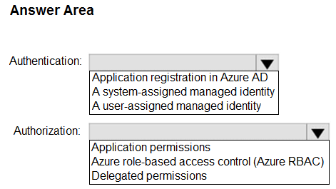

**Answer:**
Correct Answer:
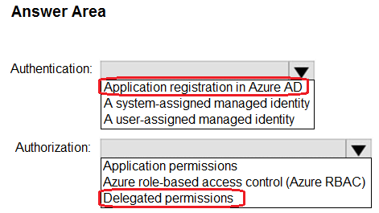

**Explication:**
N/A

## Question Set 44

**Context:**
Your company has the divisions shown in the following table.

Sub1 contains an Azure App Service web app named App1. App1 uses Azure AD for single-tenant user authentication. Users from contoso.com can authenticate to App1.
You need to recommend a solution to enable users in the fabrikam.com tenant to authenticate to App1.

**Question:**
What should you recommend?
- A. Enable Azure AD pass-through authentication and update the sign-in endpoint.
- B. Use Azure AD entitlement management to govern external users.
- C. Configure assignments for the fabrikam.com users by using Azure AD Privileged Identity Management (PIM).
- D. Configure Azure AD Identity Protection.

**Answer:**
Correct Answer: B

**Explication:**
N/A

## Question Set 45

**Context:**
Your company has the divisions shown in the following table.

Sub1 contains an Azure App Service web app named App1. App1 uses Azure AD for single-tenant user authentication. Users from contoso.com can authenticate to App1.
You need to recommend a solution to enable users in the fabrikam.com tenant to authenticate to App1.

**Question:**
What should you recommend?
- A. Configure the Azure AD provisioning service.
- B. Enable Azure AD pass-through authentication and update the sign-in endpoint.
- C. Configure Supported account types in the application registration and update the sign-in endpoint.
- D. Configure Azure AD join.

**Answer:**
Correct Answer: C

**Explication:**
N/A

## Question Set 46

**Context:**
N/A

**Question:**
HOTSPOT
–
You have an Azure AD tenant that contains a management group named MG1.
You have the Azure subscriptions shown in the following table.
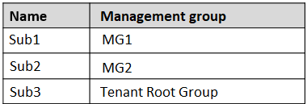
The subscriptions contain the resource groups shown in the following table.
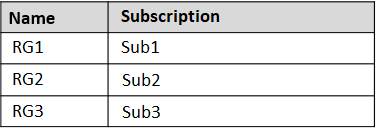
The subscription contains the Azure AD security groups shown in the following table.
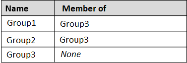
The subscription contains the user accounts shown in the following table.
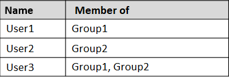
You perform the following actions:
Assign User3 the Contributor role for Sub1.
Assign Group1 the Virtual Machine Contributor role for MG1.
Assign Group3 the Contributor role for the Tenant Root Group.
For each of the following statements, select Yes if the statement is true. Otherwise, select No.
NOTE: Each correct selection is worth one point.
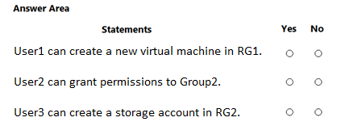

**Answer:**
Correct Answer:
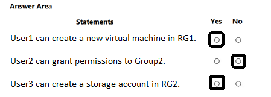

**Explication:**
N/A

## Question Set 47

**Context:**
Your company has the divisions shown in the following table.

Sub1 contains an Azure App Service web app named App1. App1 uses Azure AD for single-tenant user authentication. Users from contoso.com can authenticate to App1.
You need to recommend a solution to enable users in the fabrikam.com tenant to authenticate to App1.

**Question:**
What should you recommend?
- A. Configure Azure AD Identity Protection.
- B. Configure assignments for the fabrikam.com users by using Azure AD Privileged Identity Management (PIM).
- C. Configure Supported account types in the application registration and update the sign-in endpoint.
- D. Configure a Conditional Access policy.

**Answer:**
Correct Answer: C

**Explication:**
N/A

## Question Set 48

**Context:**
Your company has the divisions shown in the following table.

Sub1 contains an Azure App Service web app named App1. App1 uses Azure AD for single-tenant user authentication. Users from contoso.com can authenticate to App1.
You need to recommend a solution to enable users in the fabrikam.com tenant to authenticate to App1.

**Question:**
What should you recommend?
- A. Use Azure AD entitlement management to govern external users.
- B. Enable Azure AD pass-through authentication and update the sign-in endpoint.
- C. Configure a Conditional Access policy.
- D. Configure assignments for the fabrikam.com users by using Azure AD Privileged Identity Management (PIM).

**Answer:**
Correct Answer: A

**Explication:**
N/A

## Question Set 49

**Context:**
You have an Azure subscription that contains 1,000 resources.
You need to generate compliance reports for the subscription. The solution must ensure that the resources can be grouped by department.

**Question:**
What should you use to organize the resources?
- A. application groups and quotas
- B. Azure Policy and tags
- C. administrative units and Azure Lighthouse
- D. resource groups and role assignments

**Answer:**
Correct Answer: B

**Explication:**
N/A

## Question Set 50

**Context:**
You need to recommend a solution to generate a monthly report of all the new Azure Resource Manager (ARM) resource deployments in your Azure subscription.

**Question:**
What should you include in the recommendation?
- A. Azure Arc
- B. Azure Monitor metrics
- C. Azure Advisor
- D. Azure Log Analytics

**Answer:**
Correct Answer: D

**Explication:**
N/A

## Question Set 51

**Context:**
You need to recommend a solution to generate a monthly report of all the new Azure Resource Manager (ARM) resource deployments in your Azure subscription.

**Question:**
What should you include in the recommendation?
- A. Azure Monitor action groups
- B. Azure Arc
- C. Azure Monitor metrics
- D. Azure Activity Log

**Answer:**
Correct Answer: D

**Explication:**
N/A

## Question Set 52

**Context:**
DRAG DROP
–
You have an Azure AD tenant that contains an administrative unit named MarketingAU . MarketingAU contains 100 users.
You create two users named User1 and User2.
You need to ensure that the users can perform the following actions in MarketingAU :
• User1 must be able to create user accounts.
• User2 must be able to reset user passwords.

**Question:**
Which role should you assign to each user? To answer, drag the appropriate roles to the correct users. Each role may be used once, more than once, or not at all. You may need to drag the split bar between panes or scroll to view content.
NOTE: Each correct selection is worth one point.
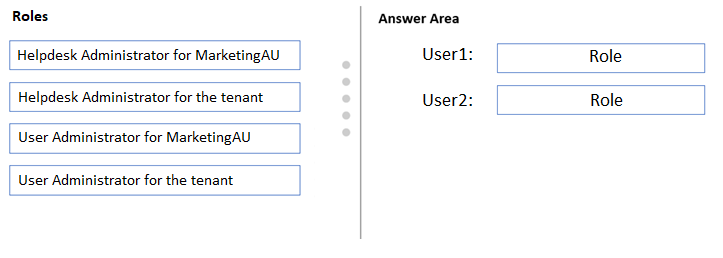

**Answer:**
Correct Answer:
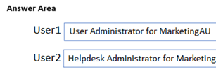

**Explication:**
N/A

## Question Set 53

**Context:**
You need to recommend a solution to generate a monthly report of all the new Azure Resource Manager (ARM) resource deployments in your Azure subscription.

**Question:**
What should you include in the recommendation?
- A. Azure Arc
- B. Azure Log Analytics
- C. Application insights
- D. Azure Monitor action groups

**Answer:**
Correct Answer: B

**Explication:**
N/A

## Question Set 54

**Context:**
HOTSPOT
–
You are designing an app that will be hosted on Azure virtual machines that run Ubuntu. The app will use a third-party email service to send email messages to users. The third-party email service requires that the app authenticate by using an API key.
You need to recommend an Azure Key Vault solution for storing and accessing the API key. The solution must minimize administrative effort.

**Question:**
What should you recommend using to store and access the key? To answer, select the appropriate options in the answer area.
NOTE: Each correct selection is worth one point.
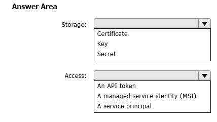

**Answer:**
Correct Answer:
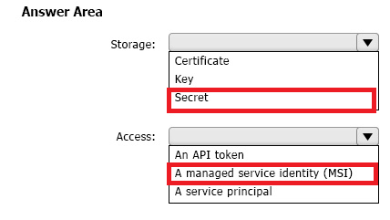

**Explication:**
N/A

## Question Set 55

**Context:**
DRAG DROP
–
You have two app registrations named App1 and App2 in Azure AD. App1 supports role-based access control (RBAC) and includes a role named Writer.
You need to ensure that when App2 authenticates to access App1, the tokens issued by Azure AD include the Writer role claim.

**Question:**
Which blade should you use to modify each app registration? To answer, drag the appropriate blades to the correct app registrations. Each blade may be used once, more than once, or not at all. You may need to drag the split bar between panes or scroll to view content.
NOTE: Each correct selection is worth one point.
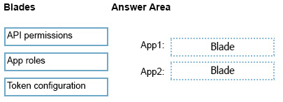

**Answer:**
Correct Answer:
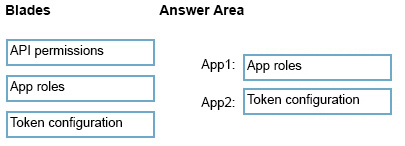

**Explication:**
N/A

## Question Set 56

**Context:**
You need to recommend a solution to generate a monthly report of all the new Azure Resource Manager (ARM) resource deployments in your Azure subscription.

**Question:**
What should you include in the recommendation?
- A. Application Insights
- B. Azure Arc
- C. Azure Log Analytics
- D. Azure Monitor metrics

**Answer:**
Correct Answer: C

**Explication:**
N/A

## Question Set 57

**Context:**
You have an Azure subscription.
You plan to deploy a monitoring solution that will include the following:
• Azure Monitor Network Insights
• Application Insights
• Microsoft Sentinel
• VM insights
The monitoring solution will be managed by a single team.

**Question:**
What is the minimum number of Azure Monitor workspaces required?
- A. 1
- B. 2
- C. 3
- D. 4

**Answer:**
Correct Answer: C

**Explication:**
N/A

## Question Set 58

**Context:**
You need to recommend a solution to generate a monthly report of all the new Azure Resource Manager (ARM) resource deployments in your Azure subscription.

**Question:**
What should you include in the recommendation?
- A. Application Insights
- B. Azure Analysis Services
- C. Azure Advisor
- D. Azure Activity Log

**Answer:**
Correct Answer: D

**Explication:**
N/A

## Question Set 59

**Context:**
HOTSPOT
–
Case Study
–
This is a case study. Case studies are not timed separately. You can use as much exam time as you would like to complete each case. However, there may be additional case studies and sections on this exam. You must manage your time to ensure that you are able to complete all questions included on this exam in the time provided.
To answer the questions included in a case study, you will need to reference information that is provided in the case study. Case studies might contain exhibits and other resources that provide more information about the scenario that is described in the case study. Each question is independent of the other questions in this case study.
At the end of this case study, a review screen will appear. This screen allows you to review your answers and to make changes before you move to the next section of the exam. After you begin a new section, you cannot return to this section.
To start the case study
–
To display the first question in this case study, click the Next button. Use the buttons in the left pane to explore the content of the case study before you answer the questions. Clicking these buttons displays information such as business requirements, existing environment, and problem statements. If the case study has an All Information tab, note that the information displayed is identical to the information displayed on the subsequent tabs. When you are ready to answer a question, click the Question button to return to the question.
Overview
–
Fabrikam , Inc. is an engineering company that has offices throughout Europe. The company has a main office in London and three branch offices in Amsterdam, Berlin, and Rome.
Existing Environment: Active Directory Environment
The network contains two Active Directory forests named corp.fabrikam.com and rd.fabrikam.com. There are no trust relationships between the forests.
Corp.fabrikam.com is a production forest that contains identities used for internal user and computer authentication.
Rd.fabrikam.com is used by the research and development (R&D) department only. The R&D department is restricted to using on-premises resources only.
Existing Environment: Network Infrastructure
Each office contains at least one domain controller from the corp.fabrikam.com domain. The main office contains all the domain controllers for the rd.fabrikam.com forest.
All the offices have a high-speed connection to the internet.
An existing application named WebApp1 is hosted in the data center of the London office. WebApp1 is used by customers to place and track orders. WebApp1 has a web tier that uses Microsoft Internet Information Services (IIS) and a database tier that runs Microsoft SQL Server 2016. The web tier and the database tier are deployed to virtual machines that run on Hyper-V.
The IT department currently uses a separate Hyper-V environment to test updates to WebApp1.
Fabrikam purchases all Microsoft licenses through a Microsoft Enterprise Agreement that includes Software Assurance.
Existing Environment: Problem Statements
The use of WebApp1 is unpredictable. At peak times, users often report delays. At other times, many resources for WebApp1 are underutilized.
Requirements: Planned Changes
–
Fabrikam plans to move most of its production workloads to Azure during the next few years, including virtual machines that rely on Active Directory for authentication.
As one of its first projects, the company plans to establish a hybrid identity model, facilitating an upcoming Microsoft 365 deployment.
All R&D operations will remain on-premises.
Fabrikam plans to migrate the production and test instances of WebApp1 to Azure.
Requirements: Technical Requirements
Fabrikam identifies the following technical requirements:
• Website content must be easily updated from a single point.
• User input must be minimized when provisioning new web app instances.
• Whenever possible, existing on-premises licenses must be used to reduce cost.
• Users must always authenticate by using their corp.fabrikam.com UPN identity.
• Any new deployments to Azure must be redundant in case an Azure region fails.
• Whenever possible, solutions must be deployed to Azure by using the Standard pricing tier of Azure App Service.
• An email distribution group named IT Support must be notified of any issues relating to the directory synchronization services.
• In the event that a link fails between Azure and the on-premises network, ensure that the virtual machines hosted in Azure can authenticate to Active Directory.
• Directory synchronization between Azure Active Directory (Azure AD) and corp.fabrikam.com must not be affected by a link failure between Azure and the on-premises network.
Requirements: Database Requirements
Fabrikam identifies the following database requirements:
• Database metrics for the production instance of WebApp1 must be available for analysis so that database administrators can optimize the performance settings.
• To avoid disrupting customer access, database downtime must be minimized when databases are migrated.
• Database backups must be retained for a minimum of seven years to meet compliance requirements.
Requirements: Security Requirements
Fabrikam identifies the following security requirements:
• Company information including policies, templates, and data must be inaccessible to anyone outside the company.
• Users on the on-premises network must be able to authenticate to corp.fabrikam.com if an internet link fails.
• Administrators must be able authenticate to the Azure portal by using their corp.fabrikam.com credentials.
• All administrative access to the Azure portal must be secured by using multi-factor authentication (MFA).
• The testing of WebApp1 updates must not be visible to anyone outside the company.

**Question:**
To meet the authentication requirements of Fabrikam , what should you include in the solution? To answer, select the appropriate options in the answer area.
NOTE: Each correct selection is worth one point.
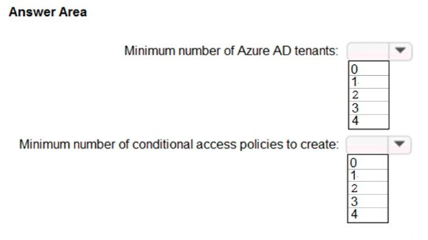

**Answer:**
Correct Answer:
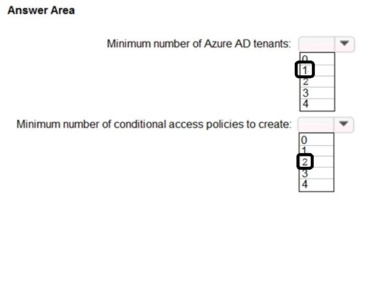

**Explication:**
N/A

## Question Set 60

**Context:**
You have an Azure subscription that contains 10 web apps. The apps are integrated with Azure AD and are accessed by users on different project teams.
The users frequently move between projects.
You need to recommend an access management solution for the web apps. The solution must meet the following requirements:
• The users must only have access to the app of the project to which they are assigned currently.
• Project managers must verify which users have access to their project’s app and remove users that are no longer assigned to their project.
• Once every 30 days, the project managers must be prompted automatically to verify which users are assigned to their projects.

**Question:**
What should you include in the recommendation?
- A. Azure AD Identity Protection
- B. Microsoft Defender for Identity
- C. Microsoft Entra Permissions Management
- D. Azure AD Identity Governance

**Answer:**
Correct Answer: D

**Explication:**
N/A

## Question Set 61

**Context:**
HOTSPOT
–
You have an Azure subscription that contains 50 Azure SQL databases.
You create an Azure Resource Manager (ARM) template named Template1 that enables Transparent Data Encryption (TDE).
You need to create an Azure Policy definition named Policy1 that will use Template1 to enable TDE for any noncompliant Azure SQL databases.

**Question:**
How should you configure Policy1? To answer, select the appropriate options in the answer area.
NOTE: Each correct selection is worth one point.
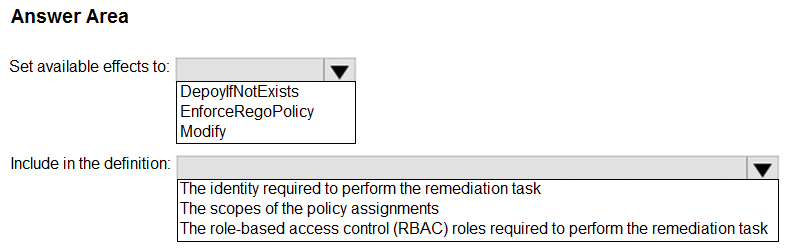

**Answer:**
Correct Answer:
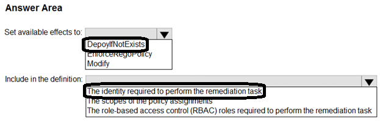

**Explication:**
N/A

## Question Set 62

**Context:**
You have an Azure subscription. The subscription contains a tiered app named App1 that is distributed across multiple containers hosted in Azure Container Instances.
You need to deploy an Azure Monitor monitoring solution for App. The solution must meet the following requirements:
• Support using synthetic transaction monitoring to monitor traffic between the App1 components.
• Minimize development effort.

**Question:**
What should you include in the solution?
- A. Network insights
- B. Application Insights
- C. Container insights
- D. Log Analytics Workspace insights

**Answer:**
Correct Answer: B

**Explication:**
N/A

## Question Set 63

**Context:**
HOTSPOT
–
You have an Azure subscription that contains the resources shown in the following table:
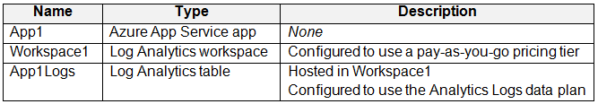
Log files from App1 are registered to App1Logs. An average of 120 GB of log data is ingested per day.
You configure an Azure Monitor alert that will be triggered if the App1 logs contain error messages.
You need to minimize the Log Analytics costs associated with App1. The solution must meet the following requirements:
• Ensure that all the log files from App1 are ingested to App1Logs.
• Minimize the impact on the Azure Monitor alert.

**Question:**
Which resource should you modify, and which modification should you perform? To answer, select the appropriate options in the answer area.
NOTE: Each correct selection is worth one point.
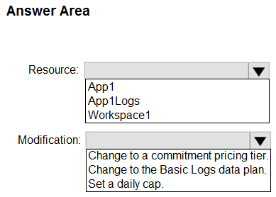

**Answer:**
Correct Answer:
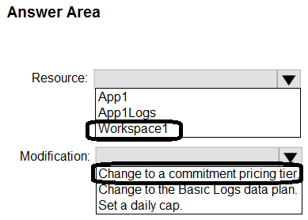

**Explication:**
N/A

## Question Set 64

**Context:**
You have 12 Azure subscriptions and three projects. Each project uses resources across multiple subscriptions.
You need to use Microsoft Cost Management to monitor costs on a per project basis. The solution must minimize administrative effort.

**Question:**
Which two components should you include in the solution? Each correct answer presents part of the solution.
NOTE: Each correct selection is worth one point.
- A. budgets
- B. resource tags
- C. custom role-based access control (RBAC) roles
- D. management groups
- E. Azure boards

**Answer:**
Correct Answer: BD

**Explication:**
N/A

## Question Set 65

**Context:**
HOTSPOT
–
You have an Azure subscription that contains multiple storage accounts.
You assign Azure Policy definitions to the storage accounts.
You need to recommend a solution to meet the following requirements:
• Trigger on-demand Azure Policy compliance scans.
• Raise Azure Monitor non-compliance alerts by querying logs collected by Log Analytics.

**Question:**
What should you recommend for each requirement? To answer, select the appropriate options in the answer area.
NOTE: Each correct selection is worth one point.
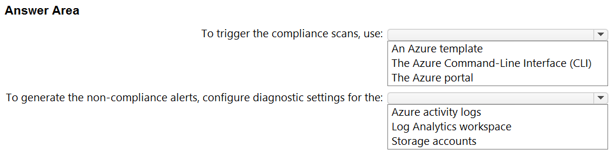

**Answer:**
Correct Answer:
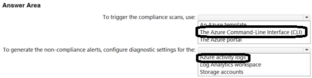

**Explication:**
N/A

## Question Set 66

**Context:**
HOTSPOT
–
You have an Azure subscription.
You plan to deploy five storage accounts that will store block blobs and five storage accounts that will host file shares. The file shares will be accessed by using the SMB protocol.
You need to recommend an access authorization solution for the storage accounts. The solution must meet the following requirements:
• Maximize security.
• Prevent the use of shared keys.
• Whenever possible, support time-limited access.

**Question:**
What should you include in the solution? To answer, select the appropriate options in the answer area.
NOTE: Each correct selection is worth one point.
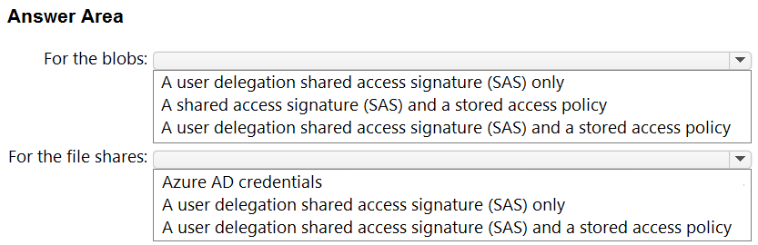

**Answer:**
Correct Answer:
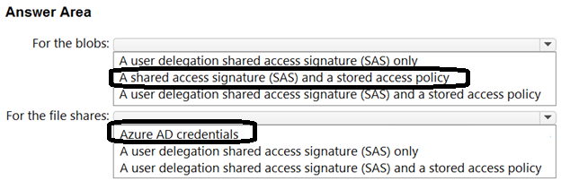

**Explication:**
N/A

## Question Set 67

**Context:**
HOTSPOT
–
You have an Azure subscription. The subscription contains 100 virtual machines that run Windows Server 2022 and have the Azure Monitor Agent installed.
You need to recommend a solution that meets the following requirements:
• Forwards JSON-formatted logs from the virtual machines to a Log Analytics workspace
• Transforms the logs and stores the data in a table in the Log Analytics workspace

**Question:**
What should you include in the recommendation? To answer, select the appropriate options in the answer area.
NOTE: Each correct selection is worth one point.
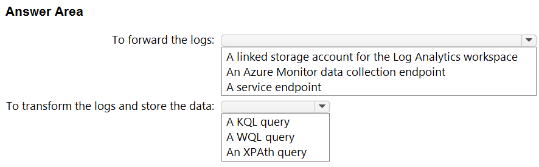

**Answer:**
Correct Answer:
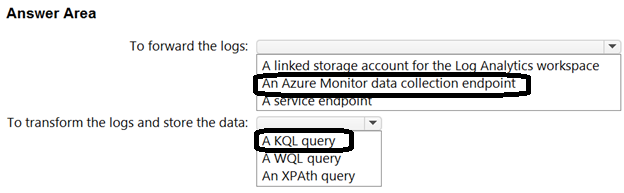

**Explication:**
Topic 2 – Question Set 2

## Question Set 68

**Context:**
You have 100 servers that run Windows Server 2012 R2 and host Microsoft SQL Server 2014 instances. The instances host databases that have the following characteristics:
- Stored procedures are implemented by using CLR.
- The largest database is currently 3 TB. None of the databases will ever exceed 4 TB.
You plan to move all the data from SQL Server to Azure.
You need to recommend a service to host the databases. The solution must meet the following requirements:
- Whenever possible, minimize management overhead for the migrated databases.
- Ensure that users can authenticate by using Azure Active Directory (Azure AD) credentials.
- Minimize the number of database changes required to facilitate the migration.

**Question:**
What should you include in the recommendation?
- A. Azure SQL Database elastic pools
- B. Azure SQL Managed Instance
- C. Azure SQL Database single databases
- D. SQL Server 2016 on Azure virtual machines

**Answer:**
Correct Answer: B

**Explication:**
SQL Managed Instance allows existing SQL Server customers to lift and shift their on-premises applications to the cloud with minimal application and database changes. At the same time, SQL Managed Instance preserves all PaaS capabilities (automatic patching and version updates, automated backups, high availability) that drastically reduce management overhead and TCO.

## Question Set 69

**Context:**
You have an Azure subscription that contains an Azure Blob Storage account named store1.
You have an on-premises file server named Server1 that runs Windows Server 2016. Server1 stores 500 GB of company files.
You need to store a copy of the company files from Server1 in store1.

**Question:**
Which two possible Azure services achieve this goal? Each correct answer presents a complete solution.
NOTE: Each correct selection is worth one point.
- A. an Azure Logic Apps integration account
- B. an Azure Import/Export job
- C. Azure Data Factory
- D. an Azure Analysis services On-premises data gateway
- E. an Azure Batch account

**Answer:**
Correct Answer: BC

**Explication:**
B: You can use the Azure Import/Export service to securely export large amounts of data from Azure Blob storage. The service requires you to ship empty drives to the Azure datacenter. The service exports data from your storage account to the drives and then ships the drives back.
C: Big data requires a service that can orchestrate and operationalize processes to refine these enormous stores of raw data into actionable business insights.
Azure Data Factory is a managed cloud service that’s built for these complex hybrid extract-transform-load (ETL), extract-load-transform (ELT), and data integration projects.

## Question Set 70

**Context:**
You have an Azure subscription that contains two applications named App1 and App2. App1 is a sales processing application. When a transaction in App1 requires shipping, a message is added to an Azure Storage account queue, and then App2 listens to the queue for relevant transactions.
In the future, additional applications will be added that will process some of the shipping requests based on the specific details of the transactions.
You need to recommend a replacement for the storage account queue to ensure that each additional application will be able to read the relevant transactions.

**Question:**
What should you recommend?
- A. one Azure Data Factory pipeline
- B. multiple storage account queues
- C. one Azure Service Bus queue
- D. one Azure Service Bus topic

**Answer:**
Correct Answer: D

**Explication:**
A queue allows processing of a message by a single consumer. In contrast to queues, topics and subscriptions provide a one-to-many form of communication in a publish and subscribe pattern. It’s useful for scaling to large numbers of recipients. Each published message is made available to each subscription registered with the topic. Publisher sends a message to a topic and one or more subscribers receive a copy of the message, depending on filter rules set on these subscriptions.
9%

## Question Set 71

**Context:**
HOTSPOT –
You need to design a storage solution for an app that will store large amounts of frequently used data. The solution must meet the following requirements:
- Maximize data throughput.
- Prevent the modification of data for one year.
- Minimize latency for read and write operations.

**Question:**
Which Azure Storage account type and storage service should you recommend? To answer, select the appropriate options in the answer area.
NOTE: Each correct selection is worth one point.
Hot Area:
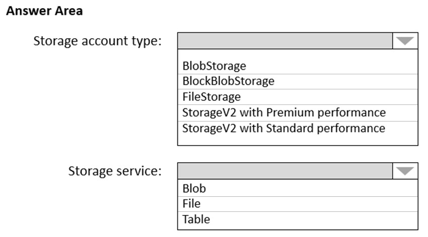

**Answer:**
Correct Answer:
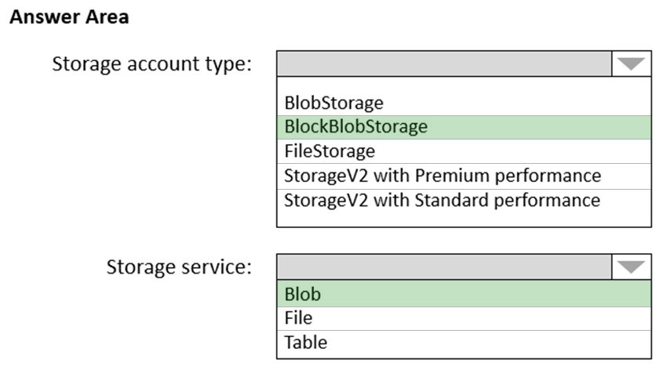

**Explication:**
- Box 1: BlockBlobStorage –
Block Blob is a premium storage account type for block blobs and append blobs. Recommended for scenarios with high transactions rates, or scenarios that use smaller objects or require consistently low storage latency.
- Box 2: Blob –
The Archive tier is an offline tier for storing blob data that is rarely accessed. The Archive tier offers the lowest storage costs, but higher data retrieval costs and latency compared to the online tiers (Hot and Cool). Data must remain in the Archive tier for at least 180 days or be subject to an early deletion charge.

## Question Set 72

**Context:**
HOTSPOT –
You have an Azure subscription that contains the storage accounts shown in the following table.
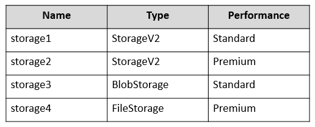
You plan to implement two new apps that have the requirements shown in the following table.
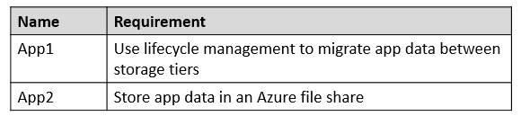

**Question:**
Which storage accounts should you recommend using for each app? To answer, select the appropriate options in the answer area.
NOTE: Each correct selection is worth one point.
Hot Area:
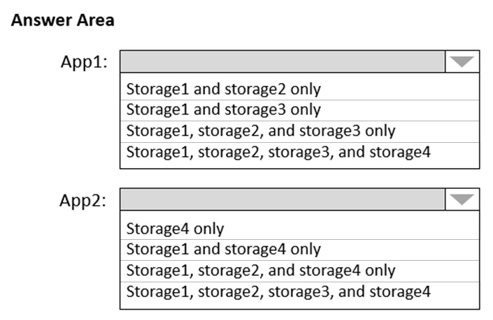

**Answer:**
Correct Answer:
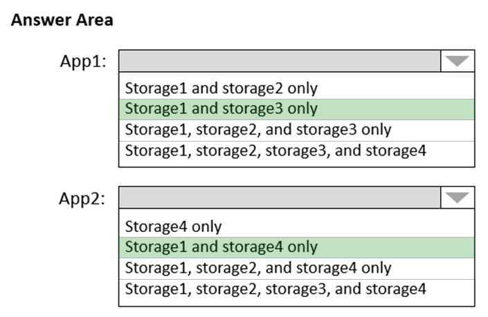

**Explication:**
- Box 1: Storage1 and storage3 only
Need to use Standard accounts.
Data stored in a premium block blob storage account cannot be tiered to hot, cool, or archive using Set Blob Tier or using Azure Blob Storage lifecycle management
- Box 2: Storage1 and storage4 only
Azure File shares requires Premium accounts. Only Storage1 and storage4 are premium.

## Question Set 73

**Context:**
You are designing an application that will be hosted in Azure.
The application will host video files that range from 50 MB to 12 GB. The application will use certificate-based authentication and will be available to users on the internet.
You need to recommend a storage option for the video files. The solution must provide the fastest read performance and must minimize storage costs.

**Question:**
What should you recommend?
- A. Azure Files
- B. Azure Data Lake Storage Gen2
- C. Azure Blob Storage
- D. Azure SQL Database

**Answer:**
Correct Answer: C

**Explication:**
Blob Storage: Stores large amounts of unstructured data, such as text or binary data, that can be accessed from anywhere in the world via HTTP or HTTPS. You can use Blob storage to expose data publicly to the world, or to store application data privately.
Max file in Blob Storage. 4.77 TB.

## Question Set 74

**Context:**
You are designing a SQL database solution. The solution will include 20 databases that will be 20 GB each and have varying usage patterns.
You need to recommend a database platform to host the databases. The solution must meet the following requirements:
- The solution must meet a Service Level Agreement (SLA) of 99.99% uptime.
- The compute resources allocated to the databases must scale dynamically.
- The solution must have reserved capacity.
Compute charges must be minimized.

**Question:**
What should you include in the recommendation?
- A. an elastic pool that contains 20 Azure SQL databases
- B. 20 databases on a Microsoft SQL server that runs on an Azure virtual machine in an availability set
- C. 20 databases on a Microsoft SQL server that runs on an Azure virtual machine
- D. 20 instances of Azure SQL Database serverless

**Answer:**
Correct Answer: A

**Explication:**
The compute and storage redundancy is built in for business critical databases and elastic pools, with a SLA of 99.99%.
Reserved capacity provides you with the flexibility to temporarily move your hot databases in and out of elastic pools (within the same region and performance tier) as part of your normal operations without losing the reserved capacity benefit.
Understanding and leveraging Azure SQL Database’s SLA

## Question Set 75

**Context:**
HOTSPOT –
You have an on-premises database that you plan to migrate to Azure.
You need to design the database architecture to meet the following requirements:
- Support scaling up and down.
- Support geo-redundant backups.
- Support a database of up to 75 TB.
- Be optimized for online transaction processing (OLTP).

**Question:**
What should you include in the design? To answer, select the appropriate options in the answer area.
NOTE: Each correct selection is worth one point.
Hot Area:
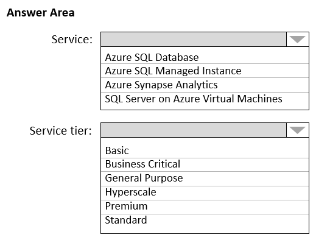

**Answer:**
Correct Answer:
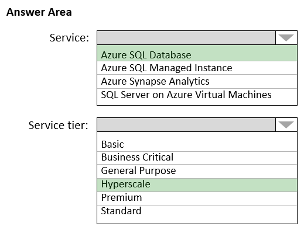

**Explication:**
- Box 1: Azure SQL Database –
Azure SQL Database:
Database size always depends on the underlying service tiers (e.g. Basic, Business Critical, Hyperscale).
It supports databases of up to 100 TB with Hyperscale service tier model.
Active geo-replication is a feature that lets you to create a continuously synchronized readable secondary database for a primary database. The readable secondary database may be in the same Azure region as the primary, or, more commonly, in a different region. This kind of readable secondary databases are also known as geo-secondaries, or geo-replicas.
Azure SQL Database and SQL Managed Instance enable you to dynamically add more resources to your database with minimal downtime.
- Box 2: Hyperscale –
Incorrect Answers:
- SQL Server on Azure VM: geo-replication not supported.
- Azure Synapse Analytics is not optimized for online transaction processing (OLTP).
- Azure SQL Managed Instance max database size is up to currently available instance size (depending on the number of vCores ).
Max instance storage size (reserved) – 2 TB for 4 vCores
– 8 TB for 8 vCores
– 16 TB for other sizes

## Question Set 76

**Context:**
You are planning an Azure IoT Hub solution that will include 50,000 IoT devices.
Each device will stream data, including temperature, device ID, and time data. Approximately 50,000 records will be written every second. The data will be visualized in near real time.
You need to recommend a service to store and query the data.

**Question:**
Which two services can you recommend? Each correct answer presents a complete solution.
NOTE: Each correct selection is worth one point.
- A. Azure Table Storage
- B. Azure Event Grid
- C. Azure Cosmos DB SQL API
- D. Azure Time Series Insights

**Answer:**
Correct Answer: CD

**Explication:**
D: Time Series Insights is a fully managed service for time series data. In this architecture, Time Series Insights performs the roles of stream processing, data store, and analytics and reporting. It accepts streaming data from either IoT Hub or Event Hubs and stores, processes, analyzes, and displays the data in near real time.
C: The processed data is stored in an analytical data store, such as Azure Data Explorer, HBase, Azure Cosmos DB, Azure Data Lake, or Blob Storage.

## Question Set 77

**Context:**
You are designing an application that will aggregate content for users.
You need to recommend a database solution for the application. The solution must meet the following requirements:
- Support SQL commands.
- Support multi-master writes.
- Guarantee low latency read operations.

**Question:**
What should you include in the recommendation?
- A. Azure Cosmos DB SQL API
- B. Azure SQL Database that uses active geo-replication
- C. Azure SQL Database Hyperscale
- D. Azure Database for PostgreSQL

**Answer:**
Correct Answer: A

**Explication:**
With Cosmos DB’s novel multi-region (multi-master) writes replication protocol, every region supports both writes and reads. The multi-region writes capability also enables:
Unlimited elastic write and read scalability.
99.999% read and write availability all around the world.
Guaranteed reads and writes served in less than 10 milliseconds at the 99th percentile.

## Question Set 78

**Context:**
N/A

**Question:**
HOTSPOT –
You have an Azure subscription that contains the SQL servers on Azure shown in the following table.
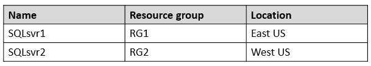
The subscription contains the storage accounts shown in the following table.
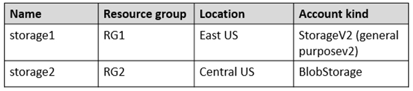
You create the Azure SQL databases shown in the following table.
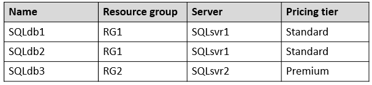
For each of the following statements, select Yes if the statement is true. Otherwise, select No.
NOTE: Each correct selection is worth one point.
Hot Area:
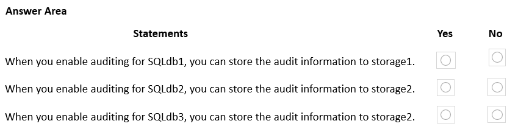

**Answer:**
Correct Answer:
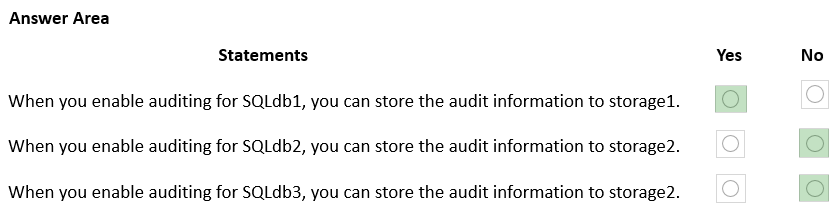

**Explication:**
- Box 1: Yes –
Auditing works fine for a Standard account.
- Box 2: No –
Auditing limitations: Premium storage is currently not supported.
- Box 3: No –
Auditing limitations: Premium storage is currently not supported.

## Question Set 79

**Context:**
DRAG DROP –
You plan to import data from your on-premises environment to Azure. The data is shown in the following table.
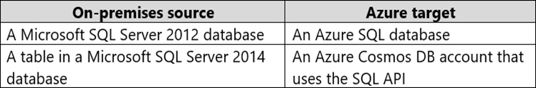

**Question:**
What should you recommend using to migrate the data? To answer, drag the appropriate tools to the correct data sources. Each tool may be used once, more than once, or not at all. You may need to drag the split bar between panes or scroll to view content.
NOTE: Each correct selection is worth one point.
Select and Place:
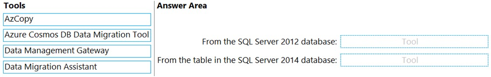

**Answer:**
Correct Answer:
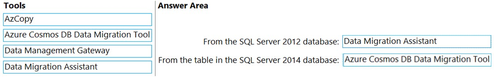

**Explication:**
- Box 1: Data Migration Assistant –
The Data Migration Assistant (DMA) helps you upgrade to a modern data platform by detecting compatibility issues that can impact database functionality in your new version of SQL Server or Azure SQL Database. DMA recommends performance and reliability improvements for your target environment and allows you to move your schema, data, and uncontained objects from your source server to your target server.
Incorrect:
AzCopy is a command-line utility that you can use to copy blobs or files to or from a storage account.
- Box 2: Azure Cosmos DB Data Migration Tool
Azure Cosmos DB Data Migration Tool can used to migrate a SQL Server Database table to Azure Cosmos.

## Question Set 80

**Context:**
You store web access logs data in Azure Blob Storage.
You plan to generate monthly reports from the access logs.
You need to recommend an automated process to upload the data to Azure SQL Database every month.

**Question:**
What should you include in the recommendation?
- A. Microsoft SQL Server Migration Assistant (SSMA)
- B. Data Migration Assistant (DMA)
- C. AzCopy
- D. Azure Data Factory

**Answer:**
Correct Answer: D

**Explication:**
You can create Data Factory pipelines that copies data from Azure Blob Storage to Azure SQL Database. The configuration pattern applies to copying from a file- based data store to a relational data store.
Required steps:
Create a data factory.
Create Azure Storage and Azure SQL Database linked services.
Create Azure Blob and Azure SQL Database datasets.
Create a pipeline contains a Copy activity.
Start a pipeline run.
Monitor the pipeline and activity runs.

## Question Set 81

**Context:**
You have an Azure subscription.
Your on-premises network contains a file server named Server1. Server1 stores 5 ׀¢׀’ of company files that are accessed rarely.
You plan to copy the files to Azure Storage.
You need to implement a storage solution for the files that meets the following requirements:
- The files must be available within 24 hours of being requested.
- Storage costs must be minimized.

**Question:**
Which two possible storage solutions achieve this goal? Each correct answer presents a complete solution.
NOTE: Each correct selection is worth one point.
- A. Create an Azure Blob Storage account that is configured for the Cool default access tier. Create a blob container, copy the files to the blob container, and set each file to the Archive access tier.
- B. Create a general-purpose v1 storage account. Create a blob container and copy the files to the blob container.
- C. Create a general-purpose v2 storage account that is configured for the Cool default access tier. Create a file share in the storage account and copy the files to the file share.
- D. Create a general-purpose v2 storage account that is configured for the Hot default access tier. Create a blob container, copy the files to the blob container, and set each file to the Archive access tier.
- E. Create a general-purpose v1 storage account. Create a fie share in the storage account and copy the files to the file share.

**Answer:**
Correct Answer: AD

**Explication:**
To minimize costs: The Archive tier is optimized for storing data that is rarely accessed and stored for at least 180 days with flexible latency requirements (on the order of hours).
7%

## Question Set 82

**Context:**
You have an app named App1 that uses two on-premises Microsoft SQL Server databases named DB1 and DB2.
You plan to migrate DB1 and DB2 to Azure
You need to recommend an Azure solution to host DB1 and DB2. The solution must meet the following requirements:
- Support server-side transactions across DB1 and DB2.
- Minimize administrative effort to update the solution.

**Question:**
What should you recommend?
- A. two Azure SQL databases in an elastic pool
- B. two databases on the same Azure SQL managed instance
- C. two databases on the same SQL Server instance on an Azure virtual machine
- D. two Azure SQL databases on different Azure SQL Database servers

**Answer:**
Correct Answer: B

**Explication:**
Elastic database transactions for Azure SQL Database and Azure SQL Managed Instance allow you to run transactions that span several databases.
SQL Managed Instance enables system administrators to spend less time on administrative tasks because the service either performs them for you or greatly simplifies those tasks.

## Question Set 83

**Context:**
You need to design a highly available Azure SQL database that meets the following requirements:
- Failover between replicas of the database must occur without any data loss.
- The database must remain available in the event of a zone outage.
- Costs must be minimized.

**Question:**
Which deployment option should you use?
- A. Azure SQL Database Hyperscale
- B. Azure SQL Database Premium
- C. Azure SQL Database Basic
- D. Azure SQL Managed Instance General Purpose

**Answer:**
Correct Answer: B

**Explication:**
Azure SQL Database Premium tier supports multiple redundant replicas for each database that are automatically provisioned in the same datacenter within a region. This design leverages the SQL Server AlwaysON technology and provides resilience to server failures with 99.99% availability SLA and RPO=0.
With the introduction of Azure Availability Zones, we are happy to announce that SQL Database now offers built-in support of Availability Zones in its Premium service tier.
Incorrect:
Not A: Hyperscale is more expensive than Premium.
Not C: Need Premium for Availability Zones.
Not D: Zone redundant configuration that is free on Azure SQL Premium is not available on Azure SQL Managed Instance.

## Question Set 84

**Context:**
HOTSPOT –
You are planning an Azure Storage solution for sensitive data. The data will be accessed daily. The dataset is less than 10 GB.
You need to recommend a storage solution that meets the following requirements:
- All the data written to storage must be retained for five years.
- Once the data is written, the data can only be read. Modifications and deletion must be prevented.
- After five years, the data can be deleted, but never modified.
- Data access charges must be minimized.

**Question:**
What should you recommend? To answer, select the appropriate options in the answer area.
NOTE: Each correct selection is worth one point.
Hot Area:
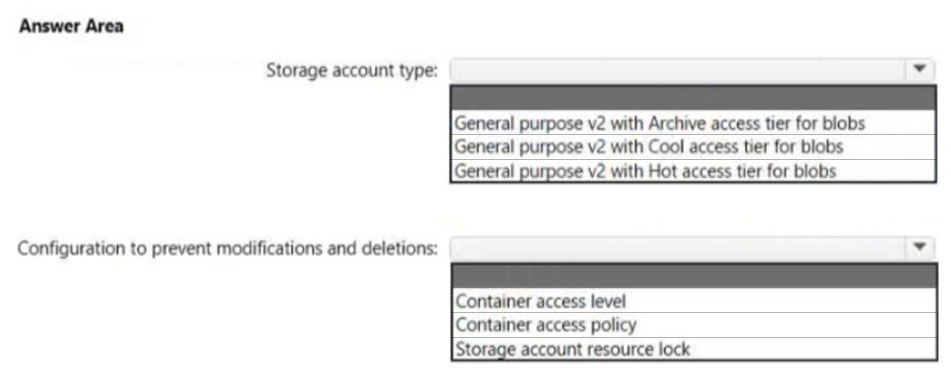

**Answer:**
Correct Answer:
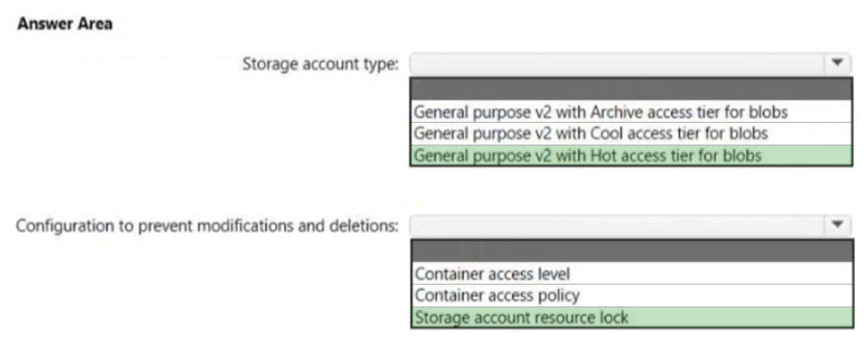

**Explication:**
- Box 1: General purpose v2 with Hot access tier for blobs
Note:
* All the data written to storage must be retained for five years.
* Data access charges must be minimized
Hot tier has higher storage costs, but lower access and transaction costs.
Incorrect:
Not Archive: Lowest storage costs, but highest access, and transaction costs.
Not Cool: Lower storage costs, but higher access and transaction costs.
- Box 2: Storage account resource lock
As an administrator, you can lock a subscription, resource group, or resource to prevent other users in your organization from accidentally deleting or modifying critical resources. The lock overrides any permissions the user might have.

## Question Set 85

**Context:**
HOTSPOT –
You are designing a data storage solution to support reporting.
The solution will ingest high volumes of data in the JSON format by using Azure Event Hubs. As the data arrives, Event Hubs will write the data to storage. The solution must meet the following requirements:
- Organize data in directories by date and time.
- Allow stored data to be queried directly, transformed into summarized tables, and then stored in a data warehouse.
- Ensure that the data warehouse can store 50 TB of relational data and support between 200 and 300 concurrent read operations.

**Question:**
Which service should you recommend for each type of data store? To answer, select the appropriate options in the answer area.
NOTE: Each correct selection is worth one point.
Hot Area:
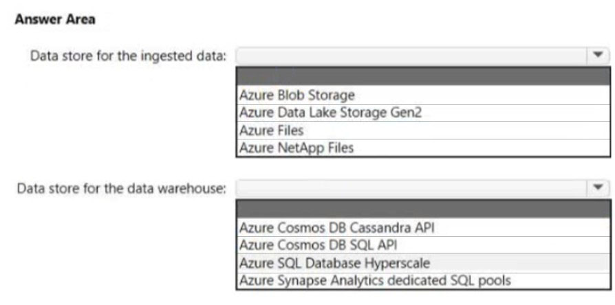

**Answer:**
Correct Answer:
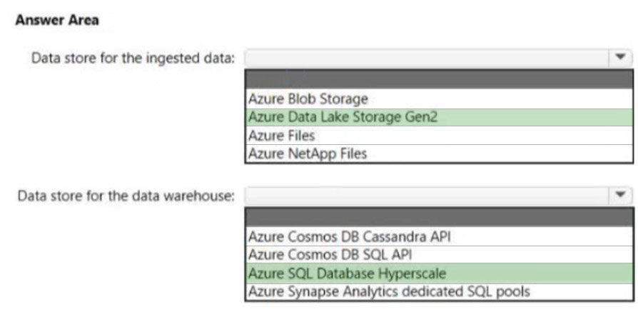

**Explication:**
- Box 1: Azure Data Lake Storage Gen2
Azure Data Explorer integrates with Azure Blob Storage and Azure Data Lake Storage (Gen1 and Gen2), providing fast, cached, and indexed access to data stored in external storage. You can analyze and query data without prior ingestion into Azure Data Explorer. You can also query across ingested and uningested external data simultaneously.
Azure Data Lake Storage is optimized storage for big data analytics workloads.
Use cases: Batch, interactive, streaming analytics and machine learning data such as log files, IoT data, click streams, large datasets
- Box 2: Azure SQL Database Hyperscale
Azure SQL Database Hyperscale is optimized for OLTP and high throughput analytics workloads with storage up to 100TB.
A Hyperscale database supports up to 100 TB of data and provides high throughput and performance, as well as rapid scaling to adapt to the workload requirements. Connectivity, query processing, database engine features, etc. work like any other database in Azure SQL Database.
Hyperscale is a multi-tiered architecture with caching at multiple levels. Effective IOPS will depend on the workload.
Compare to:
General purpose: 500 IOPS per vCore with 7,000 maximum IOPS
Business critical: 5,000 IOPS with 200,000 maximum IOPS
Incorrect:
* Azure Synapse Analytics Dedicated SQL pool.
Max database size: 240 TB –
A maximum of 128 concurrent queries will execute and remaining queries will be queued.

## Question Set 86

**Context:**
You have an app named App1 that uses an on-premises Microsoft SQL Server database named DB1.
You plan to migrate DB1 to an Azure SQL managed instance.
You need to enable customer managed Transparent Data Encryption (TDE) for the instance. The solution must maximize encryption strength.

**Question:**
Which type of encryption algorithm and key length should you use for the TDE protector?
- A. RSA 3072
- B. AES 256
- C. RSA 4096
- D. RSA 2048

**Answer:**
Correct Answer: A

**Explication:**
13%

## Question Set 87

**Context:**
You are planning an Azure IoT Hub solution that will include 50,000 IoT devices.
Each device will stream data, including temperature, device ID, and time data. Approximately 50,000 records will be written every second. The data will be visualized in near real time.
You need to recommend a service to store and query the data.

**Question:**
Which two services can you recommend? Each correct answer presents a complete solution.
NOTE: Each correct selection is worth one point.
- A. Azure Table Storage
- B. Azure Event Grid
- C. Azure Cosmos DB for NoSQL
- D. Azure Time Series Insights

**Answer:**
Correct Answer: CD

**Explication:**
N/A

## Question Set 88

**Context:**
HOTSPOT
–
You are planning an Azure Storage solution for sensitive data. The data will be accessed daily. The dataset is less than 10 GB.
You need to recommend a storage solution that meets the following requirements:
• All the data written to storage must be retained for five years.
• Once the data is written, the data can only be read. Modifications and deletion must be prevented.
• After five years, the data can be deleted, but never modified.
• Data access charges must be minimized.

**Question:**
What should you recommend? To answer, select the appropriate options in the answer area.
NOTE: Each correct selection is worth one point.
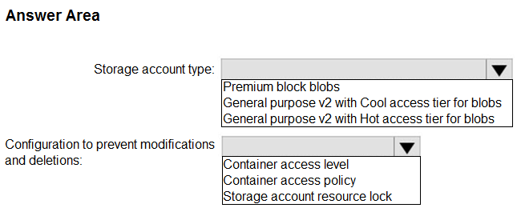

**Answer:**
Correct Answer:
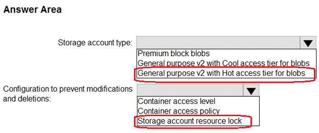

**Explication:**
N/A

## Question Set 89

**Context:**
HOTSPOT
–
You are designing a data analytics solution that will use Azure Synapse and Azure Data Lake Storage Gen2.
You need to recommend Azure Synapse pools to meet the following requirements:
• Ingest data from Data Lake Storage into hash-distributed tables.
• Implement query, and update data in Delta Lake.

**Question:**
What should you recommend for each requirement? To answer, select the appropriate options in the answer area.
NOTE: Each correct selection is worth one point.
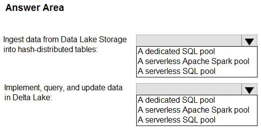

**Answer:**
Correct Answer:
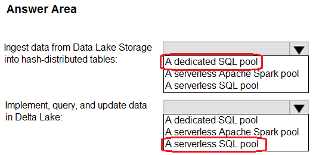

**Explication:**
N/A

## Question Set 90

**Context:**
You have an on-premises storage solution.
You need to migrate the solution to Azure. The solution must support Hadoop Distributed File System (HDFS).

**Question:**
What should you use?
- A. Azure Data Lake Storage Gen2
- B. Azure NetApp Files
- C. Azure Data Share
- D. Azure Table storage

**Answer:**
Correct Answer: A

**Explication:**
N/A

## Question Set 91

**Context:**
DRAG DROP
–
You have an on-premises app named App1.
Customers use App1 to manage digital images.
You plan to migrate App1 to Azure.
You need to recommend a data storage solution for App1. The solution must meet the following image storage requirements:
• Encrypt images at rest.
• Allow files up to 50 MB.
• Manage access to the images by using Azure Web Application Firewall (WAF) on Azure Front Door.
The solution must meet the following customer account requirements:
• Support automatic scale out of the storage.
• Maintain the availability of App1 if a datacenter fails.
• Support reading and writing data from multiple Azure regions.

**Question:**
Which service should you include in the recommendation for each type of data? To answer, drag the appropriate services to the correct type of data. Each service may be used once, more than once, or not at all. You may need to drag the split bar between panes or scroll to view content.
NOTE: Each correct answer is worth one point.
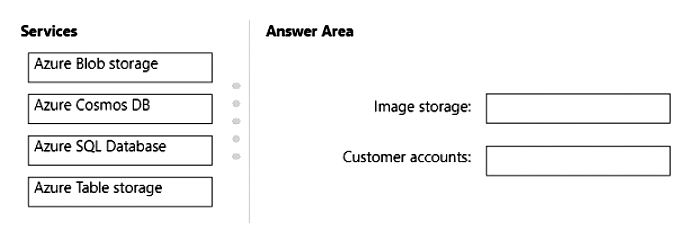

**Answer:**
Correct Answer:
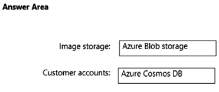

**Explication:**
N/A

## Question Set 92

**Context:**
You are designing an application that will aggregate content for users.
You need to recommend a database solution for the application. The solution must meet the following requirements:
• Support SQL commands.
• Support multi-master writes.
• Guarantee low latency read operations.

**Question:**
What should you include in the recommendation?
- A. Azure Cosmos DB for NoSQL
- B. Azure SQL Database that uses active geo-replication
- C. Azure SQL Database Hyperscale
- D. Azure Cosmos DB for PostgreSQL

**Answer:**
Correct Answer: A

**Explication:**
N/A

## Question Set 93

**Context:**
You plan to migrate on-premises MySQL databases to Azure Database for MySQL Flexible Server.
You need to recommend a solution for the Azure Database for MySQL Flexible Server configuration. The solution must meet the following requirements:
• The databases must be accessible if a datacenter fails.
• Costs must be minimized.

**Question:**
Which compute tier should you recommend?
- A. Burstable
- B. General Purpose
- C. Memory Optimized

**Answer:**
Correct Answer: A

**Explication:**
9%

## Question Set 94

**Context:**
You are designing an app that will use Azure Cosmos DB to collate sales from multiple countries.
You need to recommend an API for the app. The solution must meet the following requirements:
• Support SQL queries.
• Support geo-replication.
• Store and access data relationally.

**Question:**
Which API should you recommend?
- A. Apache Cassandra
- B. PostgreSQL
- C. MongoDB
- D. NoSQL

**Answer:**
Correct Answer: B

**Explication:**
N/A

## Question Set 95

**Context:**
HOTSPOT
–
You have an app that generates 50,000 events daily.
You plan to stream the events to an Azure event hub and use Event Hubs Capture to implement cold path processing of the events. The output of Event Hubs Capture will be consumed by a reporting system.
You need to identify which type of Azure storage must be provisioned to support Event Hubs Capture, and which inbound data format the reporting system must support.

**Question:**
What should you identify? To answer, select the appropriate options in the answer area.
NOTE: Each correct selection is worth one point.
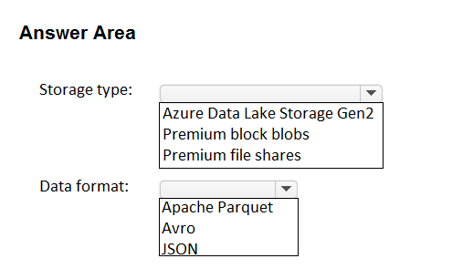

**Answer:**
Correct Answer:
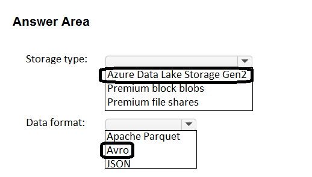

**Explication:**
N/A

## Question Set 96

**Context:**
You have the resources shown in the following table.
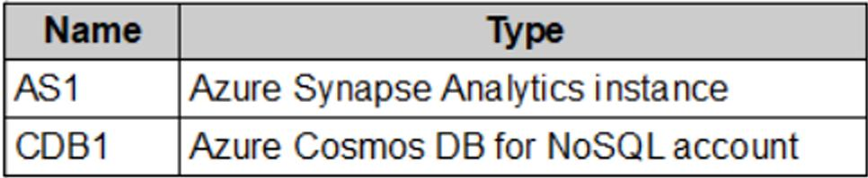
CDB1 hosts a container that stores continuously updated operational data.
You are designing a solution that will use AS1 to analyze the operational data daily.
You need to recommend a solution to analyze the data without affecting the performance of the operational data store.

**Question:**
What should you include in the recommendation?
- A. Azure Data Factory with Azure Cosmos DB and Azure Synapse Analytics connectors
- B. Azure Synapse Analytics with PolyBase data loading
- C. Azure Synapse Link for Azure Cosmos DB
- D. Azure Cosmos DB change feed

**Answer:**
Correct Answer: C

**Explication:**
N/A

## Question Set 97

**Context:**
HOTSPOT
–
You have an Azure subscription. The subscription contains an Azure SQL managed instance that stores employee details, including social security numbers and phone numbers.
You need to configure the managed instance to meet the following requirements:
• The helpdesk team must see only the last four digits of an employee’s phone number.
• Cloud administrators must be prevented from seeing the employee’s social security numbers.

**Question:**
What should you enable for each column in the managed instance? To answer, select the appropriate options in the answer area.
NOTE: Each correct selection is worth one point.
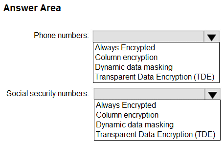

**Answer:**
Correct Answer:
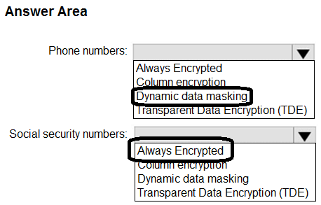

**Explication:**
N/A

## Question Set 98

**Context:**
You plan to use an Azure Storage account to store data assets.
You need to recommend a solution that meets the following requirements:
• Supports immutable storage
• Disables anonymous access to the storage account
• Supports access control list (ACL)-based Azure AD permissions

**Question:**
What should you include in the recommendation?
- A. Azure Files
- B. Azure Data Lake Storage
- C. Azure NetApp Files
- D. Azure Blob Storage

**Answer:**
Correct Answer: C

**Explication:**
N/A

## Question Set 99

**Context:**
HOTSPOT
–
You are designing a storage solution that will ingest, store, and analyze petabytes (PBs) of structured, semi-structured, and unstructured text data. The analyzed data will be offloaded to Azure Data Lake Storage Gen2 for long-term retention.
You need to recommend a storage and analytics solution that meets the following requirements:
• Stores the processed data
• Provides interactive analytics
• Supports manual scaling, built-in autoscaling, and custom autoscaling

**Question:**
What should you include in the recommendation? To answer, select the appropriate options in the answer area.
NOTE: Each correct selection is worth one point.
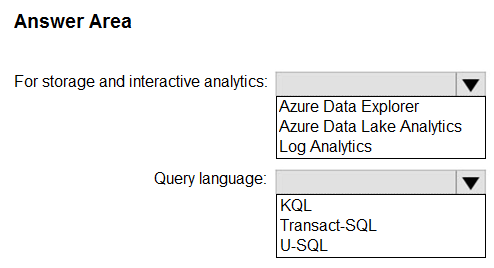

**Answer:**
Correct Answer:
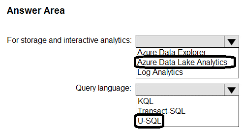

**Explication:**
N/A

## Question Set 100

**Context:**
HOTSPOT
–
You plan to use Azure SQL as a database platform.
You need to recommend an Azure SQL product and service tier that meets the following requirements:
• Automatically scales compute resources based on the workload demand
• Provides per second billing

**Question:**
What should you recommend? To answer, select the appropriate options in the answer area.
NOTE: Each correct selection is worth one point.
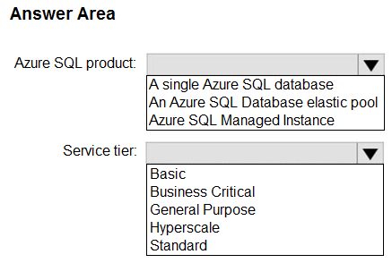

**Answer:**
Correct Answer:
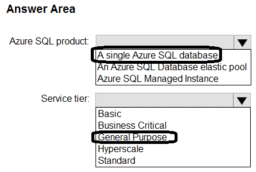

**Explication:**
N/A

## Question Set 101

**Context:**
HOTSPOT
–
You have an Azure subscription.
You need to deploy a solution that will provide point-in-time restore for blobs in storage accounts that have blob versioning and blob soft delete enabled.

**Question:**
Which type of blob should you create, and what should you enable for the accounts? To answer, select the appropriate options in the answer area.
NOTE: Each correct selection is worth one point.
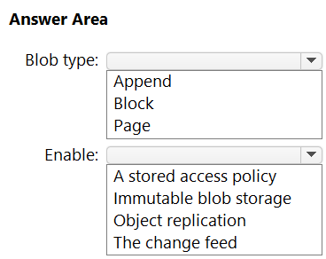

**Answer:**
Correct Answer:
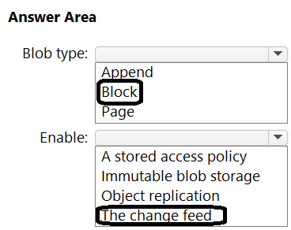

**Explication:**
N/A

## Question Set 102

**Context:**
HOTSPOT
–
Your company, named Contoso, Ltd., has an Azure subscription that contains the following resources:
• An Azure Synapse Analytics workspace named contosoworkspace1
• An Azure Data Lake Storage account named contosolake1
• An Azure SQL database named contososql1
The product data of Contoso is copied from contososql1 to contosolake1.
Contoso has a partner company named Fabrikam Inc. Fabrikam has an Azure subscription that contains the following resources:
• A virtual machine named FabrikamVM1 that runs Microsoft SQL Server 2019
• An Azure Storage account named fabrikamsa1
Contoso plans to upload the research data on FabrikamVM1 to contosolake1. During the upload, the research data must be transformed to the data formats used by Contoso.
The data in contosolake1 will be analyzed by using contosoworkspace1.
You need to recommend a solution that meets the following requirements:
• Upload and transform the FabrikamVM1 research data.
• Provide Fabrikam with restricted access to snapshots of the data in contosoworkspace1.

**Question:**
What should you recommend for each requirement? To answer, select the appropriate options in the answer area.
NOTE: Each correct selection is worth one point.
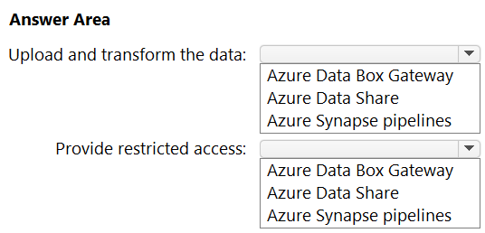

**Answer:**
Correct Answer:
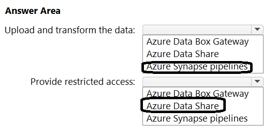

**Explication:**
N/A

## Question Set 103

**Context:**
HOTSPOT
–
You are designing a data pipeline that will integrate large amounts of data from multiple on-premises Microsoft SQL Server databases into an analytics platform in Azure. The pipeline will include the following actions:
• Database updates will be exported periodically into a staging area in Azure Blob storage.
• Data from the blob storage will be cleansed and transformed by using a highly parallelized load process.
• The transformed data will be loaded to a data warehouse.
• Each batch of updates will be used to refresh an online analytical processing (OLAP) model in a managed serving layer.
• The managed serving layer will be used by thousands of end users.
You need to implement the data warehouse and serving layers.

**Question:**
What should you use? To answer, select the appropriate options in the answer area.
NOTE: Each correct selection is worth one point.
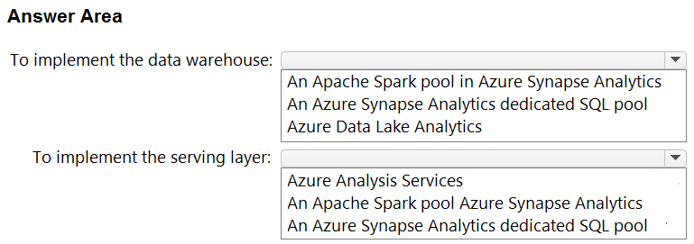

**Answer:**
Correct Answer:
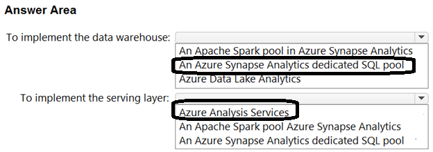

**Explication:**
Topic 3 – Question Set 3

## Question Set 104

**Context:**
You have SQL Server on an Azure virtual machine. The databases are written to nightly as part of a batch process.
You need to recommend a disaster recovery solution for the data. The solution must meet the following requirements:
- Provide the ability to recover in the event of a regional outage.
- Support a recovery time objective (RTO) of 15 minutes.
- Support a recovery point objective (RPO) of 24 hours.
- Support automated recovery.
- Minimize costs.

**Question:**
What should you include in the recommendation?
- A. Azure virtual machine availability sets
- B. Azure Disk Backup
- C. an Always On availability group
- D. Azure Site Recovery

**Answer:**
Correct Answer: D

**Explication:**
Replication with Azure Site Recover:
- RTO is typically less than 15 minutes.
- RPO: One hour for application consistency and five minutes for crash consistency.
Incorrect Answers:
B: Too slow.
C: Always On availability group RPO: Because replication to the secondary replica is asynchronous, there’s some data loss.

## Question Set 105

**Context:**
N/A

**Question:**
HOTSPOT –
You plan to deploy the backup policy shown in the following exhibit.
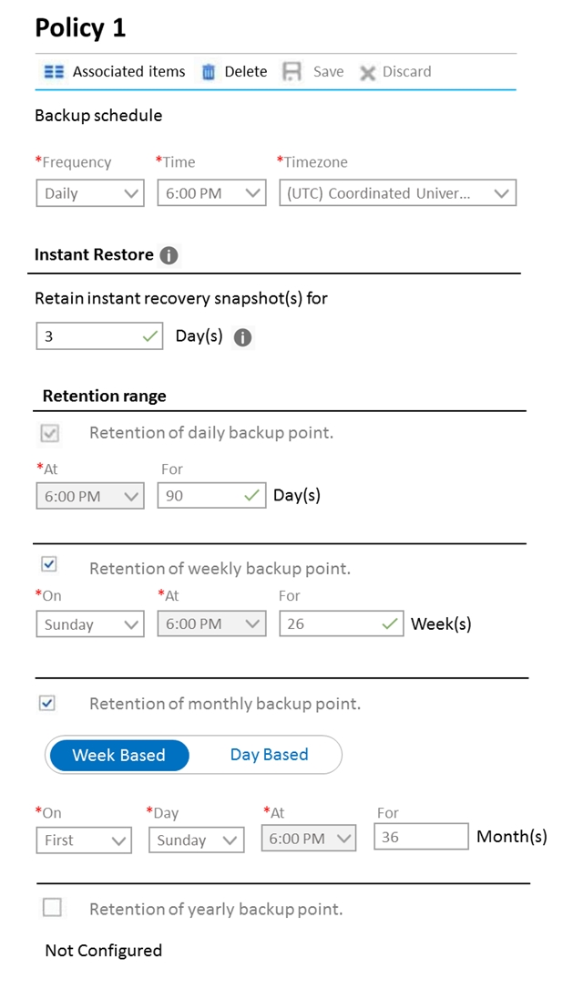
Use the drop-down menus to select the answer choice that completes each statement based on the information presented in the graphic.
NOTE: Each correct selection is worth one point.
Hot Area:
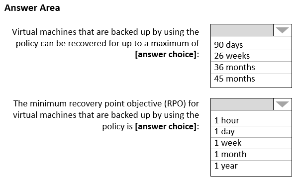

**Answer:**
Correct Answer:
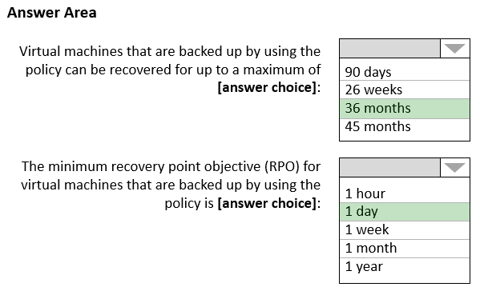

**Explication:**
N/A

## Question Set 106

**Context:**
Note: This question is part of a series of questions that present the same scenario. Each question in the series contains a unique solution that might meet the stated goals. Some question sets might have more than one correct solution, while others might not have a correct solution.
After you answer a question in this section, you will NOT be able to return to it. As a result, these questions will not appear in the review screen.
You need to deploy resources to host a stateless web app in an Azure subscription. The solution must meet the following requirements:
- Provide access to the full .NET framework.
Provide redundancy if an Azure region fails.

- Grant administrators access to the operating system to install custom application dependencies.
Solution: You deploy two Azure virtual machines to two Azure regions, and you create an Azure Traffic Manager profile.

**Question:**
Does this meet the goal?
- A. Yes
- B. No

**Answer:**
Correct Answer: A

**Explication:**
Azure Traffic Manager is a DNS-based traffic load balancer that enables you to distribute traffic optimally to services across global Azure regions, while providing high availability and responsiveness.

## Question Set 107

**Context:**
Note: This question is part of a series of questions that present the same scenario. Each question in the series contains a unique solution that might meet the stated goals. Some question sets might have more than one correct solution, while others might not have a correct solution.
After you answer a question in this section, you will NOT be able to return to it. As a result, these questions will not appear in the review screen.
You need to deploy resources to host a stateless web app in an Azure subscription. The solution must meet the following requirements:
- Provide access to the full .NET framework.
- Provide redundancy if an Azure region fails.
- Grant administrators access to the operating system to install custom application dependencies.
Solution: You deploy two Azure virtual machines to two Azure regions, and you deploy an Azure Application Gateway.

**Question:**
Does this meet the goal?
- A. Yes
- B. No

**Answer:**
Correct Answer: B

**Explication:**
App Gateway will balance the traffic between VMs deployed in the same region. Create an Azure Traffic Manager profile instead.

## Question Set 108

**Context:**
HOTSPOT –
You plan to create an Azure Storage account that will host file shares. The shares will be accessed from on-premises applications that are transaction intensive.
You need to recommend a solution to minimize latency when accessing the file shares. The solution must provide the highest-level of resiliency for the selected storage tier.

**Question:**
What should you include in the recommendation? To answer, select the appropriate options in the answer area.
NOTE: Each correct selection is worth one point.
Hot Area:
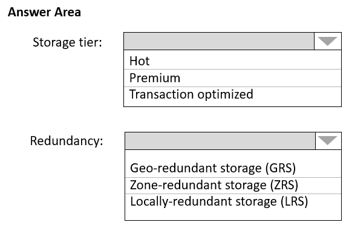

**Answer:**
Correct Answer:
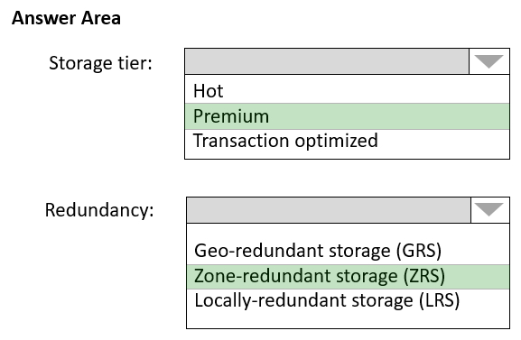

**Explication:**
- Box 1: Premium –
Premium: Premium file shares are backed by solid-state drives (SSDs) and provide consistent high performance and low latency, within single-digit milliseconds for most IO operations, for IO-intensive workloads.
Incorrect Answers:
- Hot: Hot file shares offer storage optimized for general purpose file sharing scenarios such as team shares. Hot file shares are offered on the standard storage hardware backed by HDDs.
- Transaction optimized: Transaction optimized file shares enable transaction heavy workloads that don’t need the latency offered by premium file shares.
Transaction optimized file shares are offered on the standard storage hardware backed by hard disk drives (HDDs). Transaction optimized has historically been called “standard”, however this refers to the storage media type rather than the tier itself (the hot and cool are also “standard” tiers, because they are on standard storage hardware).
- Box 2: Zone- redundant storage (ZRS):
Premium Azure file shares only support LRS and ZRS.
Zone-redundant storage (ZRS): With ZRS, three copies of each file stored, however these copies are physically isolated in three distinct storage clusters in different Azure availability zones.

## Question Set 109

**Context:**
Note: This question is part of a series of questions that present the same scenario. Each question in the series contains a unique solution that might meet the stated goals. Some question sets might have more than one correct solution, while others might not have a correct solution.
After you answer a question in this section, you will NOT be able to return to it. As a result, these questions will not appear in the review screen.
You need to deploy resources to host a stateless web app in an Azure subscription. The solution must meet the following requirements:
- Provide access to the full .NET framework.
- Provide redundancy if an Azure region fails.
- Grant administrators access to the operating system to install custom application dependencies.
Solution: You deploy an Azure virtual machine scale set that uses autoscaling.

**Question:**
Does this meet the goal?
- A. Yes
- B. No

**Answer:**
Correct Answer: B

**Explication:**
Instead, you should deploy two Azure virtual machines to two Azure regions, and you create a Traffic Manager profile.
Note: Azure Traffic Manager is a DNS-based traffic load balancer that enables you to distribute traffic optimally to services across global Azure regions, while providing high availability and responsiveness.

## Question Set 110

**Context:**
HOTSPOT –
You need to recommend an Azure Storage account configuration for two applications named Application1 and Application2. The configuration must meet the following requirements:
- Storage for Application1 must provide the highest possible transaction rates and the lowest possible latency.
- Storage for Application2 must provide the lowest possible storage costs per GB.
- Storage for both applications must be available in an event of datacenter failure.
- Storage for both applications must be optimized for uploads and downloads.

**Question:**
What should you recommend? To answer, select the appropriate options in the answer area.
NOTE: Each correct selection is worth one point.
Hot Area:
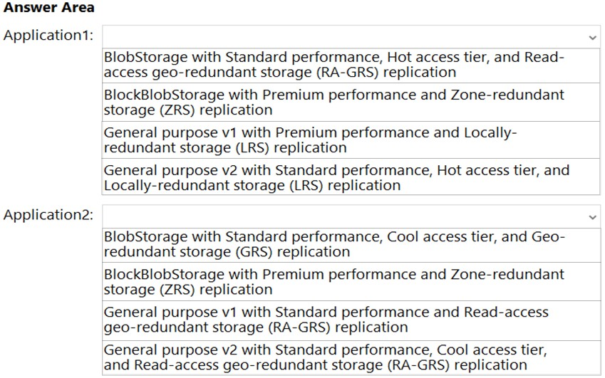

**Answer:**
Correct Answer:
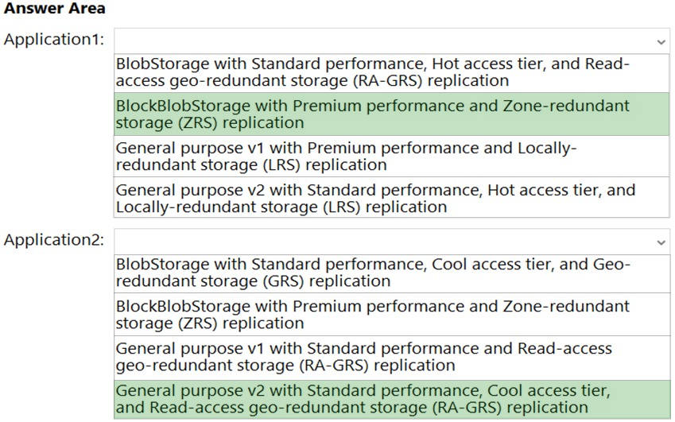

**Explication:**
- Box 1: BlobStorage with Premium Performance,ג €¦
Application1 requires high transaction rates and the lowest possible latency. We need to use Premium, not Standard.
- Box 2: General purpose v2 with Standard Performance,..
General Purpose v2 provides access to the latest Azure storage features, including Cool and Archive storage, with pricing optimized for the lowest GB storage prices. These accounts provide access to Block Blobs, Page Blobs, Files, and Queues. Recommended for most scenarios using Azure Storage.

## Question Set 111

**Context:**
HOTSPOT –
You plan to develop a new app that will store business critical data. The app must meet the following requirements:
- Prevent new data from being modified for one year.
- Maximize data resiliency.
- Minimize read latency.

**Question:**
What storage solution should you recommend for the app? To answer, select the appropriate options in the answer area.
NOTE: Each correct selection is worth one point.
Hot Area:
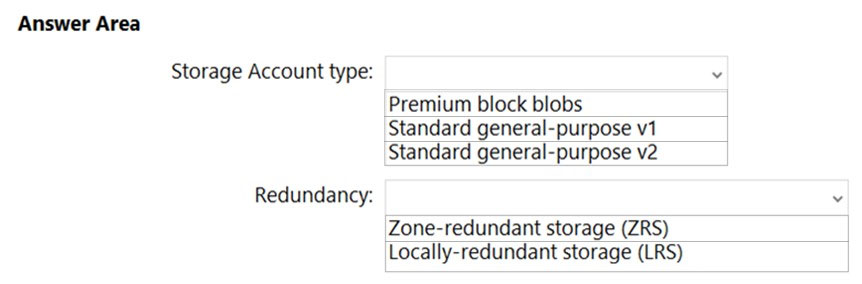

**Answer:**
Correct Answer:
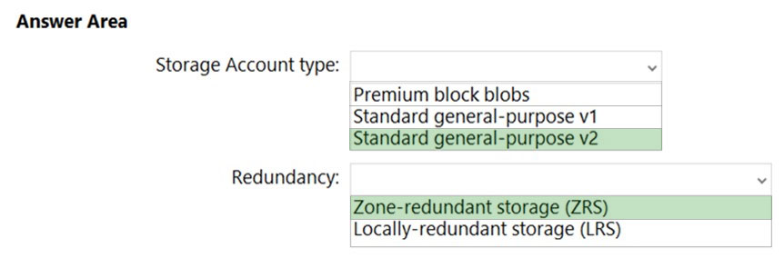

**Explication:**
- Box 1: Standard general-purpose v2
Standard general-purpose v2 supports immutable storage.
In general Standard general-purpose v2 is the preferred Microsoft recommendation.
- Box 2: Zone- redundant storage (ZRS)
ZRS is more resilient compared to LRS.
Note: RA-GRS is even more resilient, but it is not an option here.

## Question Set 112

**Context:**
You plan to deploy 10 applications to Azure. The applications will be deployed to two Azure Kubernetes Service (AKS) clusters. Each cluster will be deployed to a separate Azure region.
The application deployment must meet the following requirements:
- Ensure that the applications remain available if a single AKS cluster fails.
- Ensure that the connection traffic over the internet is encrypted by using SSL without having to configure SSL on each container.

**Question:**
Which service should you include in the recommendation?
- A. Azure Front Door
- B. Azure Traffic Manager
- C. AKS ingress controller
- D. Azure Load Balancer

**Answer:**
Correct Answer: A

**Explication:**
Azure Front Door supports SSL.
Azure Front Door, which focuses on global load-balancing and site acceleration, and Azure CDN Standard, which offers static content caching and acceleration.
The new Azure Front Door brings together security with CDN technology for a cloud-based CDN with threat protection and additional capabilities.
7%

## Question Set 113

**Context:**
HOTSPOT –
You have an on-premises file server that stores 2 TB of data files.
You plan to move the data files to Azure Blob Storage in the West Europe Azure region.
You need to recommend a storage account type to store the data files and a replication solution for the storage account. The solution must meet the following requirements:
- Be available if a single Azure datacenter fails.
- Support storage tiers.
- Minimize cost.

**Question:**
What should you recommend? To answer, select the appropriate options in the answer area.
NOTE: Each correct selection is worth one point.
Hot Area:
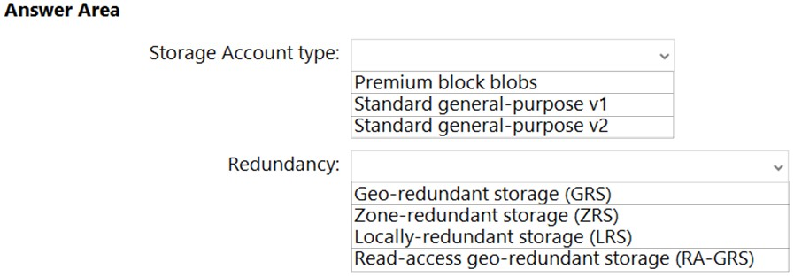

**Answer:**
Correct Answer:
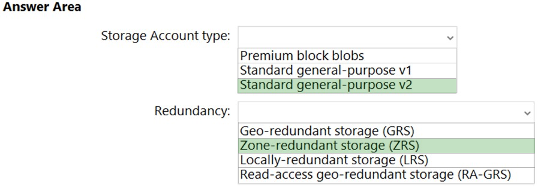

**Explication:**
- Box 1: Standard general-purpose v2
Standard general-purpose v2 meets the requirements and minimizes the costs.
- Box 2: Zone- redundant storage (ZRS)
ZRS protects against a Datacenter failure, while minimizing the costs.

## Question Set 114

**Context:**
HOTSPOT –
You have an Azure web app named App1 and an Azure key vault named KV1.
App1 stores database connection strings in KV1.
App1 performs the following types of requests to KV1:
- Get
- List
- Wrap
- Delete
Unwrap –
- Backup
- Decrypt
- Encrypt
You are evaluating the continuity of service for App1.
You need to identify the following if the Azure region that hosts KV1 becomes unavailable:

**Question:**
- To where will KV1 fail over?
- During the failover, which request type will be unavailable?
What should you identify? To answer, select the appropriate options in the answer area.
NOTE: Each correct selection is worth one point.
Hot Area:
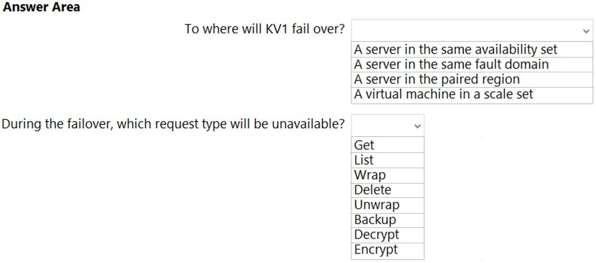

**Answer:**
Correct Answer:
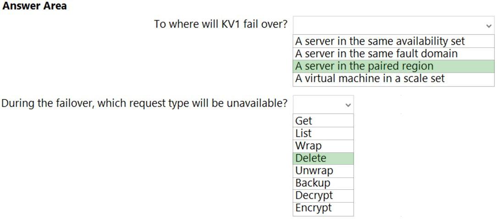

**Explication:**
- Box 1: A server in the paired region
The contents of your key vault are replicated within the region and to a secondary region at least 150 miles away, but within the same geography to maintain high durability of your keys and secrets.
Regions are paired for cross-region replication based on proximity and other factors.
- Box 2: Delete –
During failover, your key vault is in read-only mode. Requests that are supported in this mode are:
List certificates –
Get certificates –
List secrets –
Get secrets –
List keys –
Get (properties of) keys –
Encrypt –
Decrypt –
Wrap –
Unwrap –
Verify –
Sign –
Backup –

## Question Set 115

**Context:**
DRAG DROP –
Your company identifies the following business continuity and disaster recovery objectives for virtual machines that host sales, finance, and reporting applications in the company’s on-premises data center:
- The sales application must be able to fail over to a second on-premises data center.
- The reporting application must be able to recover point-in-time data at a daily granularity. The RTO is eight hours.
- The finance application requires that data be retained for seven years. In the event of a disaster, the application must be able to run from Azure. The recovery time objective (RTO) is 10 minutes.
You need to recommend which services meet the business continuity and disaster recovery objectives. The solution must minimize costs.

**Question:**
What should you recommend for each application? To answer, drag the appropriate services to the correct applications. Each service may be used once, more than once, or not at all. You may need to drag the split bar between panes or scroll to view content.
NOTE: Each correct selection is worth one point.
Select and Place:
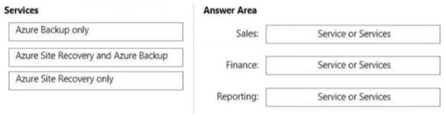

**Answer:**
Correct Answer:
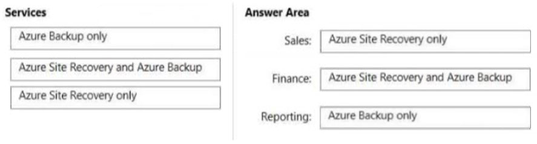

**Explication:**
- Box 1: Azure Site Recovery –
Azure Site Recovery –
Coordinates virtual-machine and physical-server replication, failover, and fullback.
DR solutions have low Recovery point objectives; DR copy can be behind by a few seconds/minutes.
DR needs only operational recovery data, which can take hours to a day. Using DR data for long-term retention is not recommended because of the fine-grained data capture.
Disaster recovery solutions have smaller Recovery time objectives because they are more in sync with the source.
Remote monitor the health of machines and create customizable recovery plans.
- Box 2: Azure Site Recovery and Azure Backup
Backup ensures that your data is safe and recoverable while Site Recovery keeps your workloads available when/if an outage occurs.
- Box 3: Azure Backup only –
Azure Backup –
Backs up data on-premises and in the cloud
Have wide variability in their acceptable Recovery point objective. VM backups usually one day while database backups as low as 15 minutes.
Backup data is typically retained for 30 days or less. From a compliance view, data may need to be saved for years. Backup data is ideal for archiving in such instances.
Because of a larger Recovery point objective, the amount of data a backup solution needs to process is usually much higher, which leads to a longer Recovery time objective.

## Question Set 116

**Context:**
You need to design a highly available Azure SQL database that meets the following requirements:
- Failover between replicas of the database must occur without any data loss.
- The database must remain available in the event of a zone outage.
- Costs must be minimized.

**Question:**
Which deployment option should you use?
- A. Azure SQL Managed Instance Business Critical
- B. Azure SQL Database Premium
- C. Azure SQL Database Basic
- D. Azure SQL Managed Instance General Purpose

**Answer:**
Correct Answer: D

**Explication:**
General Purpose service tier provides zone redundant availability.
There are two high availability architectural models:
* Standard availability model that is based on a separation of compute and storage. It relies on high availability and reliability of the remote storage tier. This architecture targets budget-oriented business applications that can tolerate some performance degradation during maintenance activities.
* Premium availability model that is based on a cluster of database engine processes. It relies on the fact that there is always a quorum of available database engine nodes. This architecture targets mission-critical applications with high IO performance, high transaction rate and guarantees minimal performance impact to your workload during maintenance activities.
Note: Zone-redundant configuration for the general purpose service tier is offered for both serverless and provisioned compute. This configuration utilizes Azure
Availability Zones ג€‰to replicate databases across multiple physical locations within an Azure region.ג €‰By selecting zone-redundancy, you can make yourג €‰new and existing serverless and provisioned generalג €‰purpose single databases and elastic pools resilient to a much larger set of failures, including catastrophic datacenter outages, without any changes of the application logic.
Incorrect:
Not A: Azure SQL Managed Instance Business Critical is more expensive.
Not B: Premium is more expensive.
Not C: Azure SQL Database Basic, and General purpose provide only locally redundant availability.

## Question Set 117

**Context:**
You need to design a highly available Azure SQL database that meets the following requirements:
- Failover between replicas of the database must occur without any data loss.
- The database must remain available in the event of a zone outage.
- Costs must be minimized.

**Question:**
Which deployment option should you use?
- A. Azure SQL Managed Instance Business Critical
- B. Azure SQL Database Premium
- C. Azure SQL Database Basic
- D. Azure SQL Database Hyperscale

**Answer:**
Correct Answer: B

**Explication:**
Azure SQL Database Premium meets the requirements and is the least expensive.
Note: There are two high availability architectural models:
* Standard availability model that is based on a separation of compute and storage. It relies on high availability and reliability of the remote storage tier. This architecture targets budget-oriented business applications that can tolerate some performance degradation during maintenance activities.
* Premium availability model that is based on a cluster of database engine processes. It relies on the fact that there is always a quorum of available database engine nodes. This architecture targets mission-critical applications with high IO performance, high transaction rate and guarantees minimal performance impact to your workload during maintenance activities.
Note: Zone-redundant configuration for the general purpose service tier is offered for both serverless and provisioned compute. This configuration utilizes Azure
Availability Zones ג€‰to replicate databases across multiple physical locations within an Azure region.ג €‰By selecting zone-redundancy, you can make yourג €‰new and existing serverless and provisioned generalג €‰purpose single databases and elastic pools resilient to a much larger set of failures, including catastrophic datacenter outages, without any changes of the application logic.
Incorrect:
Not A: Azure SQL Managed Instance Business Critical is more expensive.
Not C: Azure SQL Database Basic, and General purpose provide only locally redundant availability.

## Question Set 118

**Context:**
Note: This question is part of a series of questions that present the same scenario. Each question in the series contains a unique solution that might meet the stated goals. Some question sets might have more than one correct solution, while others might not have a correct solution.
After you answer a question in this section, you will NOT be able to return to it. As a result, these questions will not appear in the review screen.
You need to deploy resources to host a stateless web app in an Azure subscription. The solution must meet the following requirements:
- Provide access to the full .NET framework.
- Provide redundancy if an Azure region fails.
- Grant administrators access to the operating system to install custom application dependencies.
Solution: You deploy a web app in an Isolated App Service plan.

**Question:**
Does this meet the goal?
- A. Yes
- B. No

**Answer:**
Correct Answer: B

**Explication:**
Instead: You deploy two Azure virtual machines to two Azure regions, and you create an Azure Traffic Manager profile.
Note: Azure Traffic Manager is a DNS-based traffic load balancer that enables you to distribute traffic optimally to services across global Azure regions, while providing high availability and responsiveness.

## Question Set 119

**Context:**
You need to design a highly available Azure SQL database that meets the following requirements:
- Failover between replicas of the database must occur without any data loss.
- The database must remain available in the event of a zone outage.
- Costs must be minimized.

**Question:**
Which deployment option should you use?
- A. Azure SQL Database Serverless
- B. Azure SQL Database Business Critical
- C. Azure SQL Database Basic
- D. Azure SQL Database Standard

**Answer:**
Correct Answer: A

**Explication:**
Now your new and existing serverless Azure SQL Databases allow for zone redundant configuration. This feature utilizes Azure Availability Zones to replicate databases across multiple physical locations within an Azure region. By selecting zone redundancy, you can make your serverless databases resilient to a much larger set of failures, including catastrophic datacenter outagesג €”without any changes of the application logic.
The SQL Database serverless compute tier optimizes price-performance and simplifies performance management for single databases with intermittent, unpredictable usage by auto-scaling compute and billing for compute used per second.
Incorrect:
Not B: Azure SQL Database Business Critical is a more expensive solution.
Not C: Azure SQL Database Basic does not provide zone redundancy.
Not D: Azure SQL Database Standard is a more expensive solution.

## Question Set 120

**Context:**
HOTSPOT
–
You have an on-premises Microsoft SQL Server database named SQL1.
You plan to migrate SQL1 to Azure.
You need to recommend a hosting solution for SQL1. The solution must meet the following requirements:
• Support the deployment of multiple secondary, read-only replicas.
• Support automatic replication between primary and secondary replicas.
• Support failover between primary and secondary replicas within a 15-minute recovery time objective (RTO).

**Question:**
What should you include in the solution? To answer, select the appropriate options in the answer area.
NOTE: Each correct selection is worth one point.
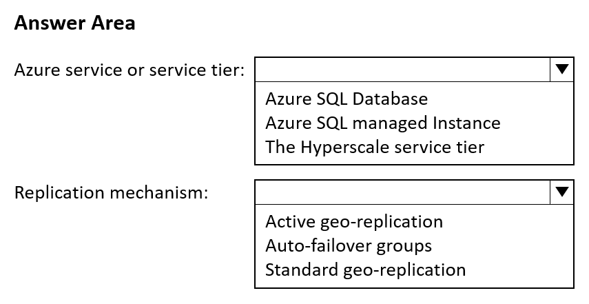

**Answer:**
Correct Answer:
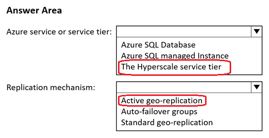

**Explication:**
N/A

## Question Set 121

**Context:**
HOTSPOT
–
You have two on-premises Microsoft SQL Server 2017 instances that host an Always On availability group named AG1. AG1 contains a single database named DB1.
You have an Azure subscription that contains a virtual machine named VM1. VM1 runs Linux and contains a SQL Server 2019 instance.
You need to migrate DB1 to VM1. The solution must minimize downtime on DB1.

**Question:**
What should you do? To answer, select the appropriate options in the answer area.
NOTE: Each correct selection is worth one point.
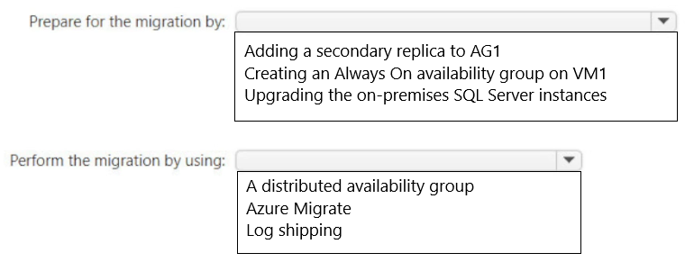

**Answer:**
Correct Answer:
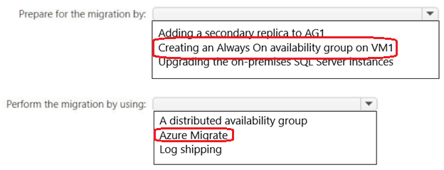

**Explication:**
N/A

## Question Set 122

**Context:**
HOTSPOT
–
You are building an Azure web app that will store the Personally Identifiable Information (PII) of employees.
You need to recommend an Azure SQL. Database solution for the web app. The solution must meet the following requirements:
• Maintain availability in the event of a single datacenter outage.
• Support the encryption of specific columns that contain PII.
• Automatically scale up during payroll operations.
• Minimize costs.

**Question:**
What should you include in the recommendations? To answer, select the appropriate options in the answer area.
NOTE: Each correct selection is worth one point.
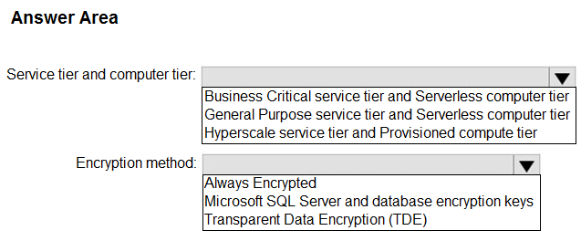

**Answer:**
Correct Answer:
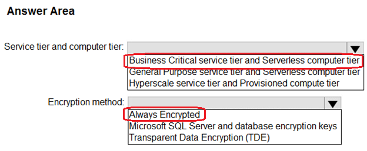

**Explication:**
N/A

## Question Set 123

**Context:**
You plan to deploy an Azure Database for MySQL flexible server named Server1 to the East US Azure region.
You need to implement a business continuity solution for Server1. The solution must minimize downtime in the event of a failover to a paired region.

**Question:**
What should you do?
- A. Create a read replica.
- B. Store the database files in Azure premium file shares.
- C. Implement Geo-redundant backup.
- D. Configure native MySQL replication.

**Answer:**
Correct Answer: C

**Explication:**
N/A

## Question Set 124

**Context:**
You have an Azure subscription that contains the resources shown in the following table.
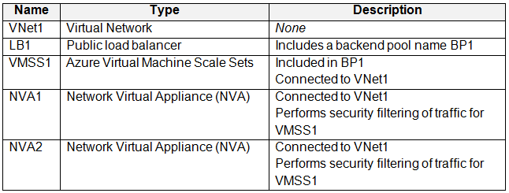
You need to recommend a load balancing solution that will distribute incoming traffic for VMSS1 across NVA1 and NVA2. The solution must minimize administrative effort.

**Question:**
What should you include in the recommendation?
- A. Gateway Load Balancer
- B. Azure Front Door
- C. Azure Application Gateway
- D. Azure Traffic Manager

**Answer:**
Correct Answer: A

**Explication:**
N/A

## Question Set 125

**Context:**
HOTSPOT
–
You have the Azure subscriptions shown in the following table.
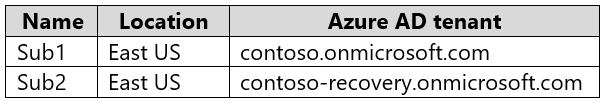
Contoso.onmicrosft.com contains a user named User1.
You need to deploy a solution to protect against ransomware attacks. The solution must meet the following requirements:
• Ensure that all the resources in Sub1 are backed up by using Azure Backup.
• Require that User1 first be assigned a role for Sub2 before the user can make major changes to the backup configuration.

**Question:**
What should you create in each subscription? To answer, select the appropriate options in the answer area.
NOTE: Each correct selection is worth one point.
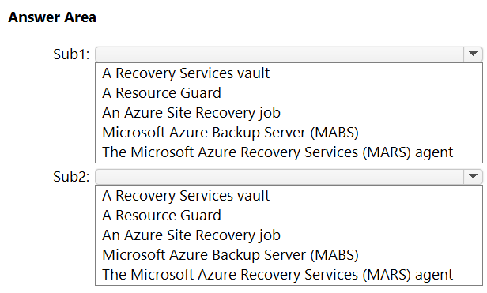

**Answer:**
Correct Answer:
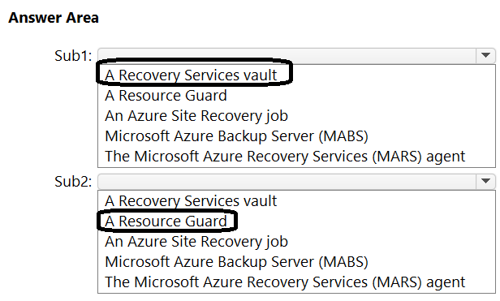

**Explication:**
N/A

## Question Set 126

**Context:**
HOTSPOT
–
You have 10 on-premises servers that run Windows Server.
You need to perform daily backups of the servers to a Recovery Services vault. The solution must meet the following requirements:
• Back up all the files and folders on the servers.
• Maintain three copies of the backups in Azure.
• Minimize costs.

**Question:**
What should you configure? To answer, select the appropriate options in the answer area.
NOTE: Each correct selection is worth one point.
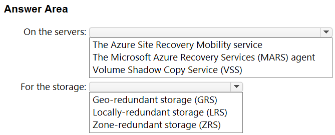

**Answer:**
Correct Answer:
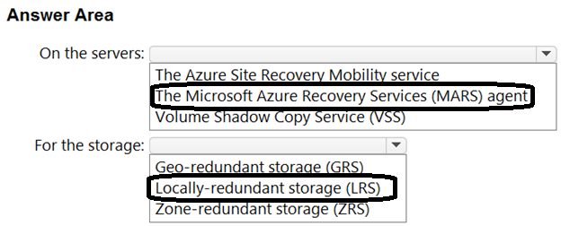

**Explication:**
N/A

## Question Set 127

**Context:**
HOTSPOT
–
You plan to deploy a containerized web-app that will be hosted in five Azure Kubernetes Service (AKS) clusters. Each cluster will be hosted in a different Azure region.
You need to provide access to the app from the internet. The solution must meet the following requirements:
• Incoming HTTPS requests must be routed to the cluster that has the lowest network latency.
• HTTPS traffic to individual pods must be routed via an ingress controller.
• In the event of an AKS cluster outage, failover time must be minimized.

**Question:**
What should you include in the solution? To answer, select the appropriate options in the answer area.
NOTE: Each correct selection is worth one point.
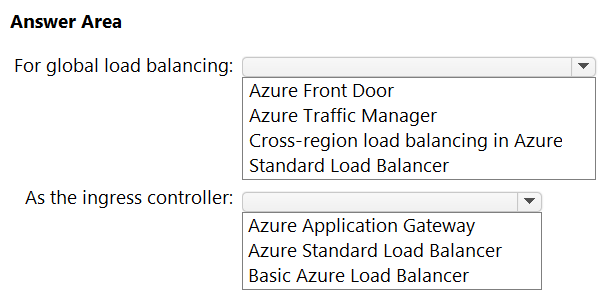

**Answer:**
Correct Answer:
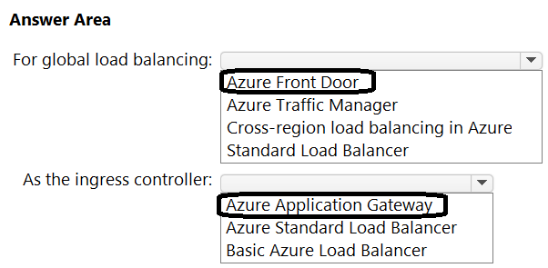

**Explication:**
N/A

## Question Set 128

**Context:**
HOTSPOT
–
You have an Azure subscription.
You create a storage account that will store documents.
You need to configure the storage account to meet the following requirements:
• Ensure that retention policies are standardized across the subscription.
• Ensure that data can be purged if the data is copied to an unauthorized location.

**Question:**
Which two settings should you enable? To answer, select the appropriate settings in the answer area.
NOTE: Each correct selection is worth one point.
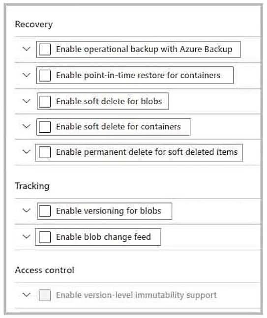

**Answer:**
Correct Answer:
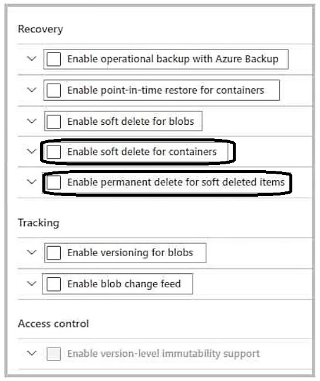

**Explication:**
Topic 4 – Question Set 4

## Question Set 129

**Context:**
You have an Azure subscription that contains a Basic Azure virtual WAN named VirtualWAN1 and the virtual hubs shown in the following table.
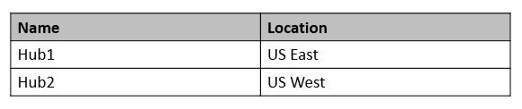
You have an ExpressRoute circuit in the US East Azure region.
You need to create an ExpressRoute association to VirtualWAN1.

**Question:**
What should you do first?
- A. Upgrade VirtualWAN1 to Standard.
- B. Create a gateway on Hub1.
- C. Enable the ExpressRoute premium add-on.
- D. Create a hub virtual network in US East.

**Answer:**
Correct Answer: A

**Explication:**
A basic Azure virtual WAN does not support express route. You have to upgrade to standard.

## Question Set 130

**Context:**
You have an Azure subscription that contains a storage account.
An application sometimes writes duplicate files to the storage account.
You have a PowerShell script that identifies and deletes duplicate files in the storage account. Currently, the script is run manually after approval from the operations manager.
You need to recommend a serverless solution that performs the following actions:
- Runs the script once an hour to identify whether duplicate files exist
- Sends an email notification to the operations manager requesting approval to delete the duplicate files
- Processes an email response from the operations manager specifying whether the deletion was approved
- Runs the script if the deletion was approved

**Question:**
What should you include in the recommendation?
- A. Azure Logic Apps and Azure Event Grid
- B. Azure Logic Apps and Azure Functions
- C. Azure Pipelines and Azure Service Fabric
- D. Azure Functions and Azure Batch

**Answer:**
Correct Answer: B

**Explication:**
You can schedule a powershell script with Azure Logic Apps.
When you want to run code that performs a specific job in your logic apps, you can create your own function by using Azure Functions. This service helps you create Node.js, C#, and F# functions so you don’t have to build a complete app or infrastructure to run code. You can also call logic apps from inside Azure functions.

## Question Set 131

**Context:**
Your company has the infrastructure shown in the following table.
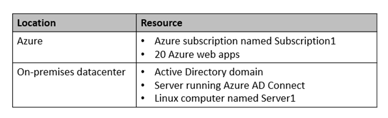
The on-premises Active Directory domain syncs with Azure Active Directory (Azure AD).
Server1 runs an application named App1 that uses LDAP queries to verify user identities in the on-premises Active Directory domain.
You plan to migrate Server1 to a virtual machine in Subscription1.
A company security policy states that the virtual machines and services deployed to Subscription1 must be prevented from accessing the on-premises network.
You need to recommend a solution to ensure that App1 continues to function after the migration. The solution must meet the security policy.

**Question:**
What should you include in the recommendation?
- A. Azure AD Application Proxy
- B. the Active Directory Domain Services role on a virtual machine
- C. an Azure VPN gateway
- D. Azure AD Domain Services (Azure AD DS)

**Answer:**
Correct Answer: D

**Explication:**
Azure Active Directory Domain Services (Azure AD DS) provides managed domain services such as domain join, group policy, lightweight directory access protocol (LDAP), and Kerberos/NTLM authentication.
4%

## Question Set 132

**Context:**
You need to design a solution that will execute custom C# code in response to an event routed to Azure Event Grid. The solution must meet the following requirements:
- The executed code must be able to access the private IP address of a Microsoft SQL Server instance that runs on an Azure virtual machine.
- Costs must be minimized.

**Question:**
What should you include in the solution?
- A. Azure Logic Apps in the Consumption plan
- B. Azure Functions in the Premium plan
- C. Azure Functions in the Consumption plan
- D. Azure Logic Apps in the integrated service environment

**Answer:**
Correct Answer: B

**Explication:**
Virtual connectivity is included in the Premium plan.
1%

## Question Set 133

**Context:**
You have an on-premises network and an Azure subscription. The on-premises network has several branch offices.
A branch office in Toronto contains a virtual machine named VM1 that is configured as a file server. Users access the shared files on VM1 from all the offices.
You need to recommend a solution to ensure that the users can access the shared files as quickly as possible if the Toronto branch office is inaccessible.

**Question:**
What should you include in the recommendation?
- A. a Recovery Services vault and Windows Server Backup
- B. Azure blob containers and Azure File Sync
- C. a Recovery Services vault and Azure Backup
- D. an Azure file share and Azure File Sync

**Answer:**
Correct Answer: D

**Explication:**
Use Azure File Sync to centralize your organization’s file shares in Azure Files, while keeping the flexibility, performance, and compatibility of an on-premises file server. Azure File Sync transforms Windows Server into a quick cache of your Azure file share.

## Question Set 134

**Context:**
HOTSPOT –
You have an Azure subscription named Subscription1 that is linked to a hybrid Azure Active Directory (Azure AD) tenant.
You have an on-premises datacenter that does NOT have a VPN connection to Subscription1. The datacenter contains a computer named Server1 that has
Microsoft SQL Server 2016 installed. Server is prevented from accessing the internet.
An Azure logic app resource named LogicApp1 requires write access to a database on Server1.
You need to recommend a solution to provide LogicApp1 with the ability to access Server1.

**Question:**
What should you recommend deploying on-premises and in Azure? To answer, select the appropriate options in the answer area.
NOTE: Each correct selection is worth one point.
Hot Area:
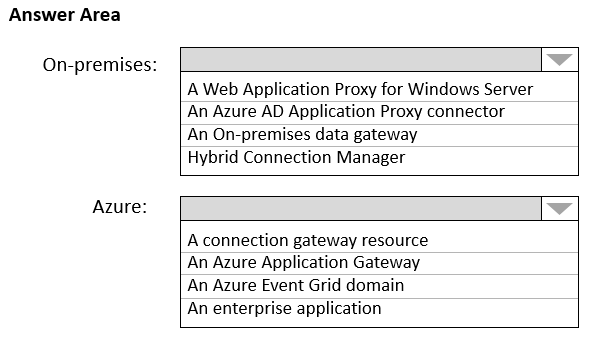

**Answer:**
Correct Answer:
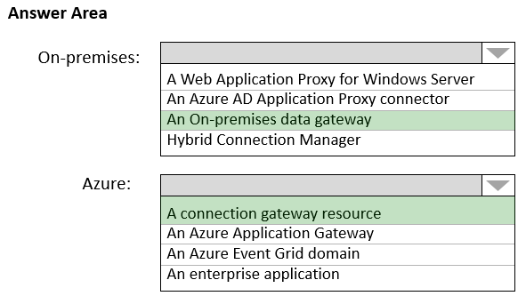

**Explication:**
- Box 1: An on-premises data gateway
For logic apps in global, multi-tenant Azure that connect to on-premises SQL Server, you need to have the on-premises data gateway installed on a local computer and a data gateway resource that’s already created in Azure.
- Box 2: A connection gateway resource

## Question Set 135

**Context:**
N/A

**Question:**
HOTSPOT –
Your company develops a web service that is deployed to an Azure virtual machine named VM1. The web service allows an API to access real-time data from
VM1.
The current virtual machine deployment is shown in the Deployment exhibit.
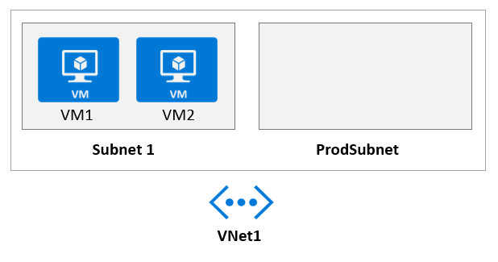
The chief technology officer (CTO) sends you the following email message: “Our developers have deployed the web service to a virtual machine named VM1.
Testing has shown that the API is accessible from VM1 and VM2. Our partners must be able to connect to the API over the Internet. Partners will use this data in applications that they develop.”
You deploy an Azure API Management (APIM) service. The relevant API Management configuration is shown in the API exhibit.
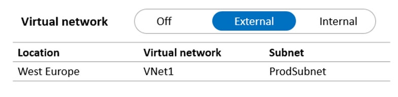
For each of the following statements, select Yes if the statement is true. Otherwise, select No.
NOTE: Each correct selection is worth one point.
Hot Area:
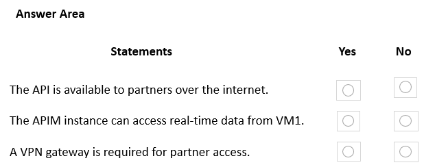

**Answer:**
Correct Answer:
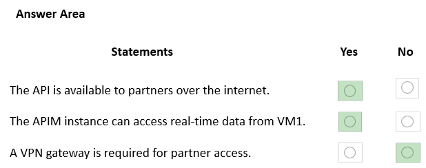

**Explication:**
N/A

## Question Set 136

**Context:**
DRAG DROP –
Your company has an existing web app that runs on Azure virtual machines.
You need to ensure that the app is protected from SQL injection attempts and uses a layer-7 load balancer. The solution must minimize disruptions to the code of the app.

**Question:**
What should you recommend? To answer, drag the appropriate services to the correct targets. Each service may be used once, more than once, or not at all. You may need to drag the split bar between panes or scroll to view content.
NOTE: Each correct selection is worth one point.
Select and Place:
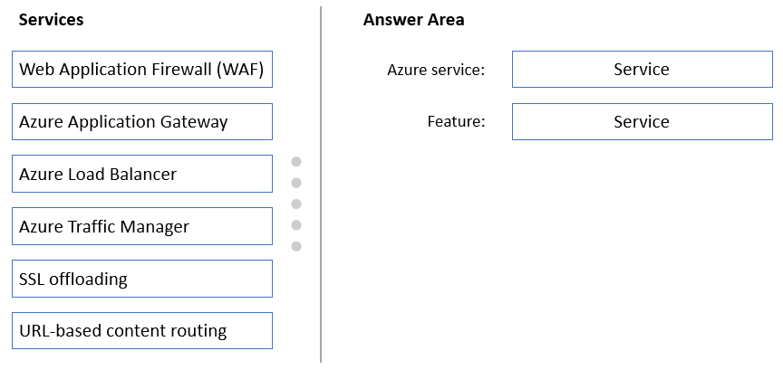

**Answer:**
Correct Answer:
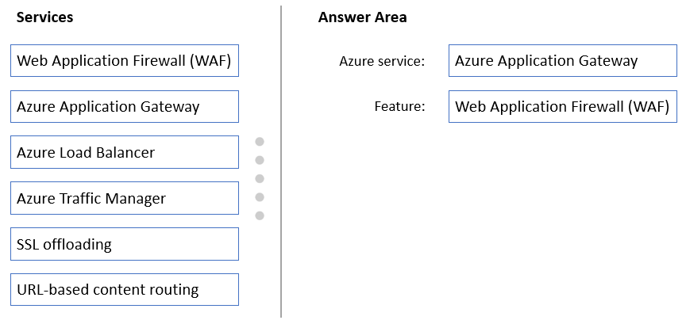

**Explication:**
- Box 1: Azure Application Gateway
The Azure Application Gateway Web Application Firewall (WAF) provides protection for web applications. These protections are provided by the Open Web
Application Security Project (OWASP) Core Rule Set (CRS).
- Box 2: Web Application Firewall (WAF)

## Question Set 137

**Context:**
You are designing a microservices architecture that will be hosted in an Azure Kubernetes Service (AKS) cluster. Apps that will consume the microservices will be hosted on Azure virtual machines. The virtual machines and the AKS cluster will reside on the same virtual network.
You need to design a solution to expose the microservices to the consumer apps. The solution must meet the following requirements:
- Ingress access to the microservices must be restricted to a single private IP address and protected by using mutual TLS authentication.
- The number of incoming microservice calls must be rate-limited.
- Costs must be minimized.

**Question:**
What should you include in the solution?
- A. Azure App Gateway with Azure Web Application Firewall (WAF)
- B. Azure API Management Standard tier with a service endpoint
- C. Azure Front Door with Azure Web Application Firewall (WAF)
- D. Azure API Management Premium tier with virtual network connection

**Answer:**
Correct Answer: D

**Explication:**
One option is to deploy APIM (API Management) inside the cluster VNet .
The AKS cluster and the applications that consume the microservices might reside within the same VNet , hence there is no reason to expose the cluster publicly as all API traffic will remain within the VNet . For these scenarios, you can deploy API Management into the cluster VNet . API Management Premium tier supports
VNet deployment.

## Question Set 138

**Context:**
You have a .NET web service named Service1 that performs the following tasks:
- Reads and writes temporary files to the local file system.
- Writes to the Application event log.
You need to recommend a solution to host Service1 in Azure. The solution must meet the following requirements:
- Minimize maintenance overhead.
- Minimize costs.

**Question:**
What should you include in the recommendation?
- A. an Azure App Service web app
- B. an Azure virtual machine scale set
- C. an App Service Environment (ASE)
- D. an Azure Functions app

**Answer:**
Correct Answer: A

**Explication:**
Azure Web App meets the requirements and is less expansive compared to VM scale sets.

## Question Set 139

**Context:**
You have the Azure resources shown in the following table.
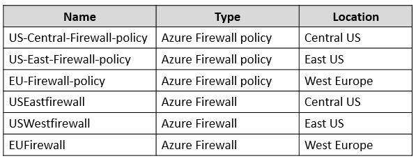
You need to deploy a new Azure Firewall policy that will contain mandatory rules for all Azure Firewall deployments. The new policy will be configured as a parent policy for the existing policies.

**Question:**
What is the minimum number of additional Azure Firewall policies you should create?
- A. 0
- B. 1
- C. 2
- D. 3

**Answer:**
Correct Answer: D

**Explication:**
Firewall policies work across regions and subscriptions.
Place all your global configurations in the parent policy.
The parent policy is required to be in the same region as the child policy.
Each of the three regions must have a new parent policy.

## Question Set 140

**Context:**
Your company has an app named App1 that uses data from the on-premises Microsoft SQL Server databases shown in the following table.
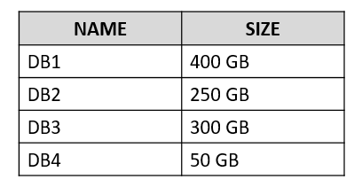
App1 and the data are used on the first day of the month only. The data is not expected to grow more than 3 percent each year.
The company is rewriting App1 as an Azure web app and plans to migrate all the data to Azure.
You need to migrate the data to Azure SQL Database and ensure that the database is only available on the first day of each month.

**Question:**
Which service tier should you use?
- A. vCore -based General Purpose
- B. DTU-based Standard
- C. vCore -based Business Critical
- D. DTU-based Basic

**Answer:**
Correct Answer: A

**Explication:**
Note: App1 and the data are used on the first day of the month only. See Serverless compute tier below.
The vCore based purchasing model.
The term vCore refers to the Virtual Core. In this purchasing model of Azure SQL Database, you can choose from the provisioned compute tier and serverless compute tier.
* Provisioned compute tier: You choose the exact compute resources for the workload.
* Serverless compute tier: Azure automatically pauses and resumes the database based on workload activity in the serverless tier. During the pause period, Azure does not charge you for the compute resources.
DTU and vCore based models for Azure SQL Databases

## Question Set 141

**Context:**
You are developing a sales application that will contain several Azure cloud services and handle different components of a transaction. Different cloud services will process customer orders, billing, payment, inventory, and shipping.
You need to recommend a solution to enable the cloud services to asynchronously communicate transaction information by using XML messages.

**Question:**
What should you include in the recommendation?
- A. Azure Service Fabric
- B. Azure Data Lake
- C. Azure Service Bus
- D. Azure Traffic Manager

**Answer:**
Correct Answer: C

**Explication:**
Asynchronous messaging options in Azure include Azure Service Bus, Event Grid, and Event Hubs.

## Question Set 142

**Context:**
Your company has 300 virtual machines hosted in a VMware environment. The virtual machines vary in size and have various utilization levels.
You plan to move all the virtual machines to Azure.
You need to recommend how many and what size Azure virtual machines will be required to move the current workloads to Azure. The solution must minimize administrative effort.

**Question:**
What should you use to make the recommendation?
- A. Azure Pricing calculator
- B. Azure Advisor
- C. Azure Migrate
- D. Azure Cost Management

**Answer:**
Correct Answer: C

**Explication:**
Azure Migrate provides a centralized hub to assess and migrate on-premises servers, infrastructure, applications, and data to Azure. It provides the following:
Unified migration platform: A single portal to start, run, and track your migration to Azure. Range of tools: A range of tools for assessment and migration.

## Question Set 143

**Context:**
You plan to provision a High Performance Computing (HPC) cluster in Azure that will use a third-party scheduler.
You need to recommend a solution to provision and manage the HPC cluster node.

**Question:**
What should you include in the recommendation?
- A. Azure Automation
- B. Azure CycleCloud
- C. Azure Purview
- D. Azure Lighthouse

**Answer:**
Correct Answer: B

**Explication:**
You can dynamically provision Azure HPC clusters with Azure CycleCloud .
Azure CycleCloud is the simplest way to manage HPC workloads.
Note: Azure CycleCloud is an enterprise-friendly tool for orchestrating and managing High Performance Computing (HPC) environments on Azure. With
CycleCloud , users can provision infrastructure for HPC systems, deploy familiar HPC schedulers, and automatically scale the infrastructure to run jobs efficiently at any scale. Through CycleCloud , users can create different types of file systems and mount them to the compute cluster nodes to support HPC workloads.

## Question Set 144

**Context:**
HOTSPOT –
You are designing an Azure App Service web app.
You plan to deploy the web app to the North Europe Azure region and the West Europe Azure region.
You need to recommend a solution for the web app. The solution must meet the following requirements:
- Users must always access the web app from the North Europe region, unless the region fails.
- The web app must be available to users if an Azure region is unavailable.
- Deployment costs must be minimized.

**Question:**
What should you include in the recommendation? To answer, select the appropriate options in the answer area.
NOTE: Each correct selection is worth one point.
Hot Area:
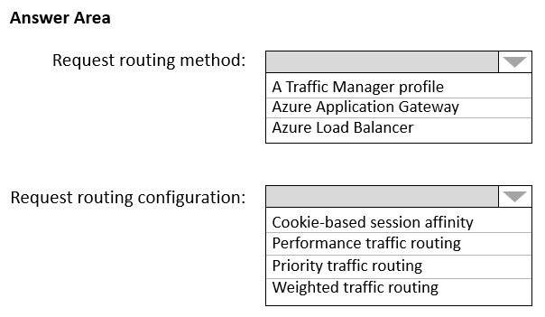

**Answer:**
Correct Answer:
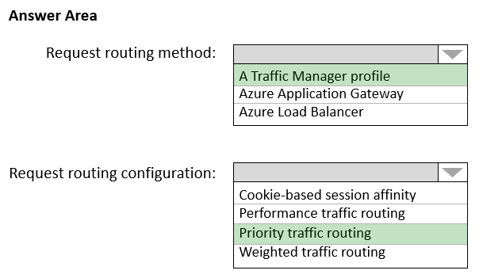

**Explication:**
- Box 1: A Traffic Manager profile
To support load balancing across the regions we need a Traffic Manager.
- Box 2: Priority traffic routing –
Priority traffic-routing method.
Often an organization wants to provide reliability for their services. To do so, they deploy one or more backup services in case their primary goes down. The
‘Priority’ traffic-routing method allows Azure customers to easily implement this failover pattern.

## Question Set 145

**Context:**
Note: This question is part of a series of questions that present the same scenario. Each question in the series contains a unique solution that might meet the stated goals. Some question sets might have more than one correct solution, while others might not have a correct solution.
After you answer a question in this section, you will NOT be able to return to it. As a result, these questions will not appear in the review screen.
You plan to deploy multiple instances of an Azure web app across several Azure regions.
You need to design an access solution for the app. The solution must meet the following replication requirements:
- Support rate limiting.
- Balance requests between all instances.
- Ensure that users can access the app in the event of a regional outage.
Solution: You use Azure Traffic Manager to provide access to the app.

**Question:**
Does this meet the goal?
- A. Yes
- B. No

**Answer:**
Correct Answer: B

**Explication:**
Azure Traffic Manager is a DNS-based traffic load balancer. This service allows you to distribute traffic to your public facing applications across the global Azure regions. Traffic Manager also provides your public endpoints with high availability and quick responsiveness. It does not provide rate limiting.
Note: Azure Front Door would meet the requirements. The Azure Web Application Firewall (WAF) rate limit rule for Azure Front Door controls the number of requests allowed from clients during a one-minute duration.

## Question Set 146

**Context:**
Note: This question is part of a series of questions that present the same scenario. Each question in the series contains a unique solution that might meet the stated goals. Some question sets might have more than one correct solution, while others might not have a correct solution.
After you answer a question in this section, you will NOT be able to return to it. As a result, these questions will not appear in the review screen.
You plan to deploy multiple instances of an Azure web app across several Azure regions.
You need to design an access solution for the app. The solution must meet the following replication requirements:
- Support rate limiting.
- Balance requests between all instances.
- Ensure that users can access the app in the event of a regional outage.
Solution: You use Azure Load Balancer to provide access to the app.

**Question:**
Does this meet the goal?
- A. Yes
- B. No

**Answer:**
Correct Answer: B

**Explication:**
Azure Application Gateway and Azure Load Balancer do not support rate or connection limits.
Note: Azure Front Door would meet the requirements. The Azure Web Application Firewall (WAF) rate limit rule for Azure Front Door controls the number of requests allowed from clients during a one-minute duration.

## Question Set 147

**Context:**
Note: This question is part of a series of questions that present the same scenario. Each question in the series contains a unique solution that might meet the stated goals. Some question sets might have more than one correct solution, while others might not have a correct solution.
After you answer a question in this section, you will NOT be able to return to it. As a result, these questions will not appear in the review screen.
You plan to deploy multiple instances of an Azure web app across several Azure regions.
You need to design an access solution for the app. The solution must meet the following replication requirements:
- Support rate limiting.
- Balance requests between all instances.
- Ensure that users can access the app in the event of a regional outage.
Solution: You use Azure Application Gateway to provide access to the app.

**Question:**
Does this meet the goal?
- A. Yes
- B. No

**Answer:**
Correct Answer: B

**Explication:**
Azure Application Gateway and Azure Load Balancer do not support rate or connection limits.
Note: Azure Front Door would meet the requirements. The Azure Web Application Firewall (WAF) rate limit rule for Azure Front Door controls the number of requests allowed from clients during a one-minute duration.

## Question Set 148

**Context:**
HOTSPOT –
Your company has two on-premises sites in New York and Los Angeles and Azure virtual networks in the East US Azure region and the West US Azure region.
Each on-premises site has ExpressRoute Global Reach circuits to both regions.
You need to recommend a solution that meets the following requirements:
- Outbound traffic to the internet from workloads hosted on the virtual networks must be routed through the closest available on-premises site.
- If an on-premises site fails, traffic from the workloads on the virtual networks to the internet must reroute automatically to the other site.

**Question:**
What should you include in the recommendation? To answer, select the appropriate options in the answer area.
NOTE: Each correct selection is worth one point.
Hot Area:
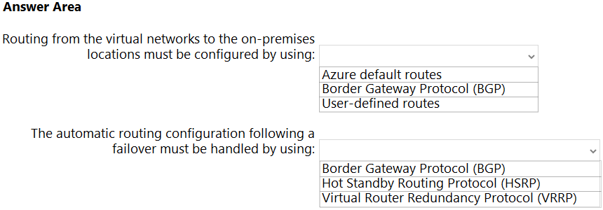

**Answer:**
Correct Answer:
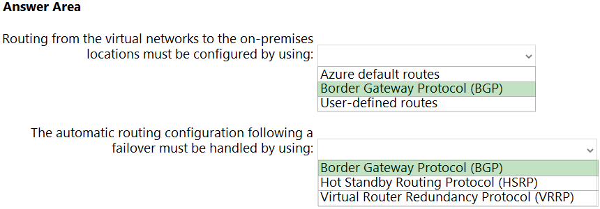

**Explication:**
- Box 1: Border Gateway Protocol (BGP)
An on-premises network gateway can exchange routes with an Azure virtual network gateway using the border gateway protocol (BGP). Using BGP with an Azure virtual network gateway is dependent on the type you selected when you created the gateway. If the type you selected were:
ExpressRoute: You must use BGP to advertise on-premises routes to the Microsoft Edge router. You cannot create user-defined routes to force traffic to the
ExpressRoute virtual network gateway if you deploy a virtual network gateway deployed as type: ExpressRoute. You can use user-defined routes for forcing traffic from the Express Route to, for example, a Network Virtual Appliance.
- Box 2: Border Gateway Protocol (BGP)
Incorrect:
Microsoft does not support HSRP or VRRP for high availability configurations.

## Question Set 149

**Context:**
HOTSPOT –
You are designing an application that will use Azure Linux virtual machines to analyze video files. The files will be uploaded from corporate offices that connect to
Azure by using ExpressRoute.
You plan to provision an Azure Storage account to host the files.
You need to ensure that the storage account meets the following requirements:
- Supports video files of up to 7 TB
- Provides the highest availability possible
- Ensures that storage is optimized for the large video files
- Ensures that files from the on-premises network are uploaded by using ExpressRoute

**Question:**
How should you configure the storage account? To answer, select the appropriate options in the answer area.
NOTE: Each correct selection is worth one point.
Hot Area:
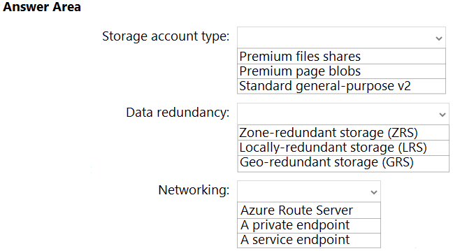

**Answer:**
Correct Answer:
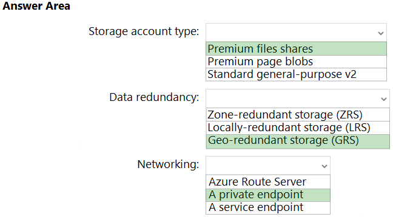

**Explication:**
- Box 1: Premium page blobs –
The maximum size for a page blob is 8 TiB.
Incorrect:
Not Premium file shares:
Max file size for Standard and Premium file shares are 4 TB.
- Box 2: Geo-redundant storage (GRS)
GRS provides additional redundancy for data storage compared to LRS or ZRS.
- Box 3: A private endpoint –
Azure Private Link allows you to securely link Azure PaaS services to your virtual network using private endpoints. For many services, you just set up an endpoint per resource. This means you can connect your on-premises or multi-cloud servers with Azure Arc and send all traffic over an Azure ExpressRoute or site-to-site
VPN connection instead of using public networks.

## Question Set 150

**Context:**
HOTSPOT –
A company plans to implement an HTTP-based API to support a web app. The web app allows customers to check the status of their orders.
The API must meet the following requirements:
- Implement Azure Functions.
- Provide public read-only operations.
- Prevent write operations.
You need to recommend which HTTP methods and authorization level to configure.

**Question:**
What should you recommend? To answer, configure the appropriate options in the dialog box in the answer area.
NOTE: Each correct selection is worth one point.
Hot Area:
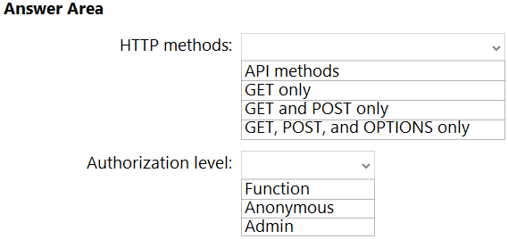

**Answer:**
Correct Answer:
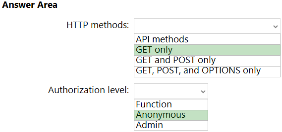

**Explication:**
- Box 1: GET only –
Get for read-only-
- Box 2: Anonymous –
Anonymous for public operations.

## Question Set 151

**Context:**
You have an Azure subscription.
You need to recommend a solution to provide developers with the ability to provision Azure virtual machines. The solution must meet the following requirements:
- Only allow the creation of the virtual machines in specific regions.
- Only allow the creation of specific sizes of virtual machines.

**Question:**
What should you include in the recommendation?
- A. Azure Resource Manager (ARM) templates
- B. Azure Policy
- C. Conditional Access policies
- D. role-based access control (RBAC)

**Answer:**
Correct Answer: B

**Explication:**
Azure Policies allows you to specify allowed locations, and allowed VM SKUs.

## Question Set 152

**Context:**
DRAG DROP –
You have an on-premises network that uses an IP address space of 172.16.0.0/16.
You plan to deploy 30 virtual machines to a new Azure subscription.
You identify the following technical requirements:
- All Azure virtual machines must be placed on the same subnet named Subnet1.
- All the Azure virtual machines must be able to communicate with all on-premises servers.
- The servers must be able to communicate between the on-premises network and Azure by using a site-to-site VPN.
You need to recommend a subnet design that meets the technical requirements.

**Question:**
What should you include in the recommendation? To answer, drag the appropriate network addresses to the correct subnets. Each network address may be used once, more than once, or not at all. You may need to drag the split bar between panes or scroll to view content.
NOTE: Each correct selection is worth one point.
Select and Place:
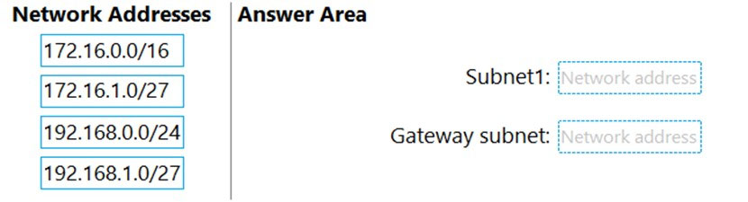

**Answer:**
Correct Answer:
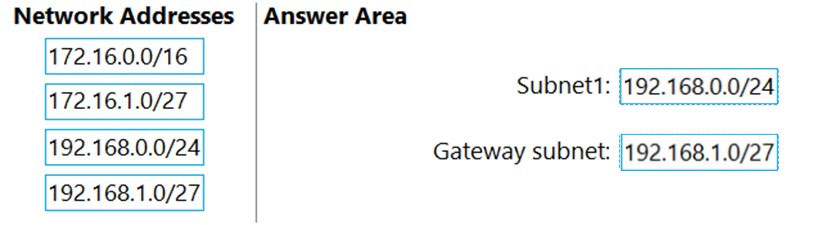

**Explication:**
N/A

## Question Set 153

**Context:**
You have data files in Azure Blob Storage.
You plan to transform the files and move them to Azure Data Lake Storage.
You need to transform the data by using mapping data flow.

**Question:**
Which service should you use?
- A. Azure Databricks
- B. Azure Storage Sync
- C. Azure Data Factory
- D. Azure Data Box Gateway

**Answer:**
Correct Answer: C

**Explication:**
You can copy and transform data in Azure Data Lake Storage Gen2 using Azure Data Factory or Azure Synapse Analytics.

## Question Set 154

**Context:**
You have an Azure subscription.
You need to deploy an Azure Kubernetes Service (AKS) solution that will use Windows Server 2019 nodes. The solution must meet the following requirements:
- Minimize the time it takes to provision compute resources during scale-out operations.
- Support autoscaling of Windows Server containers.

**Question:**
Which scaling option should you recommend?
- A. Kubernetes version 1.20.2 or newer
- B. Virtual nodes with Virtual Kubelet ACI
- C. cluster autoscaler
- D. horizontal pod autoscaler

**Answer:**
Correct Answer: C

**Explication:**
Deployments can scale across AKS with no delay as cluster autoscaler deploys new nodes in your AKS cluster.
Note: AKS clusters can scale in one of two ways:
* The cluster autoscaler watches for pods that can’t be scheduled on nodes because of resource constraints. The cluster then automatically increases the number of nodes.
* The horizontal pod autoscaler uses the Metrics Server in a Kubernetes cluster to monitor the resource demand of pods. If an application needs more resources, the number of pods is automatically increased to meet the demand.
Incorrect:
Not D: If your application needs to rapidly scale, the horizontal pod autoscaler may schedule more pods than can be provided by the existing compute resources in the node pool. If configured, this scenario would then trigger the cluster autoscaler to deploy additional nodes in the node pool, but it may take a few minutes for those nodes to successfully provision and allow the Kubernetes scheduler to run pods on them.
Other

## Question Set 155

**Context:**
HOTSPOT –
Your on-premises network contains a file server named Server1 that stores 500 GB of data.
You need to use Azure Data Factory to copy the data from Server1 to Azure Storage.
You add a new data factory.

**Question:**
What should you do next? To answer, select the appropriate options in the answer area.
NOTE: Each correct selection is worth one point.
Hot Area:
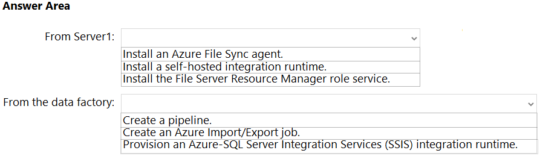

**Answer:**
Correct Answer:
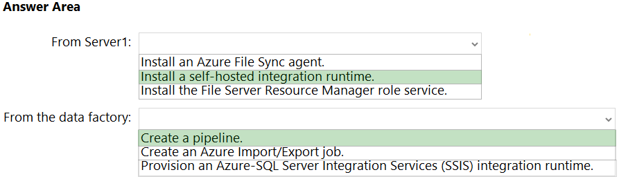

**Explication:**
- Box 1: Install a self-hosted integration runtime.
If your data store is located inside an on-premises network, an Azure virtual network, or Amazon Virtual Private Cloud, you need to configure a self-hosted integration runtime to connect to it.
The Integration Runtime to be used to connect to the data store. You can use Azure Integration Runtime or Self-hosted Integration Runtime (if your data store is located in private network). If not specified, it uses the default Azure Integration Runtime.
- Box 2: Create a pipeline.
You perform the Copy activity with a pipeline.

## Question Set 156

**Context:**
You have an Azure subscription.
You need to recommend an Azure Kubernetes Service (AKS) solution that will use Linux nodes. The solution must meet the following requirements:
- Minimize the time it takes to provision compute resources during scale-out operations.
- Support autoscaling of Linux containers.
- Minimize administrative effort.

**Question:**
Which scaling option should you recommend?
- A. horizontal pod autoscaler
- B. cluster autoscaler
- C. virtual nodes
- D. Virtual Kubelet

**Answer:**
Correct Answer: C

**Explication:**
To rapidly scale application workloads in an AKS cluster, you can use virtual nodes. With virtual nodes, you have quick provisioning of pods, and only pay per second for their execution time. You don’t need to wait for Kubernetes cluster autoscaler to deploy VM compute nodes to run the additional pods. Virtual nodes are only supported with Linux pods and nodes.

## Question Set 157

**Context:**
You are designing an order processing system in Azure that will contain the Azure resources shown in the following table.
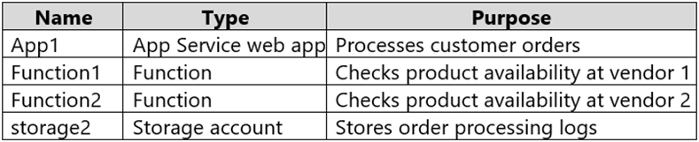
The order processing system will have the following transaction flow:
- A customer will place an order by using App1.
- When the order is received, App1 will generate a message to check for product availability at vendor 1 and vendor 2.
- An integration component will process the message, and then trigger either Function1 or Function2 depending on the type of order.
- Once a vendor confirms the product availability, a status message for App1 will be generated by Function1 or Function2.
- All the steps of the transaction will be logged to storage1.

**Question:**
Which type of resource should you recommend for the integration component?
- A. an Azure Service Bus queue
- B. an Azure Data Factory pipeline
- C. an Azure Event Grid domain
- D. an Azure Event Hubs capture

**Answer:**
Correct Answer: B

**Explication:**
Azure Data Factory is the platform is the cloud-based ETL and data integration service that allows you to create data-driven workflows for orchestrating data movement and transforming data at scale. Using Azure Data Factory, you can create and schedule data-driven workflows (called pipelines) that can ingest data from disparate data stores.
Data Factory contains a series of interconnected systems that provide a complete end-to-end platform for data engineers.

## Question Set 158

**Context:**
You have 100 Microsoft SQL Server Integration Services (SSIS) packages that are configured to use 10 on-premises SQL Server databases as their destinations.
You plan to migrate the 10 on-premises databases to Azure SQL Database.
You need to recommend a solution to create Azure-SQL Server Integration Services (SSIS) packages. The solution must ensure that the packages can target the
SQL Database instances as their destinations.

**Question:**
What should you include in the recommendation?
- A. Data Migration Assistant (DMA)
- B. Azure Data Factory
- C. Azure Data Catalog
- D. SQL Server Migration Assistant (SSMA)

**Answer:**
Correct Answer: B

**Explication:**
Migrate on-premises SSIS workloads to SSIS using ADF (Azure Data Factory).
When you migrate your database workloads from SQL Server on premises to Azure database services, namely Azure SQL Database or Azure SQL Managed
Instance, your ETL workloads on SQL Server Integration Services (SSIS) as one of the primary value-added services will need to be migrated as well.
Azure-SSIS Integration Runtime (IR) in Azure Data Factory (ADF) supports running SSIS packages. Once Azure-SSIS IR is provisioned, you can then use familiar tools, such as SQL Server Data Tools (SSDT)/SQL Server Management Studio (SSMS), and command-line utilities, such as dtinstall / dtutil / dtexec , to deploy and run your packages in Azure.

## Question Set 159

**Context:**
You have an Azure virtual machine named VM1 that runs Windows Server 2019 and contains 500 GB of data files.
You are designing a solution that will use Azure Data Factory to transform the data files, and then load the files to Azure Data Lake Storage.

**Question:**
What should you deploy on VM1 to support the design?
- A. the On-premises data gateway
- B. the Azure Pipelines agent
- C. the self-hosted integration runtime
- D. the Azure File Sync agent

**Answer:**
Correct Answer: C

**Explication:**
The integration runtime (IR) is the compute infrastructure that Azure Data Factory and Synapse pipelines use to provide data-integration capabilities across different network environments.
A self-hosted integration runtime can run copy activities between a cloud data store and a data store in a private network. It also can dispatch transform activities against compute resources in an on-premises network or an Azure virtual network. The installation of a self-hosted integration runtime needs an on-premises machine or a virtual machine inside a private network.

## Question Set 160

**Context:**
You have an Azure Active Directory (Azure AD) tenant that syncs with an on-premises Active Directory domain.
Your company has a line-of-business (LOB) application that was developed internally.
You need to implement SAML single sign-on (SSO) and enforce multi-factor authentication (MFA) when users attempt to access the application from an unknown location.

**Question:**
Which two features should you include in the solution? Each correct answer presents part of the solution.
NOTE: Each correct selection is worth one point.
- A. Azure AD Privileged Identity Management (PIM)
- B. Azure Application Gateway
- C. Azure AD enterprise applications
- D. Azure AD Identity Protection
- E. Conditional Access policies

**Answer:**
Correct Answer: DE

**Explication:**
D: The signals generated by and fed to Identity Protection, can be further fed into tools like Conditional Access to make access decisions, or fed back to a security information and event management (SIEM) tool for further investigation based on your organization’s enforced policies.
Note: Identity Protection is a tool that allows organizations to accomplish three key tasks:
Automate the detection and remediation of identity-based risks.
Investigate risks using data in the portal.
Export risk detection data to your SIEM.
E: The location condition can be used in a Conditional Access policy.
Conditional Access policies are at their most basic an if-then statement combining signals, to make decisions, and enforce organization policies. One of those signals that can be incorporated into the decision-making process is location.
Organizations can use this location for common tasks like:
* Requiring multi-factor authentication for users accessing a service when they’re off the corporate network.
* Blocking access for users accessing a service from specific countries or regions.
The location is determined by the public IP address a client provides to Azure Active Directory or GPS coordinates provided by the Microsoft Authenticator app.
Conditional Access policies by default apply to all IPv4 and IPv6 addresses.
Incorrect:
Not A: Privileged Identity Management (PIM) is a service in Azure Active Directory (Azure AD) that enables you to manage, control, and monitor access to important resources in your organization. These resources include resources in Azure AD, Azure, and other Microsoft Online Services such as Microsoft 365 or
Microsoft Intune.

## Question Set 161

**Context:**
You plan to automata the deployment of resources to Azure subscriptions.

**Question:**
What is a difference between using Azure Blueprints and Azure Resource Manager (ARM) templates?
- A. ARM templates remain connected to the deployed resources.
- B. Only blueprints can contain policy definitions.
- C. Only ARM templates can contain policy definitions.
- D. Blueprints remain connected to the deployed resources.

**Answer:**
Correct Answer: D

**Explication:**
With Azure Blueprints, the relationship between the blueprint definition (what should be deployed) and the blueprint assignment (what was deployed) is preserved.
This connection supports improved tracking and auditing of deployments.
Incorrect:
Not A: An ARM template is a document that doesn’t exist natively in Azure – each is stored either locally or in source control or in Templates (preview). The template gets used for deployments of one or more Azure resources, but once those resources deploy there’s no active connection or relationship to the template.
Not C: Blueprints are a declarative way to orchestrate the deployment of various resource templates and other artifacts such as:
Role Assignments –
Policy Assignments –
Azure Resource Manager templates (ARM templates)
Resource Groups –

## Question Set 162

**Context:**
HOTSPOT –
You have the resources shown in the following table.
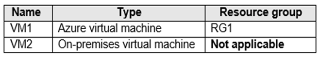
You create a new resource group in Azure named RG2.
You need to move the virtual machines to RG2.

**Question:**
What should you use to move each virtual machine? To answer, select the appropriate options in the answer area.
NOTE: Each correct selection is worth one point.
Hot Area:
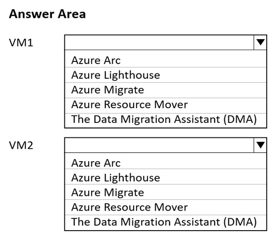

**Answer:**
Correct Answer:
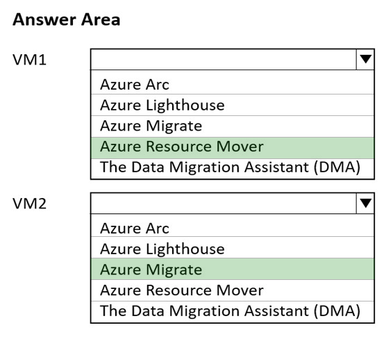

**Explication:**
- Box 1: Azure Resource Mover –
To move Azure VMs to another region, Microsoft now recommends using Azure Resource Mover.
Incorrect:
Not Azure Migrate: We are not migrating, only moving a VM between resource groups.
- Box 2: Azure Migrate –
Azure Migrate provides a centralized hub to assess and migrate on-premises servers, infrastructure, applications, and data to Azure.
Azure migrate includes Azure Migrate Server Migration: Migrate VMware VMs, Hyper-V VMs, physical servers, other virtualized servers, and public cloud VMs to
Azure.
Incorrect:
Not Arc: Azure Migrate is adequate. No need to use Azure Arc.
Not Data Migration Assistant: Data Migration Assistant is a stand-alone tool to assess SQL Servers.
It is used to assess SQL Server databases for migration to Azure SQL Database, Azure SQL Managed Instance, or Azure VMs running SQL Server.
Not Lighthouse: Azure Lighthouse enables multi-tenant management with scalability, higher automation, and enhanced governance across resources.
With Azure Lighthouse, service providers can deliver managed services using comprehensive and robust tooling built into the Azure platform. Customers maintain control over who has access to their tenant, which resources they can access, and what actions can be taken.

## Question Set 163

**Context:**
You plan to deploy an Azure App Service web app that will have multiple instances across multiple Azure regions.
You need to recommend a load balancing service for the planned deployment The solution must meet the following requirements:
- Maintain access to the app in the event of a regional outage.
- Support Azure Web Application Firewall (WAF).
- Support cookie-based affinity.
- Support URL routing.

**Question:**
What should you include in the recommendation?
- A. Azure Front Door
- B. Azure Traffic Manager
- C. Azure Application Gateway
- D. Azure Load Balancer

**Answer:**
Correct Answer: A

**Explication:**
Azure Front Door works across regions and support URL routing (HTTP(S)).
Note: HTTP(S) load-balancing services are Layer 7 load balancers that only accept HTTP(S) traffic. They are intended for web applications or other HTTP(S) endpoints. They include features such as SSL offload, web application firewall, path-based load balancing, and session affinity.
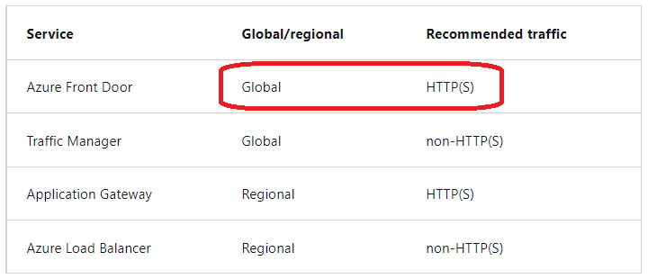
Incorrect:
Application Gateway and Azure Load Balancer only work within one single region.
6%

## Question Set 164

**Context:**
HOTSPOT –
You have the Azure resources shown in the following table.
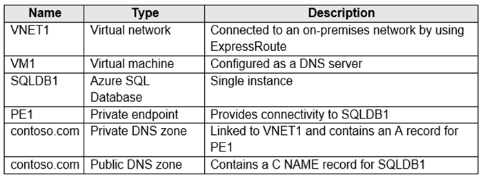
You need to design a solution that provides on-premises network connectivity to SQLDB1 through PE1.

**Question:**
How should you configure name resolution? To answer select the appropriate options in the answer area.
NOTE: Each correct selection is worth one point.
Hot Area:
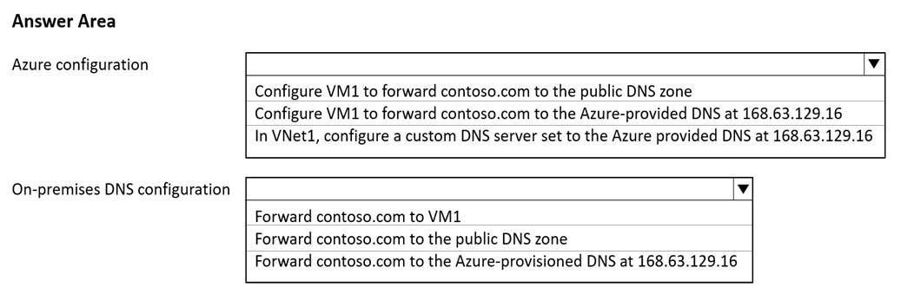

**Answer:**
Correct Answer:
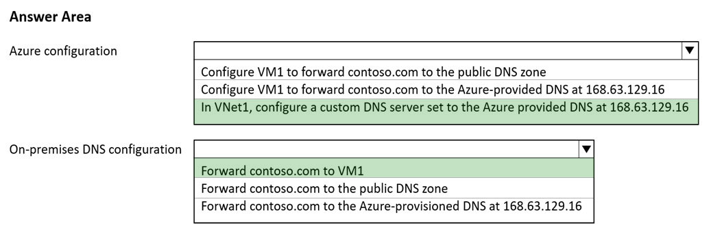

**Explication:**
- Box 1:In VNET1, configure a custom DNS server set to the Azure provided DNS at 168.63.129.16
Virtual network workloads without custom DNS server.
This configuration is appropriate for virtual network workloads without a custom DNS server. In this scenario, the client queries for the private endpoint IP address to the Azure-provided DNS service 168.63.129.16. Azure DNS will be responsible for DNS resolution of the private DNS zones.
The following screenshot illustrates the DNS resolution sequence from virtual network workloads using the private DNS zone:
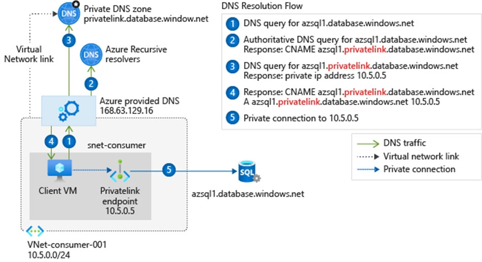
- Box 2: Forward contoso.com to VM1
Forward to the DNS server VM1.
Note: You can use the following options to configure your DNS settings for private endpoints:
* Use the host file (only recommended for testing). You can use the host file on a virtual machine to override the DNS.
* Use a private DNS zone. You can use private DNS zones to override the DNS resolution for a private endpoint. A private DNS zone can be linked to your virtual network to resolve specific domains.
* Use your DNS forwarder (optional). You can use your DNS forwarder to override the DNS resolution for a private link resource. Create a DNS forwarding rule to use a private DNS zone on your DNS server hosted in a virtual network.

## Question Set 165

**Context:**
You are designing a microservices architecture that will support a web application.
The solution must meet the following requirements:
- Deploy the solution on-premises and to Azure.
Support low-latency and hyper-scale operations.
- Allow independent upgrades to each microservice.
- Set policies for performing automatic repairs to the microservices.
You need to recommend a technology.

**Question:**
What should you recommend?
- A. Azure Container Instance
- B. Azure Logic App
- C. Azure Service Fabric
- D. Azure virtual machine scale set

**Answer:**
Correct Answer: C

**Explication:**
Azure Service Fabric enables you to create Service Fabric clusters on premises or in other clouds.
Azure Service Fabric is low-latency and scales up to thousands of machines.

## Question Set 166

**Context:**
Note: This question is part of a series of questions that present the same scenario. Each question in the series contains a unique solution that might meet the stated goals. Some question sets might have more than one correct solution, while others might not have a correct solution.
After you answer a question in this section, you will NOT be able to return to it. As a result, these questions will not appear in the review screen.
You plan to deploy multiple instances of an Azure web app across several Azure regions.
You need to design an access solution for the app. The solution must meet the following replication requirements:
- Support rate limiting.
- Balance requests between all instances.
- Ensure that users can access the app in the event of a regional outage.
Solution: You use Azure Front Door to provide access to the app.

**Question:**
Does this meet the goal?
- A. Yes
- B. No

**Answer:**
Correct Answer: A

**Explication:**
Azure Front Door meets the requirements. The Azure Web Application Firewall (WAF) rate limit rule for Azure Front Door controls the number of requests allowed from clients during a one-minute duration.

## Question Set 167

**Context:**
You need to recommend a solution to generate a monthly report of all the new Azure Resource Manager (ARM) resource deployments in your Azure subscription.

**Question:**
What should you include in the recommendation?
- A. Azure Activity Log
- B. Azure Arc
- C. Azure Analysis Services
- D. Azure Monitor action groups

**Answer:**
Correct Answer: A

**Explication:**
Activity logs are kept for 90 days. You can query for any range of dates, as long as the starting date isn’t more than 90 days in the past.
Through activity logs, you can determine:
- what operations were taken on the resources in your subscription
- who started the operation
when the operation occurred

- the status of the operation
- the values of other properties that might help you research the operation

## Question Set 168

**Context:**
You have an Azure subscription.
You need to recommend a solution to provide developers with the ability to provision Azure virtual machines. The solution must meet the following requirements:
- Only allow the creation of the virtual machines in specific regions.
- Only allow the creation of specific sizes of virtual machines.

**Question:**
What should you include in the recommendation?
- A. Attribute-based access control (ABAC)
- B. Azure Policy
- C. Conditional Access policies
- D. role-based access control (RBAC)

**Answer:**
Correct Answer: B

**Explication:**
Azure Policies allows you to specify allowed locations, and allowed VM SKUs.

## Question Set 169

**Context:**
You are developing a sales application that will contain several Azure cloud services and handle different components of a transaction. Different cloud services will process customer orders, billing, payment, inventory, and shipping.
You need to recommend a solution to enable the cloud services to asynchronously communicate transaction information by using XML messages.

**Question:**
What should you include in the recommendation?
- A. Azure Notification Hubs
- B. Azure Data Lake
- C. Azure Service Bus
- D. Azure Blob Storage

**Answer:**
Correct Answer: C

**Explication:**
Asynchronous messaging options.
There are different types of messages and the entities that participate in a messaging infrastructure. Based on the requirements of each message type, Microsoft recommends Azure messaging services. The options include Azure Service Bus, Event Grid, and Event Hubs.
Azure Service Bus queues are well suited for transferring commands from producers to consumers.
Data is transferred between different applications and services using messages. A message is a container decorated with metadata, and contains data. The data can be any kind of information, including structured data encoded with the common formats such as the following ones: JSON, XML, Apache Avro, Plain Text.

## Question Set 170

**Context:**
You have 100 devices that write performance data to Azure Blob Storage.
You plan to store and analyze the performance data in an Azure SQL database.
You need to recommend a solution to continually copy the performance data to the Azure SQL database.

**Question:**
What should you include in the recommendation?
- A. Azure Data Factory
- B. Data Migration Assistant (DMA)
- C. Azure Data Box
- D. Azure Database Migration Service

**Answer:**
Correct Answer: A

**Explication:**
N/A

## Question Set 171

**Context:**
You need to recommend a storage solution for the records of a mission critical application. The solution must provide a Service Level Agreement (SLA) for the latency of write operations and the throughput.

**Question:**
What should you include in the recommendation?
- A. Azure Data Lake Storage Gen2
- B. Azure Blob Storage
- C. Azure SQL
- D. Azure Cosmos DB

**Answer:**
Correct Answer: D

**Explication:**
Azure Cosmos DB is Microsoft’s fast NoSQL database with open APIs for any scale. It offers turnkey global distribution across any number of Azure regions by transparently scaling and replicating your data wherever your users are. The service offers comprehensive 99.99% SLAs which covers the guarantees for throughput, consistency, availability and latency for the Azure Cosmos DB Database Accounts scoped to a single Azure region configured with any of the five
Consistency Levels or Database Accounts spanning multiple Azure regions, configured with any of the four relaxed Consistency Levels. Azure Cosmos DB allows configuring multiple Azure regions as writable endpoints for a Database Account. In this configuration, Azure Cosmos DB offers 99.999% SLA for both read and write availability.

## Question Set 172

**Context:**
You are planning a storage solution. The solution must meet the following requirements:
- Support at least 500 requests per second.
- Support a large image, video, and audio streams.

**Question:**
Which type of Azure Storage account should you provision?
- A. standard general-purpose v2
- B. premium block blobs
- C. premium page blobs
- D. premium file shares

**Answer:**
Correct Answer: B

**Explication:**
Use Azure Blobs if you want your application to support streaming and random access scenarios.
It’s ideal for applications that require high transaction rates or consistent low-latency storage.
Incorrect:
Not A: Standard storage accounts has a default maximum request rate per storage account 20,000 requests per second1, but is not optimized for video and audio streams.
Not C: Page blobs is best suited for random reads and random writes.
Not D: FileStorage storage accounts (premium) has a maximum concurrent request rate of 100,000 IOPS.
Maximum file size is 4 TB, but is not optimized for video and audio streams.

## Question Set 173

**Context:**
You need to recommend a data storage solution that meets the following requirements:
- Ensures that applications can access the data by using a REST connection
- Hosts 20 independent tables of varying sizes and usage patterns
- Automatically replicates the data to a second Azure region
- Minimizes costs

**Question:**
What should you recommend?
- A. an Azure SQL Database elastic pool that uses active geo-replication
- B. tables in an Azure Storage account that use geo-redundant storage (GRS)
- C. tables in an Azure Storage account that use read-access geo-redundant storage (RA-GRS)
- D. an Azure SQL database that uses active geo-replication

**Answer:**
Correct Answer: B

**Explication:**
The Table service offers structured storage in the form of tables. The Table service API is a REST API for working with tables and the data that they contain.
Geo-redundant storage (GRS) has a lower cost than read-access geo-redundant storage (RA-GRS).

## Question Set 174

**Context:**
HOTSPOT –
You are designing a software as a service (SaaS) application that will enable Azure Active Directory (Azure AD) users to create and publish online surveys. The
SaaS application will have a front-end web app and a back-end web API. The web app will rely on the web API to handle updates to customer surveys.
You need to design an authorization flow for the SaaS application. The solution must meet the following requirements:
- To access the back-end web API, the web app must authenticate by using OAuth 2 bearer tokens.
- The web app must authenticate by using the identities of individual users.

**Question:**
What should you include in the solution? To answer, select the appropriate options in the answer area.
NOTE: Each correct selection is worth one point.
Hot Area:
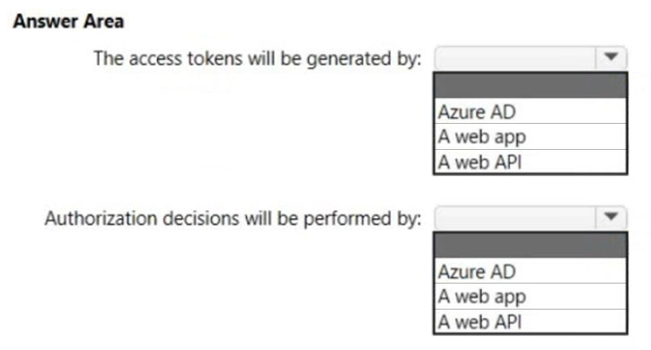

**Answer:**
Correct Answer:
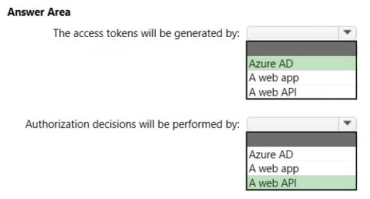

**Explication:**
- Box 1: Azure AD –
The Azure AD server issues tokens (access & refresh token). See step 5 below in graphic.
OAuth 2.0 authentication with Azure Active Directory.
The OAuth 2.0 is the industry protocol for authorization. It allows a user to grant limited access to its protected resources. Designed to work specifically with
Hypertext Transfer Protocol (HTTP), OAuth separates the role of the client from the resource owner. The client requests access to the resources controlled by the resource owner and hosted by the resource server (here the Azure AD server). The resource server issues access tokens with the approval of the resource owner. The client uses the access tokens to access the protected resources hosted by the resource server.
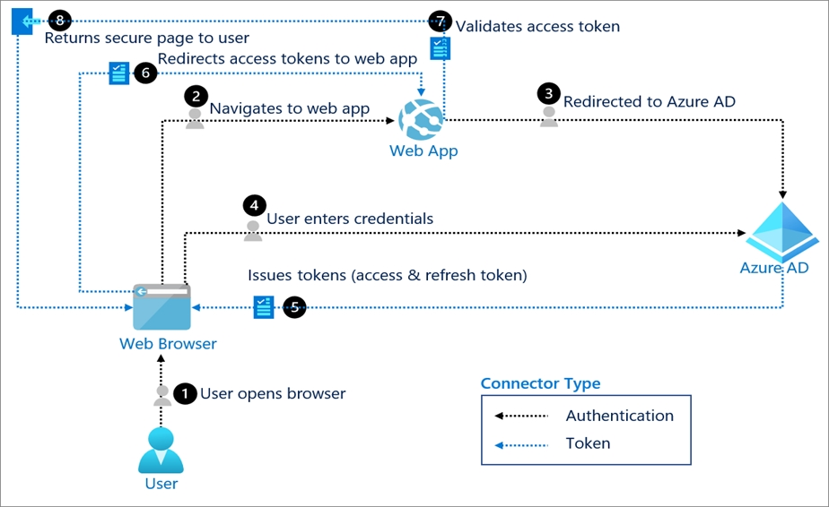
- Box 2: A web API –
Delegated access is used.
The bearer token sent to the web API contains the user identity.
The web API makes authorization decisions based on the user identity.

## Question Set 175

**Context:**
HOTSPOT –
You plan to create an Azure environment that will contain a root management group and 10 child management groups. Each child management group will contain five Azure subscriptions. You plan to have between 10 and 30 resource groups in each subscription.
You need to design an Azure governance solution. The solution must meet the following requirements:
- Use Azure Blueprints to control governance across all the subscriptions and resource groups.
- Ensure that Blueprints-based configurations are consistent across all the subscriptions and resource groups.
- Minimize the number of blueprint definitions and assignments.

**Question:**
What should you include in the solution? To answer, select the appropriate options in the answer area.
NOTE: Each correct selection is worth one point.
Hot Area:
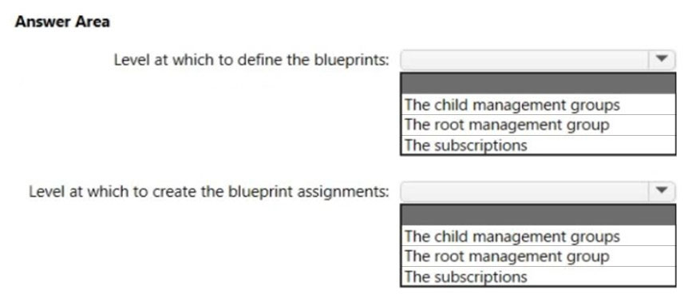

**Answer:**
Correct Answer:
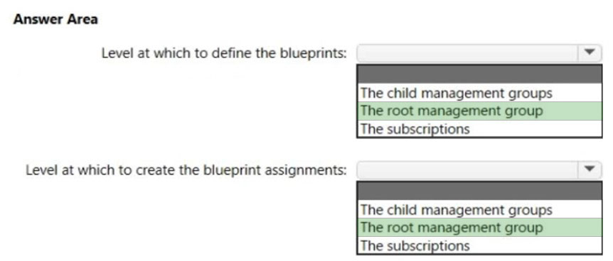

**Explication:**
Box 1. The root management group
When creating a blueprint definition, you’ll define where the blueprint is saved. Blueprints can be saved to a management group or subscription that you have
Contributor access to. If the location is a management group, the blueprint is available to assign to any child subscription of that management group.
The root management group is built into the hierarchy to have all management groups and subscriptions fold up to it. This root management group allows for global policies and Azure role assignments to be applied at the directory level.
Box 2. The root management group

## Question Set 176

**Context:**
DRAG DROP –
You are designing a virtual machine that will run Microsoft SQL Server and contain two data disks. The first data disk will store log files, and the second data disk will store data. Both disks are P40 managed disks.
You need to recommend a host caching method for each disk. The method must provide the best overall performance for the virtual machine while preserving the integrity of the SQL data and logs.

**Question:**
Which host caching method should you recommend for each disk? To answer, drag the appropriate methods to the correct disks. Each method may be used once, more than once, or not at all. You may need to drag the split bar between panes or scroll to view content.
NOTE: Each correct selection is worth one point.
Select and Place:
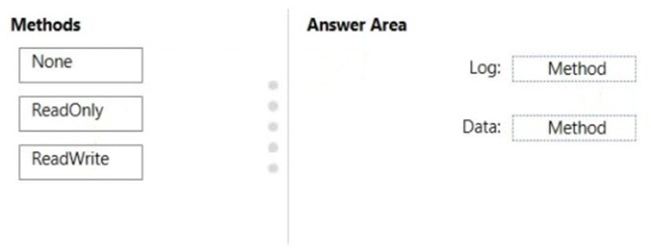

**Answer:**
Correct Answer:
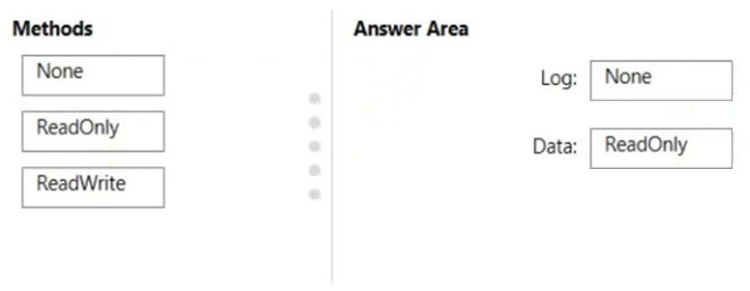

**Explication:**
- Box 1: None –
No data disk caching for the Log files.
- Box 2: ReadOnly –
Guidelines to optimize performance for your SQL Server on Azure Virtual Machines (VMs) include:
Set host caching to read-only for data file disks.
Set host caching to none for log file disks.

## Question Set 177

**Context:**
You are designing a solution that calculates 3D geometry from height-map data.
You need to recommend a solution that meets the following requirements:
- Performs calculations in Azure.
- Ensures that each node can communicate data to every other node.
- Maximizes the number of nodes to calculate multiple scenes as fast as possible.
Minimizes the amount of effort to implement the solution.

**Question:**
Which two actions should you include in the recommendation? Each correct answer presents part of the solution.
NOTE: Each correct selection is worth one point.
- A. Enable parallel file systems on Azure.
- B. Create a render farm that uses virtual machines.
- C. Create a render farm that uses virtual machine scale sets.
- D. Create a render farm that uses Azure Batch.
- E. Enable parallel task execution on compute nodes.

**Answer:**
Correct Answer: DE

**Explication:**
Multi-instance tasks allow you to run an Azure Batch task on multiple compute nodes simultaneously. These tasks enable high performance computing scenarios like Message Passing Interface (MPI) applications in Batch.
You configure compute nodes for parallel task execution at the pool level.
Azure Batch allows you to set task slots per node up to (4x) the number of node cores.

## Question Set 178

**Context:**
You have an on-premises application that consumes data from multiple databases. The application code references database tables by using a combination of the server, database, and table name.
You need to migrate the application data to Azure.

**Question:**
To which two services can you migrate the application data to achieve the goal? Each correct answer presents a complete solution.
NOTE: Each correct selection is worth one point.
- A. SQL Server Stretch Database
- B. SQL Server on an Azure virtual machine
- C. Azure SQL Database
- D. Azure SQL Managed Instance

**Answer:**
Correct Answer: BD

**Explication:**
Cross-database queries are supported by SQL Server, for example on an Azure virtual machine, and also supported by an Azure SQL Managed Instance.

## Question Set 179

**Context:**
HOTSPOT –
You plan to migrate on-premises Microsoft SQL Server databases to Azure.
You need to recommend a deployment and resiliency solution that meets the following requirements:
- Supports user-initiated backups
- Supports multiple automatically replicated instances across Azure regions
- Minimizes administrative effort to implement and maintain business continuity

**Question:**
What should you recommend? To answer, select the appropriate options in the answer area.
NOTE: Each correct selection is worth one point.
Hot Area:
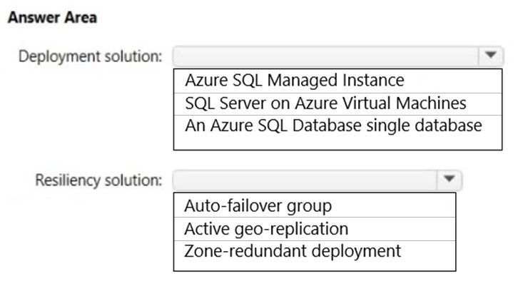

**Answer:**
Correct Answer:
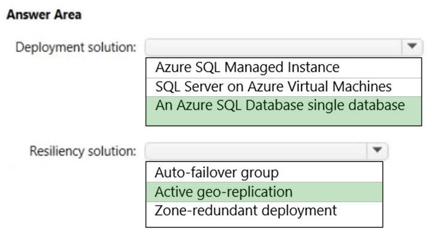

**Explication:**
- Box 1: an Azure SQL database –
Incorrect answers:
User imitated backups are not supported by Azure SQL Managed instance.
- Box 2: Active geo-replication –
Active geo-replication required to multiple automatically replicated instances across Azure regions.
You can manage Azure SQL Database security for geo-restore. SQL database cannot be used for geo-restore.
Incorrect:
Not SQL Server: Active geo-replication requires Azure SQL database.

## Question Set 180

**Context:**
You need to design a highly available Azure SQL database that meets the following requirements:
- Failover between replicas of the database must occur without any data loss.
- The database must remain available in the event of a zone outage.
- Costs must be minimized.

**Question:**
Which deployment option should you use?
- A. Azure SQL Managed Instance Business Critical
- B. Azure SQL Managed Instance General Purpose
- C. Azure SQL Database Business Critical
- D. Azure SQL Database Serverless

**Answer:**
Correct Answer: D

**Explication:**
Azure SQL Database Serverless meets the requirements and is less expensive than Azure SQL Database Business Critical.
Note: General Purpose service tier zone redundant availability.
Zone-redundant configuration for the general purpose service tier is offered for both serverless and provisioned compute.
This configuration utilizes Azure Availability Zones ג€‰to replicate databases across multiple physical locations within an Azure region.ג €‰By selecting zone-redundancy, you can make yourג €‰new and existing serverless and provisioned generalג €‰purpose single databases and elastic pools resilient to a much larger set of failures, including catastrophic datacenter outages, without any changes of the application logic.
Incorrect:
Not A, not B: Zone-redundant configuration is not available in SQL Managed Instance.
Not C: Azure SQL Database Business Critical is more expensive than Azure SQL Database Serverless.
Note: Premium and Business Critical service tiers use the Premium availability model, which integrates compute resources (sqlservr.exe process) and storage
(locally attached SSD) on a single node. High availability is achieved by replicating both compute and storage to additional nodes creating a three to four-node cluster.

## Question Set 181

**Context:**
You have an Azure web app that uses an Azure key vault named KeyVault1 in the West US Azure region.
You are designing a disaster recovery plan for KeyVault1.
You plan to back up the keys in KeyVault1.
You need to identify to where you can restore the backup.

**Question:**
What should you identify?
- A. any region worldwide
- B. the same region only
- C. KeyVault1 only
- D. the same geography only

**Answer:**
Correct Answer: D

**Explication:**
Using the backup and restore commands has two limitations:
* You can’t back up a key vault in one geography and restore it into another geography.
* The backup command backs up all versions of each secret.
Incorrect:
Not A: Azure Key Vault does not allow you to move a key vault from one region to another. You can, however, create a key vault in the new region, manually copy each individual key, secret, or certificate from your existing key vault to the new key vault, and then remove the original key vault.

## Question Set 182

**Context:**
You have an on-premises line-of-business (LOB) application that uses a Microsoft SQL Server instance as the backend.
You plan to migrate the on-premises SQL Server instance to Azure virtual machines.
You need to recommend a highly available SQL Server deployment that meets the following requirements:
- Minimizes costs
Minimizes failover time if a single server fails

**Question:**
What should you include in the recommendation?
- A. an Always On availability group that has premium storage disks and a virtual network name (VNN)
- B. an Always On Failover Cluster Instance that has a virtual network name (VNN) and a standard file share
- C. an Always On availability group that has premium storage disks and a distributed network name (DNN)
- D. an Always On Failover Cluster Instance that has a virtual network name (VNN) and a premium file share

**Answer:**
Correct Answer: C

**Explication:**
Always On availability groups on Azure Virtual Machines are similar to Always On availability groups on-premises, and rely on the underlying Windows Server
Failover Cluster.
If you deploy your SQL Server VMs to a single subnet, you can configure a virtual network name (VNN) and an Azure Load Balancer, or a distributed network name (DNN) to route traffic to your availability group listener.
There are some behavior differences between the functionality of the VNN listener and DNN listener that are important to note:
* Failover time: Failover time is faster when using a DNN listener since there is no need to wait for the network load balancer to detect the failure event and change its routing.
* Etc.
Incorrect:
Not B, not D: Migrate to an Always On availability group, not an Always on Failover cluster Instance.

## Question Set 183

**Context:**
Note: This question is part of a series of questions that present the same scenario. Each question in the series contains a unique solution that might meet the stated goals. Some question sets might have more than one correct solution, while others might not have a correct solution.
After you answer a question in this section, you will NOT be able to return to it. As a result, these questions will not appear in the review screen.
Your company plans to deploy various Azure App Service instances that will use Azure SQL databases. The App Service instances will be deployed at the same time as the Azure SQL databases.
The company has a regulatory requirement to deploy the App Service instances only to specific Azure regions. The resources for the App Service instances must reside in the same region.
You need to recommend a solution to meet the regulatory requirement.
Solution: You recommend creating resource groups based on locations and implementing resource locks on the resource groups.

**Question:**
Does this meet the goal?
- A. Yes
- B. No

**Answer:**
Correct Answer: B

**Explication:**
Instead; you should recommend using an Azure Policy initiative to enforce the location
Note: Azure Resource Policy Definitions can be used which can be applied to a specific Resource Group with the App Service instances.
In Azure Policy, we offer several built-in policies that are available by default. For example:
* Allowed Locations (Deny): Restricts the available locations for new resources. Its effect is used to enforce your geo-compliance requirements.

## Question Set 184

**Context:**
Note: This question is part of a series of questions that present the same scenario. Each question in the series contains a unique solution that might meet the stated goals. Some question sets might have more than one correct solution, while others might not have a correct solution.
After you answer a question in this section, you will NOT be able to return to it. As a result, these questions will not appear in the review screen.
Your company plans to deploy various Azure App Service instances that will use Azure SQL databases. The App Service instances will be deployed at the same time as the Azure SQL databases.
The company has a regulatory requirement to deploy the App Service instances only to specific Azure regions. The resources for the App Service instances must reside in the same region.
You need to recommend a solution to meet the regulatory requirement.
Solution: You recommend using the Regulatory compliance dashboard in Microsoft Defender for Cloud.

**Question:**
Does this meet the goal?
- A. Yes
- B. No

**Answer:**
Correct Answer: B

**Explication:**
Instead; you should recommend using an Azure Policy initiative to enforce the location
Note: Azure Resource Policy Definitions can be used which can be applied to a specific Resource Group with the App Service instances.
In Azure Policy, we offer several built-in policies that are available by default. For example:
* Allowed Locations (Deny): Restricts the available locations for new resources. Its effect is used to enforce your geo-compliance requirements.

## Question Set 185

**Context:**
Note: This question is part of a series of questions that present the same scenario. Each question in the series contains a unique solution that might meet the stated goals. Some question sets might have more than one correct solution, while others might not have a correct solution.
After you answer a question in this section, you will NOT be able to return to it. As a result, these questions will not appear in the review screen.
Your company plans to deploy various Azure App Service instances that will use Azure SQL databases. The App Service instances will be deployed at the same time as the Azure SQL databases.
The company has a regulatory requirement to deploy the App Service instances only to specific Azure regions. The resources for the App Service instances must reside in the same region.
You need to recommend a solution to meet the regulatory requirement.
Solution: You recommend using an Azure Policy initiative to enforce the location.

**Question:**
Does this meet the goal?
- A. Yes
- B. No

**Answer:**
Correct Answer: A

**Explication:**
Azure Resource Policy Definitions can be used which can be applied to a specific Resource Group with the App Service instances.
In Azure Policy, we offer several built-in policies that are available by default. For example:
* Allowed Locations (Deny): Restricts the available locations for new resources. Its effect is used to enforce your geo-compliance requirements.

## Question Set 186

**Context:**
You plan to move a web app named App1 from an on-premises datacenter to Azure.
App1 depends on a custom COM component that is installed on the host server.
You need to recommend a solution to host App1 in Azure. The solution must meet the following requirements:
- App1 must be available to users if an Azure datacenter becomes unavailable.
- Costs must be minimized.

**Question:**
What should you include in the recommendation?
- A. In two Azure regions, deploy a load balancer and a web app.
- B. In two Azure regions, deploy a load balancer and a virtual machine scale set.
- C. Deploy a load balancer and a virtual machine scale set across two availability zones.
- D. In two Azure regions, deploy an Azure Traffic Manager profile and a web app.

**Answer:**
Correct Answer: C

**Explication:**
Need to use a virtual machine as Azure App service does not allow COM components.
Need two availability zones to protect against an Azure datacenter failure.
Incorrect:
Not A, Not D: Cannot use a web app.
Azure App Service does not allow the registration of COM components on the platform. If your app makes use of any COM components, these need to be rewritten in managed code and deployed with the site or application.

## Question Set 187

**Context:**
You plan to deploy an application named App1 that will run in containers on Azure Kubernetes Service (AKS) clusters. The AKS clusters will be distributed across four Azure regions.
You need to recommend a storage solution to ensure that updated container images are replicated automatically to all the Azure regions hosting the AKS clusters.

**Question:**
Which storage solution should you recommend?
- A. geo-redundant storage (GRS) accounts
- B. Premium SKU Azure Container Registry
- C. Azure Content Delivery Network (CDN)
- D. Azure Cache for Redis

**Answer:**
Correct Answer: B

**Explication:**
Enable geo-replication for container images.
Best practice: Store your container images in Azure Container Registry and geo-replicate the registry to each AKS region.
To deploy and run your applications in AKS, you need a way to store and pull the container images. Container Registry integrates with AKS, so it can securely store your container images or Helm charts. Container Registry supports multimaster geo-replication to automatically replicate your images to Azure regions around the world.
Geo-replication is a feature of Premium SKU container registries.
Note:
When you use Container Registry geo-replication to pull images from the same region, the results are:
Faster: You pull images from high-speed, low-latency network connections within the same Azure region.
More reliable: If a region is unavailable, your AKS cluster pulls the images from an available container registry.
Cheaper: There’s no network egress charge between datacenters.

## Question Set 188

**Context:**
You have an Azure Active Directory (Azure AD) tenant.
You plan to deploy Azure Cosmos DB databases that will use the SQL API.
You need to recommend a solution to provide specific Azure AD user accounts with read access to the Cosmos DB databases.

**Question:**
What should you include in the recommendation?
- A. shared access signatures (SAS) and Conditional Access policies
- B. certificates and Azure Key Vault
- C. master keys and Azure Information Protection policies
- D. a resource token and an Access control (IAM) role assignment

**Answer:**
Correct Answer: D

**Explication:**
The Access control (IAM) pane in the Azure portal is used to configure role-based access control on Azure Cosmos resources. The roles are applied to users, groups, service principals, and managed identities in Active Directory. You can use built-in roles or custom roles for individuals and groups. The following screenshot shows Active Directory integration (RBAC) using access control (IAM) in the Azure portal:
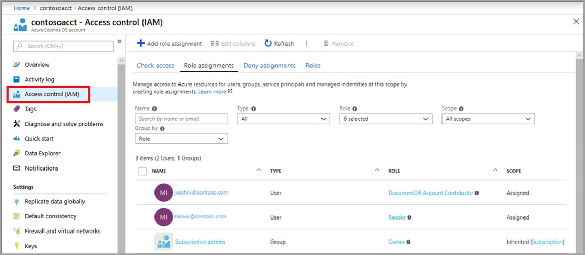
Note: To use the Azure Cosmos DB RBAC in your application, you have to update the way you initialize the Azure Cosmos DB SDK. Instead of passing your account’s primary key, you have to pass an instance of a TokenCredential class. This instance provides the Azure Cosmos DB SDK with the context required to fetch an Azure AD (AAD) token on behalf of the identity you wish to use.
D (100%

## Question Set 189

**Context:**
You need to recommend an Azure Storage solution that meets the following requirements:
- The storage must support 1 PB of data.
- The data must be stored in blob storage.
- The storage must support three levels of subfolders.
- The storage must support access control lists (ACLs).

**Question:**
What should you include in the recommendation?
- A. a premium storage account that is configured for block blobs
- B. a general purpose v2 storage account that has hierarchical namespace enabled
- C. a premium storage account that is configured for page blobs
- D. a premium storage account that is configured for file shares and supports large file shares

**Answer:**
Correct Answer: B

**Explication:**
Default limits for Azure general-purpose v2 (GPv2), general-purpose v1 (GPv1), and Blob storage accounts include:
* Default maximum storage account capacity: 5 PiB
Blob storage supports Azure Data Lake Storage Gen2, Microsoft’s enterprise big data analytics solution for the cloud. Azure Data Lake Storage Gen2 offers a hierarchical file system as well as the advantages of Blob storage.
Blob storage supports Azure Data Lake Storage Gen2, Microsoft’s enterprise big data analytics solution for the cloud. Azure Data Lake Storage Gen2 offers a hierarchical file system as well as the advantages of Blob storage
Incorrect:
Not D: In a Premium FileStorage account, storage size is limited to 100 TB.

## Question Set 190

**Context:**
HOTSPOT –
You manage a database environment for a Microsoft Volume Licensing customer named Contoso, Ltd. Contoso uses License Mobility through Software
Assurance.
You need to deploy 50 databases. The solution must meet the following requirements:
- Support automatic scaling.
- Minimize Microsoft SQL Server licensing costs.

**Question:**
What should you include in the solution? To answer, select the appropriate options in the answer area.
NOTE: Each correct selection is worth one point.
Hot Area:
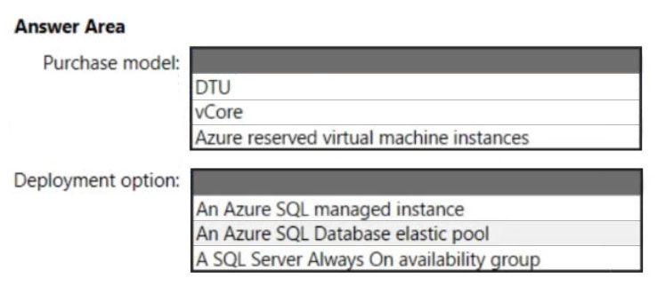

**Answer:**
Correct Answer:
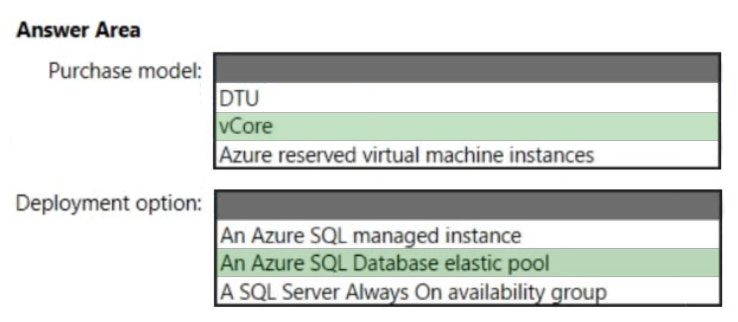

**Explication:**
- Box 1: vCore –
You can only apply the Azure Hybrid licensing model when you choose a vCore -based purchasing model and the provisioned compute tier for your Azure SQL
Database. Azure Hybrid Benefit isn’t available for service tiers under the DTU-based purchasing model or for the serverless compute tier.
- Box 2: An Azure SQL Database elastic pool
Azure SQL Database elastic pools are a simple, cost-effective solution for managing and scaling multiple databases that have varying and unpredictable usage demands. The databases in an elastic pool are on a single server and share a set number of resources at a set price. Elastic pools in SQL Database enable software as a service (SaaS) developers to optimize the price performance for a group of databases within a prescribed budget while delivering performance elasticity for each database.

## Question Set 191

**Context:**
You have an on-premises application named App1 that uses an Oracle database.
You plan to use Azure Databricks to transform and load data from App1 to an Azure Synapse Analytics instance.
You need to ensure that the App1 data is available to Databricks.

**Question:**
Which two Azure services should you include in the solution? Each correct answer presents part of the solution.
NOTE: Each correct selection is worth one point.
- A. Azure Data Box Gateway
- B. Azure Import/Export service
- C. Azure Data Lake Storage
- D. Azure Data Box Edge
- E. Azure Data Factory

**Answer:**
Correct Answer: BE

**Explication:**
Data Factory is a data integration service that provides a low-code or no-code approach to construct extract, transform, and load (ETL) processes within a visual environment or by writing your own code.
Exporting data, either to another data technology or to another Dataverse environment, can use any of the same technologies for importing data, such as dataflows, Data Factory, Power Query, and Power Automate.

## Question Set 192

**Context:**
HOTSPOT –
You are designing a cost-optimized solution that uses Azure Batch to run two types of jobs on Linux nodes. The first job type will consist of short-running tasks for a development environment. The second job type will consist of long-running Message Passing Interface (MPI) applications for a production environment that requires timely job completion.
You need to recommend the pool type and node type for each job type. The solution must minimize compute charges and leverage Azure Hybrid Benefit whenever possible.

**Question:**
What should you recommend? To answer, select the appropriate options in the answer area.
NOTE: Each correct selection is worth one point.
Hot Area:
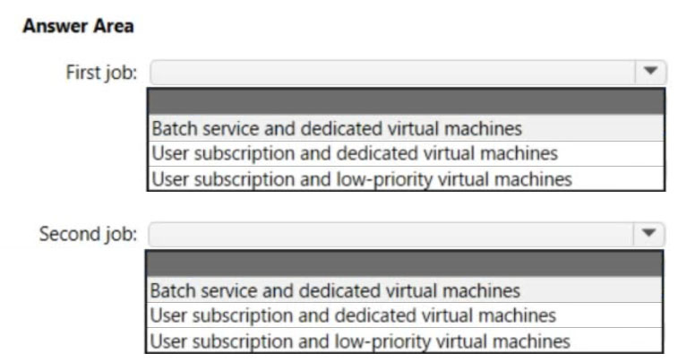

**Answer:**
Correct Answer:
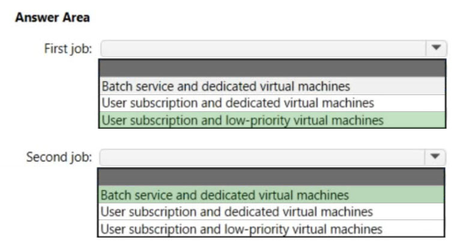

**Explication:**
- Box 1: User subscription and low-priority virtual machines
The first job type will consist of short-running tasks for a development environment.
Among the many ways to purchase and consume Azure resources are Azure low priority VMs and Spot VMs. These virtual machines are compute instances allocated from spare capacity, offered at a highly discounted rate compared to ג€on demandג € VMs. This means they can be a great option for cost savings ג€” for the right workloads
- Box 2: Batch service and dedicate virtual machines
The second job type will consist of long-running Message Passing Interface (MPI) applications for a production environment that requires timely job completion.
Azure Batch Service is a cloud based job scheduling and compute management platform that enables running large-scale parallel and high performance computing applications efficiently in the cloud. Azure Batch Service provides job scheduling and in automatically scaling and managing virtual machines running those jobs.

## Question Set 193

**Context:**
You are developing a sales application that will contain several Azure cloud services and handle different components of a transaction. Different cloud services will process customer orders, billing, payment, inventory, and shipping.
You need to recommend a solution to enable the cloud services to asynchronously communicate transaction information by using XML messages.

**Question:**
What should you include in the recommendation?
- A. Azure Notification Hubs
- B. Azure Service Fabric
- C. Azure Queue Storage
- D. Azure Data Lake

**Answer:**
Correct Answer: C

**Explication:**
Queue Storage delivers asynchronous messaging between application components, whether they are running in the cloud, on the desktop, on an on-premises server, or on a mobile device.
The maximum message size supported by Azure Storage Queues is 64KB while Azure Service Bus Queues support messages up to 256KB. This becomes an important factor especially when the message format is padded (such as XML).
8%

## Question Set 194

**Context:**
You are developing a sales application that will contain several Azure cloud services and handle different components of a transaction. Different cloud services will process customer orders, billing, payment, inventory, and shipping.
You need to recommend a solution to enable the cloud services to asynchronously communicate transaction information by using XML messages.

**Question:**
What should you include in the recommendation?
- A. Azure Notification Hubs
- B. Azure Service Fabric
- C. Azure Queue Storage
- D. Azure Application Gateway

**Answer:**
Correct Answer: C

**Explication:**
Queue storage is often used to create a backlog of work to process asynchronously.
A queue message must be in a format compatible with an XML request using UTF-8 encoding.

## Question Set 195

**Context:**
You need to design a highly available Azure SQL database that meets the following requirements:
• Failover between replicas of the database must occur without any data loss.
• The database must remain available in the event of a zone outage.
• Costs must be minimized.

**Question:**
Which deployment option should you use?
- A. Azure SQL Database Hyperscale
- B. Azure SQL Database Premium
- C. Azure SQL Database Basic
- D. Azure SQL Database Standard

**Answer:**
Correct Answer: B

**Explication:**
N/A

## Question Set 196

**Context:**
You are developing a sales application that will contain several Azure cloud services and handle different components of a transaction. Different cloud services will process customer orders, billing, payment, inventory, and shipping.
You need to recommend a solution to enable the cloud services to asynchronously communicate transaction information by using XML messages.

**Question:**
What should you include in the recommendation?
- A. Azure Service Bus
- B. Azure Data Lake
- C. Azure Traffic Manager
- D. Azure Blob Storage

**Answer:**
Correct Answer: A

**Explication:**
N/A

## Question Set 197

**Context:**
You need to design a highly available Azure SQL database that meets the following requirements:
• Failover between replicas of the database must occur without any data loss.
• The database must remain available in the event of a zone outage.
• Costs must be minimized.

**Question:**
Which deployment option should you use?
- A. Azure SQL Database Basic
- B. Azure SQL Managed Instance General Purpose
- C. Azure SQL Database Business Critical
- D. Azure SQL Managed Instance Business Critical

**Answer:**
Correct Answer: C

**Explication:**
N/A

## Question Set 198

**Context:**
You have an Azure subscription.
You need to deploy an Azure Kubernetes Service (AKS) solution that will use Windows Server 2019 nodes. The solution must meet the following requirements:
• Minimize the time it takes to provision compute resources during scale-out operations.
• Support autoscaling of Windows Server containers.

**Question:**
Which scaling option should you recommend?
- A. horizontal pod autoscaler
- B. Virtual nodes
- C. Kubernetes version 1.20.2 or newer
- D. cluster autoscaler

**Answer:**
Correct Answer: D

**Explication:**
N/A

## Question Set 199

**Context:**
You are developing a sales application that will contain several Azure cloud services and handle different components of a transaction. Different cloud services will process customer orders, billing, payment, inventory, and shipping.
You need to recommend a solution to enable the cloud services to asynchronously communicate transaction information by using XML messages.

**Question:**
What should you include in the recommendation?
- A. Azure Service Fabric
- B. Azure Data Lake
- C. Azure Service Bus
- D. Azure Application Gateway

**Answer:**
Correct Answer: C

**Explication:**
N/A

## Question Set 200

**Context:**
Your company has offices in North America and Europe.
You plan to migrate to Azure.
You need to recommend a networking solution for the new Azure infrastructure. The solution must meet the following requirements:
• The Point-to-Site (P2S) VPN connections of mobile users must connect automatically to the closest Azure region.
• The offices in each region must connect to their local Azure region by using an ExpressRoute circuit.
• Transitive routing between virtual networks and on-premises networks must be supported.
• The network traffic between virtual networks must be filtered by using FQDNs.

**Question:**
What should you include in the recommendation?
- A. Azure Virtual WAN with a secured virtual hub
- B. virtual network peering and application security groups
- C. virtual network gateways and network security groups (NSGs)
- D. Azure Route Server and Azure Network Function Manager

**Answer:**
Correct Answer: C

**Explication:**
N/A

## Question Set 201

**Context:**
You need to design a highly available Azure SQL database that meets the following requirements:
• Failover between replicas of the database must occur without any data loss.
• The database must remain available in the event of a zone outage.
• Costs must be minimized.

**Question:**
Which deployment option should you use?
- A. Azure SQL Database Business Critical
- B. Azure SQL Managed Instance Business Critical
- C. Azure SQL Database Standard
- D. Azure SQL Managed Instance General Purpose

**Answer:**
Correct Answer: A

**Explication:**
N/A

## Question Set 202

**Context:**
You are designing a point of sale (POS) solution that will be deployed across multiple locations and will use an Azure Databricks workspace in the Standard tier. The solution will include multiple apps deployed to the on-premises network of each location.
You need to configure the authentication method that will be used by the app to access the workspace. The solution must minimize the administrative effort associated with staff turnover and credential management.

**Question:**
What should you configure?
- A. a managed identity
- B. a service principal
- C. a personal access token

**Answer:**
Correct Answer: B

**Explication:**
N/A

## Question Set 203

**Context:**
HOTSPOT
–
You have two Azure AD tenants named contoso.com and fabrikam.com. Each tenant is linked to 50 Azure subscriptions. Contoso.com contains two users named User1 and User2.
You need to meet the following requirements:
• Ensure that User1 can change the Azure AD tenant linked to specific Azure subscriptions.
• If an Azure subscription is liked to a new Azure AD tenant, and no available Azure AD accounts have full subscription-level permissions to the subscription, elevate the access of User2 to the subscription.
The solution must use the principle of least privilege.

**Question:**
Which role should you assign to each user? To answer, select the appropriate options in the answer area.
NOTE: Each correct selection is worth one point.
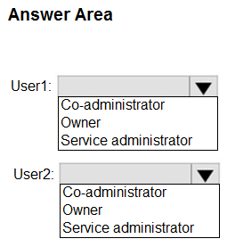

**Answer:**
Correct Answer:
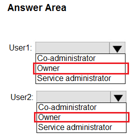

**Explication:**
N/A

## Question Set 204

**Context:**
Your company has the divisions shown in the following table.

Sub1 contains an Azure App Service web app named App1. App1 uses Azure AD for single-tenant user authentication. Users from contoso.com can authenticate to App1.
You need to recommend a solution to enable users in the fabrikam.com tenant to authenticate to App1.

**Question:**
What should you recommend?
- A. Configure a Conditional Access policy.
- B. Use Azure AD entitlement management to govern external users.
- C. Configure the Azure AD provisioning service.
- D. Configure Azure AD Identity Protection.

**Answer:**
Correct Answer: C

**Explication:**
N/A

## Question Set 205

**Context:**
You have a multi-tier app named App1 and an Azure SQL database named SQL1. The backend service of App1 writes data to SQL1. Users use the App1 client to read the data from SQL1.
During periods of high utilization, the users experience delays retrieving the data.
You need to minimize how long it takes for data requests.

**Question:**
What should you include in the solution?
- A. Azure Cache for Redis
- B. Azure Content Delivery Network (CDN)
- C. Azure Data Factory
- D. Azure Synapse Analytics

**Answer:**
Correct Answer: A

**Explication:**
N/A

## Question Set 206

**Context:**
You have an Azure subscription that contains the resources shown in the following table.
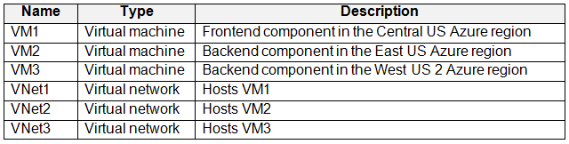
You create peering between VNet1 and VNet2 and between VNet1 and VNet3.
The virtual machines host an HTTPS-based client/server application and are accessible only via the private IP address of each virtual machine.
You need to implement a load balancing solution for VM2 and VM3. The solution must ensure that if VM2 fails, requests will be routed automatically to VM3, and if VM3 fails, requests will be routed automatically to VM2.

**Question:**
What should you include in the solution?
- A. Azure Firewall Premium
- B. Azure Application Gateway v2
- C. a cross-region load balancer
- D. Azure Front Door Premium

**Answer:**
Correct Answer: D

**Explication:**
N/A

## Question Set 207

**Context:**
You are designing an app that will include two components. The components will communicate by sending messages via a queue.
You need to recommend a solution to process the messages by using a First in, First out (FIFO) pattern.

**Question:**
What should you include in the recommendation?
- A. storage queues with a custom metadata setting
- B. Azure Service Bus queues with partitioning enabled
- C. Azure Service Bus queues with sessions enabled
- D. storage queues with a stored access policy

**Answer:**
Correct Answer: C

**Explication:**
N/A

## Question Set 208

**Context:**
HOTSPOT
–
You need to deploy an instance of SQL Server on Azure Virtual Machines. The solution must meet the following requirements:
• Support 15,000 disk IOPS.
• Support SR-IOV.
• Minimize costs.

**Question:**
What should you include in the solution? To answer, select the appropriate options in the answer area.
NOTE: Each correct selection is worth one point.
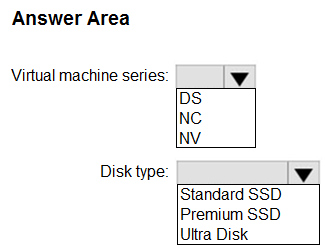

**Answer:**
Correct Answer:
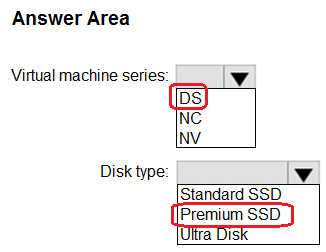

**Explication:**
N/A

## Question Set 209

**Context:**
You are developing an app that will use Azure Functions to process Azure Event Hubs events. Request processing is estimated to take between five and 20 minutes.
You need to recommend a hosting solution that meets the following requirements:
• Supports estimates of request processing runtimes
• Supports event-driven autoscaling for the app

**Question:**
Which hosting plan should you recommend?
- A. Dedicated
- B. Consumption
- C. App Service
- D. Premium

**Answer:**
Correct Answer: D

**Explication:**
N/A

## Question Set 210

**Context:**
You are developing a sales application that will contain several Azure cloud services and handle different components of a transaction. Different cloud services will process customer orders, billing, payment, inventory, and shipping.
You need to recommend a solution to enable the cloud services to asynchronously communicate transaction information by using XML messages.

**Question:**
What should you include in the recommendation?
- A. Azure Notification Hubs
- B. Azure Application Gateway
- C. Azure Service Bus
- D. Azure Traffic Manager

**Answer:**
Correct Answer: C

**Explication:**
N/A

## Question Set 211

**Context:**
You are developing a sales application that will contain several Azure cloud services and handle different components of a transaction. Different cloud services will process customer orders, billing, payment, inventory, and shipping.
You need to recommend a solution to enable the cloud services to asynchronously communicate transaction information by using XML messages.

**Question:**
What should you include in the recommendation?
- A. Azure Notification Hubs
- B. Azure Application Gateway
- C. Azure Queue Storage
- D. Azure Traffic Manager

**Answer:**
Correct Answer: C

**Explication:**
N/A

## Question Set 212

**Context:**
You need to design a highly available Azure SQL database that meets the following requirements:
• Failover between replicas of the database must occur without any data loss.
• The database must remain available in the event of a zone outage.
• Costs must be minimized.

**Question:**
Which deployment option should you use?
- A. Azure SQL Database Basic
- B. Azure SQL Database Business Critical
- C. Azure SQL Database Standard
- D. Azure SQL Managed Instance General Purpose

**Answer:**
Correct Answer: B

**Explication:**
13%

## Question Set 213

**Context:**
You need to design a highly available Azure SQL database that meets the following requirements:
• Failover between replicas of the database must occur without any data loss.
• The database must remain available in the event of a zone outage.
• Costs must be minimized.

**Question:**
Which deployment option should you use?
- A. Azure SQL Database Hyperscale
- B. Azure SQL Database Premium
- C. Azure SQL Database Standard
- D. Azure SQL Managed Instance General Purpose

**Answer:**
Correct Answer: B

**Explication:**
N/A

## Question Set 214

**Context:**
HOTSPOT
–
You company has offices in New York City, Sydney, Paris, and Johannesburg.
The company has an Azure subscription.
You plan to deploy a new Azure networking solution that meets the following requirements:
• Connects to ExpressRoute circuits in the Azure regions of East US, Southeast Asia, North Europe, and South Africa
• Minimizes latency by supporting connection in three regions
• Supports Site-to-site VPN connections
• Minimizes costs
You need to identify the minimum number of Azure Virtual WAN hubs that you must deploy, and which virtual WAN SKU to use.

**Question:**
What should you identify? To answer, select the appropriate options in the answer area.
NOTE: Each correct selection is worth one point.
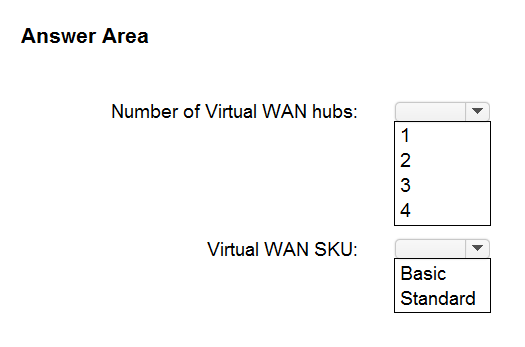

**Answer:**
Correct Answer:
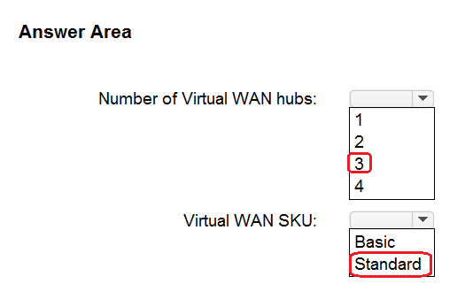

**Explication:**
N/A

## Question Set 215

**Context:**
You have an Azure Functions microservice app named App1 that is hosted in the Consumption plan. App1 uses an Azure Queue Storage trigger.
You plan to migrate App1 to an Azure Kubernetes Service (AKS) cluster.
You need to prepare the AKS cluster to support App1. The solution must meet the following requirements:
• Use the same scaling mechanism as the current deployment.
• Support kubenet and Azure Container Networking Interface (CNI) networking.

**Question:**
Which two actions should you perform? Each correct answer presents part of the solution.
NOTE: Each correct answer is worth one point.
- A. Configure the horizontal pod autoscaler .
- B. Install Virtual Kubelet .
- C. Configure the AKS cluster autoscaler .
- D. Configure the virtual node add-on.
- E. Install Kubernetes-based Event Driven Autoscaling (KEDA).

**Answer:**
Correct Answer: AE

**Explication:**
6%

## Question Set 216

**Context:**
You are developing a sales application that will contain several Azure cloud services and handle different components of a transaction. Different cloud services will process customer orders, billing, payment, inventory, and shipping.
You need to recommend a solution to enable the cloud services to asynchronously communicate transaction information by using XML messages.

**Question:**
What should you include in the recommendation?
- A. Azure Application Gateway
- B. Azure Queue Storage
- C. Azure Data Lake
- D. Azure Traffic Manager

**Answer:**
Correct Answer: B

**Explication:**
N/A

## Question Set 217

**Context:**
You need to design a highly available Azure SQL database that meets the following requirements:
• Failover between replicas of the database must occur without any data loss.
• The database must remain available in the event of a zone outage.
• Costs must be minimized.

**Question:**
Which deployment option should you use?
- A. Azure SQL Managed Instance General Purpose
- B. Azure SQL Database Hyperscale
- C. Azure SQL Database Premium
- D. Azure SQL Managed Instance Business Critical

**Answer:**
Correct Answer: C

**Explication:**
N/A

## Question Set 218

**Context:**
You need to design a highly available Azure SQL database that meets the following requirements:
• Failover between replicas of the database must occur without any data loss.
• The database must remain available in the event of a zone outage.
• Costs must be minimized.

**Question:**
Which deployment option should you use?
- A. Azure SQL Database Hyperscale
- B. Azure SQL Database Premium
- C. Azure SQL Database Basic
- D. Azure SQL Database Serverless

**Answer:**
Correct Answer: B

**Explication:**
N/A

## Question Set 219

**Context:**
You are developing a sales application that will contain several Azure cloud services and handle different components of a transaction. Different cloud services will process customer orders, billing, payment, inventory, and shipping.
You need to recommend a solution to enable the cloud services to asynchronously communicate transaction information by using XML messages.

**Question:**
What should you include in the recommendation?
- A. Azure Notification Hubs
- B. Azure Service Bus
- C. Azure Blob Storage
- D. Azure Service Fabric

**Answer:**
Correct Answer: B

**Explication:**
N/A

## Question Set 220

**Context:**
You are developing a sales application that will contain several Azure cloud services and handle different components of a transaction. Different cloud services will process customer orders, billing, payment, inventory, and shipping.
You need to recommend a solution to enable the cloud services to asynchronously communicate transaction information by using XML messages.

**Question:**
What should you include in the recommendation?
- A. Azure Service Fabric
- B. Azure Traffic Manager
- C. Azure Queue Storage
- D. Azure Notification Hubs

**Answer:**
Correct Answer: C

**Explication:**
N/A

## Question Set 221

**Context:**
You have an on-premises Microsoft SQL Server 2008 instance that hosts a 50-GB database.
You need to migrate the database to an Azure SQL managed instance. The solution must minimize downtime.

**Question:**
What should you use?
- A. Azure Migrate
- B. Azure Data Studio
- C. WANdisco LiveData Platform for Azure
- D. SQL Server Management Studio (SSMS)

**Answer:**
Correct Answer: B

**Explication:**
N/A

## Question Set 222

**Context:**
You need to design a highly available Azure SQL database that meets the following requirements:
• Failover between replicas of the database must occur without any data loss.
• The database must remain available in the event of a zone outage.
• Costs must be minimized.

**Question:**
Which deployment option should you use?
- A. Azure SQL Managed Instance Business Critical
- B. Azure SQL Managed Instance General Purpose
- C. Azure SQL Database Standard
- D. Azure SQL Database Premium

**Answer:**
Correct Answer: D

**Explication:**
N/A

## Question Set 223

**Context:**
You need to design a highly available Azure SQL database that meets the following requirements:
• Failover between replicas of the database must occur without any data loss.
• The database must remain available in the event of a zone outage.
• Costs must be minimized.

**Question:**
Which deployment option should you use?
- A. Azure SQL Database Business Critical
- B. Azure SQL Database Basic
- C. Azure SQL Managed Instance General Purpose
- D. Azure SQL Database Hyperscale

**Answer:**
Correct Answer: A

**Explication:**
N/A

## Question Set 224

**Context:**
You are developing a sales application that will contain several Azure cloud services and handle different components of a transaction. Different cloud services will process customer orders, billing, payment, inventory, and shipping.
You need to recommend a solution to enable the cloud services to asynchronously communicate transaction information by using XML messages.

**Question:**
What should you include in the recommendation?
- A. Azure Service Fabric
- B. Azure Queue Storage
- C. Azure Traffic Manager
- D. Azure Application Gateway

**Answer:**
Correct Answer: B

**Explication:**
N/A

## Question Set 225

**Context:**
You are developing a sales application that will contain several Azure cloud services and handle different components of a transaction. Different cloud services will process customer orders, billing, payment, inventory, and shipping.
You need to recommend a solution to enable the cloud services to asynchronously communicate transaction information by using XML messages.

**Question:**
What should you include in the recommendation?
- A. Azure Application Gateway
- B. Azure Data Lake
- C. Azure Queue Storage
- D. Azure Blob Storage

**Answer:**
Correct Answer: C

**Explication:**
N/A

## Question Set 226

**Context:**
You are developing a sales application that will contain several Azure cloud services and handle different components of a transaction. Different cloud services will process customer orders, billing, payment, inventory, and shipping.
You need to recommend a solution to enable the cloud services to asynchronously communicate transaction information by using XML messages.

**Question:**
What should you include in the recommendation?
- A. Azure Blob Storage
- B. Azure Data Lake
- C. Azure Queue Storage
- D. Azure Service Fabric

**Answer:**
Correct Answer: C

**Explication:**
N/A

## Question Set 227

**Context:**
You need to design a highly available Azure SQL database that meets the following requirements:
• Failover between replicas of the database must occur without any data loss.
• The database must remain available in the event of a zone outage.
• Costs must be minimized.

**Question:**
Which deployment option should you use?
- A. Azure SQL Database Serverless
- B. Azure SQL Managed Instance General Purpose
- C. Azure SQL Database Basic
- D. Azure SQL Database Business Critical

**Answer:**
Correct Answer: A

**Explication:**
N/A

## Question Set 228

**Context:**
You need to design a highly available Azure SQL database that meets the following requirements:
• Failover between replicas of the database must occur without any data loss.
• The database must remain available in the event of a zone outage.
• Costs must be minimized.

**Question:**
Which deployment option should you use?
- A. Azure SQL Database Standard
- B. Azure SQL Managed Instance General Purpose
- C. Azure SQL Database Serverless
- D. Azure SQL Database Premium

**Answer:**
Correct Answer: D

**Explication:**
N/A

## Question Set 229

**Context:**
You are developing a sales application that will contain several Azure cloud services and handle different components of a transaction. Different cloud services will process customer orders, billing, payment, inventory, and shipping.
You need to recommend a solution to enable the cloud services to asynchronously communicate transaction information by using XML messages.

**Question:**
What should you include in the recommendation?
- A. Azure Notification Hubs
- B. Azure Queue Storage
- C. Azure Blob Storage
- D. Azure Application Gateway

**Answer:**
Correct Answer: B

**Explication:**
N/A

## Question Set 230

**Context:**
HOTSPOT
–
You are developing a multi-tier app named App1 that will be hosted on Azure virtual machines. The peak utilization periods for App1 will be from 8 AM to 9 AM and 4 PM to 5 PM on weekdays.
You need to deploy the infrastructure for App1. The solution must meet the following requirements:
• Support virtual machines deployed to four availability zones across two Azure regions.
• Minimize costs by accumulating CPU credits during periods of low utilization.

**Question:**
What is the minimum number of virtual networks you should deploy, and which virtual machine size should you use? To answer, select the appropriate options in the answer area.
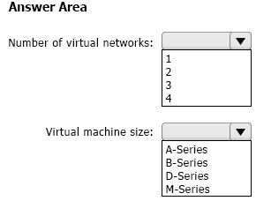

**Answer:**
Correct Answer:
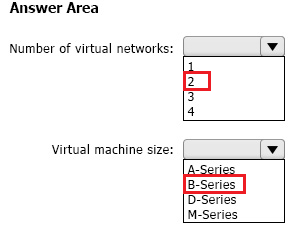

**Explication:**
N/A

## Question Set 231

**Context:**
You are developing a sales application that will contain several Azure cloud services and handle different components of a transaction. Different cloud services will process customer orders, billing, payment, inventory, and shipping.
You need to recommend a solution to enable the cloud services to asynchronously communicate transaction information by using XML messages.

**Question:**
What should you include in the recommendation?
- A. Azure Service Bus
- B. Azure Blob Storage
- C. Azure Notification Hubs
- D. Azure Application Gateway

**Answer:**
Correct Answer: A

**Explication:**
N/A

## Question Set 232

**Context:**
You have an on-premises Microsoft SQL server named SQL1 that hosts 50 databases.
You plan to migrate SQL1 to Azure SQL Managed Instance.
You need to perform an offline migration of SQL1. The solution must minimize administrative effort.

**Question:**
What should you include in the solution?
- A. Azure Migrate
- B. Azure Database Migration Service
- C. SQL Server Migration Assistant (SSMA)
- D. Data Migration Assistant (DMA)

**Answer:**
Correct Answer: B

**Explication:**
N/A

## Question Set 233

**Context:**
You are developing a sales application that will contain several Azure cloud services and handle different components of a transaction. Different cloud services will process customer orders, billing, payment, inventory, and shipping.
You need to recommend a solution to enable the cloud services to asynchronously communicate transaction information by using XML messages.

**Question:**
What should you include in the recommendation?
- A. Azure Service Bus
- B. Azure Data Lake
- C. Azure Traffic Manager
- D. Azure Notification Hubs

**Answer:**
Correct Answer: A

**Explication:**
N/A

## Question Set 234

**Context:**
You are developing a sales application that will contain several Azure cloud services and handle different components of a transaction. Different cloud services will process customer orders, billing, payment, inventory, and shipping.
You need to recommend a solution to enable the cloud services to asynchronously communicate transaction information by using XML messages.

**Question:**
What should you include in the recommendation?
- A. Azure Service Bus
- B. Azure Data Lake
- C. Azure Application Gateway
- D. Azure Notification Hubs

**Answer:**
Correct Answer: A

**Explication:**
N/A

## Question Set 235

**Context:**
You need to design a highly available Azure SQL database that meets the following requirements:
• Failover between replicas of the database must occur without any data loss.
• The database must remain available in the event of a zone outage.
• Costs must be minimized.

**Question:**
Which deployment option should you use?
- A. Azure SQL Database Business Critical
- B. Azure SQL Database Hyperscale
- C. Azure SQL Managed Instance Business Critical
- D. Azure SQL Database Standard

**Answer:**
Correct Answer: A

**Explication:**
N/A

## Question Set 236

**Context:**
DRAG DROP
–
You plan to deploy an infrastructure solution that will contain the following configurations:
• External users will access the infrastructure by using Azure Front Door.
• External user access to the backend APIs hosted in Azure Kubernetes Service (AKS) will be controlled by using Azure API Management.
• External users will be authenticated by an Azure AD B2C tenant that uses OpenID Connect-based federation with a third-party identity provider.

**Question:**
Which function does each service provide? To answer, drag the appropriate functions to the correct services. Each function may be used once, more than once, or not at all. You may need to drag the split bar between panes or scroll to view content.
NOTE: Each correct selection is worth one point.
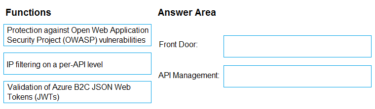

**Answer:**
Correct Answer:
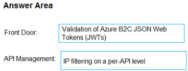

**Explication:**
N/A

## Question Set 237

**Context:**
Note: This question is part of a series of questions that present the same scenario. Each question in the series contains a unique solution that might meet the stated goals. Some question sets might have more than one correct solution, while others might not have a correct solution.
After you answer a question in this section, you will NOT be able to return to it. As a result, these questions will not appear in the review screen.
Your company plans to deploy various Azure App Service instances that will use Azure SQL databases. The App Service instances will be deployed at the same time as the Azure SQL databases.
The company has a regulatory requirement to deploy the App Service instances only to specific Azure regions. The resources for the App Service instances must reside in the same region.
You need to recommend a solution to meet the regulatory requirement.
Solution: You recommend using an Azure Policy initiative to enforce the location of resource groups.

**Question:**
Does this meet the goal?
- A. Yes
- B. No

**Answer:**
Correct Answer: A

**Explication:**
N/A

## Question Set 238

**Context:**
Your on-premises datacenter contains a server that runs Linux and hosts a Java app named App1. App1 has the following characteristics:
• App1 is an interactive app that users access by using HTTPS connections.
• The number of connections to App1 changes significantly throughout the day.
• App1 runs multiple concurrent instances.
• App1 requires major changes to run in a container.
You plan to migrate App1 to Azure.
You need to recommend a compute solution for App1. The solution must meet the following requirements:
• The solution must run multiple instances of App1.
• The number of instances must be managed automatically depending on the load.
• Administrative effort must be minimized.

**Question:**
What should you include in the recommendation?
- A. Azure Batch
- B. Azure App Service
- C. Azure Kubernetes Service (AKS)
- D. Azure Virtual Machine Scale Sets

**Answer:**
Correct Answer: D

**Explication:**
N/A

## Question Set 239

**Context:**
HOTSPOT
–
You have an Azure App Service web app named Webapp1 that connects to an Azure SQL database named DB1. Webapp1 and DB1 are deployed to the East US Azure region.
You need to ensure that all the traffic between Webapp1 and DB1 is sent via a private connection.

**Question:**
What should you do? To answer, select the appropriate options in the answer area.
NOTE: Each correct selection is worth one point.
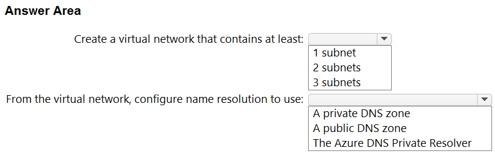

**Answer:**
Correct Answer:
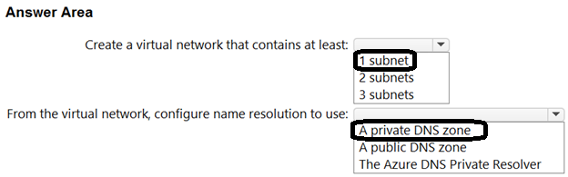

**Explication:**
N/A

## Question Set 240

**Context:**
HOTSPOT
–
Your on-premises network contains an Active Directory Domain Services (AD DS) domain. The domain contains a server named Server1. Server1 contains an app named App1 that uses AD DS authentication. Remote users access App1 by using a VPN connection to the on-premises network.
You have an Azure AD tenant that syncs with the AD DS domain by using Azure AD Connect.
You need to ensure that the remote users can access App1 without using a VPN. The solution must meet the following requirements:
• Ensure that the users authenticate by using Azure Multi-Factor Authentication (MFA).
• Minimize administrative effort.

**Question:**
What should you include in the solution? To answer, select the appropriate options in the answer area.
NOTE: Each correct selection is worth one point.
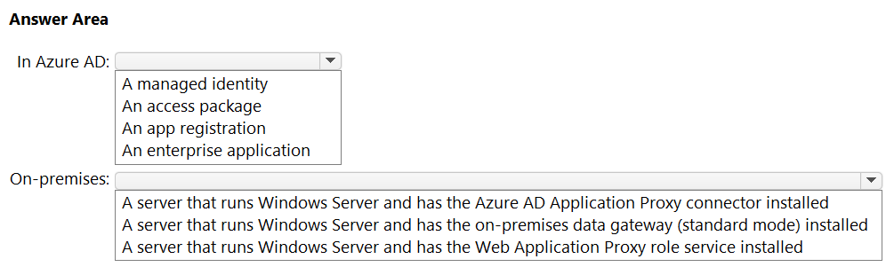

**Answer:**
Correct Answer:
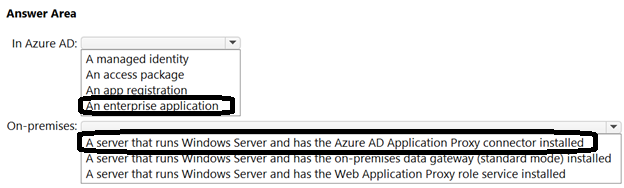

**Explication:**
N/A

## Question Set 241

**Context:**
You have an Azure subscription that contains an Azure Kubernetes Service (AKS) instance named AKS1. AKS1 hosts microservice-based APIs that are configured to listen on non-default HTTP ports.
You plan to deploy a Standard tier Azure API Management instance named APIM1 that will make the APIs available to external users.
You need to ensure that the AKS1 APIs are accessible to APIM1. The solution must meet the following requirements:
• Implement MTLS authentication between APIM1 and AKS1.
• Minimize development effort.
• Minimize costs.

**Question:**
What should you do?
- A. Implement an external load balancer on AKS1.
- B. Redeploy APIM1 to the virtual network that contains AKS1.
- C. Implement an ExternalName service on AKS1.
- D. Deploy an ingress controller to AKS1.

**Answer:**
Correct Answer: D

**Explication:**
N/A

## Question Set 242

**Context:**
HOTSPOT
–
You need to recommend a solution to integrate Azure Cosmos DB and Azure Synapse. The solution must meet the following requirements:
• Traffic from an Azure Synapse workspace to the Azure Cosmos DB account must be sent via the Microsoft backbone network.
• Traffic from the Azure Synapse workspace to the Azure Cosmos DB account must NOT be routed over the internet.
• Implementation effort must be minimized.

**Question:**
What should you include in the recommendation? To answer, select the appropriate options in the answer area.
NOTE: Each correct selection is worth one point.
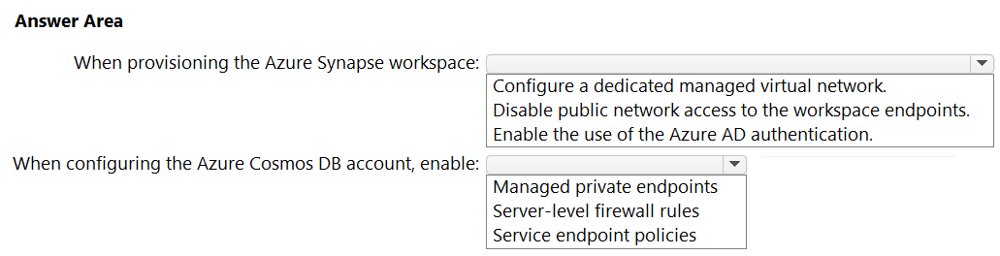

**Answer:**
Correct Answer:
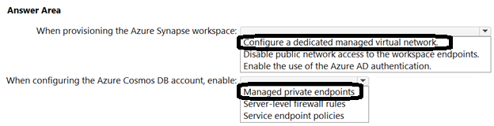

**Explication:**
Topic 5 – Testlet 1

## Question Set 243

**Context:**
Introductory Info Case Study –
This is a case study. Case studies are not timed separately. You can use as much exam time as you would like to complete each case. However, there may be additional case studies and sections on this exam. You must manage your time to ensure that you are able to complete all questions included on this exam in the time provided.
To answer the questions included in a case study, you will need to reference information that is provided in the case study. Case studies might contain exhibits and other resources that provide more information about the scenario that is described in the case study. Each question is independent of the other questions in this case study.
At the end of this case study, a review screen will appear. This screen allows you to review your answers and to make changes before you move to the next section of the exam. After you begin a new section, you cannot return to this section.
To start the case study –
To display the first question in this case study, click the Next button. Use the buttons in the left pane to explore the content of the case study before you answer the questions. Clicking these buttons displays information such as business requirements, existing environment, and problem statements. If the case study has an All Information tab, note that the information displayed is identical to the information displayed on the subsequent tabs When you are ready to answer a question, click the Question button to return to the question.
Overview –
Litware , Inc. is a medium-sized finance company that has a main office in Boston.
Existing Environment –
Identity Environment –
The network contains an Active Directory forest named litware.com that is linked to an Azure Active Directory (Azure AD) tenant named litware.com. All users have Azure Active Directory Premium P2 licenses.
Litware has a second Azure AD tenant named dev.litware.com that is used as a development environment.
The litware.com tenant has a Conditional Access policy named Capolicy1. Capolicy1 requires that when users manage the Azure subscription for a production environment by using the Azure portal, they must connect from a hybrid Azure AD-joined device.
Azure Environment –
Litware has 10 Azure subscriptions that are linked to the Litware.com tenant and five Azure subscriptions that are linked to the dev.litware.com tenant. All the subscriptions are in an Enterprise Agreement (EA).
The litware.com tenant contains a custom Azure role-based access control (Azure RBAC) role named Role1 that grants the DataActions read permission to the blobs and files in Azure Storage.
On-Premises Environment –
The on-premises network of Litware contains the resources shown in the following table.
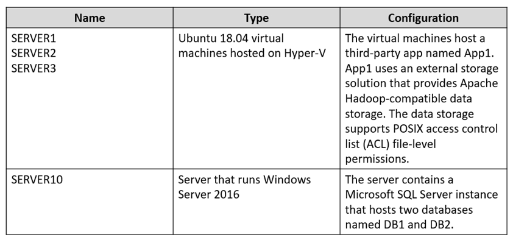
Network Environment –
Litware has ExpressRoute connectivity to Azure.
Planned Changes and Requirements
Planned Changes –
Litware plans to implement the following changes:
Migrate DB1 and DB2 to Azure.
Migrate App1 to Azure virtual machines.
Migrate the external storage used by App1 to Azure Storage.
Deploy the Azure virtual machines that will host App1 to Azure dedicated hosts.

Authentication and Authorization Requirements
Litware identifies the following authentication and authorization requirements:
Only users that manage the production environment by using the Azure portal must connect from a hybrid Azure AD-joined device and authenticate by using
Azure Multi-Factor Authentication (MFA).
The Network Contributor built-in RBAC role must be used to grant permissions to the network administrators for all the virtual networks in all the Azure subscriptions.
To access the resources in Azure, App1 must use the managed identity of the virtual machines that will host the app.
RBAC roles must be applied to management groups.
Resiliency Requirements –
Litware identifies the following resiliency requirements:
Once migrated to Azure, DB1 and DB2 must meet the following requirements:
– Maintain availability if two availability zones in the local Azure region fail.
– Fail over automatically.
– Minimize I/O latency.
App1 must meet the following requirements:
– Be hosted in an Azure region that supports availability zones.
– Be hosted on Azure virtual machines that support automatic scaling.
– Maintain availability if two availability zones in the local Azure region fail.
Security and Compliance Requirements
Litware identifies the following security and compliance requirements:
Once App1 is migrated to Azure, you must ensure that new data can be written to the app, and the modification of new and existing data is prevented for a period of three years.
On-premises users and services must be able to access the Azure Storage account that will host the data in App1.
Access to the public endpoint of the Azure Storage account that will host the App1 data must be prevented.
All Azure SQL databases in the production environment must have Transparent Data Encryption (TDE) enabled.
App1 must NOT share physical hardware with other workloads.
Business Requirements –
Litware identifies the following business requirements:
Minimize administrative effort.
Minimize costs.
Question HOTSPOT –

You need to ensure that users managing the production environment are registered for Azure MFA and must authenticate by using Azure MFA when they sign in to the Azure portal. The solution must meet the authentication and authorization requirements.

**Question:**
What should you do? To answer, select the appropriate options in the answer area.
NOTE: Each correct selection is worth one point.
Hot Area:
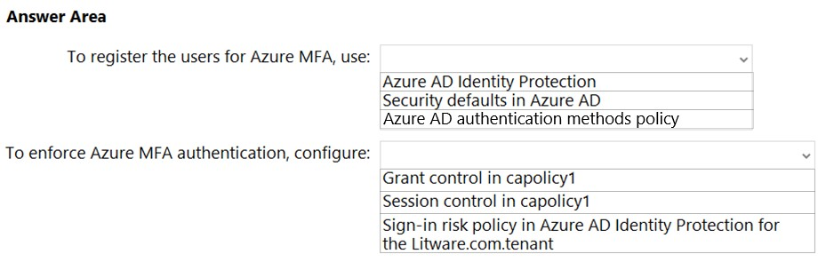

**Answer:**
Correct Answer:
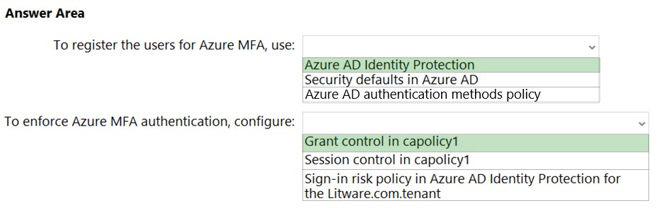

**Explication:**
- Box 1: Azure AD Identity Protection
Only users that manage the production environment by using the Azure portal must connect from a hybrid Azure AD-joined device and authenticate by using
Azure Multi-Factor Authentication (MFA).
Note: Policy configuration –
1. Navigate to the Azure portal.
2. Browse to Azure Active Directory > Security > Identity Protection > MFA registration policy.
3. Under Assignments
4. Users – Choose All users or Select individuals and groups if limiting your rollout.
5. Optionally you can choose to exclude users from the policy.
6. Enforce Policy – On
7. Save
- Box 2: Grant control in capolicy1
The litware.com tenant has a Conditional Access policy named Capolicy1. Capolicy1 requires that when users manage the Azure subscription for a production environment by using the Azure portal, they must connect from a hybrid Azure AD-joined device.
Note: We need to configure the policy conditions for capolicy1 that prompt for MFA.

## Question Set 244

**Context:**
Introductory Info Case Study –
This is a case study. Case studies are not timed separately. You can use as much exam time as you would like to complete each case. However, there may be additional case studies and sections on this exam. You must manage your time to ensure that you are able to complete all questions included on this exam in the time provided.
To answer the questions included in a case study, you will need to reference information that is provided in the case study. Case studies might contain exhibits and other resources that provide more information about the scenario that is described in the case study. Each question is independent of the other questions in this case study.
At the end of this case study, a review screen will appear. This screen allows you to review your answers and to make changes before you move to the next section of the exam. After you begin a new section, you cannot return to this section.
To start the case study –
To display the first question in this case study, click the Next button. Use the buttons in the left pane to explore the content of the case study before you answer the questions. Clicking these buttons displays information such as business requirements, existing environment, and problem statements. If the case study has an All Information tab, note that the information displayed is identical to the information displayed on the subsequent tabs When you are ready to answer a question, click the Question button to return to the question.
Overview –
Litware , Inc. is a medium-sized finance company that has a main office in Boston.
Existing Environment –
Identity Environment –
The network contains an Active Directory forest named litware.com that is linked to an Azure Active Directory (Azure AD) tenant named litware.com. All users have Azure Active Directory Premium P2 licenses.
Litware has a second Azure AD tenant named dev.litware.com that is used as a development environment.
The litware.com tenant has a Conditional Access policy named Capolicy1. Capolicy1 requires that when users manage the Azure subscription for a production environment by using the Azure portal, they must connect from a hybrid Azure AD-joined device.
Azure Environment –
Litware has 10 Azure subscriptions that are linked to the Litware.com tenant and five Azure subscriptions that are linked to the dev.litware.com tenant. All the subscriptions are in an Enterprise Agreement (EA).
The litware.com tenant contains a custom Azure role-based access control (Azure RBAC) role named Role1 that grants the DataActions read permission to the blobs and files in Azure Storage.
On-Premises Environment –
The on-premises network of Litware contains the resources shown in the following table.

Network Environment –
Litware has ExpressRoute connectivity to Azure.
Planned Changes and Requirements
Planned Changes –
Litware plans to implement the following changes:
Migrate DB1 and DB2 to Azure.
Migrate App1 to Azure virtual machines.
Migrate the external storage used by App1 to Azure Storage.
Deploy the Azure virtual machines that will host App1 to Azure dedicated hosts.

Authentication and Authorization Requirements
Litware identifies the following authentication and authorization requirements:
Only users that manage the production environment by using the Azure portal must connect from a hybrid Azure AD-joined device and authenticate by using
Azure Multi-Factor Authentication (MFA).
The Network Contributor built-in RBAC role must be used to grant permissions to the network administrators for all the virtual networks in all the Azure subscriptions.
To access the resources in Azure, App1 must use the managed identity of the virtual machines that will host the app.
RBAC roles must be applied to management groups.
Resiliency Requirements –
Litware identifies the following resiliency requirements:
Once migrated to Azure, DB1 and DB2 must meet the following requirements:
– Maintain availability if two availability zones in the local Azure region fail.
– Fail over automatically.
– Minimize I/O latency.
App1 must meet the following requirements:
– Be hosted in an Azure region that supports availability zones.
– Be hosted on Azure virtual machines that support automatic scaling.
– Maintain availability if two availability zones in the local Azure region fail.
Security and Compliance Requirements
Litware identifies the following security and compliance requirements:
Once App1 is migrated to Azure, you must ensure that new data can be written to the app, and the modification of new and existing data is prevented for a period of three years.
On-premises users and services must be able to access the Azure Storage account that will host the data in App1.
Access to the public endpoint of the Azure Storage account that will host the App1 data must be prevented.
All Azure SQL databases in the production environment must have Transparent Data Encryption (TDE) enabled.
App1 must NOT share physical hardware with other workloads.
Business Requirements –
Litware identifies the following business requirements:
Minimize administrative effort.
Minimize costs.
Question After you migrate App1 to Azure, you need to enforce the data modification requirements to meet the security and compliance requirements.

**Question:**
What should you do?
- A. Create an access policy for the blob service.
- B. Implement Azure resource locks.
- C. Create Azure RBAC assignments.
- D. Modify the access level of the blob service.

**Answer:**
Correct Answer: A

**Explication:**
Scenario: Once App1 is migrated to Azure, you must ensure that new data can be written to the app, and the modification of new and existing data is prevented for a period of three years.
As an administrator, you can lock a subscription, resource group, or resource to prevent other users in your organization from accidentally deleting or modifying critical resources. The lock overrides any permissions the user might have.
Topic 6 – Testlet 10

## Question Set 245

**Context:**
Introductory Info Case Study –
This is a case study. Case studies are not timed separately. You can use as much exam time as you would like to complete each case. However, there may be additional case studies and sections on this exam. You must manage your time to ensure that you are able to complete all questions included on this exam in the time provided.
To answer the questions included in a case study, you will need to reference information that is provided in the case study. Case studies might contain exhibits and other resources that provide more information about the scenario that is described in the case study. Each question is independent of the other questions in this case study.
At the end of this case study, a review screen will appear. This screen allows you to review your answers and to make changes before you move to the next section of the exam. After you begin a new section, you cannot return to this section.
To start the case study –
To display the first question in this case study, click the Next button. Use the buttons in the left pane to explore the content of the case study before you answer the questions. Clicking these buttons displays information such as business requirements, existing environment, and problem statements. If the case study has an All Information tab, note that the information displayed is identical to the information displayed on the subsequent tabs. When you are ready to answer a question, click the Question button to return to the question.
Overview –
Contoso, Ltd. is a research company that has a main office in Montreal.
Existing Environment –
Technical Environment –
The on-premises network contains a single Active Directory domain named contoso.com.
Contoso has a single Azure subscription.
Business Partnerships –
Contoso has a business partnership with Fabrikam , Inc. Fabrikam users access some Contoso applications over the internet by using Azure Active Directory
(Azure AD) guest accounts.
Requirements –
Planned Changes –
Contoso plans to deploy two applications named App1 and App2 to Azure.
App1 –
App1 will be a Python web app hosted in Azure App Service that requires a Linux runtime. Users from Contoso and Fabrikam will access App1.
App1 will access several services that require third-party credentials and access strings. The credentials and access strings are stored in Azure Key Vault.
App1 will have six instances: three in the East US Azure region and three in the West Europe Azure region.
App1 has the following data requirements:
Each instance will write data to a data store in the same availability zone as the instance.
Data written by any App1 instance must be visible to all App1 instances.
App1 will only be accessible from the internet. App1 has the following connection requirements:
Connections to App1 must pass through a web application firewall (WAF).
Connections to App1 must be active-active load balanced between instances.
All connections to App1 from North America must be directed to the East US region. All other connections must be directed to the West Europe region.
Every hour, you will run a maintenance task by invoking a PowerShell script that copies files from all the App1 instances. The PowerShell script will run from a central location.
App2 –
App2 will be a .NET app hosted in App Service that requires a Windows runtime. App2 has the following file storage requirements:
Save files to an Azure Storage account.
Replicate files to an on-premises location.
Ensure that on-premises clients can read the files over the LAN by using the SMB protocol.
You need to monitor App2 to analyze how long it takes to perform different transactions within the application. The solution must not require changes to the application code.
Application Development Requirements
Application developers will constantly develop new versions of App1 and App2. The development process must meet the following requirements:
A staging instance of a new application version must be deployed to the application host before the new version is used in production.
After testing the new version, the staging version of the application will replace the production version.

The switch to the new application version from staging to production must occur without any downtime of the application.
Identity Requirements –
Contoso identifies the following requirements for managing Fabrikam access to resources:
Every month, an account manager at Fabrikam must review which Fabrikam users have access permissions to App1. Accounts that no longer need permissions must be removed as guests.
The solution must minimize development effort.
Security Requirement –
All secrets used by Azure services must be stored in Azure Key Vault.
Services that require credentials must have the credentials tied to the service instance. The credentials must NOT be shared between services. Question You need to recommend a solution for the App1 maintenance task. The solution must minimize costs.

**Question:**
What should you include in the recommendation?
- A. an Azure logic app
- B. an Azure function
- C. an Azure virtual machine
- D. an App Service WebJob

**Answer:**
Correct Answer: A

**Explication:**
Every hour, you will run a maintenance task by invoking a PowerShell script that copies files from all the App1 instances. The PowerShell script will run from a central location.
App1 will have six instances: three in the East US Azure region and three in the West Europe Azure region.
You can create and manage workflows with Azure PowerShell in Azure Logic Apps.
You can create a Consumption logic app in multi-tenant Azure Logic Apps by using the JSON file for a logic app workflow definition. You can then manage your logic app by running the cmdlets in the Az.LogicApp PowerShell module.

## Question Set 246

**Context:**
Introductory Info Case Study –
This is a case study. Case studies are not timed separately. You can use as much exam time as you would like to complete each case. However, there may be additional case studies and sections on this exam. You must manage your time to ensure that you are able to complete all questions included on this exam in the time provided.
To answer the questions included in a case study, you will need to reference information that is provided in the case study. Case studies might contain exhibits and other resources that provide more information about the scenario that is described in the case study. Each question is independent of the other questions in this case study.
At the end of this case study, a review screen will appear. This screen allows you to review your answers and to make changes before you move to the next section of the exam. After you begin a new section, you cannot return to this section.
To start the case study –
To display the first question in this case study, click the Next button. Use the buttons in the left pane to explore the content of the case study before you answer the questions. Clicking these buttons displays information such as business requirements, existing environment, and problem statements. If the case study has an All Information tab, note that the information displayed is identical to the information displayed on the subsequent tabs. When you are ready to answer a question, click the Question button to return to the question.
Overview –
Contoso, Ltd. is a research company that has a main office in Montreal.
Existing Environment –
Technical Environment –
The on-premises network contains a single Active Directory domain named contoso.com.
Contoso has a single Azure subscription.
Business Partnerships –
Contoso has a business partnership with Fabrikam , Inc. Fabrikam users access some Contoso applications over the internet by using Azure Active Directory
(Azure AD) guest accounts.
Requirements –
Planned Changes –
Contoso plans to deploy two applications named App1 and App2 to Azure.
App1 –
App1 will be a Python web app hosted in Azure App Service that requires a Linux runtime. Users from Contoso and Fabrikam will access App1.
App1 will access several services that require third-party credentials and access strings. The credentials and access strings are stored in Azure Key Vault.
App1 will have six instances: three in the East US Azure region and three in the West Europe Azure region.
App1 has the following data requirements:
Each instance will write data to a data store in the same availability zone as the instance.
Data written by any App1 instance must be visible to all App1 instances.
App1 will only be accessible from the internet. App1 has the following connection requirements:
Connections to App1 must pass through a web application firewall (WAF).
Connections to App1 must be active-active load balanced between instances.
All connections to App1 from North America must be directed to the East US region. All other connections must be directed to the West Europe region.
Every hour, you will run a maintenance task by invoking a PowerShell script that copies files from all the App1 instances. The PowerShell script will run from a central location.
App2 –
App2 will be a .NET app hosted in App Service that requires a Windows runtime. App2 has the following file storage requirements:
Save files to an Azure Storage account.
Replicate files to an on-premises location.
Ensure that on-premises clients can read the files over the LAN by using the SMB protocol.
You need to monitor App2 to analyze how long it takes to perform different transactions within the application. The solution must not require changes to the application code.
Application Development Requirements
Application developers will constantly develop new versions of App1 and App2. The development process must meet the following requirements:
A staging instance of a new application version must be deployed to the application host before the new version is used in production.
After testing the new version, the staging version of the application will replace the production version.

The switch to the new application version from staging to production must occur without any downtime of the application.
Identity Requirements –
Contoso identifies the following requirements for managing Fabrikam access to resources:
Every month, an account manager at Fabrikam must review which Fabrikam users have access permissions to App1. Accounts that no longer need permissions must be removed as guests.
The solution must minimize development effort.
Security Requirement –
All secrets used by Azure services must be stored in Azure Key Vault.
Services that require credentials must have the credentials tied to the service instance. The credentials must NOT be shared between services. Question You need to recommend a solution that meets the application development requirements.

**Question:**
What should you include in the recommendation?
- A. the Azure App Configuration service
- B. an Azure Container Registry instance
- C. deployment slots
- D. Continuous Integration/Continuous Deployment (CI/CD) sources

**Answer:**
Correct Answer: C

**Explication:**
When you deploy your web app, web app on Linux, mobile back end, or API app to Azure App Service, you can use a separate deployment slot instead of the default production slot when you’re running in the Standard, Premium, or Isolated App Service plan tier. Deployment slots are live apps with their own host names.
App content and configurations elements can be swapped between two deployment slots, including the production slot.
Deploying your application to a non-production slot has the following benefits:
* You can validate app changes in a staging deployment slot before swapping it with the production slot.
* Deploying an app to a slot first and swapping it into production makes sure that all instances of the slot are warmed up before being swapped into production.
This eliminates downtime when you deploy your app.
* After a swap, the slot with previously staged app now has the previous production app. If the changes swapped into the production slot aren’t as you expect, you can perform the same swap immediately to get your “last known good site” back.
Note: Application Development Requirements
Application developers will constantly develop new versions of App1 and App2. The development process must meet the following requirements:
ג€¢ A staging instance of a new application version must be deployed to the application host before the new version is used in production.
ג€¢ After testing the new version, the staging version of the application will replace the production version.
ג€¢ The switch to the new application version from staging to production must occur without any downtime of the application.

## Question Set 247

**Context:**
Introductory Info Case Study –
This is a case study. Case studies are not timed separately. You can use as much exam time as you would like to complete each case. However, there may be additional case studies and sections on this exam. You must manage your time to ensure that you are able to complete all questions included on this exam in the time provided.
To answer the questions included in a case study, you will need to reference information that is provided in the case study. Case studies might contain exhibits and other resources that provide more information about the scenario that is described in the case study. Each question is independent of the other questions in this case study.
At the end of this case study, a review screen will appear. This screen allows you to review your answers and to make changes before you move to the next section of the exam. After you begin a new section, you cannot return to this section.
To start the case study –
To display the first question in this case study, click the Next button. Use the buttons in the left pane to explore the content of the case study before you answer the questions. Clicking these buttons displays information such as business requirements, existing environment, and problem statements. If the case study has an All Information tab, note that the information displayed is identical to the information displayed on the subsequent tabs. When you are ready to answer a question, click the Question button to return to the question.
Overview –
Contoso, Ltd. is a research company that has a main office in Montreal.
Existing Environment –
Technical Environment –
The on-premises network contains a single Active Directory domain named contoso.com.
Contoso has a single Azure subscription.
Business Partnerships –
Contoso has a business partnership with Fabrikam , Inc. Fabrikam users access some Contoso applications over the internet by using Azure Active Directory
(Azure AD) guest accounts.
Requirements –
Planned Changes –
Contoso plans to deploy two applications named App1 and App2 to Azure.
App1 –
App1 will be a Python web app hosted in Azure App Service that requires a Linux runtime. Users from Contoso and Fabrikam will access App1.
App1 will access several services that require third-party credentials and access strings. The credentials and access strings are stored in Azure Key Vault.
App1 will have six instances: three in the East US Azure region and three in the West Europe Azure region.
App1 has the following data requirements:
Each instance will write data to a data store in the same availability zone as the instance.
Data written by any App1 instance must be visible to all App1 instances.
App1 will only be accessible from the internet. App1 has the following connection requirements:
Connections to App1 must pass through a web application firewall (WAF).
Connections to App1 must be active-active load balanced between instances.
All connections to App1 from North America must be directed to the East US region. All other connections must be directed to the West Europe region.
Every hour, you will run a maintenance task by invoking a PowerShell script that copies files from all the App1 instances. The PowerShell script will run from a central location.
App2 –
App2 will be a .NET app hosted in App Service that requires a Windows runtime. App2 has the following file storage requirements:
Save files to an Azure Storage account.
Replicate files to an on-premises location.
Ensure that on-premises clients can read the files over the LAN by using the SMB protocol.
You need to monitor App2 to analyze how long it takes to perform different transactions within the application. The solution must not require changes to the application code.
Application Development Requirements
Application developers will constantly develop new versions of App1 and App2. The development process must meet the following requirements:
A staging instance of a new application version must be deployed to the application host before the new version is used in production.
After testing the new version, the staging version of the application will replace the production version.

The switch to the new application version from staging to production must occur without any downtime of the application.
Identity Requirements –
Contoso identifies the following requirements for managing Fabrikam access to resources:
Every month, an account manager at Fabrikam must review which Fabrikam users have access permissions to App1. Accounts that no longer need permissions must be removed as guests.
The solution must minimize development effort.
Security Requirement –
All secrets used by Azure services must be stored in Azure Key Vault.
Services that require credentials must have the credentials tied to the service instance. The credentials must NOT be shared between services. Question You need to recommend an App Service architecture that meets the requirements for App1. The solution must minimize costs.

**Question:**
What should you recommend?
- A. one App Service Environment (ASE) per availability zone
- B. one App Service Environment (ASE) per region
- C. one App Service plan per region
- D. one App Service plan per availability zone

**Answer:**
Correct Answer: B

**Explication:**
App1 has the following data requirements:
Each instance will write data to a data store in the same availability zone as the instance.
Data written by any App1 instance must be visible to all App1 instances.
Note: The Azure App Service Environment v2 is an Azure App Service feature that provides a fully isolated and dedicated environment for securely running App
Service apps at high scale.
Customers can create multiple ASEs within a single Azure region or across multiple Azure regions. This flexibility makes ASEs ideal for horizontally scaling stateless application tiers in support of high requests per second (RPS) workloads.

## Question Set 248

**Context:**
Introductory Info Case Study –
This is a case study. Case studies are not timed separately. You can use as much exam time as you would like to complete each case. However, there may be additional case studies and sections on this exam. You must manage your time to ensure that you are able to complete all questions included on this exam in the time provided.
To answer the questions included in a case study, you will need to reference information that is provided in the case study. Case studies might contain exhibits and other resources that provide more information about the scenario that is described in the case study. Each question is independent of the other questions in this case study.
At the end of this case study, a review screen will appear. This screen allows you to review your answers and to make changes before you move to the next section of the exam. After you begin a new section, you cannot return to this section.
To start the case study –
To display the first question in this case study, click the Next button. Use the buttons in the left pane to explore the content of the case study before you answer the questions. Clicking these buttons displays information such as business requirements, existing environment, and problem statements. If the case study has an All Information tab, note that the information displayed is identical to the information displayed on the subsequent tabs. When you are ready to answer a question, click the Question button to return to the question.
Overview –
Contoso, Ltd. is a research company that has a main office in Montreal.
Existing Environment –
Technical Environment –
The on-premises network contains a single Active Directory domain named contoso.com.
Contoso has a single Azure subscription.
Business Partnerships –
Contoso has a business partnership with Fabrikam , Inc. Fabrikam users access some Contoso applications over the internet by using Azure Active Directory
(Azure AD) guest accounts.
Requirements –
Planned Changes –
Contoso plans to deploy two applications named App1 and App2 to Azure.
App1 –
App1 will be a Python web app hosted in Azure App Service that requires a Linux runtime. Users from Contoso and Fabrikam will access App1.
App1 will access several services that require third-party credentials and access strings. The credentials and access strings are stored in Azure Key Vault.
App1 will have six instances: three in the East US Azure region and three in the West Europe Azure region.
App1 has the following data requirements:
Each instance will write data to a data store in the same availability zone as the instance.
Data written by any App1 instance must be visible to all App1 instances.
App1 will only be accessible from the internet. App1 has the following connection requirements:
Connections to App1 must pass through a web application firewall (WAF).
Connections to App1 must be active-active load balanced between instances.
All connections to App1 from North America must be directed to the East US region. All other connections must be directed to the West Europe region.
Every hour, you will run a maintenance task by invoking a PowerShell script that copies files from all the App1 instances. The PowerShell script will run from a central location.
App2 –
App2 will be a .NET app hosted in App Service that requires a Windows runtime. App2 has the following file storage requirements:
Save files to an Azure Storage account.
Replicate files to an on-premises location.
Ensure that on-premises clients can read the files over the LAN by using the SMB protocol.
You need to monitor App2 to analyze how long it takes to perform different transactions within the application. The solution must not require changes to the application code.
Application Development Requirements
Application developers will constantly develop new versions of App1 and App2. The development process must meet the following requirements:
A staging instance of a new application version must be deployed to the application host before the new version is used in production.
After testing the new version, the staging version of the application will replace the production version.

The switch to the new application version from staging to production must occur without any downtime of the application.
Identity Requirements –
Contoso identifies the following requirements for managing Fabrikam access to resources:
Every month, an account manager at Fabrikam must review which Fabrikam users have access permissions to App1. Accounts that no longer need permissions must be removed as guests.
The solution must minimize development effort.
Security Requirement –
All secrets used by Azure services must be stored in Azure Key Vault.
Services that require credentials must have the credentials tied to the service instance. The credentials must NOT be shared between services. Question HOTSPOT –
You need to recommend a solution to ensure that App1 can access the third-party credentials and access strings. The solution must meet the security requirements.

**Question:**
What should you include in the recommendation? To answer, select the appropriate options in the answer area.
NOTE: Each correct selection is worth one point.
Hot Area:
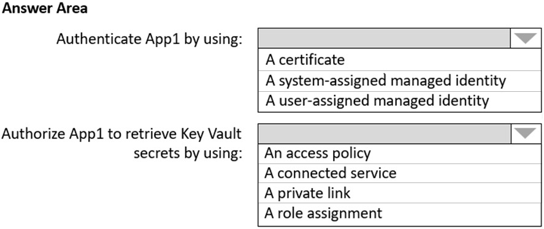

**Answer:**
Correct Answer:
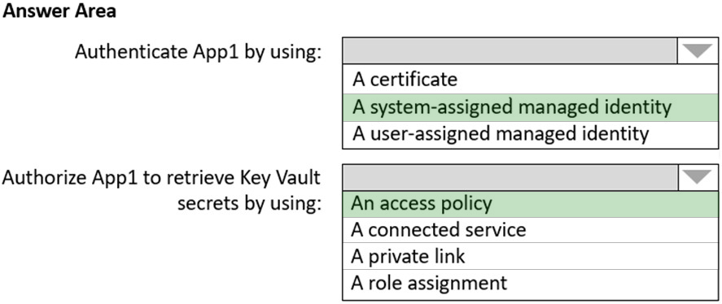

**Explication:**
Scenario: Security Requirement –
All secrets used by Azure services must be stored in Azure Key Vault.
Services that require credentials must have the credentials tied to the service instance. The credentials must NOT be shared between services.
- Box 1: A system-assigned managed identity
No one knows the credentials of managed identities.
Managed Identities exist in two formats:
* System assigned: in this scenario, the identity is linked to a single Azure Resource, eg a Virtual Machine, a Logic App, a Storage Account, Web App, Function,ג €¦ so almost anything. Next, they also ג€liveג € with the Azure Resource, which means they get deleted when the Azure Resource gets deleted.
* User Assigned Managed Identity (incorrect for this question), which means that you first have to create it as a stand-alone Azure resource by itself, after which it can be linked to multiple Azure Resources.
- Box 2: An access policy –
Set up an access policy for the system-assigned managed identity.
Note: Grant access –
The managed identity needs to be granted access to read the secret that we’ll store in the Key Vault.
1. Navigate to your newly created Key Vault
2. Select Access Policy from the menu on the left side.
3. Select Add Access Policy
4. Etc.
Topic 7 – Testlet 11

## Question Set 249

**Context:**
N/A

**Question:**
Introductory Info Case Study –
This is a case study. Case studies are not timed separately. You can use as much exam time as you would like to complete each case. However, there may be additional case studies and sections on this exam. You must manage your time to ensure that you are able to complete all questions included on this exam in the time provided.
To answer the questions included in a case study, you will need to reference information that is provided in the case study. Case studies might contain exhibits and other resources that provide more information about the scenario that is described in the case study. Each question is independent of the other questions in this case study.
At the end of this case study, a review screen will appear. This screen allows you to review your answers and to make changes before you move to the next section of the exam. After you begin a new section, you cannot return to this section.
To start the case study –
To display the first question in this case study, click the Next button. Use the buttons in the left pane to explore the content of the case study before you answer the questions. Clicking these buttons displays information such as business requirements, existing environment, and problem statements. If the case study has an All Information tab, note that the information displayed is identical to the information displayed on the subsequent tabs. When you are ready to answer a question, click the Question button to return to the question.
Overview –
Fabrikam , Inc. is an engineering company that has offices throughout Europe. The company has a main office in London and three branch offices in Amsterdam,
Berlin, and Rome.
Existing Environment: Active Directory Environment
The network contains two Active Directory forests named corp.fabrikam.com and rd.fabrikam.com. There are no trust relationships between the forests.
Corp.fabrikam.com is a production forest that contains identities used for internal user and computer authentication.
Rd.fabrikam.com is used by the research and development (R&D) department only. The R&D department is restricted to using on-premises resources only.
Existing Environment: Network Infrastructure
Each office contains at least one domain controller from the corp.fabrikam.com domain. The main office contains all the domain controllers for the rd.fabrikam.com forest.
All the offices have a high-speed connection to the internet.
An existing application named WebApp1 is hosted in the data center of the London office. WebApp1 is used by customers to place and track orders. WebApp1 has a web tier that uses Microsoft Internet Information Services (IIS) and a database tier that runs Microsoft SQL Server 2016. The web tier and the database tier are deployed to virtual machines that run on Hyper-V.
The IT department currently uses a separate Hyper-V environment to test updates to WebApp1.
Fabrikam purchases all Microsoft licenses through a Microsoft Enterprise Agreement that includes Software Assurance.
Existing Environment: Problem Statements
The use of WebApp1 is unpredictable. At peak times, users often report delays. At other times, many resources for WebApp1 are underutilized.
Requirements: Planned Changes –
Fabrikam plans to move most of its production workloads to Azure during the next few years, including virtual machines that rely on Active Directory for authentication.
As one of its first projects, the company plans to establish a hybrid identity model, facilitating an upcoming Microsoft 365 deployment.
All R&D operations will remain on-premises.
Fabrikam plans to migrate the production and test instances of WebApp1 to Azure.
Requirements: Technical Requirements
Fabrikam identifies the following technical requirements:
Website content must be easily updated from a single point.
User input must be minimized when provisioning new web app instances.
Whenever possible, existing on-premises licenses must be used to reduce cost.
Users must always authenticate by using their corp.fabrikam.com UPN identity.
Any new deployments to Azure must be redundant in case an Azure region fails.
Whenever possible, solutions must be deployed to Azure by using the Standard pricing tier of Azure App Service.
An email distribution group named IT Support must be notified of any issues relating to the directory synchronization services.
In the event that a link fails between Azure and the on-premises network, ensure that the virtual machines hosted in Azure can authenticate to Active Directory.
Directory synchronization between Azure Active Directory (Azure AD) and corp.fabrikam.com must not be affected by a link failure between Azure and the on- premises network.
Requirements: Database Requirements
Fabrikam identifies the following database requirements:
Database metrics for the production instance of WebApp1 must be available for analysis so that database administrators can optimize the performance settings.
To avoid disrupting customer access, database downtime must be minimized when databases are migrated.
Database backups must be retained for a minimum of seven years to meet compliance requirements.
Requirements: Security Requirements
Fabrikam identifies the following security requirements:
Company information including policies, templates, and data must be inaccessible to anyone outside the company.
Users on the on-premises network must be able to authenticate to corp.fabrikam.com if an internet link fails.
Administrators must be able authenticate to the Azure portal by using their corp.fabrikam.com credentials.
All administrative access to the Azure portal must be secured by using multi-factor authentication (MFA).
The testing of WebApp1 updates must not be visible to anyone outside the company. Question HOTSPOT –
You are evaluating the components of the migration to Azure that require you to provision an Azure Storage account. For each of the following statements, select
Yes if the statement is true. Otherwise, select No.
NOTE: Each correct selection is worth one point.
Hot Area:
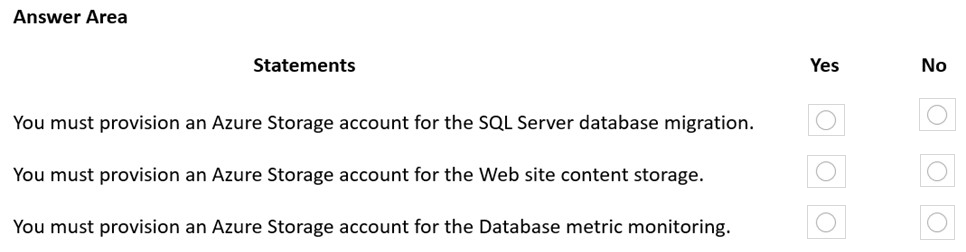

**Answer:**
Correct Answer:
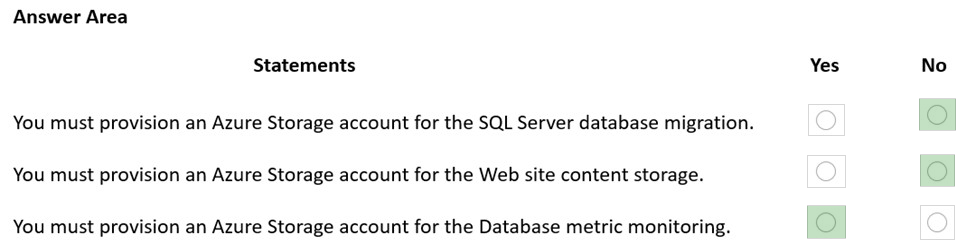

**Explication:**
- Box 1: No –
Online migration will work fine. It does not require an Azure Storage account.
- Box 2: No –
Data for the web site can migrated to Azure app service.
- Box 3: Yes –
Scenario: Database metrics for the production instance of WebApp1 must be available for analysis so that database administrators can optimize the performance settings.

## Question Set 250

**Context:**
Introductory Info Case Study –
This is a case study. Case studies are not timed separately. You can use as much exam time as you would like to complete each case. However, there may be additional case studies and sections on this exam. You must manage your time to ensure that you are able to complete all questions included on this exam in the time provided.
To answer the questions included in a case study, you will need to reference information that is provided in the case study. Case studies might contain exhibits and other resources that provide more information about the scenario that is described in the case study. Each question is independent of the other questions in this case study.
At the end of this case study, a review screen will appear. This screen allows you to review your answers and to make changes before you move to the next section of the exam. After you begin a new section, you cannot return to this section.
To start the case study –
To display the first question in this case study, click the Next button. Use the buttons in the left pane to explore the content of the case study before you answer the questions. Clicking these buttons displays information such as business requirements, existing environment, and problem statements. If the case study has an All Information tab, note that the information displayed is identical to the information displayed on the subsequent tabs. When you are ready to answer a question, click the Question button to return to the question.
Overview –
Fabrikam , Inc. is an engineering company that has offices throughout Europe. The company has a main office in London and three branch offices in Amsterdam,
Berlin, and Rome.
Existing Environment: Active Directory Environment
The network contains two Active Directory forests named corp.fabrikam.com and rd.fabrikam.com. There are no trust relationships between the forests.
Corp.fabrikam.com is a production forest that contains identities used for internal user and computer authentication.
Rd.fabrikam.com is used by the research and development (R&D) department only. The R&D department is restricted to using on-premises resources only.
Existing Environment: Network Infrastructure
Each office contains at least one domain controller from the corp.fabrikam.com domain. The main office contains all the domain controllers for the rd.fabrikam.com forest.
All the offices have a high-speed connection to the internet.
An existing application named WebApp1 is hosted in the data center of the London office. WebApp1 is used by customers to place and track orders. WebApp1 has a web tier that uses Microsoft Internet Information Services (IIS) and a database tier that runs Microsoft SQL Server 2016. The web tier and the database tier are deployed to virtual machines that run on Hyper-V.
The IT department currently uses a separate Hyper-V environment to test updates to WebApp1.
Fabrikam purchases all Microsoft licenses through a Microsoft Enterprise Agreement that includes Software Assurance.
Existing Environment: Problem Statements
The use of WebApp1 is unpredictable. At peak times, users often report delays. At other times, many resources for WebApp1 are underutilized.
Requirements: Planned Changes –
Fabrikam plans to move most of its production workloads to Azure during the next few years, including virtual machines that rely on Active Directory for authentication.
As one of its first projects, the company plans to establish a hybrid identity model, facilitating an upcoming Microsoft 365 deployment.
All R&D operations will remain on-premises.
Fabrikam plans to migrate the production and test instances of WebApp1 to Azure.
Requirements: Technical Requirements
Fabrikam identifies the following technical requirements:
Website content must be easily updated from a single point.
User input must be minimized when provisioning new web app instances.
Whenever possible, existing on-premises licenses must be used to reduce cost.
Users must always authenticate by using their corp.fabrikam.com UPN identity.
Any new deployments to Azure must be redundant in case an Azure region fails.
Whenever possible, solutions must be deployed to Azure by using the Standard pricing tier of Azure App Service.
An email distribution group named IT Support must be notified of any issues relating to the directory synchronization services.
In the event that a link fails between Azure and the on-premises network, ensure that the virtual machines hosted in Azure can authenticate to Active Directory.
Directory synchronization between Azure Active Directory (Azure AD) and corp.fabrikam.com must not be affected by a link failure between Azure and the on- premises network.
Requirements: Database Requirements
Fabrikam identifies the following database requirements:
Database metrics for the production instance of WebApp1 must be available for analysis so that database administrators can optimize the performance settings.
To avoid disrupting customer access, database downtime must be minimized when databases are migrated.
Database backups must be retained for a minimum of seven years to meet compliance requirements.
Requirements: Security Requirements
Fabrikam identifies the following security requirements:
Company information including policies, templates, and data must be inaccessible to anyone outside the company.
Users on the on-premises network must be able to authenticate to corp.fabrikam.com if an internet link fails.
Administrators must be able authenticate to the Azure portal by using their corp.fabrikam.com credentials.
All administrative access to the Azure portal must be secured by using multi-factor authentication (MFA).

**Question:**
The testing of WebApp1 updates must not be visible to anyone outside the company. Question What should you include in the identity management strategy to support the planned changes?
- A. Deploy domain controllers for corp.fabrikam.com to virtual networks in Azure.
- B. Move all the domain controllers from corp.fabrikam.com to virtual networks in Azure.
- C. Deploy a new Azure AD tenant for the authentication of new R&D projects.
- D. Deploy domain controllers for the rd.fabrikam.com forest to virtual networks in Azure.

**Answer:**
Correct Answer: A

**Explication:**
Directory synchronization between Azure Active Directory (Azure AD) and corp.fabrikam.com must not be affected by a link failure between Azure and the on- premises network. (This requires domain controllers in Azure).
Users on the on-premises network must be able to authenticate to corp.fabrikam.com if an Internet link fails. (This requires domain controllers on-premises).
Topic 8 – Testlet 12

## Question Set 251

**Context:**
Introductory Info Case Study –
This is a case study. Case studies are not timed separately. You can use as much exam time as you would like to complete each case. However, there may be additional case studies and sections on this exam. You must manage your time to ensure that you are able to complete all questions included on this exam in the time provided.
To answer the questions included in a case study, you will need to reference information that is provided in the case study. Case studies might contain exhibits and other resources that provide more information about the scenario that is described in the case study. Each question is independent of the other questions in this case study.
At the end of this case study, a review screen will appear. This screen allows you to review your answers and to make changes before you move to the next section of the exam. After you begin a new section, you cannot return to this section.
To start the case study –
To display the first question in this case study, click the Next button. Use the buttons in the left pane to explore the content of the case study before you answer the questions. Clicking these buttons displays information such as business requirements, existing environment, and problem statements. If the case study has an All Information tab, note that the information displayed is identical to the information displayed on the subsequent tabs When you are ready to answer a question, click the Question button to return to the question.
Overview –
Litware , Inc. is a medium-sized finance company that has a main office in Boston.
Existing Environment –
Identity Environment –
The network contains an Active Directory forest named litware.com that is linked to an Azure Active Directory (Azure AD) tenant named litware.com. All users have Azure Active Directory Premium P2 licenses.
Litware has a second Azure AD tenant named dev.litware.com that is used as a development environment.
The litware.com tenant has a Conditional Access policy named Capolicy1. Capolicy1 requires that when users manage the Azure subscription for a production environment by using the Azure portal, they must connect from a hybrid Azure AD-joined device.
Azure Environment –
Litware has 10 Azure subscriptions that are linked to the Litware.com tenant and five Azure subscriptions that are linked to the dev.litware.com tenant. All the subscriptions are in an Enterprise Agreement (EA).
The litware.com tenant contains a custom Azure role-based access control (Azure RBAC) role named Role1 that grants the DataActions read permission to the blobs and files in Azure Storage.
On-Premises Environment –
The on-premises network of Litware contains the resources shown in the following table.

Network Environment –
Litware has ExpressRoute connectivity to Azure.
Planned Changes and Requirements
Planned Changes –
Litware plans to implement the following changes:
Migrate DB1 and DB2 to Azure.
Migrate App1 to Azure virtual machines.
Migrate the external storage used by App1 to Azure Storage.
Deploy the Azure virtual machines that will host App1 to Azure dedicated hosts.

Authentication and Authorization Requirements
Litware identifies the following authentication and authorization requirements:
Only users that manage the production environment by using the Azure portal must connect from a hybrid Azure AD-joined device and authenticate by using
Azure Multi-Factor Authentication (MFA).
The Network Contributor built-in RBAC role must be used to grant permissions to the network administrators for all the virtual networks in all the Azure subscriptions.
To access the resources in Azure, App1 must use the managed identity of the virtual machines that will host the app.
RBAC roles must be applied to management groups.
Resiliency Requirements –
Litware identifies the following resiliency requirements:
Once migrated to Azure, DB1 and DB2 must meet the following requirements:
– Maintain availability if two availability zones in the local Azure region fail.
– Fail over automatically.
– Minimize I/O latency.
App1 must meet the following requirements:
– Be hosted in an Azure region that supports availability zones.
– Be hosted on Azure virtual machines that support automatic scaling.
– Maintain availability if two availability zones in the local Azure region fail.
Security and Compliance Requirements
Litware identifies the following security and compliance requirements:
Once App1 is migrated to Azure, you must ensure that new data can be written to the app, and the modification of new and existing data is prevented for a period of three years.
On-premises users and services must be able to access the Azure Storage account that will host the data in App1.
Access to the public endpoint of the Azure Storage account that will host the App1 data must be prevented.
All Azure SQL databases in the production environment must have Transparent Data Encryption (TDE) enabled.
App1 must NOT share physical hardware with other workloads.
Business Requirements –
Litware identifies the following business requirements:
Minimize administrative effort.
Minimize costs.
Question HOTSPOT –

You plan to migrate App1 to Azure.
You need to recommend a high-availability solution for App1. The solution must meet the resiliency requirements.

**Question:**
What should you include in the recommendation? To answer, select the appropriate options in the answer area.
NOTE: Each correct selection is worth one point.
Hot Area:
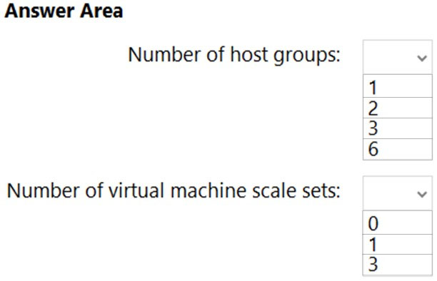

**Answer:**
Correct Answer:
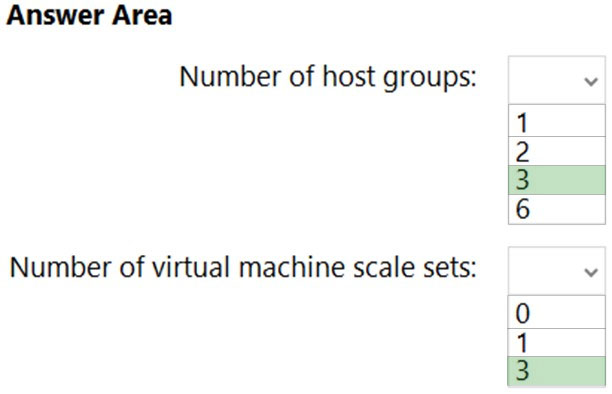

**Explication:**
- Box 1: 3 –
Need three host groups to meet the third scenario requirement below.
Scenario: App1 must meet the following requirements:
Be hosted in an Azure region that supports availability zones.
Be hosted on Azure virtual machines that support automatic scaling.
Maintain availability if two availability zones in the local Azure region fail.
- Box 2: 3 –
The availability setting of your host group should match your scale set.
* The host group and the scale set must be using the same availability zone.
* The fault domain count for the host group level should match the fault domain count for your scale set.

## Question Set 252

**Context:**
Introductory Info Case Study –
This is a case study. Case studies are not timed separately. You can use as much exam time as you would like to complete each case. However, there may be additional case studies and sections on this exam. You must manage your time to ensure that you are able to complete all questions included on this exam in the time provided.
To answer the questions included in a case study, you will need to reference information that is provided in the case study. Case studies might contain exhibits and other resources that provide more information about the scenario that is described in the case study. Each question is independent of the other questions in this case study.
At the end of this case study, a review screen will appear. This screen allows you to review your answers and to make changes before you move to the next section of the exam. After you begin a new section, you cannot return to this section.
To start the case study –
To display the first question in this case study, click the Next button. Use the buttons in the left pane to explore the content of the case study before you answer the questions. Clicking these buttons displays information such as business requirements, existing environment, and problem statements. If the case study has an All Information tab, note that the information displayed is identical to the information displayed on the subsequent tabs When you are ready to answer a question, click the Question button to return to the question.
Overview –
Litware , Inc. is a medium-sized finance company that has a main office in Boston.
Existing Environment –
Identity Environment –
The network contains an Active Directory forest named litware.com that is linked to an Azure Active Directory (Azure AD) tenant named litware.com. All users have Azure Active Directory Premium P2 licenses.
Litware has a second Azure AD tenant named dev.litware.com that is used as a development environment.
The litware.com tenant has a Conditional Access policy named Capolicy1. Capolicy1 requires that when users manage the Azure subscription for a production environment by using the Azure portal, they must connect from a hybrid Azure AD-joined device.
Azure Environment –
Litware has 10 Azure subscriptions that are linked to the Litware.com tenant and five Azure subscriptions that are linked to the dev.litware.com tenant. All the subscriptions are in an Enterprise Agreement (EA).
The litware.com tenant contains a custom Azure role-based access control (Azure RBAC) role named Role1 that grants the DataActions read permission to the blobs and files in Azure Storage.
On-Premises Environment –
The on-premises network of Litware contains the resources shown in the following table.

Network Environment –
Litware has ExpressRoute connectivity to Azure.
Planned Changes and Requirements
Planned Changes –
Litware plans to implement the following changes:
Migrate DB1 and DB2 to Azure.
Migrate App1 to Azure virtual machines.
Migrate the external storage used by App1 to Azure Storage.
Deploy the Azure virtual machines that will host App1 to Azure dedicated hosts.

Authentication and Authorization Requirements
Litware identifies the following authentication and authorization requirements:
Only users that manage the production environment by using the Azure portal must connect from a hybrid Azure AD-joined device and authenticate by using
Azure Multi-Factor Authentication (MFA).
The Network Contributor built-in RBAC role must be used to grant permissions to the network administrators for all the virtual networks in all the Azure subscriptions.
To access the resources in Azure, App1 must use the managed identity of the virtual machines that will host the app.
RBAC roles must be applied to management groups.
Resiliency Requirements –
Litware identifies the following resiliency requirements:
Once migrated to Azure, DB1 and DB2 must meet the following requirements:
– Maintain availability if two availability zones in the local Azure region fail.
– Fail over automatically.
– Minimize I/O latency.
App1 must meet the following requirements:
– Be hosted in an Azure region that supports availability zones.
– Be hosted on Azure virtual machines that support automatic scaling.
– Maintain availability if two availability zones in the local Azure region fail.
Security and Compliance Requirements
Litware identifies the following security and compliance requirements:
Once App1 is migrated to Azure, you must ensure that new data can be written to the app, and the modification of new and existing data is prevented for a period of three years.
On-premises users and services must be able to access the Azure Storage account that will host the data in App1.
Access to the public endpoint of the Azure Storage account that will host the App1 data must be prevented.
All Azure SQL databases in the production environment must have Transparent Data Encryption (TDE) enabled.
App1 must NOT share physical hardware with other workloads.
Business Requirements –
Litware identifies the following business requirements:
Minimize administrative effort.
Minimize costs .
Question

HOTSPOT –
You plan to migrate App1 to Azure.
You need to recommend a storage solution for App1 that meets the security and compliance requirements.

**Question:**
Which type of storage should you recommend, and how should you recommend configuring the storage? To answer, select the appropriate options in the answer area.
NOTE: Each correct selection is worth one point.
Hot Area:
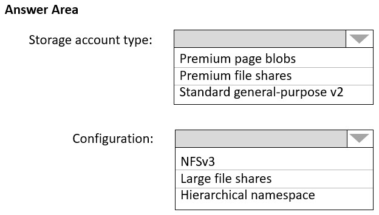

**Answer:**
Correct Answer:
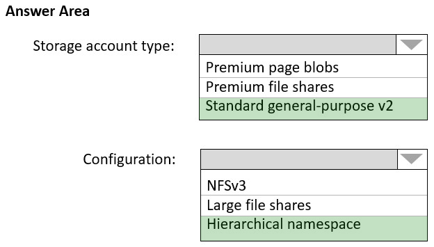

**Explication:**
- Box 1: Standard general-purpose v2
Standard general-purpose v2 supports Blob Storage.
Azure Storage provides data protection for Blob Storage and Azure Data Lake Storage Gen2.
Scenario:
Litware identifies the following security and compliance requirements:
- Once App1 is migrated to Azure, you must ensure that new data can be written to the app, and the modification of new and existing data is prevented for a period of three years.
- On-premises users and services must be able to access the Azure Storage account that will host the data in App1.
- Access to the public endpoint of the Azure Storage account that will host the App1 data must be prevented.
All Azure SQL databases in the production environment must have Transparent Data Encryption (TDE) enabled.
- App1 must NOT share physical hardware with other workloads.
- Box 2: Hierarchical namespace –
Scenario: Plan: Migrate App1 to Azure virtual machines.
Azure Data Lake Storage Gen2 implements an access control model that supports both Azure role-based access control (Azure RBAC) and POSIX-like access control lists (ACLs).
Data Lake Storage Gen2 and the Network File System (NFS) 3.0 protocol both require a storage account with a hierarchical namespace enabled.

## Question Set 253

**Context:**
Introductory Info Case Study –
This is a case study. Case studies are not timed separately. You can use as much exam time as you would like to complete each case. However, there may be additional case studies and sections on this exam. You must manage your time to ensure that you are able to complete all questions included on this exam in the time provided.
To answer the questions included in a case study, you will need to reference information that is provided in the case study. Case studies might contain exhibits and other resources that provide more information about the scenario that is described in the case study. Each question is independent of the other questions in this case study.
At the end of this case study, a review screen will appear. This screen allows you to review your answers and to make changes before you move to the next section of the exam. After you begin a new section, you cannot return to this section.
To start the case study –
To display the first question in this case study, click the Next button. Use the buttons in the left pane to explore the content of the case study before you answer the questions. Clicking these buttons displays information such as business requirements, existing environment, and problem statements. If the case study has an All Information tab, note that the information displayed is identical to the information displayed on the subsequent tabs When you are ready to answer a question, click the Question button to return to the question.
Overview –
Litware , Inc. is a medium-sized finance company that has a main office in Boston.
Existing Environment –
Identity Environment –
The network contains an Active Directory forest named litware.com that is linked to an Azure Active Directory (Azure AD) tenant named litware.com. All users have Azure Active Directory Premium P2 licenses.
Litware has a second Azure AD tenant named dev.litware.com that is used as a development environment.
The litware.com tenant has a Conditional Access policy named Capolicy1. Capolicy1 requires that when users manage the Azure subscription for a production environment by using the Azure portal, they must connect from a hybrid Azure AD-joined device.
Azure Environment –
Litware has 10 Azure subscriptions that are linked to the Litware.com tenant and five Azure subscriptions that are linked to the dev.litware.com tenant. All the subscriptions are in an Enterprise Agreement (EA).
The litware.com tenant contains a custom Azure role-based access control (Azure RBAC) role named Role1 that grants the DataActions read permission to the blobs and files in Azure Storage.
On-Premises Environment –
The on-premises network of Litware contains the resources shown in the following table.

Network Environment –
Litware has ExpressRoute connectivity to Azure.
Planned Changes and Requirements
Planned Changes –
Litware plans to implement the following changes:
Migrate DB1 and DB2 to Azure.
Migrate App1 to Azure virtual machines.
Migrate the external storage used by App1 to Azure Storage.
Deploy the Azure virtual machines that will host App1 to Azure dedicated hosts.

Authentication and Authorization Requirements
Litware identifies the following authentication and authorization requirements:
Only users that manage the production environment by using the Azure portal must connect from a hybrid Azure AD-joined device and authenticate by using
Azure Multi-Factor Authentication (MFA).
The Network Contributor built-in RBAC role must be used to grant permissions to the network administrators for all the virtual networks in all the Azure subscriptions.
To access the resources in Azure, App1 must use the managed identity of the virtual machines that will host the app.
RBAC roles must be applied to management groups.
Resiliency Requirements –
Litware identifies the following resiliency requirements:
Once migrated to Azure, DB1 and DB2 must meet the following requirements:
– Maintain availability if two availability zones in the local Azure region fail.
– Fail over automatically.
– Minimize I/O latency.
App1 must meet the following requirements:
– Be hosted in an Azure region that supports availability zones.
– Be hosted on Azure virtual machines that support automatic scaling.
– Maintain availability if two availability zones in the local Azure region fail.
Security and Compliance Requirements
Litware identifies the following security and compliance requirements:
Once App1 is migrated to Azure, you must ensure that new data can be written to the app, and the modification of new and existing data is prevented for a period of three years.
On-premises users and services must be able to access the Azure Storage account that will host the data in App1.
Access to the public endpoint of the Azure Storage account that will host the App1 data must be prevented.
All Azure SQL databases in the production environment must have Transparent Data Encryption (TDE) enabled.
App1 must NOT share physical hardware with other workloads.
Business Requirements –
Litware identifies the following business requirements:
Minimize administrative effort.
Minimize costs .
Question

You plan to migrate App1 to Azure.
You need to recommend a network connectivity solution for the Azure Storage account that will host the App1 data. The solution must meet the security and compliance requirements.

**Question:**
What should you include in the recommendation?
- A. Microsoft peering for an ExpressRoute circuit
- B. Azure public peering for an ExpressRoute circuit
- C. a service endpoint that has a service endpoint policy
- D. a private endpoint

**Answer:**
Correct Answer: D

**Explication:**
Private Endpoint securely connect to storage accounts from on-premises networks that connect to the VNet using VPN or ExpressRoutes with private-peering.
Private Endpoint also secure your storage account by configuring the storage firewall to block all connections on the public endpoint for the storage service.
Incorrect Answers:
A: Microsoft peering provides access to Azure public services via public endpoints with public IP addresses, which should not be allowed.
B: Azure public peering has been deprecated.
C: By default, Service Endpoints are enabled on subnets configured in Azure virtual networks. Endpoints can’t be used for traffic from your premises to Azure services.

## Question Set 254

**Context:**
Introductory Info Case Study –
This is a case study. Case studies are not timed separately. You can use as much exam time as you would like to complete each case. However, there may be additional case studies and sections on this exam. You must manage your time to ensure that you are able to complete all questions included on this exam in the time provided.
To answer the questions included in a case study, you will need to reference information that is provided in the case study. Case studies might contain exhibits and other resources that provide more information about the scenario that is described in the case study. Each question is independent of the other questions in this case study.
At the end of this case study, a review screen will appear. This screen allows you to review your answers and to make changes before you move to the next section of the exam. After you begin a new section, you cannot return to this section.
To start the case study –
To display the first question in this case study, click the Next button. Use the buttons in the left pane to explore the content of the case study before you answer the questions. Clicking these buttons displays information such as business requirements, existing environment, and problem statements. If the case study has an All Information tab, note that the information displayed is identical to the information displayed on the subsequent tabs When you are ready to answer a question, click the Question button to return to the question.
Overview –
Litware , Inc. is a medium-sized finance company that has a main office in Boston.
Existing Environment –
Identity Environment –
The network contains an Active Directory forest named litware.com that is linked to an Azure Active Directory (Azure AD) tenant named litware.com. All users have Azure Active Directory Premium P2 licenses.
Litware has a second Azure AD tenant named dev.litware.com that is used as a development environment.
The litware.com tenant has a Conditional Access policy named Capolicy1. Capolicy1 requires that when users manage the Azure subscription for a production environment by using the Azure portal, they must connect from a hybrid Azure AD-joined device.
Azure Environment –
Litware has 10 Azure subscriptions that are linked to the Litware.com tenant and five Azure subscriptions that are linked to the dev.litware.com tenant. All the subscriptions are in an Enterprise Agreement (EA).
The litware.com tenant contains a custom Azure role-based access control (Azure RBAC) role named Role1 that grants the DataActions read permission to the blobs and files in Azure Storage.
On-Premises Environment –
The on-premises network of Litware contains the resources shown in the following table.

Network Environment –
Litware has ExpressRoute connectivity to Azure.
Planned Changes and Requirements
Planned Changes –
Litware plans to implement the following changes:
Migrate DB1 and DB2 to Azure.
Migrate App1 to Azure virtual machines.
Migrate the external storage used by App1 to Azure Storage.
Deploy the Azure virtual machines that will host App1 to Azure dedicated hosts.

Authentication and Authorization Requirements
Litware identifies the following authentication and authorization requirements:
Only users that manage the production environment by using the Azure portal must connect from a hybrid Azure AD-joined device and authenticate by using
Azure Multi-Factor Authentication (MFA).
The Network Contributor built-in RBAC role must be used to grant permissions to the network administrators for all the virtual networks in all the Azure subscriptions.
To access the resources in Azure, App1 must use the managed identity of the virtual machines that will host the app.
RBAC roles must be applied to management groups.
Resiliency Requirements –
Litware identifies the following resiliency requirements:
Once migrated to Azure, DB1 and DB2 must meet the following requirements:
– Maintain availability if two availability zones in the local Azure region fail.
– Fail over automatically.
– Minimize I/O latency.
App1 must meet the following requirements:
– Be hosted in an Azure region that supports availability zones.
– Be hosted on Azure virtual machines that support automatic scaling.
– Maintain availability if two availability zones in the local Azure region fail.
Security and Compliance Requirements
Litware identifies the following security and compliance requirements:
Once App1 is migrated to Azure, you must ensure that new data can be written to the app, and the modification of new and existing data is prevented for a period of three years.
On-premises users and services must be able to access the Azure Storage account that will host the data in App1.
Access to the public endpoint of the Azure Storage account that will host the App1 data must be prevented.
All Azure SQL databases in the production environment must have Transparent Data Encryption (TDE) enabled.
App1 must NOT share physical hardware with other workloads.
Business Requirements –
Litware identifies the following business requirements:
Minimize administrative effort.
Minimize costs.
Question You need to implement the Azure RBAC role assignments for the Network Contributor role. The solution must meet the authentication and authorization requirements.

**Question:**
What is the minimum number of assignments that you must use?
- A. 1
- B. 2
- C. 5
- D. 10
- E. 15

**Answer:**
Correct Answer: B

**Explication:**
Scenario: The Network Contributor built-in RBAC role must be used to grant permissions to the network administrators for all the virtual networks in all the Azure subscriptions.
RBAC roles must be applied at the highest level possible.

## Question Set 255

**Context:**
Introductory Info Case Study –
This is a case study. Case studies are not timed separately. You can use as much exam time as you would like to complete each case. However, there may be additional case studies and sections on this exam. You must manage your time to ensure that you are able to complete all questions included on this exam in the time provided.
To answer the questions included in a case study, you will need to reference information that is provided in the case study. Case studies might contain exhibits and other resources that provide more information about the scenario that is described in the case study. Each question is independent of the other questions in this case study.
At the end of this case study, a review screen will appear. This screen allows you to review your answers and to make changes before you move to the next section of the exam. After you begin a new section, you cannot return to this section.
To start the case study –
To display the first question in this case study, click the Next button. Use the buttons in the left pane to explore the content of the case study before you answer the questions. Clicking these buttons displays information such as business requirements, existing environment, and problem statements. If the case study has an All Information tab, note that the information displayed is identical to the information displayed on the subsequent tabs When you are ready to answer a question, click the Question button to return to the question.
Overview –
Litware , Inc. is a medium-sized finance company that has a main office in Boston.
Existing Environment –
Identity Environment –
The network contains an Active Directory forest named litware.com that is linked to an Azure Active Directory (Azure AD) tenant named litware.com. All users have Azure Active Directory Premium P2 licenses.
Litware has a second Azure AD tenant named dev.litware.com that is used as a development environment.
The litware.com tenant has a Conditional Access policy named Capolicy1. Capolicy1 requires that when users manage the Azure subscription for a production environment by using the Azure portal, they must connect from a hybrid Azure AD-joined device.
Azure Environment –
Litware has 10 Azure subscriptions that are linked to the Litware.com tenant and five Azure subscriptions that are linked to the dev.litware.com tenant. All the subscriptions are in an Enterprise Agreement (EA).
The litware.com tenant contains a custom Azure role-based access control (Azure RBAC) role named Role1 that grants the DataActions read permission to the blobs and files in Azure Storage.
On-Premises Environment –
The on-premises network of Litware contains the resources shown in the following table.

Network Environment –
Litware has ExpressRoute connectivity to Azure.
Planned Changes and Requirements
Planned Changes –
Litware plans to implement the following changes:
Migrate DB1 and DB2 to Azure.
Migrate App1 to Azure virtual machines.
Migrate the external storage used by App1 to Azure Storage.
Deploy the Azure virtual machines that will host App1 to Azure dedicated hosts.

Authentication and Authorization Requirements
Litware identifies the following authentication and authorization requirements:
Only users that manage the production environment by using the Azure portal must connect from a hybrid Azure AD-joined device and authenticate by using
Azure Multi-Factor Authentication (MFA).
The Network Contributor built-in RBAC role must be used to grant permissions to the network administrators for all the virtual networks in all the Azure subscriptions.
To access the resources in Azure, App1 must use the managed identity of the virtual machines that will host the app.
RBAC roles must be applied to management groups.
Resiliency Requirements –
Litware identifies the following resiliency requirements:
Once migrated to Azure, DB1 and DB2 must meet the following requirements:
– Maintain availability if two availability zones in the local Azure region fail.
– Fail over automatically.
– Minimize I/O latency.
App1 must meet the following requirements:
– Be hosted in an Azure region that supports availability zones.
– Be hosted on Azure virtual machines that support automatic scaling.
– Maintain availability if two availability zones in the local Azure region fail.
Security and Compliance Requirements
Litware identifies the following security and compliance requirements:
Once App1 is migrated to Azure, you must ensure that new data can be written to the app, and the modification of new and existing data is prevented for a period of three years.
On-premises users and services must be able to access the Azure Storage account that will host the data in App1.
Access to the public endpoint of the Azure Storage account that will host the App1 data must be prevented.
All Azure SQL databases in the production environment must have Transparent Data Encryption (TDE) enabled.
App1 must NOT share physical hardware with other workloads.
Business Requirements –
Litware identifies the following business requirements:
Minimize administrative effort.
Minimize costs .
Question DRAG DROP –

You need to configure an Azure policy to ensure that the Azure SQL databases have Transparent Data Encryption (TDE) enabled. The solution must meet the security and compliance requirements.

**Question:**
Which three actions should you perform in sequence? To answer, move the appropriate actions from the list of actions to the answer area and arrange them in the correct order.
Select and Place:
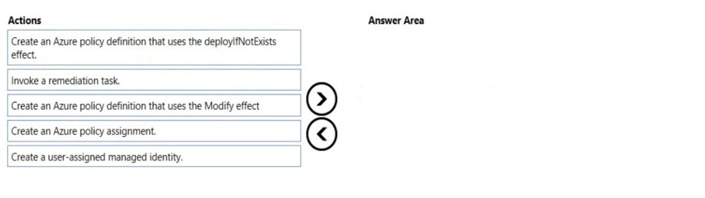

**Answer:**
Correct Answer:
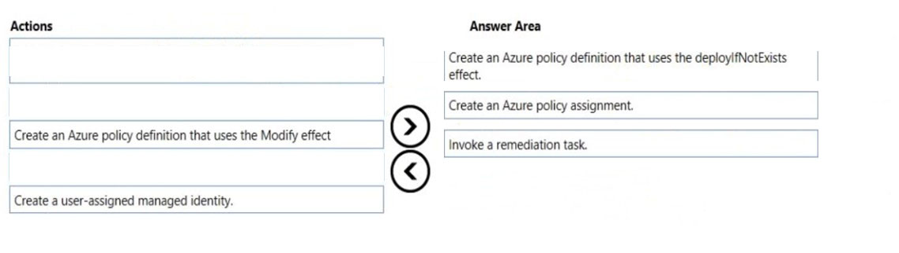

**Explication:**
Step 1: Create an Azure policy definition that uses the deployIfNotExists
The first step is to define the roles that deployIfNotExists and modify needs in the policy definition to successfully deploy the content of your included template.
Step 2: Create an Azure policy assignment
When creating an assignment using the portal, Azure Policy both generates the managed identity and grants it the roles defined in roleDefinitionIds .
Step 3: Invoke a remediation task.
Resources that are non-compliant to a deployIfNotExists or modify policy can be put into a compliant state through Remediation. Remediation is accomplished by instructing Azure Policy to run the deployIfNotExists effect or the modify operations of the assigned policy on your existing resources and subscriptions, whether that assignment is to a management group, a subscription, a resource group, or an individual resource.
During evaluation, the policy assignment with deployIfNotExists or modify effects determines if there are non-compliant resources or subscriptions. When non- compliant resources or subscriptions are found, the details are provided on the Remediation page.
Topic 9 – Testlet 2

## Question Set 256

**Context:**
Introductory Info Case Study –
This is a case study. Case studies are not timed separately. You can use as much exam time as you would like to complete each case. However, there may be additional case studies and sections on this exam. You must manage your time to ensure that you are able to complete all questions included on this exam in the time provided.
To answer the questions included in a case study, you will need to reference information that is provided in the case study. Case studies might contain exhibits and other resources that provide more information about the scenario that is described in the case study. Each question is independent of the other questions in this case study.
At the end of this case study, a review screen will appear. This screen allows you to review your answers and to make changes before you move to the next section of the exam. After you begin a new section, you cannot return to this section.
To start the case study –
To display the first question in this case study, click the Next button. Use the buttons in the left pane to explore the content of the case study before you answer the questions. Clicking these buttons displays information such as business requirements, existing environment, and problem statements. If the case study has an All Information tab, note that the information displayed is identical to the information displayed on the subsequent tabs. When you are ready to answer a question, click the Question button to return to the question.
Overview –
Fabrikam , Inc. is an engineering company that has offices throughout Europe. The company has a main office in London and three branch offices in Amsterdam,
Berlin, and Rome.
Existing Environment: Active Directory Environment
The network contains two Active Directory forests named corp.fabrikam.com and rd.fabrikam.com. There are no trust relationships between the forests.
Corp.fabrikam.com is a production forest that contains identities used for internal user and computer authentication.
Rd.fabrikam.com is used by the research and development (R&D) department only. The R&D department is restricted to using on-premises resources only.
Existing Environment: Network Infrastructure
Each office contains at least one domain controller from the corp.fabrikam.com domain. The main office contains all the domain controllers for the rd.fabrikam.com forest.
All the offices have a high-speed connection to the internet.
An existing application named WebApp1 is hosted in the data center of the London office. WebApp1 is used by customers to place and track orders. WebApp1 has a web tier that uses Microsoft Internet Information Services (IIS) and a database tier that runs Microsoft SQL Server 2016. The web tier and the database tier are deployed to virtual machines that run on Hyper-V.
The IT department currently uses a separate Hyper-V environment to test updates to WebApp1.
Fabrikam purchases all Microsoft licenses through a Microsoft Enterprise Agreement that includes Software Assurance.
Existing Environment: Problem Statements
The use of WebApp1 is unpredictable. At peak times, users often report delays. At other times, many resources for WebApp1 are underutilized.
Requirements: Planned Changes –
Fabrikam plans to move most of its production workloads to Azure during the next few years, including virtual machines that rely on Active Directory for authentication.
As one of its first projects, the company plans to establish a hybrid identity model, facilitating an upcoming Microsoft 365 deployment.
All R&D operations will remain on-premises.
Fabrikam plans to migrate the production and test instances of WebApp1 to Azure.
Requirements: Technical Requirements
Fabrikam identifies the following technical requirements:
Website content must be easily updated from a single point.
User input must be minimized when provisioning new web app instances.
Whenever possible, existing on-premises licenses must be used to reduce cost.
Users must always authenticate by using their corp.fabrikam.com UPN identity.
Any new deployments to Azure must be redundant in case an Azure region fails.
Whenever possible, solutions must be deployed to Azure by using the Standard pricing tier of Azure App Service.
An email distribution group named IT Support must be notified of any issues relating to the directory synchronization services.
In the event that a link fails between Azure and the on-premises network, ensure that the virtual machines hosted in Azure can authenticate to Active Directory.
Directory synchronization between Azure Active Directory (Azure AD) and corp.fabrikam.com must not be affected by a link failure between Azure and the on- premises network.
Requirements: Database Requirements
Fabrikam identifies the following database requirements:
Database metrics for the production instance of WebApp1 must be available for analysis so that database administrators can optimize the performance settings.
To avoid disrupting customer access, database downtime must be minimized when databases are migrated.
Database backups must be retained for a minimum of seven years to meet compliance requirements.
Requirements: Security Requirements
Fabrikam identifies the following security requirements:
Company information including policies, templates, and data must be inaccessible to anyone outside the company.
Users on the on-premises network must be able to authenticate to corp.fabrikam.com if an internet link fails.
Administrators must be able authenticate to the Azure portal by using their corp.fabrikam.com credentials.
All administrative access to the Azure portal must be secured by using multi-factor authentication (MFA).
The testing of WebApp1 updates must not be visible to anyone outside the company. Question HOTSPOT –

**Question:**
To meet the authentication requirements of Fabrikam , what should you include in the solution? To answer, select the appropriate options in the answer area.
NOTE: Each correct selection is worth one point.
Hot Area:
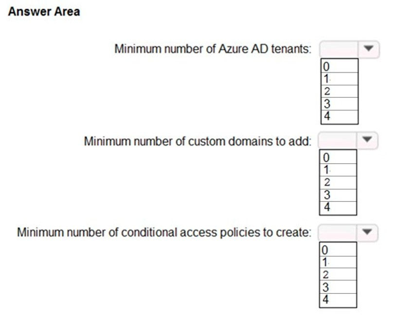

**Answer:**
Correct Answer:
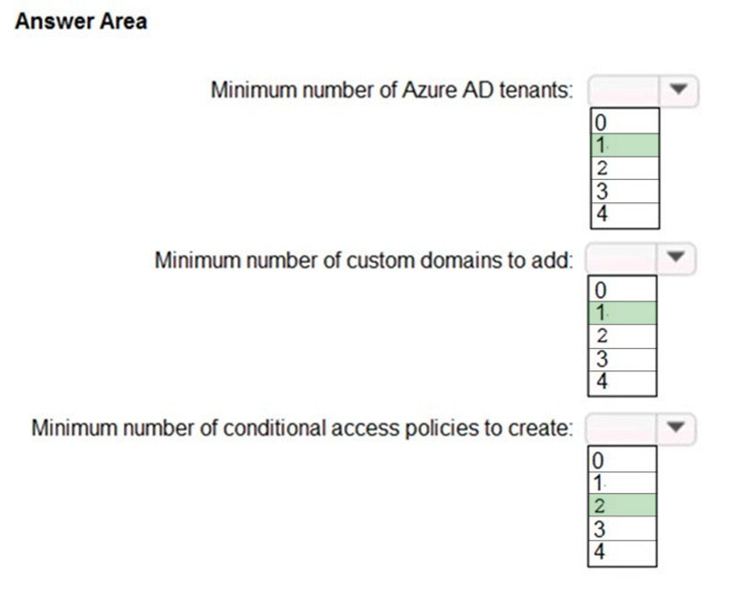

**Explication:**
- Box 1: 1 –
One single Azure AD tenant is needed as only the Corp tenant is migrated.
- Box 2: 1 –
- Box 3: 2 –
One conditional access policy for Multi-Factor Authentication (MFA) will be used for administative access, and a second conditional access policy in order to prevent external access.

## Question Set 257

**Context:**
Introductory Info Case Study –
This is a case study. Case studies are not timed separately. You can use as much exam time as you would like to complete each case. However, there may be additional case studies and sections on this exam. You must manage your time to ensure that you are able to complete all questions included on this exam in the time provided.
To answer the questions included in a case study, you will need to reference information that is provided in the case study. Case studies might contain exhibits and other resources that provide more information about the scenario that is described in the case study. Each question is independent of the other questions in this case study.
At the end of this case study, a review screen will appear. This screen allows you to review your answers and to make changes before you move to the next section of the exam. After you begin a new section, you cannot return to this section.
To start the case study –
To display the first question in this case study, click the Next button. Use the buttons in the left pane to explore the content of the case study before you answer the questions. Clicking these buttons displays information such as business requirements, existing environment, and problem statements. If the case study has an All Information tab, note that the information displayed is identical to the information displayed on the subsequent tabs. When you are ready to answer a question, click the Question button to return to the question.
Overview –
Fabrikam , Inc. is an engineering company that has offices throughout Europe. The company has a main office in London and three branch offices in Amsterdam,
Berlin, and Rome.
Existing Environment: Active Directory Environment
The network contains two Active Directory forests named corp.fabrikam.com and rd.fabrikam.com. There are no trust relationships between the forests.
Corp.fabrikam.com is a production forest that contains identities used for internal user and computer authentication.
Rd.fabrikam.com is used by the research and development (R&D) department only. The R&D department is restricted to using on-premises resources only.
Existing Environment: Network Infrastructure
Each office contains at least one domain controller from the corp.fabrikam.com domain. The main office contains all the domain controllers for the rd.fabrikam.com forest.
All the offices have a high-speed connection to the internet.
An existing application named WebApp1 is hosted in the data center of the London office. WebApp1 is used by customers to place and track orders. WebApp1 has a web tier that uses Microsoft Internet Information Services (IIS) and a database tier that runs Microsoft SQL Server 2016. The web tier and the database tier are deployed to virtual machines that run on Hyper-V.
The IT department currently uses a separate Hyper-V environment to test updates to WebApp1.
Fabrikam purchases all Microsoft licenses through a Microsoft Enterprise Agreement that includes Software Assurance.
Existing Environment: Problem Statements
The use of WebApp1 is unpredictable. At peak times, users often report delays. At other times, many resources for WebApp1 are underutilized.
Requirements: Planned Changes –
Fabrikam plans to move most of its production workloads to Azure during the next few years, including virtual machines that rely on Active Directory for authentication.
As one of its first projects, the company plans to establish a hybrid identity model, facilitating an upcoming Microsoft 365 deployment.
All R&D operations will remain on-premises.
Fabrikam plans to migrate the production and test instances of WebApp1 to Azure.
Requirements: Technical Requirements
Fabrikam identifies the following technical requirements:
Website content must be easily updated from a single point.
User input must be minimized when provisioning new web app instances.
Whenever possible, existing on-premises licenses must be used to reduce cost.
Users must always authenticate by using their corp.fabrikam.com UPN identity.
Any new deployments to Azure must be redundant in case an Azure region fails.
Whenever possible, solutions must be deployed to Azure by using the Standard pricing tier of Azure App Service.
An email distribution group named IT Support must be notified of any issues relating to the directory synchronization services.
In the event that a link fails between Azure and the on-premises network, ensure that the virtual machines hosted in Azure can authenticate to Active Directory.
Directory synchronization between Azure Active Directory (Azure AD) and corp.fabrikam.com must not be affected by a link failure between Azure and the on- premises network.
Requirements: Database Requirements
Fabrikam identifies the following database requirements:
Database metrics for the production instance of WebApp1 must be available for analysis so that database administrators can optimize the performance settings.
To avoid disrupting customer access, database downtime must be minimized when databases are migrated.
Database backups must be retained for a minimum of seven years to meet compliance requirements.
Requirements: Security Requirements
Fabrikam identifies the following security requirements:
Company information including policies, templates, and data must be inaccessible to anyone outside the company.
Users on the on-premises network must be able to authenticate to corp.fabrikam.com if an internet link fails.
Administrators must be able authenticate to the Azure portal by using their corp.fabrikam.com credentials.
All administrative access to the Azure portal must be secured by using multi-factor authentication (MFA).
The testing of WebApp1 updates must not be visible to anyone outside the company. Question You need to recommend a notification solution for the IT Support distribution group.

**Question:**
What should you include in the recommendation?
- A. a SendGrid account with advanced reporting
- B. an action group
- C. Azure Network Watcher
- D. Azure AD Connect Health

**Answer:**
Correct Answer: D

**Explication:**
An email distribution group named IT Support must be notified of any issues relating to the directory synchronization services.
Note: You can configure the Azure AD Connect Health service to send email notifications when alerts indicate that your identity infrastructure is not healthy. his occurs when an alert is generated, and when it is resolved.
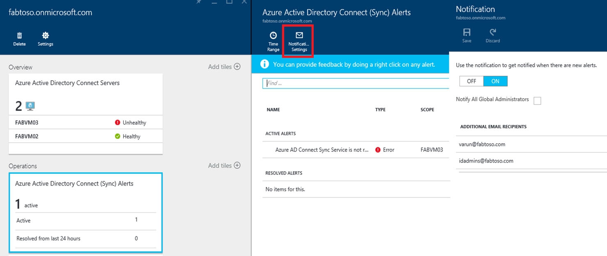

## Question Set 258

**Context:**
Introductory Info Case Study –
This is a case study. Case studies are not timed separately. You can use as much exam time as you would like to complete each case. However, there may be additional case studies and sections on this exam. You must manage your time to ensure that you are able to complete all questions included on this exam in the time provided.
To answer the questions included in a case study, you will need to reference information that is provided in the case study. Case studies might contain exhibits and other resources that provide more information about the scenario that is described in the case study. Each question is independent of the other questions in this case study.
At the end of this case study, a review screen will appear. This screen allows you to review your answers and to make changes before you move to the next section of the exam. After you begin a new section, you cannot return to this section.
To start the case study –
To display the first question in this case study, click the Next button. Use the buttons in the left pane to explore the content of the case study before you answer the questions. Clicking these buttons displays information such as business requirements, existing environment, and problem statements. If the case study has an All Information tab, note that the information displayed is identical to the information displayed on the subsequent tabs. When you are ready to answer a question, click the Question button to return to the question.
Overview –
Fabrikam , Inc. is an engineering company that has offices throughout Europe. The company has a main office in London and three branch offices in Amsterdam,
Berlin, and Rome.
Existing Environment: Active Directory Environment
The network contains two Active Directory forests named corp.fabrikam.com and rd.fabrikam.com. There are no trust relationships between the forests.
Corp.fabrikam.com is a production forest that contains identities used for internal user and computer authentication.
Rd.fabrikam.com is used by the research and development (R&D) department only. The R&D department is restricted to using on-premises resources only.
Existing Environment: Network Infrastructure
Each office contains at least one domain controller from the corp.fabrikam.com domain. The main office contains all the domain controllers for the rd.fabrikam.com forest.
All the offices have a high-speed connection to the internet.
An existing application named WebApp1 is hosted in the data center of the London office. WebApp1 is used by customers to place and track orders. WebApp1 has a web tier that uses Microsoft Internet Information Services (IIS) and a database tier that runs Microsoft SQL Server 2016. The web tier and the database tier are deployed to virtual machines that run on Hyper-V.
The IT department currently uses a separate Hyper-V environment to test updates to WebApp1.
Fabrikam purchases all Microsoft licenses through a Microsoft Enterprise Agreement that includes Software Assurance.
Existing Environment: Problem Statements
The use of WebApp1 is unpredictable. At peak times, users often report delays. At other times, many resources for WebApp1 are underutilized.
Requirements: Planned Changes –
Fabrikam plans to move most of its production workloads to Azure during the next few years, including virtual machines that rely on Active Directory for authentication.
As one of its first projects, the company plans to establish a hybrid identity model, facilitating an upcoming Microsoft 365 deployment.
All R&D operations will remain on-premises.
Fabrikam plans to migrate the production and test instances of WebApp1 to Azure.
Requirements: Technical Requirements
Fabrikam identifies the following technical requirements:
Website content must be easily updated from a single point.
User input must be minimized when provisioning new web app instances.
Whenever possible, existing on-premises licenses must be used to reduce cost.
Users must always authenticate by using their corp.fabrikam.com UPN identity.
Any new deployments to Azure must be redundant in case an Azure region fails.
Whenever possible, solutions must be deployed to Azure by using the Standard pricing tier of Azure App Service.
An email distribution group named IT Support must be notified of any issues relating to the directory synchronization services.
In the event that a link fails between Azure and the on-premises network, ensure that the virtual machines hosted in Azure can authenticate to Active Directory.
Directory synchronization between Azure Active Directory (Azure AD) and corp.fabrikam.com must not be affected by a link failure between Azure and the on- premises network.
Requirements: Database Requirements
Fabrikam identifies the following database requirements:
Database metrics for the production instance of WebApp1 must be available for analysis so that database administrators can optimize the performance settings.
To avoid disrupting customer access, database downtime must be minimized when databases are migrated.
Database backups must be retained for a minimum of seven years to meet compliance requirements.
Requirements: Security Requirements
Fabrikam identifies the following security requirements:
Company information including policies, templates, and data must be inaccessible to anyone outside the company.
Users on the on-premises network must be able to authenticate to corp.fabrikam.com if an internet link fails.
Administrators must be able authenticate to the Azure portal by using their corp.fabrikam.com credentials.
All administrative access to the Azure portal must be secured by using multi-factor authentication (MFA).
The testing of WebApp1 updates must not be visible to anyone outside the company. Question You need to recommend a solution to meet the database retention requirements.

**Question:**
What should you recommend?
- A. Configure a long-term retention policy for the database.
- B. Configure Azure Site Recovery.
- C. Use automatic Azure SQL Database backups.
- D. Configure geo-replication of the database.

**Answer:**
Correct Answer: A

**Explication:**
Scenario: Database backups must be retained for a minimum of seven years to meet compliance requirements.
Many applications have regulatory, compliance, or other business purposes that require you to retain database backups beyond the 7-35 days provided by Azure
SQL Database and Azure SQL Managed Instance automatic backups. By using the long-term retention (LTR) feature, you can store specified SQL Database and
SQL Managed Instance full backups in Azure Blob storage with configured redundancy for up to 10 years. LTR backups can then be restored as a new database.
Topic 10 – Testlet 3

## Question Set 259

**Context:**
Introductory Info Case Study –
This is a case study. Case studies are not timed separately. You can use as much exam time as you would like to complete each case. However, there may be additional case studies and sections on this exam. You must manage your time to ensure that you are able to complete all questions included on this exam in the time provided.
To answer the questions included in a case study, you will need to reference information that is provided in the case study. Case studies might contain exhibits and other resources that provide more information about the scenario that is described in the case study. Each question is independent of the other questions in this case study.
At the end of this case study, a review screen will appear. This screen allows you to review your answers and to make changes before you move to the next section of the exam. After you begin a new section, you cannot return to this section.
To start the case study –
To display the first question in this case study, click the Next button. Use the buttons in the left pane to explore the content of the case study before you answer the questions. Clicking these buttons displays information such as business requirements, existing environment, and problem statements. If the case study has an All Information tab, note that the information displayed is identical to the information displayed on the subsequent tabs. When you are ready to answer a question, click the Question button to return to the question.
Overview –
Contoso, Ltd. is a research company that has a main office in Montreal.
Existing Environment: Technical Environment
The on-premises network contains a single Active Directory domain named contoso.com.
Contoso has a single Azure subscription.
Existing Environment: Business Partnerships
Contoso has a business partnership with Fabrikam , Inc. Fabrikam users access some Contoso applications over the internet by using Azure Active Directory
(Azure AD) guest accounts.
Requirements: Planned Changes –
Contoso plans to deploy two applications named App1 and App2 to Azure.
Requirements: App1 –
App1 will be a Python web app hosted in Azure App Service that requires a Linux runtime. Users from Contoso and Fabrikam will access App1.
App1 will access several services that require third-party credentials and access strings. The credentials and access strings are stored in Azure Key Vault.
App1 will have six instances: three in the East US Azure region and three in the West Europe Azure region.
App1 has the following data requirements:
Each instance will write data to a data store in the same availability zone as the instance.
Data written by any App1 instance must be visible to all App1 instances.
App1 will only be accessible from the internet. App1 has the following connection requirements:
Connections to App1 must pass through a web application firewall (WAF).
Connections to App1 must be active-active load balanced between instances.
All connections to App1 from North America must be directed to the East US region. All other connections must be directed to the West Europe region.
Every hour, you will run a maintenance task by invoking a PowerShell script that copies files from all the App1 instances. The PowerShell script will run from a central location.
Requirements: App2 –
App2 will be a .NET app hosted in App Service that requires a Windows runtime. App2 has the following file storage requirements:
Save files to an Azure Storage account.
Replicate files to an on-premises location.
Ensure that on-premises clients can read the files over the LAN by using the SMB protocol.
You need to monitor App2 to analyze how long it takes to perform different transactions within the application. The solution must not require changes to the application code.
Application Development Requirements
Application developers will constantly develop new versions of App1 and App2. The development process must meet the following requirements:
A staging instance of a new application version must be deployed to the application host before the new version is used in production.
After testing the new version, the staging version of the application will replace the production version.
The switch to the new application version from staging to production must occur without any downtime of the application.
Identity Requirements –
Contoso identifies the following requirements for managing Fabrikam access to resources:
Every month, an account manager at Fabrikam must review which Fabrikam users have access permissions to App1. Accounts that no longer need permissions must be removed as guests.
The solution must minimize development effort.
Security Requirement –
All secrets used by Azure services must be stored in Azure Key Vault.
Services that require credentials must have the credentials tied to the service instance. The credentials must NOT be shared between services. Question HOTSPOT –

**Question:**
What should you implement to meet the identity requirements? To answer, select the appropriate options in the answer area.
NOTE: Each correct selection is worth one point.
Hot Area:
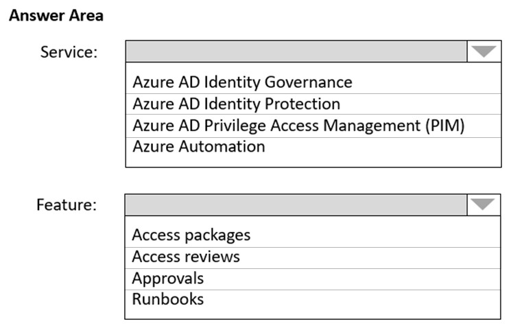

**Answer:**
Correct Answer:
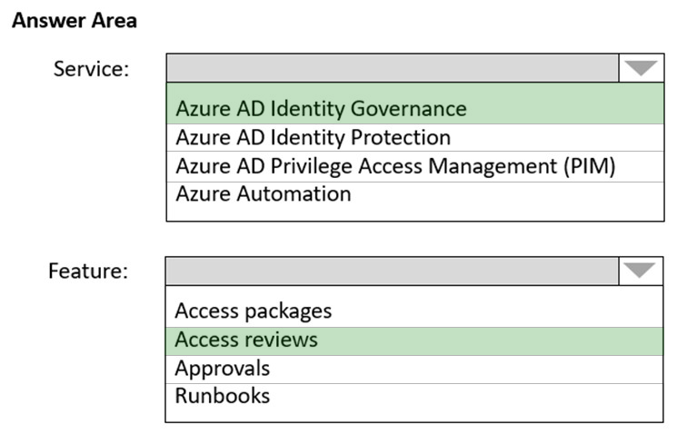

**Explication:**
Requirements: Identity Requirements
Contoso identifies the following requirements for managing Fabrikam access to resources:
* Every month, an account manager at Fabrikam must review which Fabrikam users have access permissions to App1. Accounts that no longer need permissions must be removed as guests.
* The solution must minimize development effort.
- Box 1: Azure AD Identity Governance
Incorrect:
Not PIM: Life Cycle Requirements must be met.
- Box 2: Access reviews –
Azure Active Directory (Azure AD) access reviews enable organizations to efficiently manage group memberships, access to enterprise applications, and role assignments. User’s access can be reviewed on a regular basis to make sure only the right people have continued access.

## Question Set 260

**Context:**
Introductory Info Case Study –
This is a case study. Case studies are not timed separately. You can use as much exam time as you would like to complete each case. However, there may be additional case studies and sections on this exam. You must manage your time to ensure that you are able to complete all questions included on this exam in the time provided.
To answer the questions included in a case study, you will need to reference information that is provided in the case study. Case studies might contain exhibits and other resources that provide more information about the scenario that is described in the case study. Each question is independent of the other questions in this case study.
At the end of this case study, a review screen will appear. This screen allows you to review your answers and to make changes before you move to the next section of the exam. After you begin a new section, you cannot return to this section.
To start the case study –
To display the first question in this case study, click the Next button. Use the buttons in the left pane to explore the content of the case study before you answer the questions. Clicking these buttons displays information such as business requirements, existing environment, and problem statements. If the case study has an All Information tab, note that the information displayed is identical to the information displayed on the subsequent tabs. When you are ready to answer a question, click the Question button to return to the question.
Overview –
Contoso, Ltd. is a research company that has a main office in Montreal.
Existing Environment: Technical Environment
The on-premises network contains a single Active Directory domain named contoso.com.
Contoso has a single Azure subscription.
Existing Environment: Business Partnerships
Contoso has a business partnership with Fabrikam , Inc. Fabrikam users access some Contoso applications over the internet by using Azure Active Directory
(Azure AD) guest accounts.
Requirements: Planned Changes –
Contoso plans to deploy two applications named App1 and App2 to Azure.
Requirements: App1 –
App1 will be a Python web app hosted in Azure App Service that requires a Linux runtime. Users from Contoso and Fabrikam will access App1.
App1 will access several services that require third-party credentials and access strings. The credentials and access strings are stored in Azure Key Vault.
App1 will have six instances: three in the East US Azure region and three in the West Europe Azure region.
App1 has the following data requirements:
Each instance will write data to a data store in the same availability zone as the instance.
Data written by any App1 instance must be visible to all App1 instances.
App1 will only be accessible from the internet. App1 has the following connection requirements:
Connections to App1 must pass through a web application firewall (WAF).
Connections to App1 must be active-active load balanced between instances.
All connections to App1 from North America must be directed to the East US region. All other connections must be directed to the West Europe region.
Every hour, you will run a maintenance task by invoking a PowerShell script that copies files from all the App1 instances. The PowerShell script will run from a central location.
Requirements: App2 –
App2 will be a .NET app hosted in App Service that requires a Windows runtime. App2 has the following file storage requirements:
Save files to an Azure Storage account.
Replicate files to an on-premises location.
Ensure that on-premises clients can read the files over the LAN by using the SMB protocol.
You need to monitor App2 to analyze how long it takes to perform different transactions within the application. The solution must not require changes to the application code.
Application Development Requirements
Application developers will constantly develop new versions of App1 and App2. The development process must meet the following requirements:
A staging instance of a new application version must be deployed to the application host before the new version is used in production.
After testing the new version, the staging version of the application will replace the production version.
The switch to the new application version from staging to production must occur without any downtime of the application.
Identity Requirements –
Contoso identifies the following requirements for managing Fabrikam access to resources:
Every month, an account manager at Fabrikam must review which Fabrikam users have access permissions to App1. Accounts that no longer need permissions must be removed as guests.
The solution must minimize development effort.
Security Requirement –
All secrets used by Azure services must be stored in Azure Key Vault.

**Question:**
Services that require credentials must have the credentials tied to the service instance. The credentials must NOT be shared between services. Question What should you recommend to meet the monitoring requirements for App2?
- A. VM insights
- B. Azure Application Insights
- C. Microsoft Sentinel
- D. Container insights

**Answer:**
Correct Answer: B

**Explication:**
Scenario: You need to monitor App2 to analyze how long it takes to perform different transactions within the application. The solution must not require changes to the application code.
Unified cross-component transaction diagnostics.
The unified diagnostics experience automatically correlates server-side telemetry from across all your Application Insights monitored components into a single view. It doesn’t matter if you have multiple resources. Application Insights detects the underlying relationship and allows you to easily diagnose the application component, dependency, or exception that caused a transaction slowdown or failure.
Note: Components are independently deployable parts of your distributed/microservices application. Developers and operations teams have code-level visibility or access to telemetry generated by these application components.
Topic 11 – Testlet 4

## Question Set 261

**Context:**
Introductory Info Case Study –
This is a case study. Case studies are not timed separately. You can use as much exam time as you would like to complete each case. However, there may be additional case studies and sections on this exam. You must manage your time to ensure that you are able to complete all questions included on this exam in the time provided.
To answer the questions included in a case study, you will need to reference information that is provided in the case study. Case studies might contain exhibits and other resources that provide more information about the scenario that is described in the case study. Each question is independent of the other questions in this case study.
At the end of this case study, a review screen will appear. This screen allows you to review your answers and to make changes before you move to the next section of the exam. After you begin a new section, you cannot return to this section.
To start the case study –
To display the first question in this case study, click the Next button. Use the buttons in the left pane to explore the content of the case study before you answer the questions. Clicking these buttons displays information such as business requirements, existing environment, and problem statements. If the case study has an All Information tab, note that the information displayed is identical to the information displayed on the subsequent tabs. When you are ready to answer a question, click the Question button to return to the question.
Overview –
Fabrikam , Inc. is an engineering company that has offices throughout Europe. The company has a main office in London and three branch offices in Amsterdam,
Berlin, and Rome.
Existing Environment: Active Directory Environment
The network contains two Active Directory forests named corp.fabrikam.com and rd.fabrikam.com. There are no trust relationships between the forests.
Corp.fabrikam.com is a production forest that contains identities used for internal user and computer authentication.
Rd.fabrikam.com is used by the research and development (R&D) department only. The R&D department is restricted to using on-premises resources only.
Existing Environment: Network Infrastructure
Each office contains at least one domain controller from the corp.fabrikam.com domain. The main office contains all the domain controllers for the rd.fabrikam.com forest.
All the offices have a high-speed connection to the internet.
An existing application named WebApp1 is hosted in the data center of the London office. WebApp1 is used by customers to place and track orders. WebApp1 has a web tier that uses Microsoft Internet Information Services (IIS) and a database tier that runs Microsoft SQL Server 2016. The web tier and the database tier are deployed to virtual machines that run on Hyper-V.
The IT department currently uses a separate Hyper-V environment to test updates to WebApp1.
Fabrikam purchases all Microsoft licenses through a Microsoft Enterprise Agreement that includes Software Assurance.
Existing Environment: Problem Statements
The use of WebApp1 is unpredictable. At peak times, users often report delays. At other times, many resources for WebApp1 are underutilized.
Requirements: Planned Changes –
Fabrikam plans to move most of its production workloads to Azure during the next few years, including virtual machines that rely on Active Directory for authentication.
As one of its first projects, the company plans to establish a hybrid identity model, facilitating an upcoming Microsoft 365 deployment.
All R&D operations will remain on-premises.
Fabrikam plans to migrate the production and test instances of WebApp1 to Azure.
Requirements: Technical Requirements
Fabrikam identifies the following technical requirements:
Website content must be easily updated from a single point.
User input must be minimized when provisioning new web app instances.
Whenever possible, existing on-premises licenses must be used to reduce cost.
Users must always authenticate by using their corp.fabrikam.com UPN identity.
Any new deployments to Azure must be redundant in case an Azure region fails.
Whenever possible, solutions must be deployed to Azure by using the Standard pricing tier of Azure App Service.
An email distribution group named IT Support must be notified of any issues relating to the directory synchronization services.
In the event that a link fails between Azure and the on-premises network, ensure that the virtual machines hosted in Azure can authenticate to Active Directory.
Directory synchronization between Azure Active Directory (Azure AD) and corp.fabrikam.com must not be affected by a link failure between Azure and the on- premises network.
Requirements: Database Requirements
Fabrikam identifies the following database requirements:
Database metrics for the production instance of WebApp1 must be available for analysis so that database administrators can optimize the performance settings.
To avoid disrupting customer access, database downtime must be minimized when databases are migrated.
Database backups must be retained for a minimum of seven years to meet compliance requirements.
Requirements: Security Requirements
Fabrikam identifies the following security requirements:
Company information including policies, templates, and data must be inaccessible to anyone outside the company.
Users on the on-premises network must be able to authenticate to corp.fabrikam.com if an internet link fails.
Administrators must be able authenticate to the Azure portal by using their corp.fabrikam.com credentials.
All administrative access to the Azure portal must be secured by using multi-factor authentication (MFA).
The testing of WebApp1 updates must not be visible to anyone outside the company. Question You need to recommend a data storage strategy for WebApp1.

**Question:**
What should you include in the recommendation?
- A. an Azure virtual machine that runs SQL Server
- B. a fixed-size DTU Azure SQL database
- C. an Azure SQL Database elastic pool
- D. a vCore -based Azure SQL database

**Answer:**
Correct Answer: D

**Explication:**
The use of WebApp1 is unpredictable. At peak times, users often report delays. At other times, many resources for WebApp1 are underutilized.
Database metrics for the production instance of WebApp1 must be available for analysis so that database administrators can optimize the performance settings.
Note: A virtual core ( vCore ) represents a logical CPU and offers you the option to choose between generations of hardware and the physical characteristics of the hardware (for example, the number of cores, the memory, and the storage size). The vCore -based purchasing model gives you flexibility, control, transparency of individual resource consumption, and a straightforward way to translate on-premises workload requirements to the cloud. This model optimizes price, and allows you to choose compute, memory, and storage resources based on your workload needs.
Incorrect:
Not C: Azure SQL Database elastic pools are a simple, cost-effective solution for managing and scaling multiple databases, not for a single database.
7%
Topic 12 – Testlet 5

## Question Set 262

**Context:**
Introductory Info Case Study –
This is a case study. Case studies are not timed separately. You can use as much exam time as you would like to complete each case. However, there may be additional case studies and sections on this exam. You must manage your time to ensure that you are able to complete all questions included on this exam in the time provided.
To answer the questions included in a case study, you will need to reference information that is provided in the case study. Case studies might contain exhibits and other resources that provide more information about the scenario that is described in the case study. Each question is independent of the other questions in this case study.
At the end of this case study, a review screen will appear. This screen allows you to review your answers and to make changes before you move to the next section of the exam. After you begin a new section, you cannot return to this section.
To start the case study –
To display the first question in this case study, click the Next button. Use the buttons in the left pane to explore the content of the case study before you answer the questions. Clicking these buttons displays information such as business requirements, existing environment, and problem statements. If the case study has an All Information tab, note that the information displayed is identical to the information displayed on the subsequent tabs When you are ready to answer a question, click the Question button to return to the question.
Overview –
Litware , Inc. is a medium-sized finance company that has a main office in Boston.
Existing Environment –
Identity Environment –
The network contains an Active Directory forest named litware.com that is linked to an Azure Active Directory (Azure AD) tenant named litware.com. All users have Azure Active Directory Premium P2 licenses.
Litware has a second Azure AD tenant named dev.litware.com that is used as a development environment.
The litware.com tenant has a Conditional Access policy named Capolicy1. Capolicy1 requires that when users manage the Azure subscription for a production environment by using the Azure portal, they must connect from a hybrid Azure AD-joined device.
Azure Environment –
Litware has 10 Azure subscriptions that are linked to the Litware.com tenant and five Azure subscriptions that are linked to the dev.litware.com tenant. All the subscriptions are in an Enterprise Agreement (EA).
The litware.com tenant contains a custom Azure role-based access control (Azure RBAC) role named Role1 that grants the DataActions read permission to the blobs and files in Azure Storage.
On-Premises Environment –
The on-premises network of Litware contains the resources shown in the following table.

Network Environment –
Litware has ExpressRoute connectivity to Azure.
Planned Changes and Requirements
Planned Changes –
Litware plans to implement the following changes:
Migrate DB1 and DB2 to Azure.
Migrate App1 to Azure virtual machines.
Migrate the external storage used by App1 to Azure Storage.
Deploy the Azure virtual machines that will host App1 to Azure dedicated hosts.

Authentication and Authorization Requirements
Litware identifies the following authentication and authorization requirements:
Only users that manage the production environment by using the Azure portal must connect from a hybrid Azure AD-joined device and authenticate by using
Azure Multi-Factor Authentication (MFA).
The Network Contributor built-in RBAC role must be used to grant permissions to the network administrators for all the virtual networks in all the Azure subscriptions.
To access the resources in Azure, App1 must use the managed identity of the virtual machines that will host the app.
RBAC roles must be applied to management groups.
Resiliency Requirements –
Litware identifies the following resiliency requirements:
Once migrated to Azure, DB1 and DB2 must meet the following requirements:
– Maintain availability if two availability zones in the local Azure region fail.
– Fail over automatically.
– Minimize I/O latency.
App1 must meet the following requirements:
– Be hosted in an Azure region that supports availability zones.
– Be hosted on Azure virtual machines that support automatic scaling.
– Maintain availability if two availability zones in the local Azure region fail.
Security and Compliance Requirements
Litware identifies the following security and compliance requirements:
Once App1 is migrated to Azure, you must ensure that new data can be written to the app, and the modification of new and existing data is prevented for a period of three years.
On-premises users and services must be able to access the Azure Storage account that will host the data in App1.
Access to the public endpoint of the Azure Storage account that will host the App1 data must be prevented.
All Azure SQL databases in the production environment must have Transparent Data Encryption (TDE) enabled.
App1 must NOT share physical hardware with other workloads.
Business Requirements –
Litware identifies the following business requirements:
Minimize administrative effort.
Minimize costs.
Question HOTSPOT –

You plan to migrate DB1 and DB2 to Azure.
You need to ensure that the Azure database and the service tier meet the resiliency and business requirements.

**Question:**
What should you configure? To answer, select the appropriate options in the answer area.
NOTE: Each correct selection is worth one point.
Hot Area:
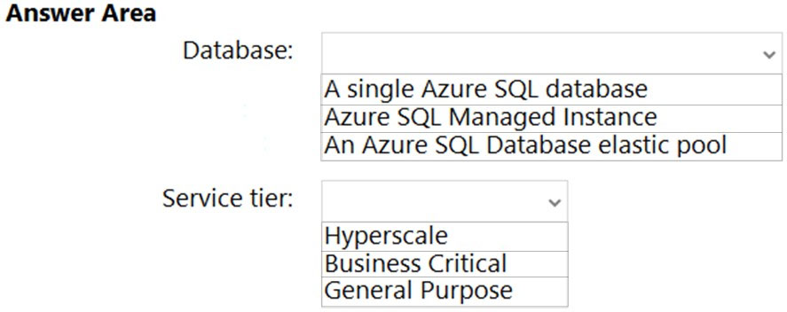

**Answer:**
Correct Answer:
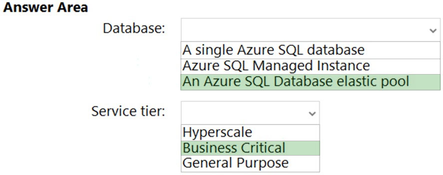

**Explication:**
- Box 1: An Azure SQL Database elastic pool
Scenario:
* Resiliency Requirements. Once migrated to Azure, DB1 and DB2 must meet the following requirements:
Maintain availability if two availability zones in the local Azure region fail.
Fail over automatically.
Minimize I/O latency.
* Litware identifies the following business requirements:
Minimize administrative effort.
Minimize costs.
- Box 2: Business Critical
Topic 13 – Testlet 6

## Question Set 263

**Context:**
Introductory Info Case Study –
This is a case study. Case studies are not timed separately. You can use as much exam time as you would like to complete each case. However, there may be additional case studies and sections on this exam. You must manage your time to ensure that you are able to complete all questions included on this exam in the time provided.
To answer the questions included in a case study, you will need to reference information that is provided in the case study. Case studies might contain exhibits and other resources that provide more information about the scenario that is described in the case study. Each question is independent of the other questions in this case study.
At the end of this case study, a review screen will appear. This screen allows you to review your answers and to make changes before you move to the next section of the exam. After you begin a new section, you cannot return to this section.
To start the case study –
To display the first question in this case study, click the Next button. Use the buttons in the left pane to explore the content of the case study before you answer the questions. Clicking these buttons displays information such as business requirements, existing environment, and problem statements. If the case study has an All Information tab, note that the information displayed is identical to the information displayed on the subsequent tabs. When you are ready to answer a question, click the Question button to return to the question.
Overview –
Contoso, Ltd. is a research company that has a main office in Montreal.
Existing Environment: Technical Environment
The on-premises network contains a single Active Directory domain named contoso.com.
Contoso has a single Azure subscription.
Existing Environment: Business Partnerships
Contoso has a business partnership with Fabrikam , Inc. Fabrikam users access some Contoso applications over the internet by using Azure Active Directory
(Azure AD) guest accounts.
Requirements: Planned Changes –
Contoso plans to deploy two applications named App1 and App2 to Azure.
Requirements: App1 –
App1 will be a Python web app hosted in Azure App Service that requires a Linux runtime. Users from Contoso and Fabrikam will access App1.
App1 will access several services that require third-party credentials and access strings. The credentials and access strings are stored in Azure Key Vault.
App1 will have six instances: three in the East US Azure region and three in the West Europe Azure region.
App1 has the following data requirements:
Each instance will write data to a data store in the same availability zone as the instance.
Data written by any App1 instance must be visible to all App1 instances.
App1 will only be accessible from the internet. App1 has the following connection requirements:
Connections to App1 must pass through a web application firewall (WAF).
Connections to App1 must be active-active load balanced between instances.
All connections to App1 from North America must be directed to the East US region. All other connections must be directed to the West Europe region.
Every hour, you will run a maintenance task by invoking a PowerShell script that copies files from all the App1 instances. The PowerShell script will run from a central location.
Requirements: App2 –
App2 will be a .NET app hosted in App Service that requires a Windows runtime. App2 has the following file storage requirements:
Save files to an Azure Storage account.
Replicate files to an on-premises location.
Ensure that on-premises clients can read the files over the LAN by using the SMB protocol.
You need to monitor App2 to analyze how long it takes to perform different transactions within the application. The solution must not require changes to the application code.
Application Development Requirements
Application developers will constantly develop new versions of App1 and App2. The development process must meet the following requirements:
A staging instance of a new application version must be deployed to the application host before the new version is used in production.
After testing the new version, the staging version of the application will replace the production version.
The switch to the new application version from staging to production must occur without any downtime of the application.
Identity Requirements –
Contoso identifies the following requirements for managing Fabrikam access to resources:
Every month, an account manager at Fabrikam must review which Fabrikam users have access permissions to App1. Accounts that no longer need permissions must be removed as guests.
The solution must minimize development effort.
Security Requirement –
All secrets used by Azure services must be stored in Azure Key Vault.
Services that require credentials must have the credentials tied to the service instance. The credentials must NOT be shared between services. Question DRAG DROP –
You need to recommend a solution that meets the file storage requirements for App2.

**Question:**
What should you deploy to the Azure subscription and the on-premises network? To answer, drag the appropriate services to the correct locations. Each service may be used once, more than once, or not at all. You may need to drag the split bar between panes or scroll to view content.
NOTE: Each correct selection is worth one point.
Select and Place:
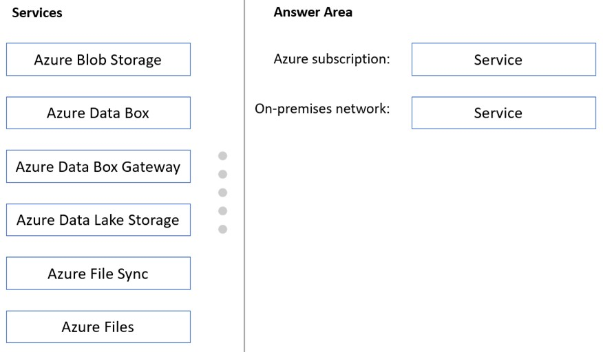

**Answer:**
Correct Answer:
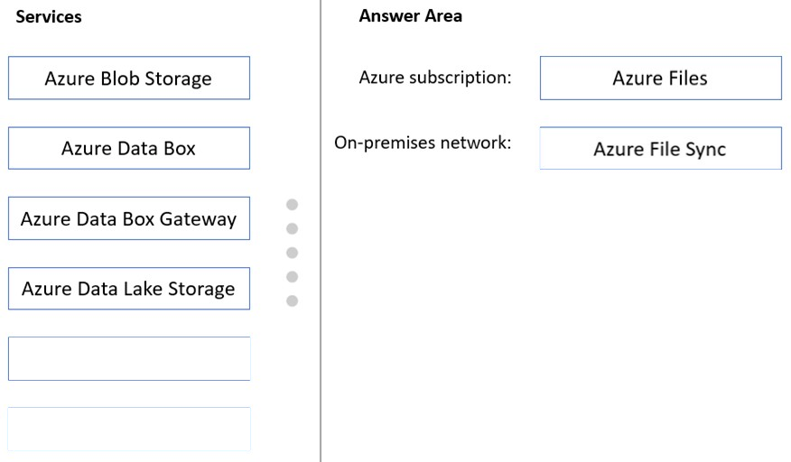

**Explication:**
- Box 1: Azure Files –
Scenario: App2 has the following file storage requirements:
- Save files to an Azure Storage account.
- Replicate files to an on-premises location.
- Ensure that on-premises clients can read the files over the LAN by using the SMB protocol.
- Box 2: Azure File Sync –
Use Azure File Sync to centralize your organization’s file shares in Azure Files, while keeping the flexibility, performance, and compatibility of an on-premises file server. Azure File Sync transforms Windows Server into a quick cache of your Azure file share. You can use any protocol that’s available on Windows Server to access your data locally, including SMB, NFS, and FTPS. You can have as many caches as you need across the world.

## Question Set 264

**Context:**
Introductory Info Case Study –
This is a case study. Case studies are not timed separately. You can use as much exam time as you would like to complete each case. However, there may be additional case studies and sections on this exam. You must manage your time to ensure that you are able to complete all questions included on this exam in the time provided.
To answer the questions included in a case study, you will need to reference information that is provided in the case study. Case studies might contain exhibits and other resources that provide more information about the scenario that is described in the case study. Each question is independent of the other questions in this case study.
At the end of this case study, a review screen will appear. This screen allows you to review your answers and to make changes before you move to the next section of the exam. After you begin a new section, you cannot return to this section.
To start the case study –
To display the first question in this case study, click the Next button. Use the buttons in the left pane to explore the content of the case study before you answer the questions. Clicking these buttons displays information such as business requirements, existing environment, and problem statements. If the case study has an All Information tab, note that the information displayed is identical to the information displayed on the subsequent tabs. When you are ready to answer a question, click the Question button to return to the question.
Overview –
Contoso, Ltd. is a research company that has a main office in Montreal.
Existing Environment: Technical Environment
The on-premises network contains a single Active Directory domain named contoso.com.
Contoso has a single Azure subscription.
Existing Environment: Business Partnerships
Contoso has a business partnership with Fabrikam , Inc. Fabrikam users access some Contoso applications over the internet by using Azure Active Directory
(Azure AD) guest accounts.
Requirements: Planned Changes –
Contoso plans to deploy two applications named App1 and App2 to Azure.
Requirements: App1 –
App1 will be a Python web app hosted in Azure App Service that requires a Linux runtime. Users from Contoso and Fabrikam will access App1.
App1 will access several services that require third-party credentials and access strings. The credentials and access strings are stored in Azure Key Vault.
App1 will have six instances: three in the East US Azure region and three in the West Europe Azure region.
App1 has the following data requirements:
Each instance will write data to a data store in the same availability zone as the instance.
Data written by any App1 instance must be visible to all App1 instances.
App1 will only be accessible from the internet. App1 has the following connection requirements:
Connections to App1 must pass through a web application firewall (WAF).
Connections to App1 must be active-active load balanced between instances.
All connections to App1 from North America must be directed to the East US region. All other connections must be directed to the West Europe region.
Every hour, you will run a maintenance task by invoking a PowerShell script that copies files from all the App1 instances. The PowerShell script will run from a central location.
Requirements: App2 –
App2 will be a .NET app hosted in App Service that requires a Windows runtime. App2 has the following file storage requirements:
Save files to an Azure Storage account.
Replicate files to an on-premises location.
Ensure that on-premises clients can read the files over the LAN by using the SMB protocol.
You need to monitor App2 to analyze how long it takes to perform different transactions within the application. The solution must not require changes to the application code.
Application Development Requirements
Application developers will constantly develop new versions of App1 and App2. The development process must meet the following requirements:
A staging instance of a new application version must be deployed to the application host before the new version is used in production.
After testing the new version, the staging version of the application will replace the production version.
The switch to the new application version from staging to production must occur without any downtime of the application.
Identity Requirements –
Contoso identifies the following requirements for managing Fabrikam access to resources:
Every month, an account manager at Fabrikam must review which Fabrikam users have access permissions to App1. Accounts that no longer need permissions must be removed as guests.
The solution must minimize development effort.
Security Requirement –
All secrets used by Azure services must be stored in Azure Key Vault.
Services that require credentials must have the credentials tied to the service instance. The credentials must NOT be shared between services. Question You need to recommend a solution that meets the data requirements for App1.

**Question:**
What should you recommend deploying to each availability zone that contains an instance of App1?
- A. an Azure Cosmos DB that uses multi-region writes
- B. an Azure Data Lake store that uses geo-zone-redundant storage (GZRS)
- C. an Azure Storage account that uses geo-zone-redundant storage (GZRS)

**Answer:**
Correct Answer: A

**Explication:**
Scenario: App1 has the following data requirements:
- Each instance will write data to a data store in the same availability zone as the instance.
- Data written by any App1 instance must be visible to all App1 instances.
Azure Cosmos DB: Each partition across all the regions is replicated. Each region contains all the data partitions of an Azure Cosmos container and can serve reads as well as serve writes when multi-region writes is enabled.
Incorrect Answers:
B, D: GZRS protects against failures. Geo-redundant storage (with GRS or GZRS) replicates your data to another physical location in the secondary region to protect against regional outages. However, that data is available to be read only if the customer or Microsoft initiates a failover from the primary to secondary region.
C: Active geo-replication is designed as a business continuity solution that lets you perform quick disaster recovery of individual databases in case of a regional disaster or a large scale outage. Once geo-replication is set up, you can initiate a geo-failover to a geo-secondary in a different Azure region. The geo-failover is initiated programmatically by the application or manually by the user.
Topic 14 – Testlet 7

## Question Set 265

**Context:**
Introductory Info Case Study –
This is a case study. Case studies are not timed separately. You can use as much exam time as you would like to complete each case. However, there may be additional case studies and sections on this exam. You must manage your time to ensure that you are able to complete all questions included on this exam in the time provided.
To answer the questions included in a case study, you will need to reference information that is provided in the case study. Case studies might contain exhibits and other resources that provide more information about the scenario that is described in the case study. Each question is independent of the other questions in this case study.
At the end of this case study, a review screen will appear. This screen allows you to review your answers and to make changes before you move to the next section of the exam. After you begin a new section, you cannot return to this section.
To start the case study –
To display the first question in this case study, click the Next button. Use the buttons in the left pane to explore the content of the case study before you answer the questions. Clicking these buttons displays information such as business requirements, existing environment, and problem statements. If the case study has an All Information tab, note that the information displayed is identical to the information displayed on the subsequent tabs. When you are ready to answer a question, click the Question button to return to the question.
Overview –
Contoso, Ltd. is a research company that has a main office in Montreal.
Existing Environment: Technical Environment
The on-premises network contains a single Active Directory domain named contoso.com.
Contoso has a single Azure subscription.
Existing Environment: Business Partnerships
Contoso has a business partnership with Fabrikam , Inc. Fabrikam users access some Contoso applications over the internet by using Azure Active Directory
(Azure AD) guest accounts.
Requirements: Planned Changes –
Contoso plans to deploy two applications named App1 and App2 to Azure.
Requirements: App1 –
App1 will be a Python web app hosted in Azure App Service that requires a Linux runtime. Users from Contoso and Fabrikam will access App1.
App1 will access several services that require third-party credentials and access strings. The credentials and access strings are stored in Azure Key Vault.
App1 will have six instances: three in the East US Azure region and three in the West Europe Azure region.
App1 has the following data requirements:
Each instance will write data to a data store in the same availability zone as the instance.
Data written by any App1 instance must be visible to all App1 instances.
App1 will only be accessible from the internet. App1 has the following connection requirements:
Connections to App1 must pass through a web application firewall (WAF).
Connections to App1 must be active-active load balanced between instances.
All connections to App1 from North America must be directed to the East US region. All other connections must be directed to the West Europe region.
Every hour, you will run a maintenance task by invoking a PowerShell script that copies files from all the App1 instances. The PowerShell script will run from a central location.
Requirements: App2 –
App2 will be a .NET app hosted in App Service that requires a Windows runtime. App2 has the following file storage requirements:
Save files to an Azure Storage account.
Replicate files to an on-premises location.
Ensure that on-premises clients can read the files over the LAN by using the SMB protocol.
You need to monitor App2 to analyze how long it takes to perform different transactions within the application. The solution must not require changes to the application code.
Application Development Requirements
Application developers will constantly develop new versions of App1 and App2. The development process must meet the following requirements:
A staging instance of a new application version must be deployed to the application host before the new version is used in production.
After testing the new version, the staging version of the application will replace the production version.
The switch to the new application version from staging to production must occur without any downtime of the application.
Identity Requirements –
Contoso identifies the following requirements for managing Fabrikam access to resources:
Every month, an account manager at Fabrikam must review which Fabrikam users have access permissions to App1. Accounts that no longer need permissions must be removed as guests.
The solution must minimize development effort.
Security Requirement –
All secrets used by Azure services must be stored in Azure Key Vault.
Services that require credentials must have the credentials tied to the service instance. The credentials must NOT be shared between services. Question HOTSPOT –
You are evaluating whether to use Azure Traffic Manager and Azure Application Gateway to meet the connection requirements for App1.

**Question:**
What is the minimum numbers of instances required for each service? To answer, select the appropriate options in the answer area.
NOTE: Each correct selection is worth one point.
Hot Area:
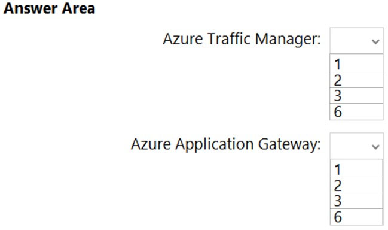

**Answer:**
Correct Answer:
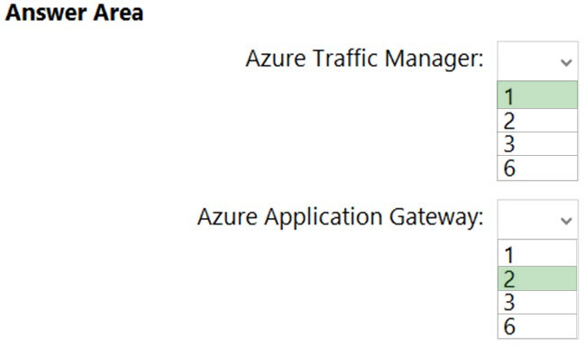

**Explication:**
- Box 1: 1 –
App1 will only be accessible from the internet. App1 has the following connection requirements:
ג€¢ Connections to App1 must be active-active load balanced between instances.
ג€¢ All connections to App1 from North America must be directed to the East US region. All other connections must be directed to the West Europe region.
App1 will have six instances: three in the East US Azure region and three in the West Europe Azure region.
Note: Azure Traffic Manager is a DNS-based traffic load balancer. This service allows you to distribute traffic to your public facing applications across the global
Azure regions.
- Box 2: 2 –
For production workloads, run at least two gateway instances.
A single Application Gateway deployment can run multiple instances of the gateway.
Use one Application Gateway in East US Region, and one in the West Europe region.
Topic 15 – Testlet 8

## Question Set 266

**Context:**
Introductory Info Case Study –
This is a case study. Case studies are not timed separately. You can use as much exam time as you would like to complete each case. However, there may be additional case studies and sections on this exam. You must manage your time to ensure that you are able to complete all questions included on this exam in the time provided.
To answer the questions included in a case study, you will need to reference information that is provided in the case study. Case studies might contain exhibits and other resources that provide more information about the scenario that is described in the case study. Each question is independent of the other questions in this case study.
At the end of this case study, a review screen will appear. This screen allows you to review your answers and to make changes before you move to the next section of the exam. After you begin a new section, you cannot return to this section.
To start the case study –
To display the first question in this case study, click the Next button. Use the buttons in the left pane to explore the content of the case study before you answer the questions. Clicking these buttons displays information such as business requirements, existing environment, and problem statements. If the case study has an All Information tab, note that the information displayed is identical to the information displayed on the subsequent tabs When you are ready to answer a question, click the Question button to return to the question.
Overview –
Litware , Inc. is a medium-sized finance company that has a main office in Boston.
Existing Environment –
Identity Environment –
The network contains an Active Directory forest named litware.com that is linked to an Azure Active Directory (Azure AD) tenant named litware.com. All users have Azure Active Directory Premium P2 licenses.
Litware has a second Azure AD tenant named dev.litware.com that is used as a development environment.
The litware.com tenant has a Conditional Access policy named Capolicy1. Capolicy1 requires that when users manage the Azure subscription for a production environment by using the Azure portal, they must connect from a hybrid Azure AD-joined device.
Azure Environment –
Litware has 10 Azure subscriptions that are linked to the Litware.com tenant and five Azure subscriptions that are linked to the dev.litware.com tenant. All the subscriptions are in an Enterprise Agreement (EA).
The litware.com tenant contains a custom Azure role-based access control (Azure RBAC) role named Role1 that grants the DataActions read permission to the blobs and files in Azure Storage.
On-Premises Environment –
The on-premises network of Litware contains the resources shown in the following table.

Network Environment –
Litware has ExpressRoute connectivity to Azure.
Planned Changes and Requirements
Planned Changes –
Litware plans to implement the following changes:
Migrate DB1 and DB2 to Azure.
Migrate App1 to Azure virtual machines.
Migrate the external storage used by App1 to Azure Storage.
Deploy the Azure virtual machines that will host App1 to Azure dedicated hosts.

Authentication and Authorization Requirements
Litware identifies the following authentication and authorization requirements:
Only users that manage the production environment by using the Azure portal must connect from a hybrid Azure AD-joined device and authenticate by using
Azure Multi-Factor Authentication (MFA).
The Network Contributor built-in RBAC role must be used to grant permissions to the network administrators for all the virtual networks in all the Azure subscriptions.
To access the resources in Azure, App1 must use the managed identity of the virtual machines that will host the app.
RBAC roles must be applied to management groups.
Resiliency Requirements –
Litware identifies the following resiliency requirements:
Once migrated to Azure, DB1 and DB2 must meet the following requirements:
– Maintain availability if two availability zones in the local Azure region fail.
– Fail over automatically.
– Minimize I/O latency.
App1 must meet the following requirements:
– Be hosted in an Azure region that supports availability zones.
– Be hosted on Azure virtual machines that support automatic scaling.
– Maintain availability if two availability zones in the local Azure region fail.
Security and Compliance Requirements
Litware identifies the following security and compliance requirements:
Once App1 is migrated to Azure, you must ensure that new data can be written to the app, and the modification of new and existing data is prevented for a period of three years.
On-premises users and services must be able to access the Azure Storage account that will host the data in App1.
Access to the public endpoint of the Azure Storage account that will host the App1 data must be prevented.
All Azure SQL databases in the production environment must have Transparent Data Encryption (TDE) enabled.
App1 must NOT share physical hardware with other workloads.
Business Requirements –
Litware identifies the following business requirements:
Minimize administrative effort.
Minimize costs.
Question HOTSPOT –

**Question:**
How should the migrated databases DB1 and DB2 be implemented in Azure?
Hot Area:
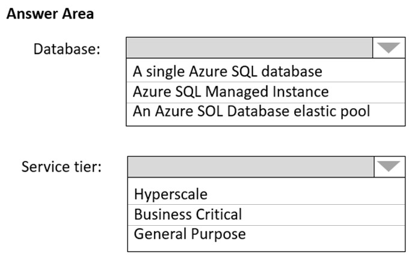

**Answer:**
Correct Answer:
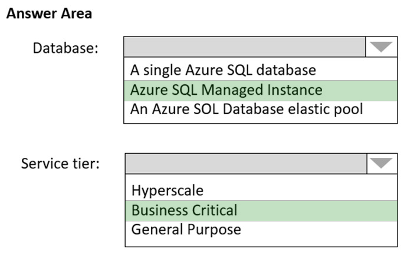

**Explication:**
- Box 1: SQL Managed Instance –
Scenario: Once migrated to Azure, DB1 and DB2 must meet the following requirements:
- Maintain availability if two availability zones in the local Azure region fail.
- Fail over automatically.
- Minimize I/O latency.
The auto-failover groups feature allows you to manage the replication and failover of a group of databases on a server or all databases in a managed instance to another region. It is a declarative abstraction on top of the existing active geo-replication feature, designed to simplify deployment and management of geo- replicated databases at scale. You can initiate a geo-failover manually or you can delegate it to the Azure service based on a user-defined policy. The latter option allows you to automatically recover multiple related databases in a secondary region after a catastrophic failure or other unplanned event that results in full or partial loss of the SQL Database or SQL Managed Instance availability in the primary region.
- Box 2: Business critical –
SQL Managed Instance is available in two service tiers:
General purpose: Designed for applications with typical performance and I/O latency requirements.
Business critical: Designed for applications with low I/O latency requirements and minimal impact of underlying maintenance operations on the workload.
Topic 16 – Testlet 9

## Question Set 267

**Context:**
N/A

**Question:**
Introductory Info Case Study –
This is a case study. Case studies are not timed separately. You can use as much exam time as you would like to complete each case. However, there may be additional case studies and sections on this exam. You must manage your time to ensure that you are able to complete all questions included on this exam in the time provided.
To answer the questions included in a case study, you will need to reference information that is provided in the case study. Case studies might contain exhibits and other resources that provide more information about the scenario that is described in the case study. Each question is independent of the other questions in this case study.
At the end of this case study, a review screen will appear. This screen allows you to review your answers and to make changes before you move to the next section of the exam. After you begin a new section, you cannot return to this section.
To start the case study –
To display the first question in this case study, click the Next button. Use the buttons in the left pane to explore the content of the case study before you answer the questions. Clicking these buttons displays information such as business requirements, existing environment, and problem statements. If the case study has an All Information tab, note that the information displayed is identical to the information displayed on the subsequent tabs. When you are ready to answer a question, click the Question button to return to the question.
Overview –
Fabrikam , Inc. is an engineering company that has offices throughout Europe. The company has a main office in London and three branch offices in Amsterdam,
Berlin, and Rome.
Existing Environment: Active Directory Environment
The network contains two Active Directory forests named corp.fabrikam.com and rd.fabrikam.com. There are no trust relationships between the forests.
Corp.fabrikam.com is a production forest that contains identities used for internal user and computer authentication.
Rd.fabrikam.com is used by the research and development (R&D) department only. The R&D department is restricted to using on-premises resources only.
Existing Environment: Network Infrastructure
Each office contains at least one domain controller from the corp.fabrikam.com domain. The main office contains all the domain controllers for the rd.fabrikam.com forest.
All the offices have a high-speed connection to the internet.
An existing application named WebApp1 is hosted in the data center of the London office. WebApp1 is used by customers to place and track orders. WebApp1 has a web tier that uses Microsoft Internet Information Services (IIS) and a database tier that runs Microsoft SQL Server 2016. The web tier and the database tier are deployed to virtual machines that run on Hyper-V.
The IT department currently uses a separate Hyper-V environment to test updates to WebApp1.
Fabrikam purchases all Microsoft licenses through a Microsoft Enterprise Agreement that includes Software Assurance.
Existing Environment: Problem Statements
The use of WebApp1 is unpredictable. At peak times, users often report delays. At other times, many resources for WebApp1 are underutilized.
Requirements: Planned Changes –
Fabrikam plans to move most of its production workloads to Azure during the next few years, including virtual machines that rely on Active Directory for authentication.
As one of its first projects, the company plans to establish a hybrid identity model, facilitating an upcoming Microsoft 365 deployment.
All R&D operations will remain on-premises.
Fabrikam plans to migrate the production and test instances of WebApp1 to Azure.
Requirements: Technical Requirements
Fabrikam identifies the following technical requirements:
Website content must be easily updated from a single point.
User input must be minimized when provisioning new web app instances.
Whenever possible, existing on-premises licenses must be used to reduce cost.
Users must always authenticate by using their corp.fabrikam.com UPN identity.
Any new deployments to Azure must be redundant in case an Azure region fails.
Whenever possible, solutions must be deployed to Azure by using the Standard pricing tier of Azure App Service.
An email distribution group named IT Support must be notified of any issues relating to the directory synchronization services.
In the event that a link fails between Azure and the on-premises network, ensure that the virtual machines hosted in Azure can authenticate to Active Directory.
Directory synchronization between Azure Active Directory (Azure AD) and corp.fabrikam.com must not be affected by a link failure between Azure and the on- premises network.
Requirements: Database Requirements
Fabrikam identifies the following database requirements:
Database metrics for the production instance of WebApp1 must be available for analysis so that database administrators can optimize the performance settings.
To avoid disrupting customer access, database downtime must be minimized when databases are migrated.
Database backups must be retained for a minimum of seven years to meet compliance requirements.
Requirements: Security Requirements
Fabrikam identifies the following security requirements:
Company information including policies, templates, and data must be inaccessible to anyone outside the company.
Users on the on-premises network must be able to authenticate to corp.fabrikam.com if an internet link fails.
Administrators must be able authenticate to the Azure portal by using their corp.fabrikam.com credentials.
All administrative access to the Azure portal must be secured by using multi-factor authentication (MFA).
The testing of WebApp1 updates must not be visible to anyone outside the company. Question HOTSPOT –
You design a solution for the web tier of WebApp1 as shown in the exhibit.
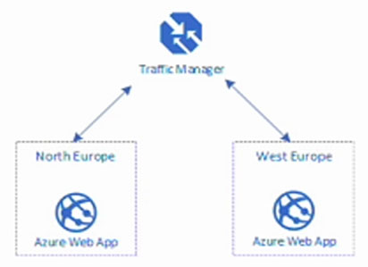
For each of the following statements, select Yes if the statement is true. Otherwise, select No.
NOTE: Each correct selection is worth one point.
Hot Area:
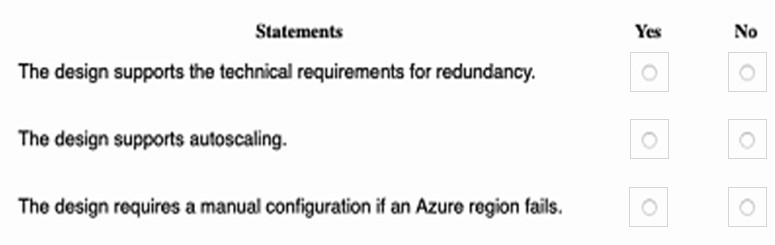

**Answer:**
Correct Answer:
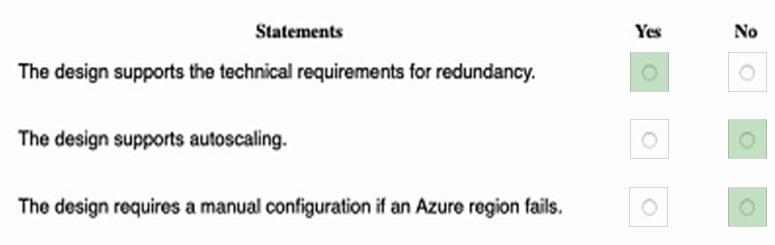

**Explication:**
- Box 1: Yes –
Any new deployments to Azure must be redundant in case an Azure region fails.
Traffic Manager is resilient to failure, including the failure of an entire Azure region.
- Box 2: No –
Traffic Manager provides load balancing, but not auto-scaling.
- Box 3: No –
Automatic failover using Azure Traffic Manager: when you have complex architectures and multiple sets of resources capable of performing the same function, you can configure Azure Traffic Manager (based on DNS) to check the health of your resources and route the traffic from the non-healthy resource to the healthy resource.
1
